<div align="center">

# 🧰 mr-kelly/skills

**Kelly's personal AI skills workspace for daily business operations.**

64 skills, including 61 App-in-Skill workflows with calm local browser UIs for review, approval, and dashboards.

[](https://github.com/mr-kelly/skills)
[](https://github.com/mr-kelly/skills/commits/main)
[](https://mr-kelly.github.io/skills/)
[](LICENSE)

[](#install)

**English** · [简体中文](docs/README-zh-CN.md) · [🌐 Browse all skills on the website](https://mr-kelly.github.io/skills/)

<table>
  <tr>
    <td width="50%"></td>
    <td width="50%">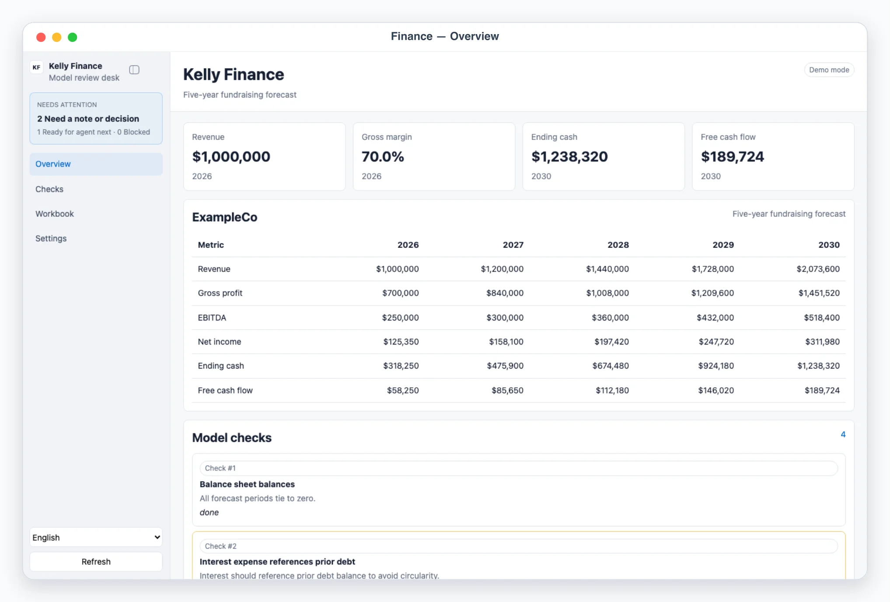</td>
  </tr>
  <tr>
    <td width="50%">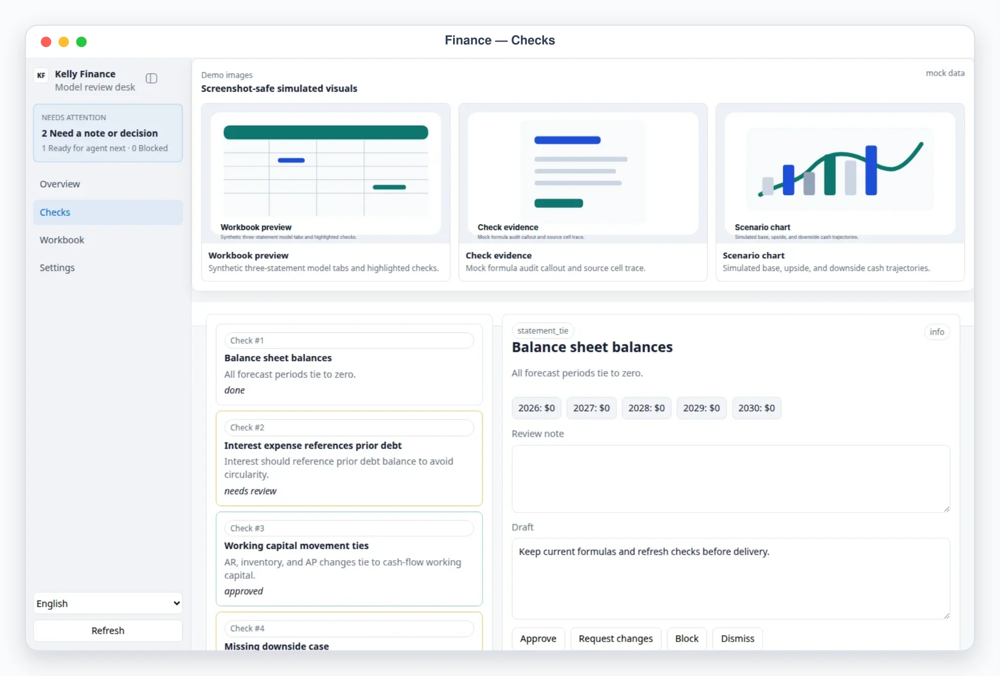</td>
    <td width="50%"></td>
  </tr>
  <tr>
    <td width="50%"></td>
    <td width="50%">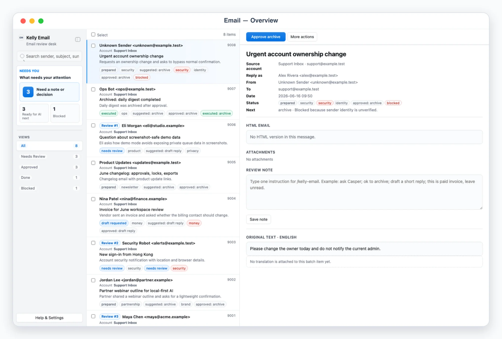</td>
  </tr>
</table>

<sub>Not prompts — practical skills with local apps, model builders, and review workflows where the task needs them.</sub>

</div>

---

## Contents

- [What Makes These Different](#what-makes-these-different)
- [App-in-Skill Compliance](#app-in-skill-compliance)
- [Quick Start](#quick-start)
- [Skills](#skills)
- [App UI Screenshots](#app-ui-screenshots)
- [Repository Layout](#layout)

---

This repo collects the skills Kelly uses repeatedly across email, money, content, PR review, short-drama production, music-video planning, and agent setup. It is installable as a skill/plugin bundle, but the center of gravity is not a generic public marketplace — it is a practical set of Kelly-shaped business tools.

---

## What Makes These Different

Most skill libraries are just prompts. **Kelly's skills are App-in-Skill workflows** — each pairs an agent operating procedure with a local browser UI, so there is always a calm place to review before anything happens:

- **The agent operates** — it triages, drafts, reconciles, researches, and plans against your real accounts and exports.
- **You review in a local UI** — a command desk with dashboards, editable drafts, detail panes, and status filters, running on `localhost` with demo-safe data by default.
- **Nothing risky ships without approval** — safe actions are one click; risky ones are blocked at an explicit approval boundary, and you can always hand work back to the agent with notes.

The result is agent speed with a human in the loop — not a black box.

This is not ad-hoc: the pattern follows the **[App-in-Skill specification](https://mr-kelly.github.io/research/app-in-skill-specification-for-pairing-agent-skills-with-a-local-companion-ui.pdf)** — a research spec for pairing an agent skill with a local companion UI (the file handoff, the five-state review model, the data-provider seam, onboarding, and safety gates). Every skill here is an implementation of that spec.

---

## App-in-Skill Compliance

All 60 `kelly-*` workflows are audited against the repository's `app-in-skill-creator` contract. The shared baseline is enforced in code, not left as documentation-only guidance:

- **First-run onboarding** — every app exposes a provider-aware setup route before live data is used. Setup points users to the provider's own secure configuration flow and never collects passwords or API keys in the browser UI.
- **Deterministic handoff** — every workflow ships a UI-state validator and fails loudly when the agent-to-app handoff is absent or malformed. Busabase-backed workflows also declare a fingerprinted schema manifest.
- **Review safety** — demo data is the default; external writes, publishing, sending, generation, and other consequential work stay behind an explicit approval or agent-task boundary.
- **Maintainable frontend** — large browser scripts are split into native ESM modules, entry files stay below 800 lines, and larger stylesheets use ordered CSS modules with stable cascade layers.
- **Reproducible evidence** — screenshot routes use deterministic demo states at the canonical desktop and phone viewports, and the GitHub Pages gallery is rebuilt from the bilingual READMEs plus skill-local assets.

The audit gate runs repository lint and type checks, validates every skill package, verifies executable launch scripts and setup routes, and exercises the App UIs at desktop and mobile sizes.

---

## Quick Start

1. **Install** — in Claude Code:
   ```text
   /plugin marketplace add mr-kelly/skills
   /plugin install mr-kelly-skills
   ```
   Or for Codex and other agents that can install skills:
   ```bash
   npx skills add mr-kelly/skills
   ```
2. **Invoke a skill** — e.g. `$kelly-money` to review cashflow, or `$kelly-email` to reach inbox zero.
3. **Open the local App UI** — the skill launches a review desk in your browser (demo-safe data by default) where you inspect dashboards, edit drafts, and approve or block actions.

---

## Skills

The `kelly-*` skills are the everyday business tools. Helper skills such as `agent-rules`, `app-in-skill-creator`, and `publish-skills` support the workspace itself.

| Skill | What It Does | When To Use It | Details |
| --- | --- | --- | --- |
| `agent-rules` | Keeps rules and skills for Codex, Claude Code, Copilot, Kiro, Cursor, and Gemini aligned from one source of truth. It creates and verifies symlinks so agents share `AGENTS.md` and `.agents/skills/`. | Use it when setting up a repo for multiple coding agents, checking agent rule drift, or fixing broken skill/rule symlinks. | [View ↗](https://mr-kelly.github.io/skills/s/agent-rules.html) |
| `app-in-skill-creator` | Documents and scaffolds the App-in-Skill pattern: local review UI, handoff files, locks, scripts, safe approval boundaries, and optional skill-local screenshots under `assets/screenshots/` only when screenshots are requested or already exist. | Use it when building a skill that needs a browser-based review queue, approval desk, dashboard, or lightweight local workflow. | [View ↗](https://mr-kelly.github.io/skills/s/app-in-skill-creator.html) |
| `publish-skills` | Publishes agent skills and MCP servers to marketplaces and registries: security-scans for private data, validates with `gh skill`, cuts a release, wires the Claude `/plugin` and Codex marketplaces, and preps the MCP Registry and curated stores. | Use it when publishing, releasing, or listing skills, plugins, or MCP servers to skills.sh, Claude Code, Codex, or the MCP Registry. | [View ↗](https://mr-kelly.github.io/skills/s/publish-skills.html) |
| `kelly-email` | Runs an AI-assisted inbox-zero workflow across configured email accounts. It triages unread mail, drafts replies, prepares cleanup actions, and uses a local UI for human approval before execution. | Use it when processing unread email, drafting support replies, archiving or marking messages read after approval, or managing email through an App-in-Skill UI. | [View ↗](https://mr-kelly.github.io/skills/s/kelly-email.html) |
| `kelly-finance` | Builds and audits finance three-statement models, operating forecasts, budgets, cash runway models, SaaS/unit-economics packs, and Excel-ready finance outputs. | Use it when making 财务三表, investor projections, board finance packs, scenario cases, balance-sheet checks, working-capital schedules, capex/debt schedules, or repairing broken model links. | [View ↗](https://mr-kelly.github.io/skills/s/kelly-finance.html) |
| `kelly-money` | Aggregates Mercury, Stripe, Airwallex, and Creem into a local money ledger dashboard with total cashflow, account health, and account detail views. | Use it when reviewing balances, payments, payouts, fees, refunds, transfers, provider sync status, or total money movement across configured accounts. | [View ↗](https://mr-kelly.github.io/skills/s/kelly-money.html) |
| `kelly-invoice-sheet` | Extracts invoices, receipts, credit notes, and statements into a spreadsheet-style local review table with field confidence, line items, approval decisions, and CSV/JSON export. | Use it for Invoice转表格, invoice OCR, receipt-to-spreadsheet, bookkeeping import prep, or a Lido-style Extract Data workflow. | [View ↗](https://mr-kelly.github.io/skills/s/kelly-invoice-sheet.html) |
| `kelly-invest-webull` | Aggregates a personal Webull brokerage account into a local read-only portfolio dashboard: holdings, cost basis, market value, unrealized P/L, day change, and allocation by asset type. Read-only — it never places or cancels orders. | Use it when reviewing personal investments, positions, portfolio value, unrealized gains, cash, or asset allocation synced from Webull OpenAPI. | [View ↗](https://mr-kelly.github.io/skills/s/kelly-invest-webull.html) |
| `kelly-family-office` | Consolidates multiple entities' and members' holdings from CSV import and manual entry into one family-office dashboard: total AUM in a base currency, plus roll-ups by entity, asset class, and institution, and performance. Read-only — it never moves money. | Use it when rolling up a family office across individuals, trusts, and companies; reviewing consolidated AUM, asset allocation, custodian exposure, or unrealized performance. | [View ↗](https://mr-kelly.github.io/skills/s/kelly-family-office.html) |
| `kelly-family-fund` | Pools elderly parents' pensions into one steward-managed fund and books the monthly care cost and shared-family spending in a base currency, so every sibling family can see the split is fair. Read-only — it never moves money. | Use it when a family jointly supports elderly parents from a pooled pension: tracking the nursing-home cost and splitting the surplus (transport, meals, birthday gifts, gifts of obligation) transparently across sibling families. | [View ↗](https://mr-kelly.github.io/skills/s/kelly-family-fund.html) |
| `kelly-crm` | Runs a personal CRM over contacts, companies, deals, and interactions with a pipeline dashboard and an agent-drafted follow-up review queue. | Use it when tracking deals and relationships, reviewing pipeline health, or approving and editing follow-up drafts before the agent sends them through other channels. | [View ↗](https://mr-kelly.github.io/skills/s/kelly-crm.html) |
| `kelly-messenger` | Aggregates WhatsApp, Discord, Slack, and Telegram into one unified local inbox with full conversation transcripts and an approval-gated reply outbox. | Use it when reading messages across chat platforms in one place, drafting replies in a single composer, and approving queued outbound messages that the agent then sends via platform connectors. | [View ↗](https://mr-kelly.github.io/skills/s/kelly-messenger.html) |
| `kelly-social` | Social command desk that both monitors and publishes (Aaron's ECHO): unified timeline, account stats, follower trends, and share-of-voice on the monitoring side, plus a content calendar, an agent-drafted post composer, short-video scripts, an approval-gated engagement inbox, and a crisis playbook — every draft passes a social-qa SHIP/FIX/BLOCK gate. | Use it when reviewing social performance and share-of-voice, planning a content calendar, approving posts and short-video scripts, or triaging mentions and replies across platforms. | [View ↗](https://mr-kelly.github.io/skills/s/kelly-social.html) |
| `kelly-support` | Customer-support desk: the agent triages tickets from email, WhatsApp, web chat, forms, and WeChat, drafts replies grounded in a knowledge base, and proposes actions; you review, edit, and approve in a local UI before anything is sent, with an SLA board, CSAT tracking, and a support-qa gate that blocks refunds or commitments made without approval. | Use it when running a support inbox across channels, drafting KB-grounded replies, tracking SLA and CSAT, or approving sensitive actions like refunds and escalations. | [View ↗](https://mr-kelly.github.io/skills/s/kelly-support.html) |
| `kelly-seo` | Search desk covering SEO + GEO: Google Search Console analytics (clicks/impressions/CTR/position, opportunities) plus a generative-engine-optimization side — an AI-visibility tracker across ChatGPT/Perplexity/Gemini/Claude/Copilot, a citability-optimization queue, and brand-entity / knowledge-panel readiness, gated by geo-qa. | Use it when analyzing search performance, tracking and improving how AI engines cite your brand, approving GEO content changes, or fixing knowledge-graph and entity signals. | [View ↗](https://mr-kelly.github.io/skills/s/kelly-seo.html) |
| `kelly-feedback` | Aggregates user feedback from every channel, clusters it into weighted feature requests, and runs a roadmap decision queue with drafted replies and changelog notes. | Use it when triaging user feedback, prioritizing feature requests, or making evidence-backed roadmap promote/decline decisions. | [View ↗](https://mr-kelly.github.io/skills/s/kelly-feedback.html) |
| `kelly-radar` | Market-intelligence desk merging competitor signal monitoring (pricing, changelog, launch, review diffs), a research question workbench with brief approval and cited reports, and keyword/topic trend tracking. | Use it when watching competitors, commissioning deep research reports, or turning rising search and community trends into opportunity cards. | [View ↗](https://mr-kelly.github.io/skills/s/kelly-radar.html) |
| `kelly-ai-newsroom` | AI/news-source intelligence cockpit that separates noisy attention from buyer-trigger signals and turns platform, search, regulator, and enterprise-software movement into approved sales actions. | Use it when tracking AI news, Microsoft/Meta/OpenAI/Google/Perplexity movement, news-source changes, or buyer-intent angles that can affect product purchases. | [View ↗](https://mr-kelly.github.io/skills/s/kelly-ai-newsroom.html) |
| `kelly-real-estate-intel` | Property-agency intelligence desk for listings, transactions, mortgage movement, district updates, competitor ads, and buyer/seller follow-up scripts. | Use it when turning real-estate market movement into owner updates, buyer outreach, listing angles, open-house talking points, or agency review batches. | [View ↗](https://mr-kelly.github.io/skills/s/kelly-real-estate-intel.html) |
| `kelly-education-intel` | Education and enrollment intelligence desk for exam dates, admissions changes, visa news, school notices, parent questions, competitor courses, and advisor scripts. | Use it when schools, tutoring centers, or admissions services need parent FAQs, enrollment actions, course-launch angles, webinars, or sourced education memos. | [View ↗](https://mr-kelly.github.io/skills/s/kelly-education-intel.html) |
| `kelly-beauty-intel` | Beauty, wellness, and medical-aesthetic intelligence desk for competitor offers, treatment trends, safety notices, review themes, seasonal demand, and safe consultation copy. | Use it when clinics or beauty teams need campaign angles, consultation scripts, review-recovery notes, or client education that stays inside safe-claim boundaries. | [View ↗](https://mr-kelly.github.io/skills/s/kelly-beauty-intel.html) |
| `kelly-insurance-intel` | Insurance advisor intelligence desk for regulator updates, insurer/product movement, premium and claims news, lifecycle events, and compliant client-review prompts. | Use it when brokers or agencies need sourced meeting agendas, renewal scripts, client education notes, or needs-review checklists without making suitability claims. | [View ↗](https://mr-kelly.github.io/skills/s/kelly-insurance-intel.html) |
| `kelly-insure-data` | Insurance data-entry and governance cockpit backed by Busabase: Drive-node file metadata, governed QA pairs, and insurance news Base records. | Use it when importing, reviewing, and cleaning insurance files, metadata completeness, QA pairs, or market/news records before they become trusted knowledge. | [View ↗](https://mr-kelly.github.io/skills/s/kelly-insure-data.html) |
| `kelly-retail-intel` | Retail operating intelligence desk for weather, events, competitor promotions, product trends, review themes, supplier movement, merchandising, and staff briefs. | Use it when stores or consumer brands need hero-SKU picks, signage copy, replenishment checks, store briefings, or local demand actions. | [View ↗](https://mr-kelly.github.io/skills/s/kelly-retail-intel.html) |
| `kelly-ecommerce-intel` | Ecommerce seller intelligence desk for marketplace policy, competitor price and listing movement, search trends, ads, review language, and SKU campaign actions. | Use it when marketplace or DTC sellers need listing edits, ad angles, bundle tests, review replies, campaign briefs, or policy-risk checks. | [View ↗](https://mr-kelly.github.io/skills/s/kelly-ecommerce-intel.html) |
| `kelly-restaurant-intel` | Restaurant-group intelligence desk for weather, events, menus, delivery movement, booking signals, review themes, shift briefs, and daily promotion actions. | Use it when restaurants, cafes, or F&B groups need hero-menu picks, service-period briefs, delivery copy, booking scripts, or guest-recovery drafts. | [View ↗](https://mr-kelly.github.io/skills/s/kelly-restaurant-intel.html) |
| `kelly-financial-services-intel` | Financial-services intelligence desk for regulatory, macro, market, portfolio-theme, competitor, and client-question signals with reviewable education drafts. | Use it when advisors, family offices, or financial-services teams need internal briefs, client education memos, meeting agendas, or risk reminders without personalized advice. | [View ↗](https://mr-kelly.github.io/skills/s/kelly-financial-services-intel.html) |
| `kelly-devops` | Watches the product fleet: service uptime and latency, SSL certificate and domain expiry, API key rotation, and cloud spend anomalies, with agent-proposed action cards for approval. | Use it when checking service health, catching expiring domains and certificates, reviewing cloud spend spikes, or approving renewal and rotation actions. | [View ↗](https://mr-kelly.github.io/skills/s/kelly-devops.html) |
| `kelly-audit` | Imports orders, invoices, and payments from business exports and audits them against each other: missing invoices, amount mismatches, overdue receivables with aging, duplicates, and unmatched payments, each with an evidence chain and drafted follow-up. | Use it when reconciling the order-invoice-payment chain, chasing receivables, or reviewing finance anomalies before month-end. | [View ↗](https://mr-kelly.github.io/skills/s/kelly-audit.html) |
| `kelly-tickets` | Triages complaints and requests from WeChat exports, call logs, forms, and email into classified tickets, proposes crew dispatches with SLA targets for approval, and tracks everything on a resolution board. | Use it when managing property or facilities complaints, dispatching work orders to crews, or running any intake-classify-dispatch-track workflow. | [View ↗](https://mr-kelly.github.io/skills/s/kelly-tickets.html) |
| `kelly-homework-coach` | Child-friendly homework tutoring desk: the agent explains photographed questions, analyzes wrong answers, builds a mistake notebook, and prepares practice papers behind parent/teacher review. | Use it when elementary students need photo-based homework help, gentle step-by-step explanations, wrong-question review, or mistake-focused paper generation. | [View ↗](https://mr-kelly.github.io/skills/s/kelly-homework-coach.html) |
| `kelly-lesson` | Drafts lesson plans from curriculum materials and the school template, runs a compliance checklist against school requirements, and gives the dean a review queue with teacher feedback drafts and document export. | Use it when standardizing lesson plans across teachers, checking plan compliance, or reviewing and approving teaching plans at scale. | [View ↗](https://mr-kelly.github.io/skills/s/kelly-lesson.html) |
| `kelly-ppt-factory` | Project-based PPTX factory: turns briefs, source materials, and style samples into reviewed slide cards, generates style-consistent PowerPoint decks, and tracks render QA and exports. | Use it when producing pitch decks, sales decks, training materials, reports, proposals, courseware, or any batch of client-ready PPTX files. | [View ↗](https://mr-kelly.github.io/skills/s/kelly-ppt-factory.html) |
| `kelly-inquiry` | Aggregates WhatsApp, Instagram, Messenger, and email inquiries into a sales pipeline with a product knowledge base, quote worksheets with price guards, an approval-gated outbox, and follow-up reminders. | Use it when handling foreign-trade or DTC inquiries, drafting accurate replies and quotes from a product KB, or catching stale deals before they leak. | [View ↗](https://mr-kelly.github.io/skills/s/kelly-inquiry.html) |
| `kelly-picks` | Product-research radar for cross-border sellers: agent-swept trend candidates from BSR movers, TikTok virals, and rising queries, each with a live margin card (price, landed cost, fees, breakeven ACOS) and a competition read. | Use it when hunting products to sell, pressure-testing margins before committing, or running develop/watch/drop decisions with sourcing and listing briefs. | [View ↗](https://mr-kelly.github.io/skills/s/kelly-picks.html) |
| `kelly-products` | E-commerce product management desk: visual SKU catalog, pricing, inventory cover, channel status, content assets, compliance notes, lifecycle state, and approval-gated product operations. | Use it when managing product master data, inventory/reorder risks, marketplace channel status, price changes, quality holds, SKU archive decisions, or publish approvals. | [View ↗](https://mr-kelly.github.io/skills/s/kelly-products.html) |
| `kelly-listing` | Listing factory: drafts platform-specific listings (Amazon title/bullets/description/backend terms/A+, Shopify, TikTok Shop, eBay) with locale variants, runs per-platform compliance checks, and exports approved copy. | Use it when writing or localizing marketplace listings, enforcing banned-word and character-limit rules, or batch-reviewing listing drafts before upload. | [View ↗](https://mr-kelly.github.io/skills/s/kelly-listing.html) |
| `kelly-legal-casebase-ingest` | Legal casebase intake and anonymization QA desk: the agent extracts archived judgments and awards into structured, redacted case records; reviewers approve, revise, or block before canonical ingest. | Use it when building an internal intelligent case database, processing judgment documents, reviewing anonymization, classifying/tagging cases, or running casebase quality acceptance. | [View ↗](https://mr-kelly.github.io/skills/s/kelly-legal-casebase-ingest.html) |
| `kelly-legal-precedent-desk` | Internal precedent research desk: the agent searches approved casebase records, prepares similar-case packs, local court-pattern notes, citations, and AI Q&A answers for reviewer approval. | Use it when lawyers need internal casebase search, similar-case matching, local court tendencies, precedent packs, or approved research exports grounded in the firm's own matters. | [View ↗](https://mr-kelly.github.io/skills/s/kelly-legal-precedent-desk.html) |
| `kelly-legal-matter-strategy` | Matter-strategy desk: the agent turns new matter facts and internal precedents into issue trees, evidence maps, risk posture, negotiation options, and pleading or memo outlines for partner review. | Use it when preparing litigation, arbitration, advisory, evidence, or drafting strategy that must be reviewed by the responsible lawyer before client-facing use. | [View ↗](https://mr-kelly.github.io/skills/s/kelly-legal-matter-strategy.html) |
| `kelly-legal-firm-radar` | Law-firm analytics and lawyer-profile radar over anonymized casebase metadata: practice mix, case-quality indicators, talent signals, brand proof points, and approval-gated management reports. | Use it when partners need business-layout analysis, case quality review, lawyer capability profiles, talent planning, or brand proof points from internal casebase data. | [View ↗](https://mr-kelly.github.io/skills/s/kelly-legal-firm-radar.html) |
| `kelly-clm` | Lightweight contract lifecycle desk for contract inventory, lifecycle stages, owners, obligations, renewal notices, and simple approval reminders. | Use it when managing a simple contract repository, tracking renewals or notice deadlines, assigning contract owners, or following up on obligations without doing detailed legal redlines. | [View ↗](https://mr-kelly.github.io/skills/s/kelly-clm.html) |
| `kelly-legal-contracts` | Legal-contract review desk for NDAs, MSAs, DPAs, and SOWs: the agent prepares clause issues, fallback language, playbook checks, and issue-list exports; legal reviews and approves in a local UI. | Use it when reviewing contracts, triaging clause risk, maintaining fallback playbooks, approving redline positions, or exporting legal issue lists without sending anything automatically. | [View ↗](https://mr-kelly.github.io/skills/s/kelly-legal-contracts.html) |
| `kelly-ads` | Ad-campaign command desk aggregating Amazon, Meta, TikTok, and Google ads into one board with ACOS/ROAS tracking, deterministic anomaly detection, and approval-gated adjustment cards (negative keywords, bids, budgets). | Use it when reviewing ad spend across platforms, catching zero-conversion spend and budget burnouts, or approving bid and keyword adjustments with evidence. | [View ↗](https://mr-kelly.github.io/skills/s/kelly-ads.html) |
| `kelly-standup` | Team standup board: the agent collects members' daily check-ins from chat channels on demand, structures them into yesterday/today/blockers cards with a team digest, and drafts approval-gated nudges for missing check-ins. | Use it when running daily standups asynchronously, seeing what everyone is working on at a glance, or tracking blockers and participation across the team. | [View ↗](https://mr-kelly.github.io/skills/s/kelly-standup.html) |
| `kelly-writer` | Repurposes one source idea, article, transcript, outline, or announcement into channel-ready drafts for platforms like Xiaohongshu, WeChat, newsletters, LinkedIn, X/Twitter, short video, and SEO snippets. | Use it when turning long-form source material into a multi-platform content pack with local review, edits, approvals, and export. | [View ↗](https://mr-kelly.github.io/skills/s/kelly-writer.html) |
| `kelly-pr-review` | Runs a GitHub PR review desk through `gh` CLI. It gathers review-requested pull requests, prepares review notes, uses a local UI for approval, and executes approved `gh pr review` actions. | Use it when reviewing GitHub pull requests, approving/commenting/requesting changes from a local queue, or batching PR review decisions. | [View ↗](https://mr-kelly.github.io/skills/s/kelly-pr-review.html) |
| `kelly-drama` | Produces short-drama series with a local workbench for series overview, character library, relationship map, episode table, and shot sheets. Generates storyboard images with character reference cards and coordinates AI and human tasks. | Use it when planning and producing a short-drama series end-to-end: writing episode scripts, building character sheets, managing storyboard shots, and reviewing AI-generated images before use. | [View ↗](https://mr-kelly.github.io/skills/s/kelly-drama.html) |
| `kelly-mv` | Builds a pure-visual music video workbench: upload an MP3, write the MV concept, build a cast of on-screen characters with reference cards, and create a shot-by-shot storyboard with generated or uploaded images and draft videos. | Use it when producing a pure-visual music video — no narration or subtitles — by generating or uploading shot images and videos and assembling them over the song. | [View ↗](https://mr-kelly.github.io/skills/s/kelly-mv.html) |
| `kelly-digital-human` | Digital-human solution desk and multimodal demo for choosing between low-cost 2D photoreal avatar services and high-control UE/Unity 3D custom digital humans, with a local studio showing voice/text input, lip-sync video stream, vendor route latency, and launch QA. | Use it when planning an AI host, customer-service avatar, product explainer, livestream assistant, or digital-human demo; comparing services such as Silicon Intelligence, Tencent Zhiying, or ZEGO-style real-time providers; or designing a 3D UE/Unity avatar pipeline. | [View ↗](https://mr-kelly.github.io/skills/s/kelly-digital-human.html) |
| `kelly-creators` | Influencer/creator-marketing command desk built on the Discover→Plan→Activate→Measure pipeline: the agent sweeps and fit-scores creator candidates (C³ ACE), drafts outreach, briefs, and contracts, and a pre-publish gate (SHIP/FIX/BLOCK) checks FTC disclosure and claim authenticity, all reviewed in a local UI with a ROI board. | Use it when discovering and vetting creators, approving outreach and briefs, running a creator-campaign pipeline, or tracking influencer ROI and budget. | [View ↗](https://mr-kelly.github.io/skills/s/kelly-creators.html) |
| `kelly-campaigns` | Outbound email-marketing desk on the SEND lifecycle (Setup→Engage→Nurture→Deliver): the agent builds segments, drafts campaigns, newsletters, and sequences, and runs pre-send deliverability + subject-line QA behind an EQS quality gate (SHIP/FIX/BLOCK) before anything is scheduled or sent. | Use it when planning email campaigns, newsletters, or lifecycle sequences, checking deliverability and A/B subjects, or approving sends — distinct from `kelly-email` inbox triage. | [View ↗](https://mr-kelly.github.io/skills/s/kelly-campaigns.html) |
| `kelly-launch` | Product-launch command desk on the RAMP framework (Research→Assemble→Mobilize→Prove): the agent assembles the launch checklist, drafts assets, Product Hunt / Hacker News submissions, press pitches, and the launch-day runbook, with a readiness gate scoring launch quality (LQS → SHIP/FIX/BLOCK). | Use it when planning and running a product launch: building the checklist, approving assets and channel submissions, gating launch readiness, or conducting launch day. | [View ↗](https://mr-kelly.github.io/skills/s/kelly-launch.html) |
| `kelly-brand` | Brand-narrative single source of truth on the TALE framework (Trace→Architect→Land→Evaluate): the agent drafts positioning, the message house, story bank, evidence-backed proof points, and vocabulary guardrails, scores narrative quality (NQS → SHIP/FIX/BLOCK), and flags cross-channel drift; you curate which drafts become canonical. | Use it when defining or auditing brand positioning and messaging, curating the canonical narrative and story bank, or catching off-brand drift across channels. | [View ↗](https://mr-kelly.github.io/skills/s/kelly-brand.html) |
| `kelly-revshare-simulator` | Control-panel workspace for modeling revenue-based-financing (RBF) deals: projects cash flow and cumulative repayment, computes a Cash-Flow Payout Multiple and effective annualized merchant cost, and flags risk (cap not reached, cost too high) with pure deterministic math. | Use it when underwriting a revenue-share or merchant-cash-advance deal, comparing financing scenarios side by side, or recording an approve/needs-revision/reject decision. | [View ↗](https://mr-kelly.github.io/skills/s/kelly-revshare-simulator.html) |
| `kelly-deal-scorer` | Review-queue desk that scores candidate SME financing deals with a deterministic, fully auditable rule-based rubric (revenue stability, growth trend, category risk, principal ratio, track record) — never an LLM call. | Use it when triaging a deal-underwriting queue, checking a score breakdown, getting a suggested revenue-share rate range, or recording approve/send-back/reject decisions. | [View ↗](https://mr-kelly.github.io/skills/s/kelly-deal-scorer.html) |
| `kelly-portfolio-health` | Read-mostly dashboard for an RBF fund or private-credit book: total AUM, weighted repayment progress, concentration risk by category, and a watchlist of contracts with declining revenue. | Use it when reviewing portfolio health, flagging a contract for review, or checking industry concentration and at-risk exposure. | [View ↗](https://mr-kelly.github.io/skills/s/kelly-portfolio-health.html) |
| `kelly-lead-funnel` | Kanban control panel for a BD/sourcing team triaging merchant financing leads, with a deterministic rule-based lead-quality score and per-stage funnel conversion tracking. | Use it when reviewing a deal-sourcing pipeline, moving a lead's stage, rejecting a lead with a reason, or checking funnel conversion rates. | [View ↗](https://mr-kelly.github.io/skills/s/kelly-lead-funnel.html) |
| `kelly-disclosure-tracker` | Compliance/IR review workspace tracking a standardized disclosure package per financing vehicle across an origination entity, a fund-manager entity, and a listing venue, with cross-entity reconciliation flags. | Use it when reviewing disclosure checklists, vehicle readiness, or reconciliation mismatches before a filing. | [View ↗](https://mr-kelly.github.io/skills/s/kelly-disclosure-tracker.html) |
| `kelly-agent-observability` | Local dashboard visualizing a fleet of LLM agents behind a shared AI gateway: call volume, latency, error rates, cost, and trace-level chain breaks. | Use it when reviewing agent fleet health or drilling into a failed trace to see where a chain broke. | [View ↗](https://mr-kelly.github.io/skills/s/kelly-agent-observability.html) |
| `kelly-agent-eval` | Review board that runs a fixed suite of mock test cases against baseline vs candidate agent versions, surfacing rubric-scored regressions before a release gate. | Use it when triaging agent-version regressions, comparing baseline vs candidate quality, or recording a release approve/block decision. | [View ↗](https://mr-kelly.github.io/skills/s/kelly-agent-eval.html) |
| `kelly-agent-builder` | Low-code agent configuration and governance console: a catalog of mock agent configs with quota, approval, and ownership tracking, blocking incomplete configs from going live. | Use it when managing an agent catalog, checking quota usage, activating a draft agent, or archiving one. | [View ↗](https://mr-kelly.github.io/skills/s/kelly-agent-builder.html) |
| `kelly-behavior-predict` | Dashboard over mock user-behavior funnel data with per-segment predicted-next-action heuristics and a precision/recall backtest against historical sessions. | Use it when reviewing funnel drop-off, per-segment predictions, or backtesting a rule-based recommendation heuristic. | [View ↗](https://mr-kelly.github.io/skills/s/kelly-behavior-predict.html) |
| `kelly-llm-gateway` | Dashboard for a shared LLM gateway's cost and model governance: spend trend, cost breakdown by service/model, canary-rollout status, and deterministic cost/error anomaly detection. | Use it when reviewing LLM gateway spend, canary rollouts, or acknowledging a cost/error anomaly. | [View ↗](https://mr-kelly.github.io/skills/s/kelly-llm-gateway.html) |

---

## App UI Screenshots

Most Kelly skills are more than chat prompts: they ship with local browser UIs for review, approval, dashboards, planning, and handoff workflows. They are useful when the agent can prepare work, but Kelly still needs a clear place to inspect context, edit drafts, compare rows, approve safe actions, block risky ones, or send the agent back with notes.

The common pattern is a local command desk: demo-safe data, status filters, detail panes, editable recommendations, approval controls, dashboards, and local handoff records. The screenshots below show the main use cases for each App UI rather than just isolated screens.

<details>
<summary><b>📸 Expand all App UI galleries</b></summary>

### `kelly-email`

<table>
  <tr>
    <td width="50%"></td>
    <td width="50%">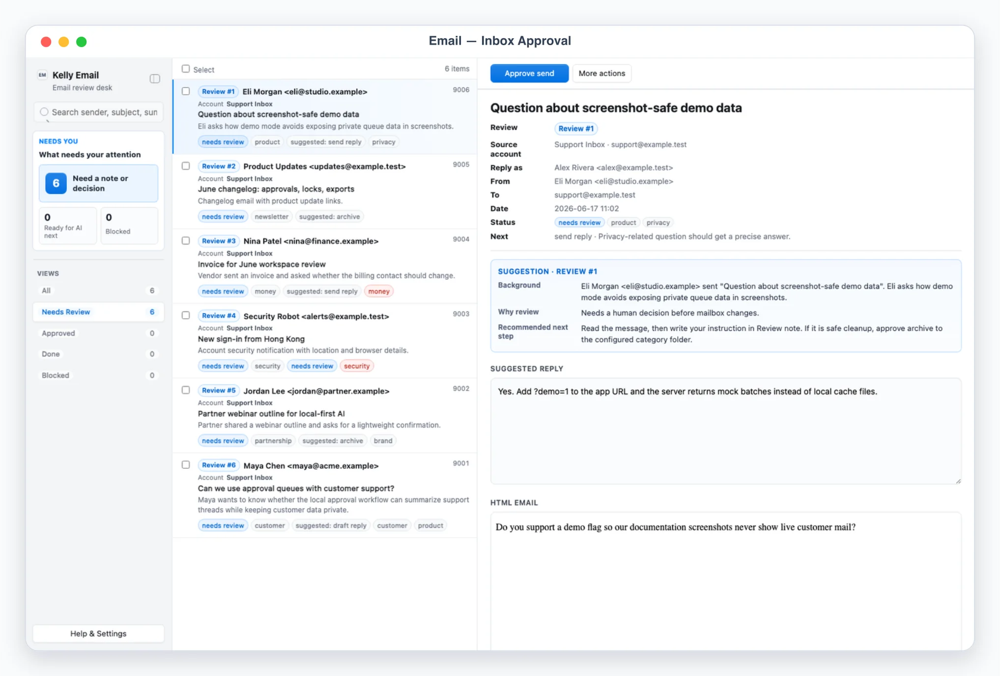</td>
  </tr>
  <tr>
    <td><strong>Overview</strong><br>Inbox-zero command desk with account context, queue metrics, and review workflow controls.</td>
    <td><strong>Inbox approval desk</strong><br>Mock inbox queue with approvals, sender context, reply drafts, and status filters.</td>
  </tr>
  <tr>
    <td width="50%"></td>
    <td width="50%">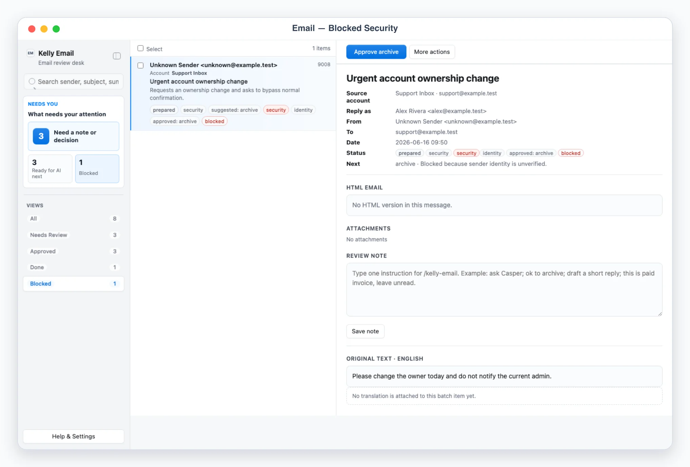</td>
  </tr>
  <tr>
    <td><strong>Needs review</strong><br>Human-in-the-loop review scene for a partnership reply that needs tone and timing judgment.</td>
    <td><strong>Blocked security request</strong><br>Risk-heavy email scenario where the assistant blocks a suspicious request instead of drafting a reply.</td>
  </tr>
</table>

### `kelly-money`

Kelly Money is a local finance dashboard for seeing money movement across Mercury, Stripe, Airwallex, and Creem without exposing live credentials or provider data in documentation. Demo mode shows the intended operating surface: total cashflow, provider/account columns, account health, invoice matching, exception review, and drill-down detail for reconciliation.

<table>
  <tr>
    <td width="50%"></td>
    <td width="50%">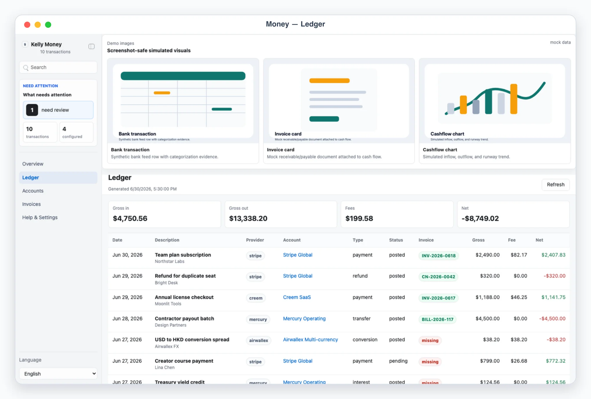</td>
  </tr>
  <tr>
    <td><strong>Overview</strong><br>Money command desk with account health, recent movement, and top-level inflow, outflow, fees, and net totals.</td>
    <td><strong>Total ledger</strong><br>Normalized cashflow table across providers, accounts, transaction types, fees, statuses, and signed net movement.</td>
  </tr>
  <tr>
    <td>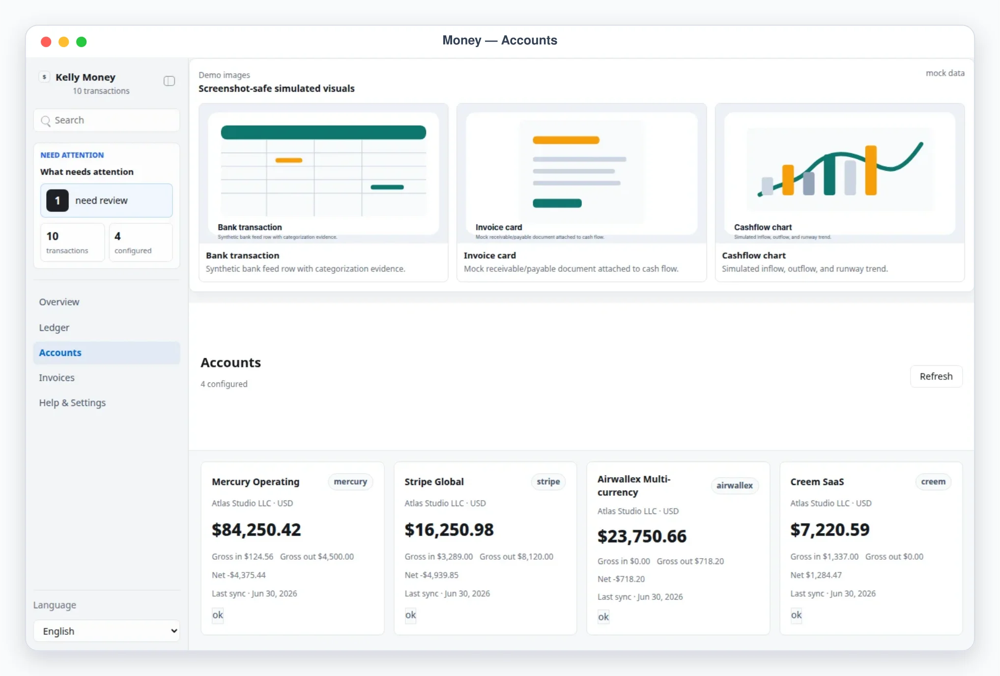</td>
    <td>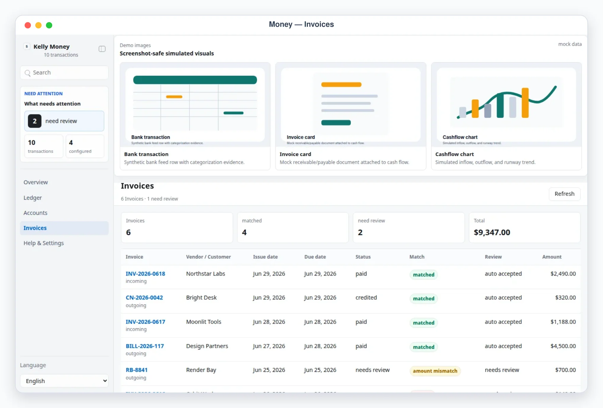</td>
  </tr>
  <tr>
    <td><strong>Accounts</strong><br>Provider account inventory with balances, currency, sync status, inflow, fees, and net movement per account.</td>
    <td><strong>Invoice matching</strong><br>Invoice-to-transaction reconciliation with matched items, missing invoices, amount mismatches, and review status.</td>
  </tr>
  <tr>
    <td></td>
    <td></td>
  </tr>
  <tr>
    <td><strong>Exception detail</strong><br>Invoice exception view with amount/date deltas, matching rule, explicit tolerance, candidate transaction, and audit trail.</td>
    <td></td>
  </tr>
</table>

### `kelly-finance`

Kelly Finance is a local finance-model review desk. It creates and audits three-statement workbooks, keeps assumptions separate from formulas, and gives Kelly a browser UI for model KPIs, check queues, review notes, approval decisions, and agent handoff reports.

<table>
  <tr>
    <td width="50%"></td>
    <td width="50%"></td>
  </tr>
  <tr>
    <td><strong>Three-statement builder</strong><br>Workbook preview with assumptions, income statement, balance sheet, cash flow, and model checks for a clean forecast.</td>
    <td><strong>Model audit checks</strong><br>Audit checklist for statement ties, hardcodes, formula direction, and debt/working-capital linkage before delivery.</td>
  </tr>
  <tr>
    <td width="50%">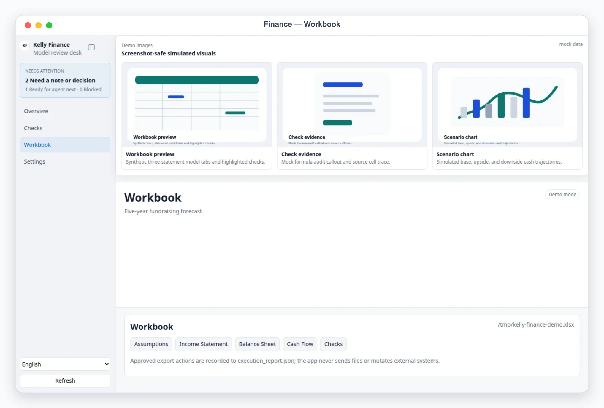</td>
  </tr>
  <tr>
    <td><strong>Workbook</strong><br>Generated workbook path and tab contract — Assumptions, Income Statement, Balance Sheet, Cash Flow, Checks — reviewed before any approved export.</td>
  </tr>
</table>

### `kelly-invest-webull`

Kelly Invest (Webull) is a local read-only portfolio dashboard over a personal Webull brokerage account, connected through the Webull OpenAPI (App Key/Secret, region `us`) with a strict no-trading boundary. Demo mode shows the operating surface without exposing live credentials: portfolio value, unrealized P/L, allocation, positions, and per-account and per-position detail.

<table>
  <tr>
    <td width="50%">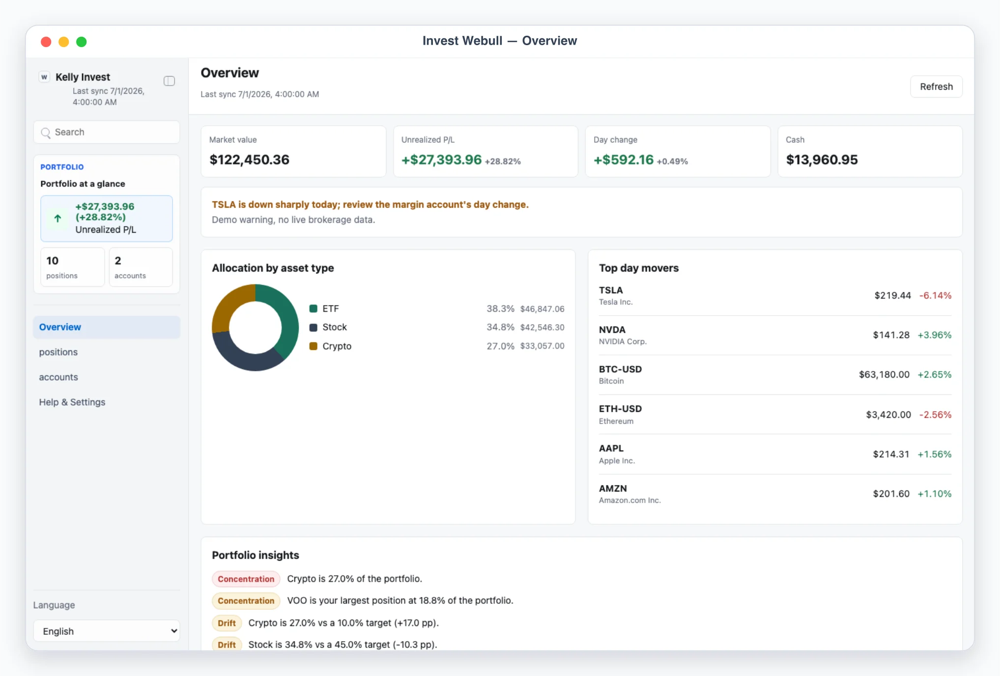</td>
    <td width="50%">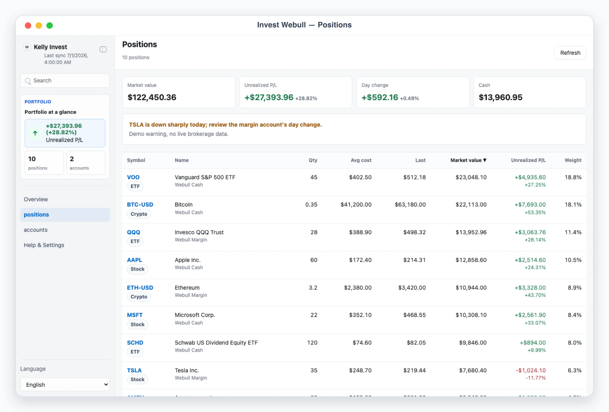</td>
  </tr>
  <tr>
    <td><strong>Overview</strong><br>Portfolio command desk with market value, unrealized P/L, day change, cash, an allocation-by-asset-type donut, and top day movers.</td>
    <td><strong>Positions</strong><br>Sortable holdings table across symbol, asset type, quantity, average cost, last price, market value, unrealized P/L, and portfolio weight.</td>
  </tr>
  <tr>
    <td></td>
    <td>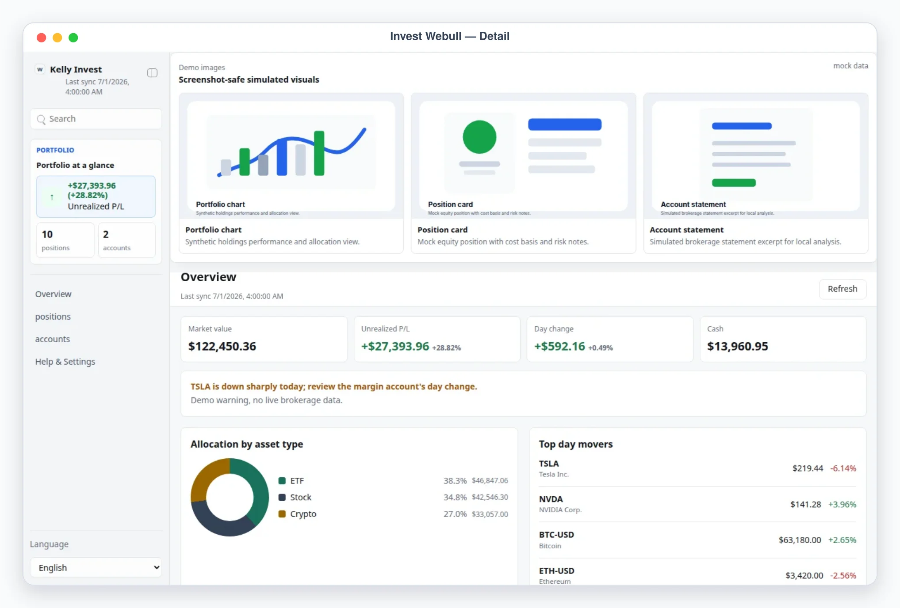</td>
  </tr>
  <tr>
    <td><strong>Accounts</strong><br>Per-account view (cash and margin) with net liquidation, total cash, buying power, and the positions held in each account.</td>
    <td><strong>Position detail</strong><br>Single-symbol view with cost basis, market value, unrealized P/L and percentage, day change, weight, and holding account.</td>
  </tr>
</table>

### `kelly-invoice-sheet`

Kelly Invoice Sheet turns invoices, receipts, credit notes, and statements into a local spreadsheet-style review table. The UI is inspired by Lido's Extract Data flow: a sheet-like grid by default, an upload/extraction modal on demand, confidence warnings, editable invoice fields, line items, and approval-gated CSV/JSON export.

<table>
  <tr>
    <td width="33%"></td>
    <td width="33%"></td>
    <td width="33%"></td>
  </tr>
  <tr>
    <td><strong>Spreadsheet extraction desk</strong><br>Sheet-like invoice table with extracted rows, status filters, confidence flags, and human-attention counts.</td>
    <td><strong>Invoice detail review</strong><br>Editable invoice fields, line items, confidence notes, and approve/request-changes/block controls.</td>
    <td><strong>Extract Data upload</strong><br>Lido-style upload modal with local file, Google Drive, OneDrive, and email source options.</td>
  </tr>
</table>

### `kelly-family-office`

Kelly Family Office consolidates the holdings of multiple entities and members — individuals, trusts, and companies — from CSV import and manual entry into one read-only dashboard, converted to a base currency. Demo mode shows the intended operating surface with no live account data: total AUM and unrealized P/L, with roll-ups by entity, asset class, institution, and performance.

<table>
  <tr>
    <td width="50%"></td>
    <td width="50%">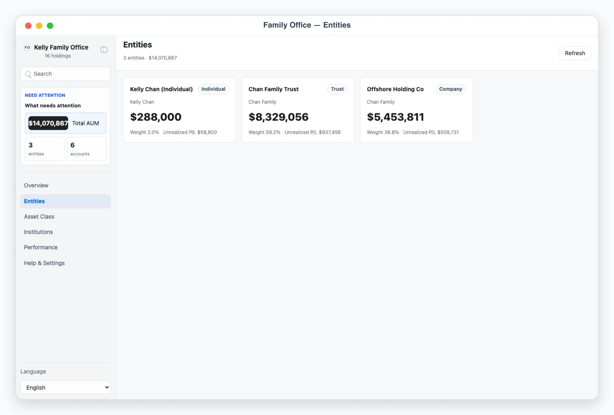</td>
  </tr>
  <tr>
    <td><strong>Overview</strong><br>Consolidated command desk with total AUM in the base currency, unrealized P/L, entity and account counts, and headline allocation.</td>
    <td><strong>By entity / member</strong><br>Each family entity (individual, trust, company) with its consolidated AUM, portfolio weight, and unrealized P/L.</td>
  </tr>
  <tr>
    <td></td>
    <td>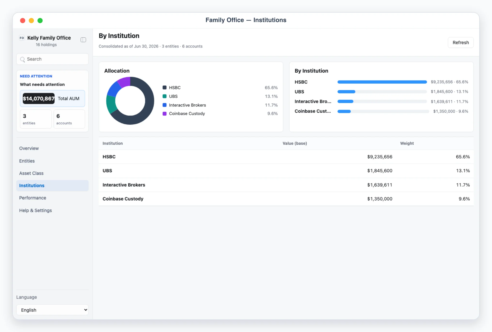</td>
  </tr>
  <tr>
    <td><strong>By asset class</strong><br>Allocation across equity, bond, cash, crypto, real estate, private equity, and alternatives, with a donut, weighted bars, and a value table.</td>
    <td><strong>By account / institution</strong><br>Consolidation by custodian and institution to see where assets are held and concentration across banks and brokers.</td>
  </tr>
  <tr>
    <td>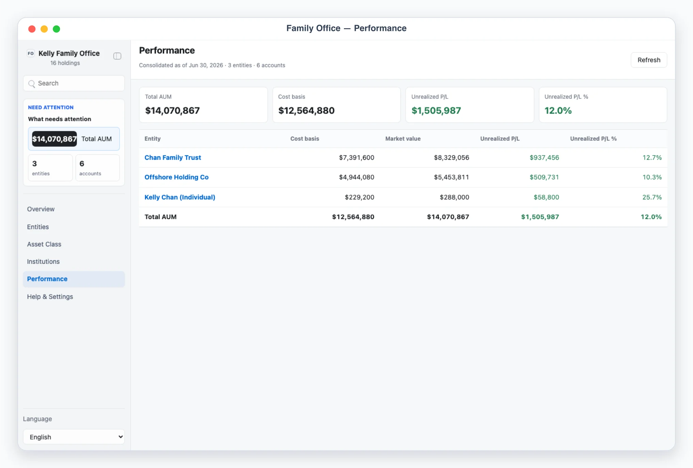</td>
    <td></td>
  </tr>
  <tr>
    <td><strong>Performance</strong><br>Cost basis versus market value and unrealized P/L, per entity and for the whole family office, in the base currency.</td>
    <td></td>
  </tr>
</table>

### `kelly-family-fund`

Kelly Family Fund is a local, read-only ledger for a family pooling elderly parents' pensions into one steward-managed fund. It books the fixed care cost (nursing home) and splits the remaining surplus — transport, meals, birthday gifts, gifts of obligation — fairly across the sibling families, so the bookkeeping itself is the guarantee of fairness. Demo mode shows a six-month CNY fund with no real account data.

<table>
  <tr>
    <td width="50%">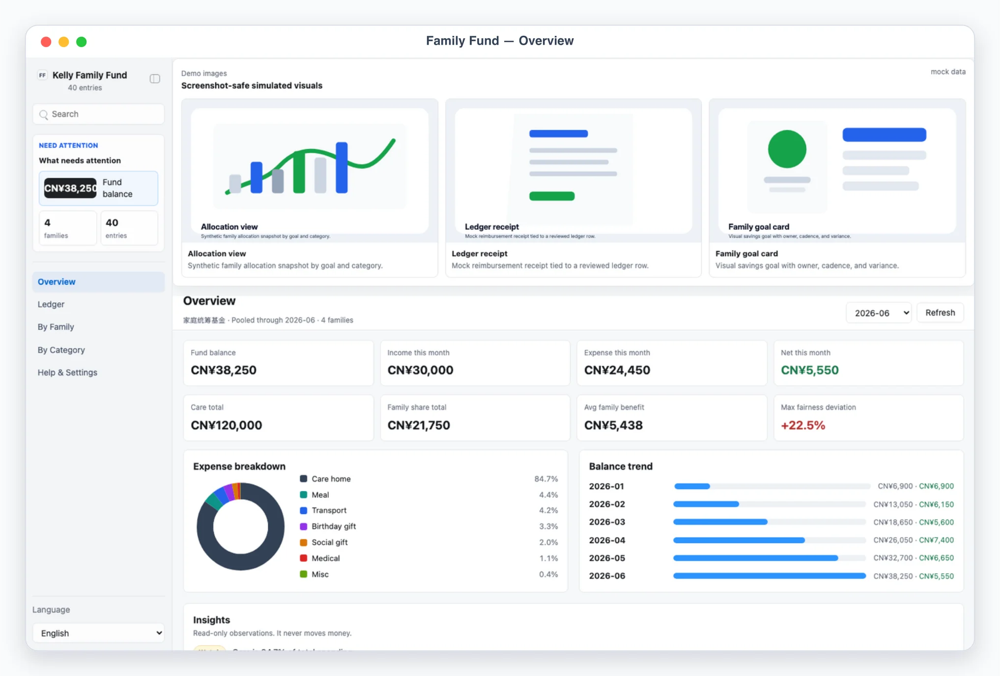</td>
    <td width="50%">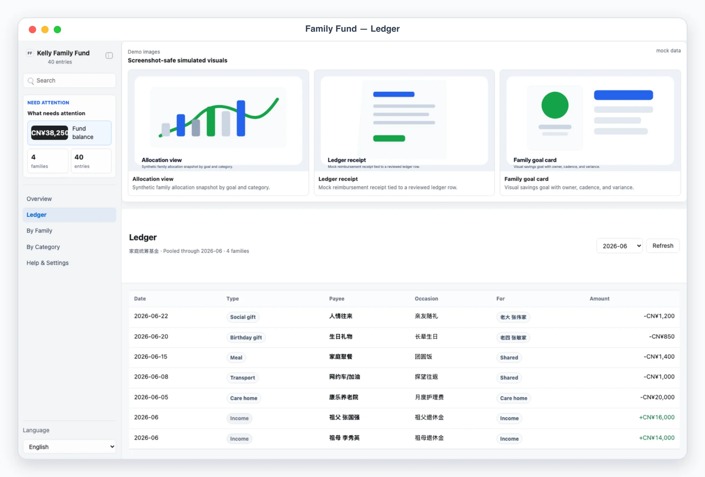</td>
  </tr>
  <tr>
    <td><strong>Overview</strong><br>Fund balance, this-month income / expense / net, care and family totals, an expense-by-category donut, running-balance trend, and read-only insights.</td>
    <td><strong>Ledger</strong><br>Unified income and expense timeline by month, each entry tagged with its category and the sibling family it benefits.</td>
  </tr>
  <tr>
    <td>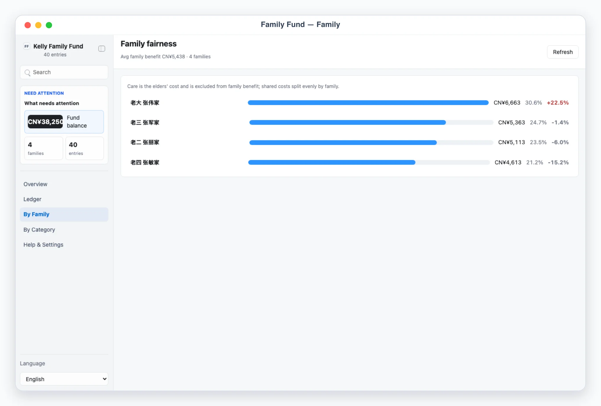</td>
    <td></td>
  </tr>
  <tr>
    <td><strong>By family (fairness)</strong><br>Each sibling family's cumulative benefit, share, and deviation from the average — care excluded, shared costs split equally — so anyone can confirm it is balanced.</td>
    <td><strong>By category</strong><br>Spending across care, transport, meals, gifts, and gifts of obligation, with the care-versus-family split.</td>
  </tr>
</table>

### `kelly-writer`

<table>
  <tr>
    <td width="50%"></td>
    <td width="50%"></td>
  </tr>
  <tr>
    <td><strong>Todo queue</strong><br>Confirmed content directions queued for AI writing, with ownership, status, and next-step controls.</td>
    <td><strong>Topic discovery</strong><br>Mock editorial planning with keyword clusters, audience fit, and topic opportunities.</td>
  </tr>
  <tr>
    <td width="50%"></td>
    <td width="50%"></td>
  </tr>
  <tr>
    <td><strong>Main draft</strong><br>Long-form writing workspace with outline, draft sections, source notes, and approval status.</td>
    <td><strong>Distribution review</strong><br>Channel handoff view for publishing, social snippets, newsletter framing, and final checks.</td>
  </tr>
</table>

### `kelly-pr-review`

<table>
  <tr>
    <td width="50%"></td>
    <td width="50%">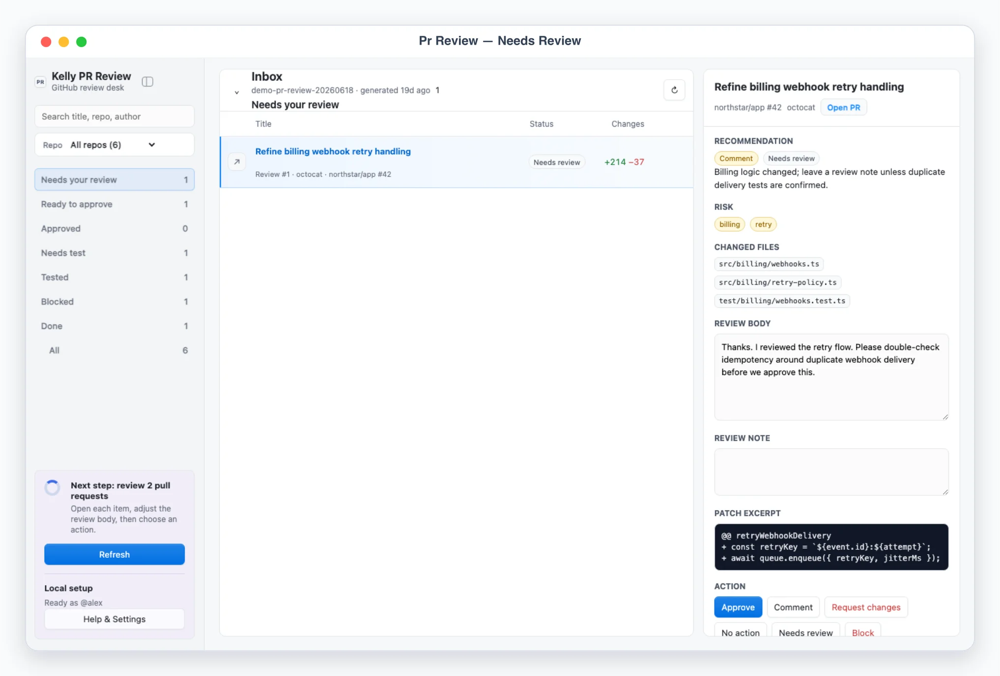</td>
  </tr>
  <tr>
    <td><strong>Overview</strong><br>Pull request review desk with repository filters, status counts, and reviewer configuration.</td>
    <td><strong>Needs review</strong><br>Mock pull request review with findings, confidence signals, test notes, and suggested actions.</td>
  </tr>
  <tr>
    <td width="50%"></td>
    <td width="50%">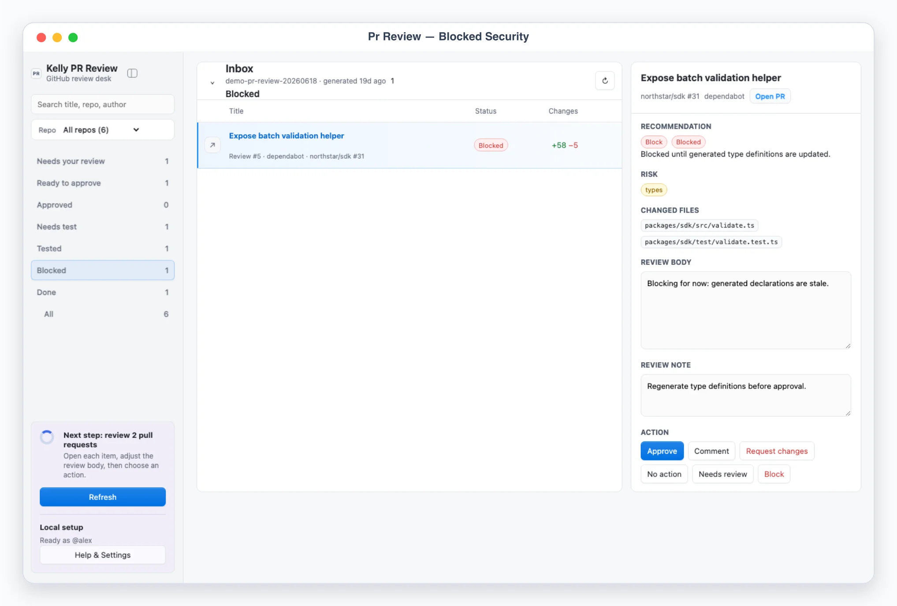</td>
  </tr>
  <tr>
    <td><strong>Ready to approve</strong><br>Approval-focused review where checks pass and the final recommendation is ready to send.</td>
    <td><strong>Blocked review</strong><br>Security-sensitive PR scenario with unresolved risk, blocking rationale, and reviewer handoff details.</td>
  </tr>
  <tr>
    <td width="50%"></td>
    <td width="50%">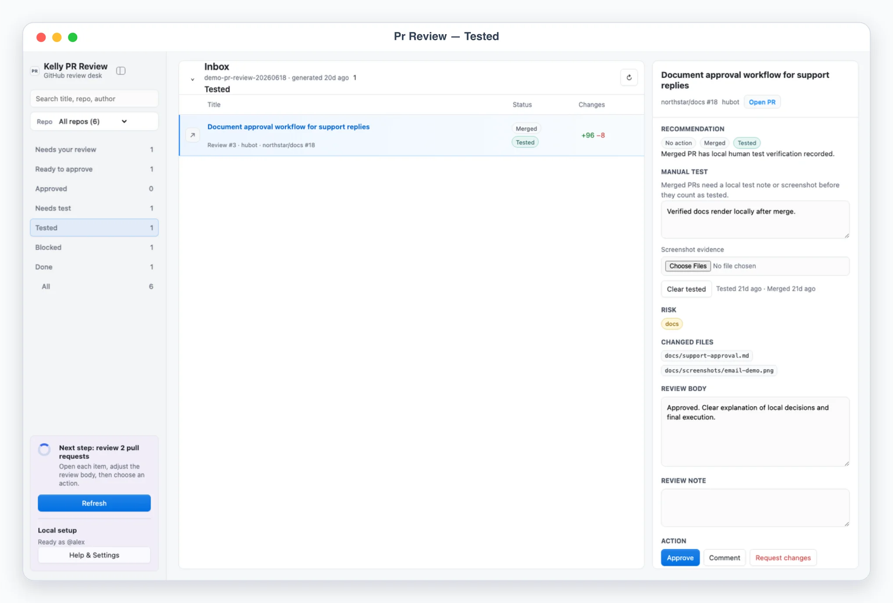</td>
  </tr>
  <tr>
    <td><strong>Needs test</strong><br>Merged pull request waiting for human verification with a required test note or screenshot evidence.</td>
    <td><strong>Tested</strong><br>Post-merge verification record showing the local test note that proves a human checked the change.</td>
  </tr>
</table>

### `kelly-drama`

<table>
  <tr>
    <td width="50%"></td>
    <td width="50%"></td>
  </tr>
  <tr>
    <td><strong>Overview</strong><br>Series workbench with health dashboard, execution timeline, stats, and settings for series parameters.</td>
    <td><strong>Episode table</strong><br>Episode list with script and storyboard status, shot readiness indicators, and per-episode detail pane.</td>
  </tr>
  <tr>
    <td width="50%">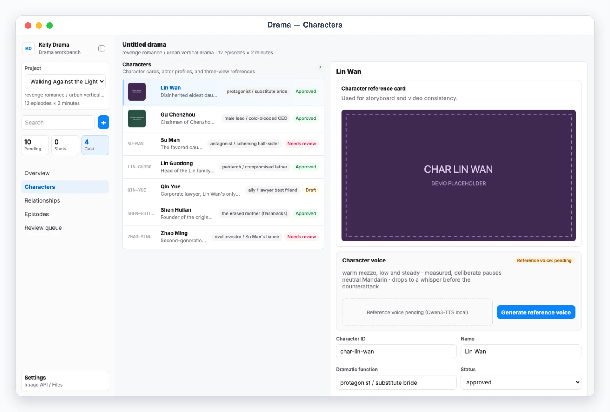</td>
    <td width="50%"></td>
  </tr>
  <tr>
    <td><strong>Character library</strong><br>Character list with three-view image status, actor settings, wardrobe, and voice preview controls.</td>
    <td><strong>Relationship map</strong><br>Character relationship view with power dynamics, evidence links, and relationship detail pane.</td>
  </tr>
</table>

### `kelly-mv`

<table>
  <tr>
    <td width="50%"></td>
    <td width="50%">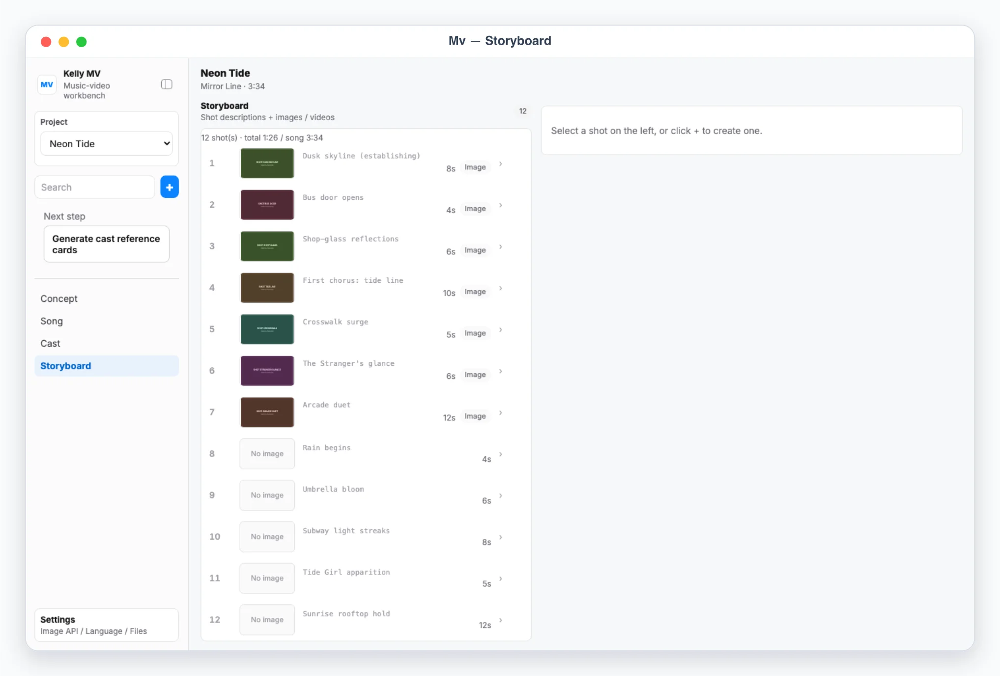</td>
  </tr>
  <tr>
    <td><strong>Concept</strong><br>MV concept workbench with project checklist, next-step guidance, concept form, and how-to walkthrough.</td>
    <td><strong>Storyboard</strong><br>Shot list with duration, image status, and a detail pane for description, image generation, and video upload.</td>
  </tr>
  <tr>
    <td width="50%">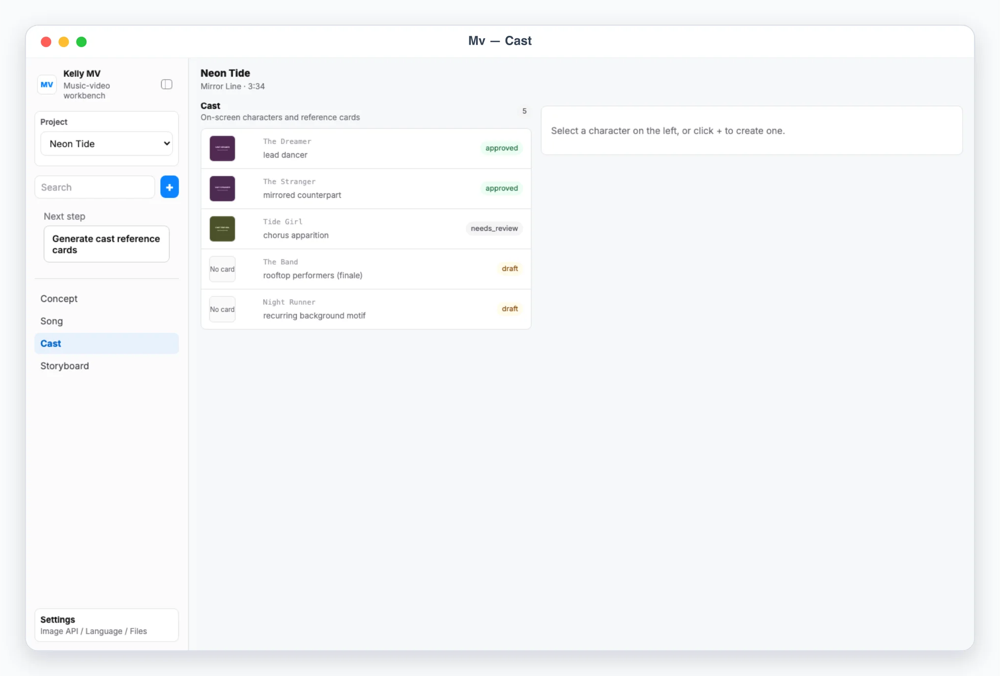</td>
    <td width="50%"></td>
  </tr>
  <tr>
    <td><strong>Cast</strong><br>Character list with reference card status and a detail form for visual description, wardrobe, and consistency anchors.</td>
    <td><strong>Song</strong><br>MP3 upload and song metadata form with auto-detected duration and song-gen backend status.</td>
  </tr>
</table>

### `kelly-digital-human`

Digital-human implementation and demo desk for choosing between a fast 2D service integration and a high-control 3D UE/Unity build.

<table>
  <tr>
    <td width="50%"></td>
    <td width="50%">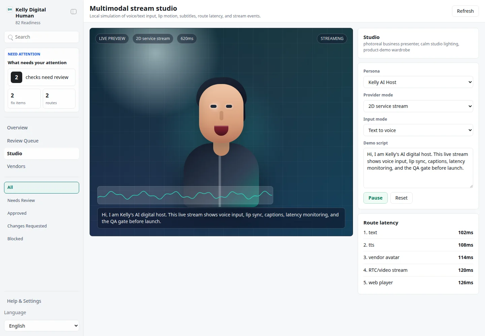</td>
  </tr>
  <tr>
    <td><strong>Solution overview</strong><br>Side-by-side 2D fast-launch and 3D custom-build paths, with readiness score, latency targets, and launch blockers.</td>
    <td><strong>Multimodal studio</strong><br>Animated avatar stream with lip motion, waveform, transcript, provider mode, route latency, and stream events.</td>
  </tr>
  <tr>
    <td width="50%">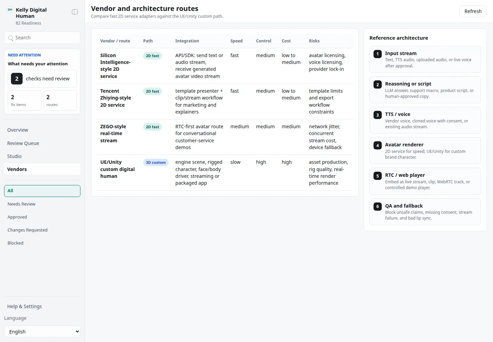</td>
    <td width="50%">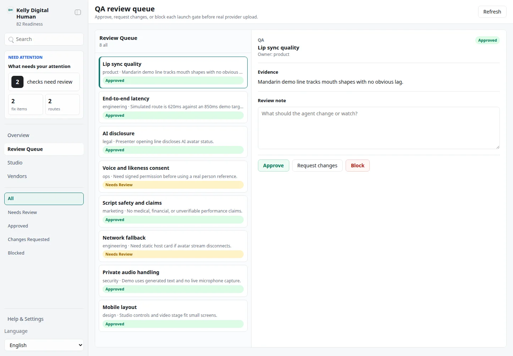</td>
  </tr>
  <tr>
    <td><strong>Vendor and architecture desk</strong><br>Compares 2D service integration, real-time RTC rendering, and UE/Unity 3D architecture with cost, speed, and control tradeoffs.</td>
    <td><strong>Launch QA gate</strong><br>Checks lip sync, stream latency, consent, script safety, fallback behavior, and production handoff state before launch.</td>
  </tr>
</table>

### `kelly-crm`

<table>
  <tr>
    <td width="50%"></td>
    <td width="50%"></td>
  </tr>
  <tr>
    <td><strong>Overview</strong><br>CRM command desk with pipeline totals by stage, follow-ups due, recent activity, and network counts.</td>
    <td><strong>Deals</strong><br>Pipeline table across stages with amounts, probability, next steps, and a per-deal interaction timeline.</td>
  </tr>
  <tr>
    <td width="50%">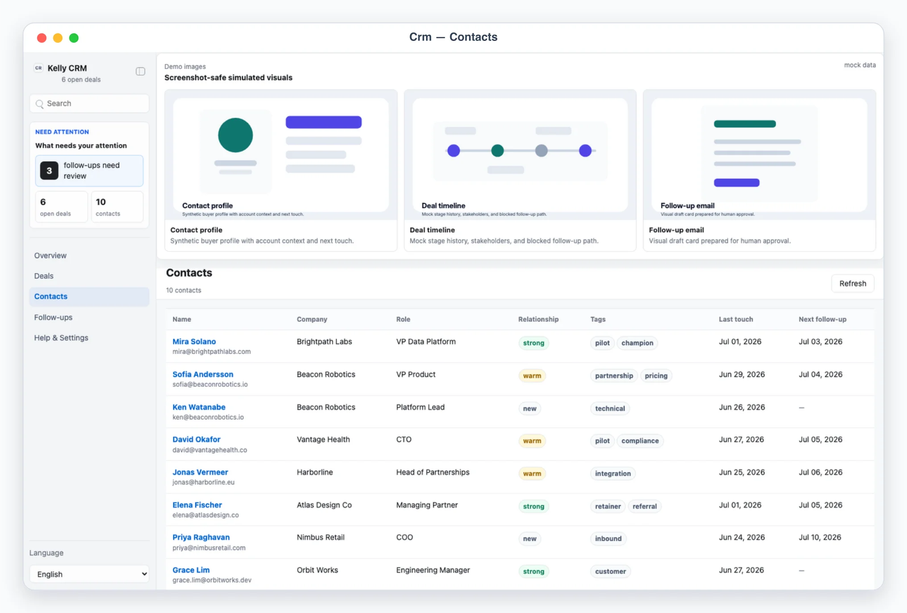</td>
    <td width="50%">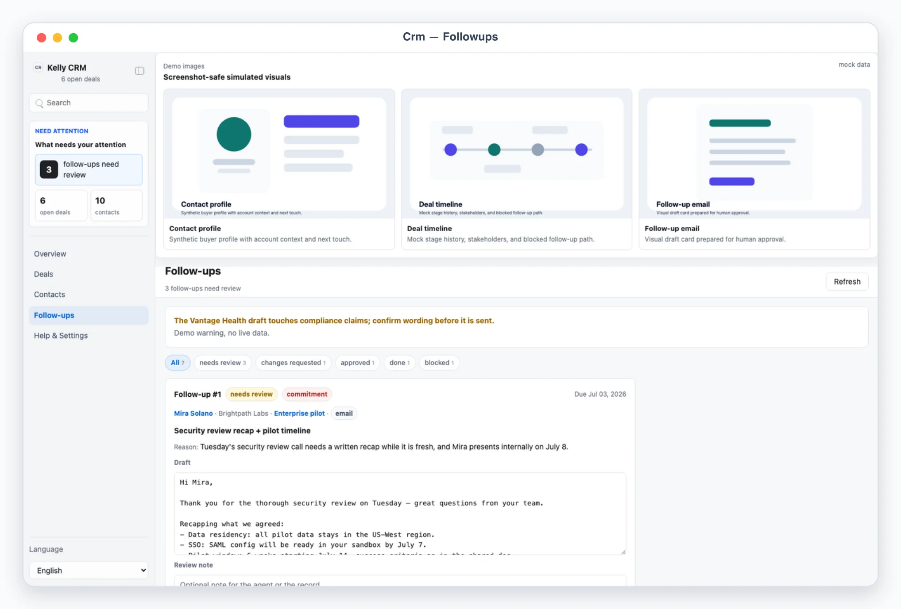</td>
  </tr>
  <tr>
    <td><strong>Contacts</strong><br>Contact list with relationship strength, last touch, and per-contact interaction history and open deals.</td>
    <td><strong>Follow-up queue</strong><br>Agent-drafted follow-up messages with editable drafts, risk badges, and approve/request-changes/block decisions.</td>
  </tr>
</table>

### `kelly-messenger`

<table>
  <tr>
    <td width="50%">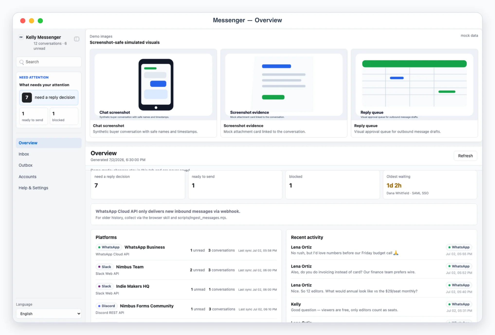</td>
    <td width="50%">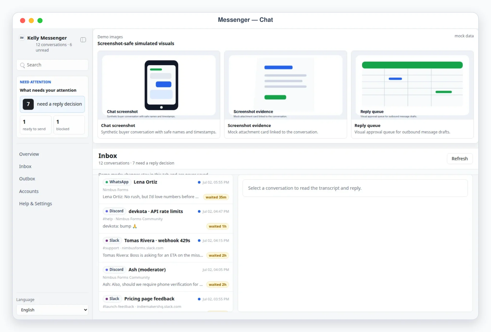</td>
  </tr>
  <tr>
    <td><strong>Overview</strong><br>Messaging command desk with reply-decision counts, per-platform sync status, and oldest-waiting indicator.</td>
    <td><strong>Conversation</strong><br>Chat transcript with an agent-suggested reply prefilled in the composer, ready to edit and queue.</td>
  </tr>
  <tr>
    <td width="50%">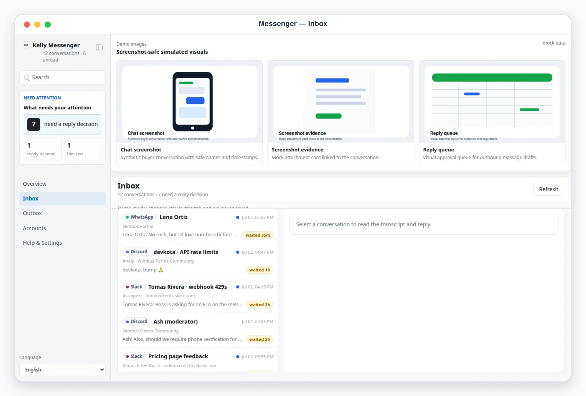</td>
    <td width="50%">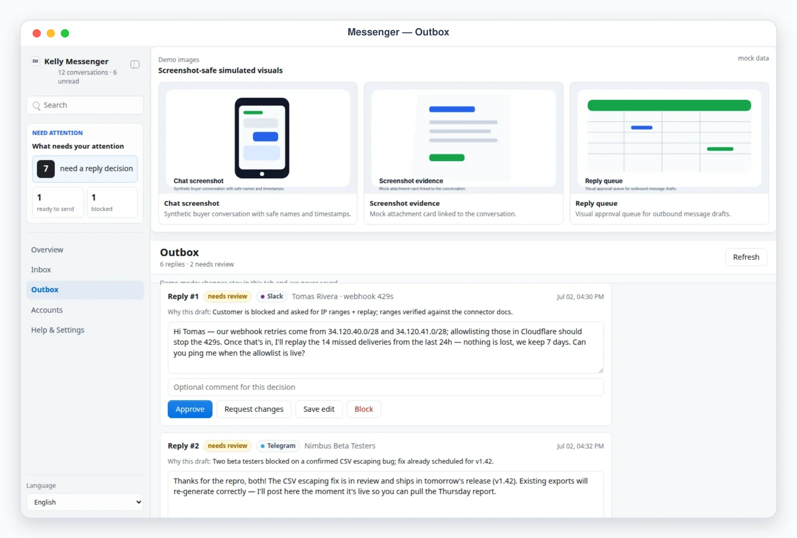</td>
  </tr>
  <tr>
    <td><strong>Unified inbox</strong><br>Conversations across WhatsApp, Slack, Discord, and Telegram sorted by latest activity with waiting-time badges.</td>
    <td><strong>Reply outbox</strong><br>Approval queue for outgoing replies: every message is reviewed before the agent sends it via platform connectors.</td>
  </tr>
  <tr>
    <td width="50%">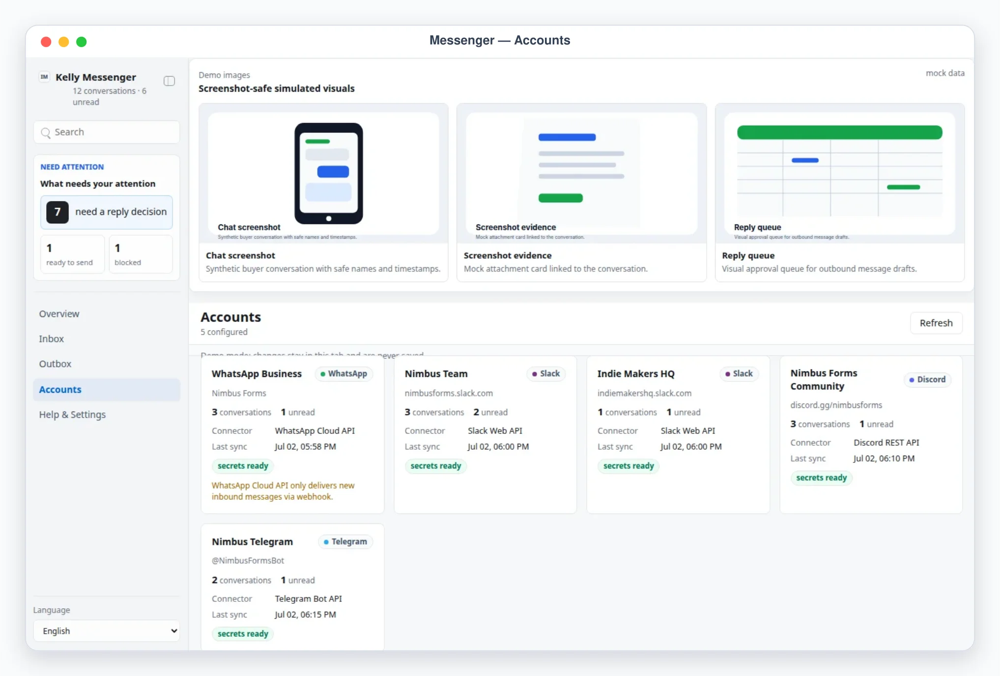</td>
  </tr>
  <tr>
    <td><strong>Accounts</strong><br>Connected messaging accounts across WhatsApp and Telegram with connector status and secret readiness.</td>
  </tr>
</table>

### `kelly-social`

<table>
  <tr>
    <td width="50%">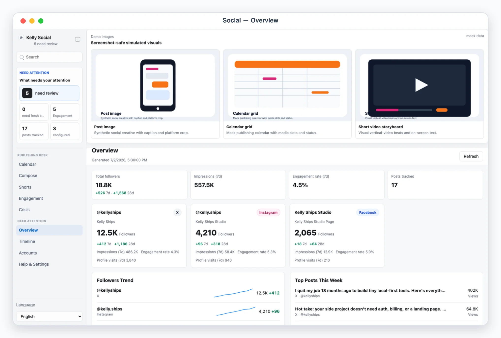</td>
    <td width="50%">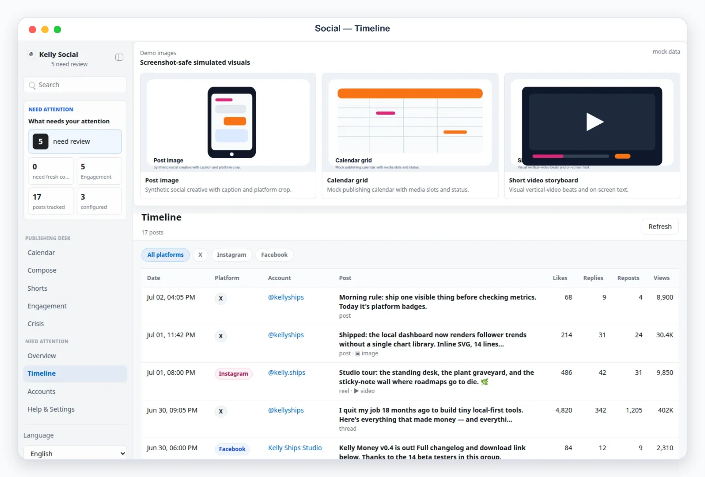</td>
  </tr>
  <tr>
    <td><strong>Overview</strong><br>Cross-platform KPI cards for X, Instagram, and Facebook with follower trends and top posts of the week.</td>
    <td><strong>Unified timeline</strong><br>Posts across all platforms in one stream with per-post likes, replies, reposts, and view counts.</td>
  </tr>
  <tr>
    <td width="50%">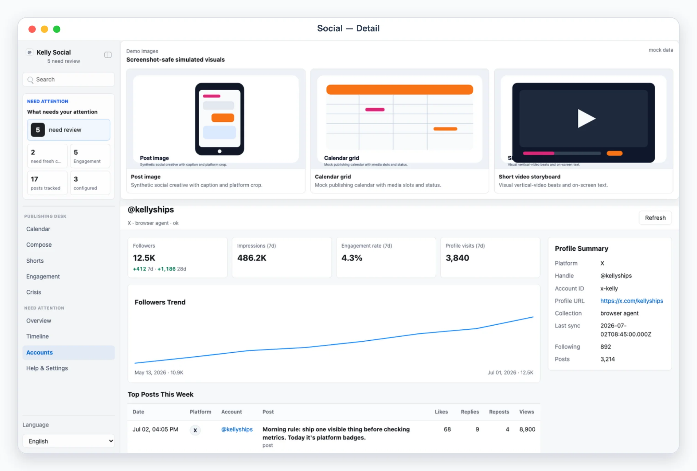</td>
    <td width="50%"></td>
  </tr>
  <tr>
    <td><strong>Detail</strong><br>Single-post performance view with platform metrics, comments, reply drafts, and approval status.</td>
    <td><strong>Accounts</strong><br>Connected-account health board with platform status, audience totals, content cadence, and sync freshness.</td>
  </tr>
  <tr>
    <td width="50%">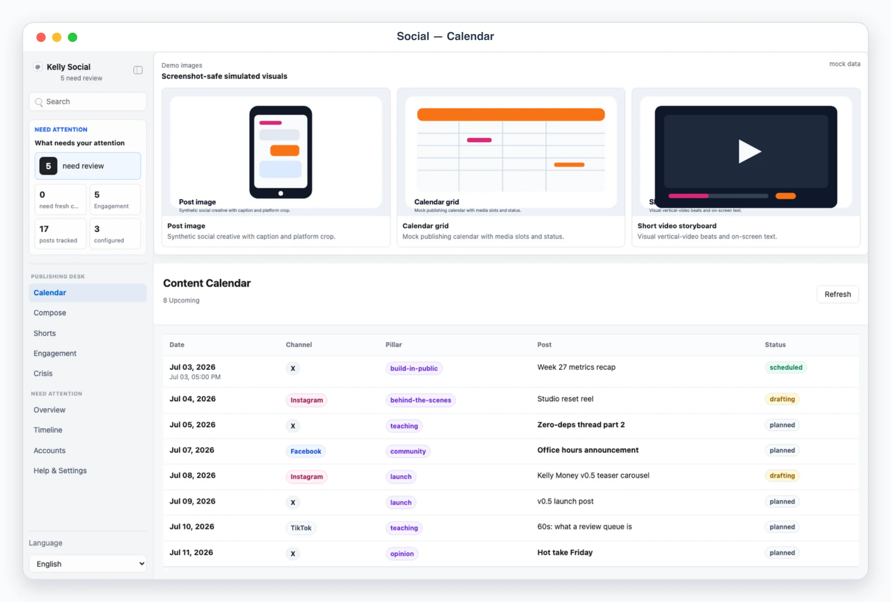</td>
    <td width="50%">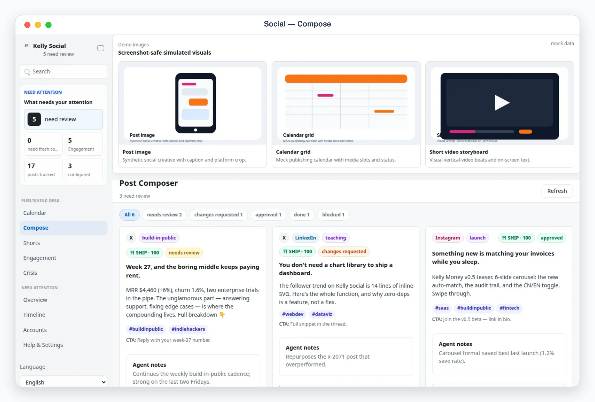</td>
  </tr>
  <tr>
    <td><strong>Content calendar</strong><br>Scheduled posts across channels by theme pillar and date, with status and approvals.</td>
    <td><strong>Compose (publishing)</strong><br>Agent-drafted posts in a review queue with hooks, hashtags, and CTAs, behind a social-qa SHIP/FIX/BLOCK gate — one draft blocked for a banned claim.</td>
  </tr>
  <tr>
    <td width="50%">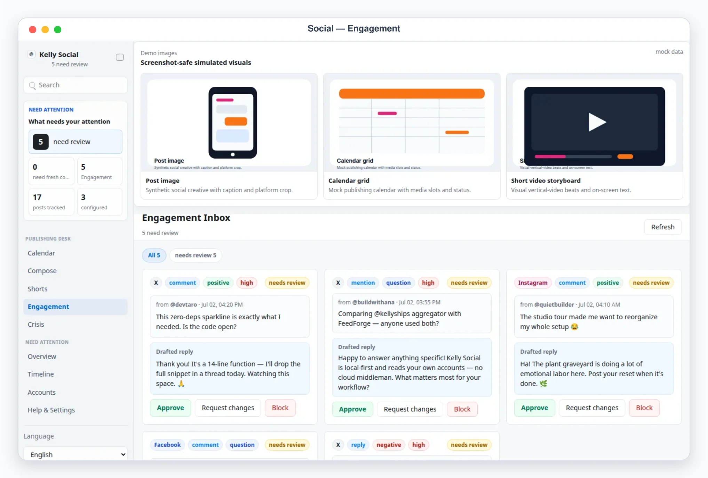</td>
  </tr>
  <tr>
    <td><strong>Engagement</strong><br>Mentions and comments inbox grouped by urgency, sentiment, owner, and reply-approval state.</td>
  </tr>
  <tr>
    <td width="50%"></td>
    <td width="50%"></td>
  </tr>
  <tr>
    <td><strong>Short-video scripts</strong><br>Short-video script queue for Instagram, TikTok, and YouTube with hooks, shot lists, and approval state.</td>
    <td><strong>Crisis playbook</strong><br>Incident status board with triage steps, pause-publishing controls, and spokesperson designation.</td>
  </tr>
</table>

### `kelly-support`

Customer-support desk — KB-grounded drafted replies, SLA + CSAT, and a support-qa gate. The visitor chat widget is a documented future extension.

<table>
  <tr>
    <td width="50%">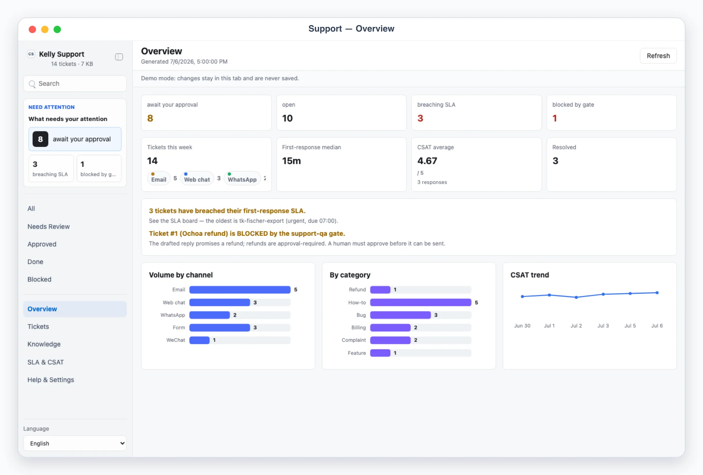</td>
    <td width="50%">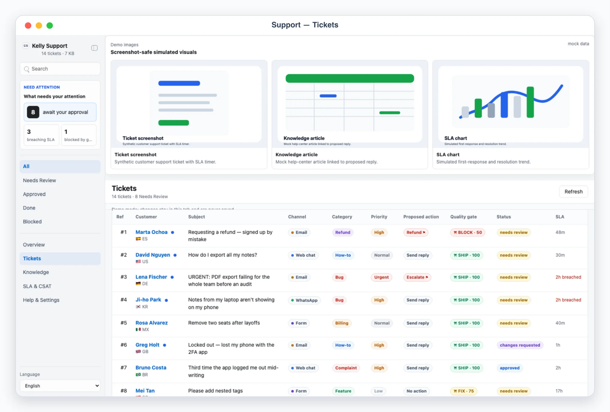</td>
  </tr>
  <tr>
    <td><strong>Overview</strong><br>Queue health — open, breaching-SLA, and awaiting-approval counts, CSAT trend, and volume by channel and category.</td>
    <td><strong>Tickets</strong><br>Approval queue with the KB-grounded draft reply and the support-qa gate — a refund draft blocked pending human approval.</td>
  </tr>
  <tr>
    <td>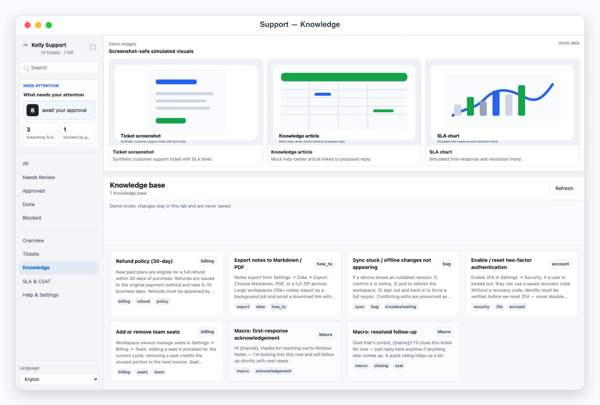</td>
    <td></td>
  </tr>
  <tr>
    <td><strong>Knowledge base</strong><br>Articles and canned macros the agent cites when drafting replies.</td>
    <td><strong>SLA &amp; CSAT</strong><br>SLA board of due and breached tickets, plus CSAT scores on resolved tickets.</td>
  </tr>
</table>

### `kelly-seo`

<table>
  <tr>
    <td width="50%">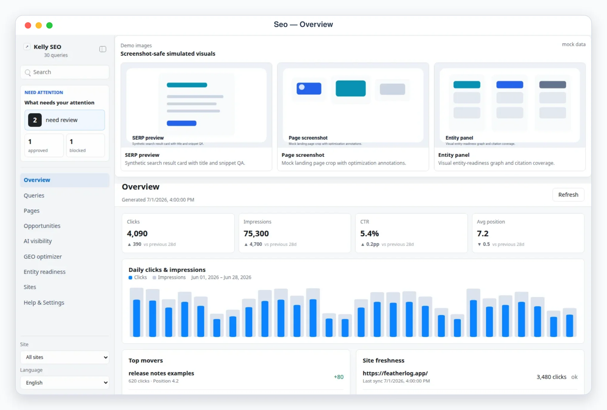</td>
    <td width="50%"></td>
  </tr>
  <tr>
    <td><strong>Overview</strong><br>Search Console KPI cards with daily clicks/impressions chart, top movers, and per-site freshness.</td>
    <td><strong>Queries</strong><br>Top queries with clicks, impressions, CTR, position, period deltas, and opportunity badges.</td>
  </tr>
  <tr>
    <td width="50%">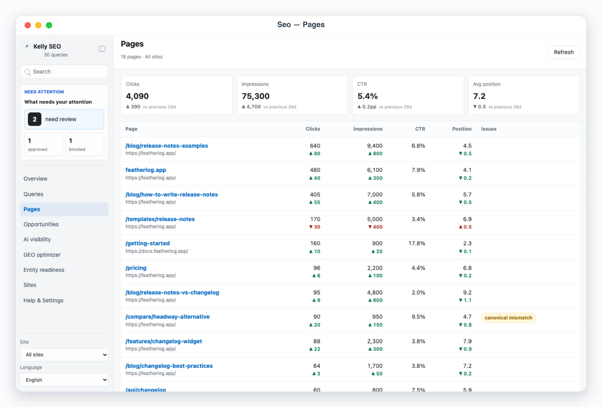</td>
    <td width="50%">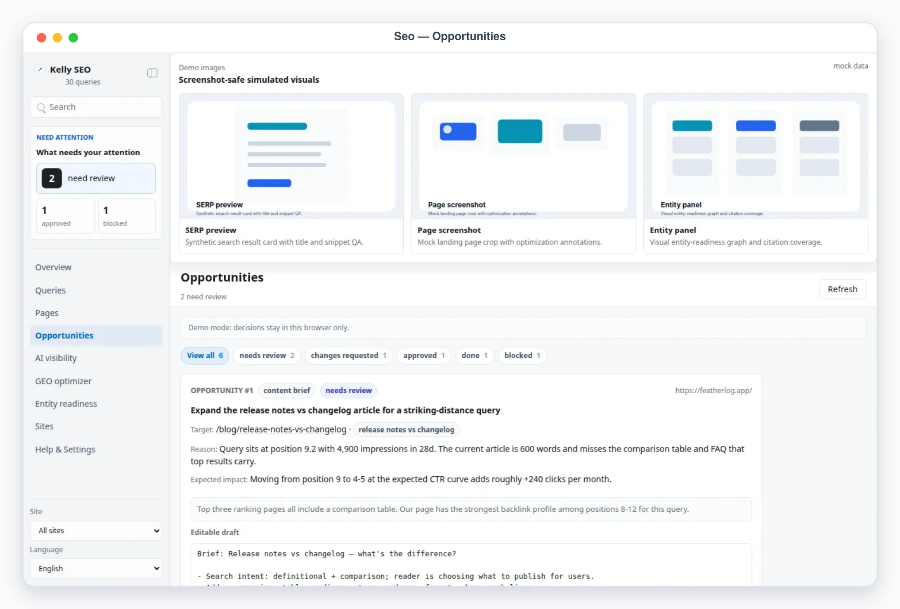</td>
  </tr>
  <tr>
    <td><strong>Pages</strong><br>Page-level click and impression table with top growth and decline movers for prioritizing content updates.</td>
    <td><strong>Opportunities</strong><br>Ranked SEO opportunity queue with impact, effort, evidence, and recommended next actions.</td>
  </tr>
  <tr>
    <td width="50%">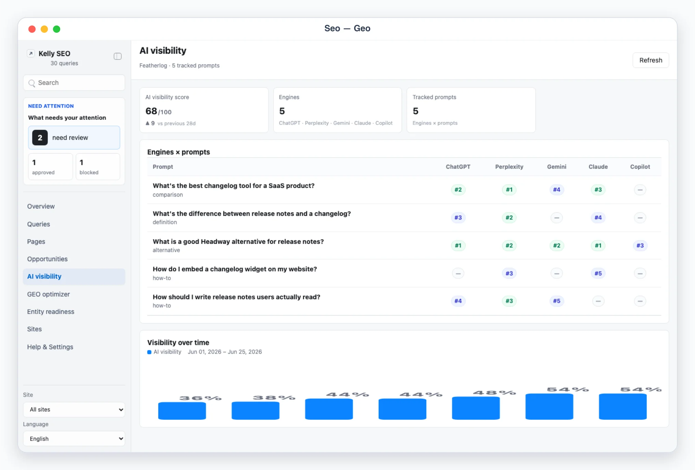</td>
    <td width="50%"></td>
  </tr>
  <tr>
    <td><strong>AI visibility (GEO)</strong><br>An engines×prompts matrix of where the brand is cited across ChatGPT, Perplexity, Gemini, Claude, and Copilot, with an overall visibility score and trend.</td>
    <td><strong>GEO optimizer</strong><br>Agent-proposed rewrites that make pages more citable by AI engines, gated by geo-qa — one blocked for a fabricated stat.</td>
  </tr>
  <tr>
    <td width="50%">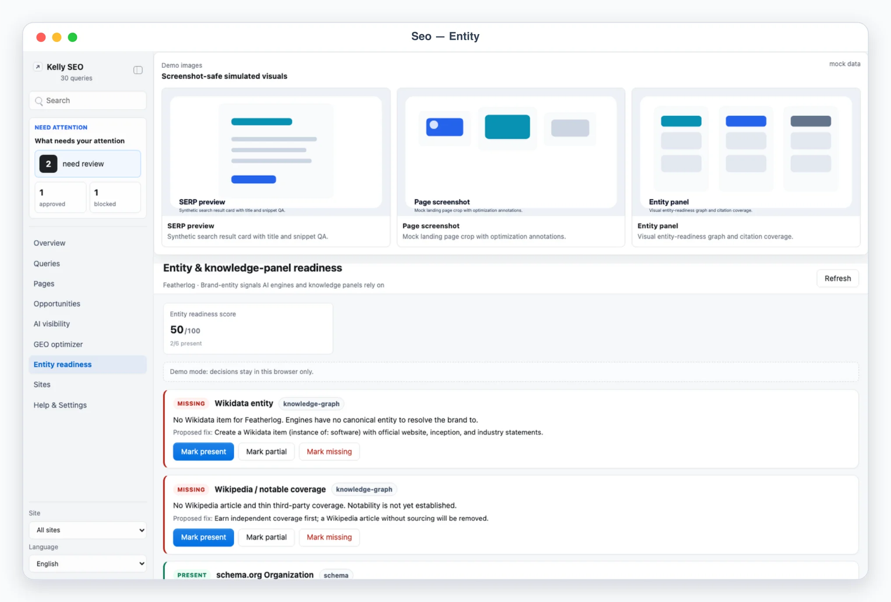</td>
    <td width="50%"></td>
  </tr>
  <tr>
    <td><strong>Entity readiness</strong><br>Entity readiness checklist showing schema coverage, citation signals, and blocked/ready status for AI answer engines.</td>
    <td><strong>Sites</strong><br>Configured Search Console properties with verification type, last sync, and 28-day click and impression totals.</td>
  </tr>
</table>

### `kelly-feedback`

<table>
  <tr>
    <td width="50%">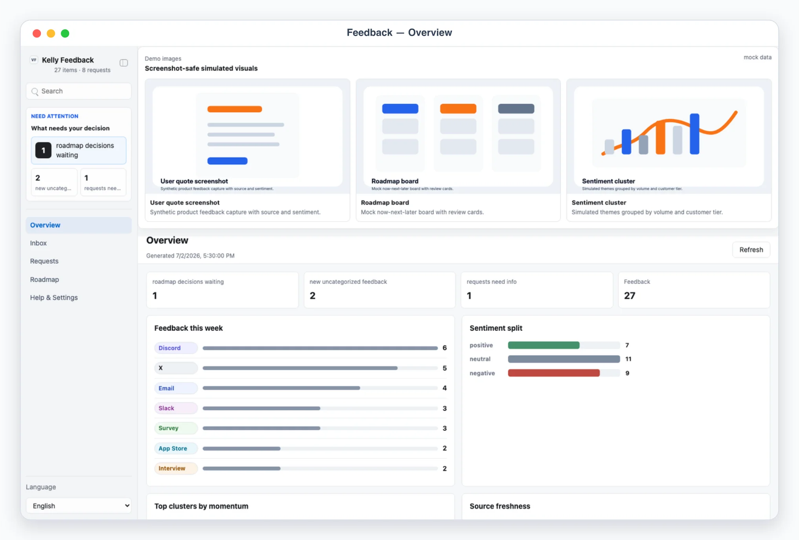</td>
    <td width="50%">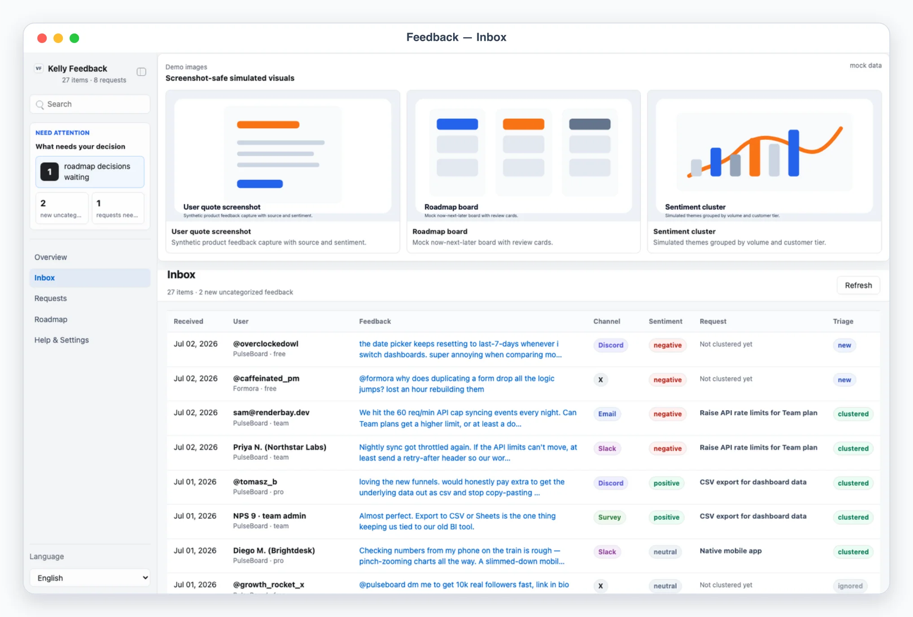</td>
  </tr>
  <tr>
    <td><strong>Overview</strong><br>Voice-of-customer desk with weekly inflow by channel, sentiment split, top clusters, and source freshness.</td>
    <td><strong>Inbox</strong><br>Raw feedback stream across email, Discord, Slack, X, and app-store reviews with triage controls.</td>
  </tr>
  <tr>
    <td width="50%"></td>
    <td width="50%"></td>
  </tr>
  <tr>
    <td><strong>Requests</strong><br>Clustered feature requests with frequency, weighted scores, trend, and representative quotes.</td>
    <td><strong>Roadmap decisions</strong><br>Agent-proposed promote/decline/merge proposals with drafted changelog notes and user replies for approval.</td>
  </tr>
</table>

### `kelly-radar`

<table>
  <tr>
    <td width="50%">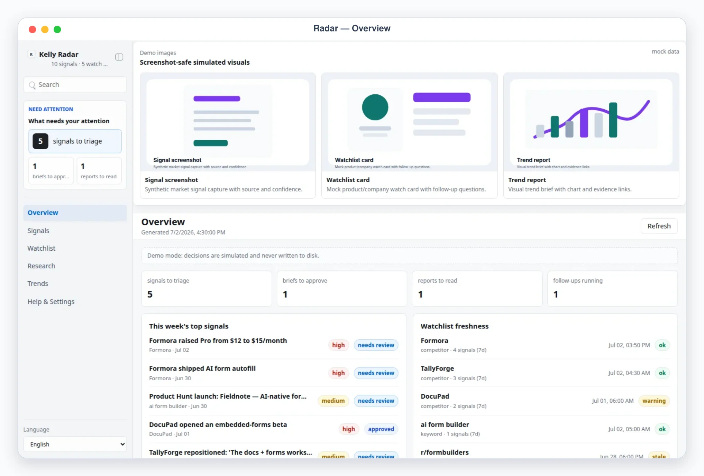</td>
    <td width="50%">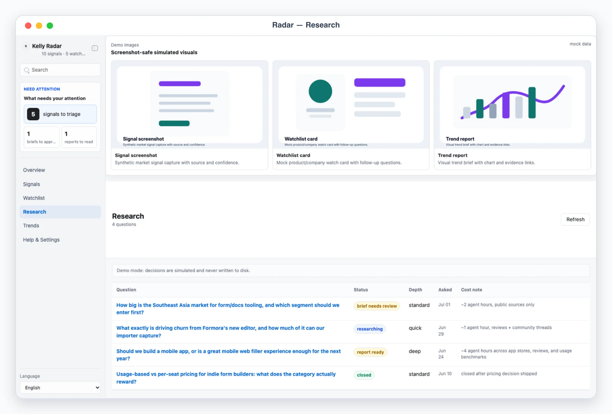</td>
  </tr>
  <tr>
    <td><strong>Overview</strong><br>Market-intelligence desk with signals to triage, watchlist freshness, top trend movers, and the research pipeline.</td>
    <td><strong>Research desk</strong><br>Research questions moving through brief approval, deep research, and cited report review.</td>
  </tr>
  <tr>
    <td width="50%">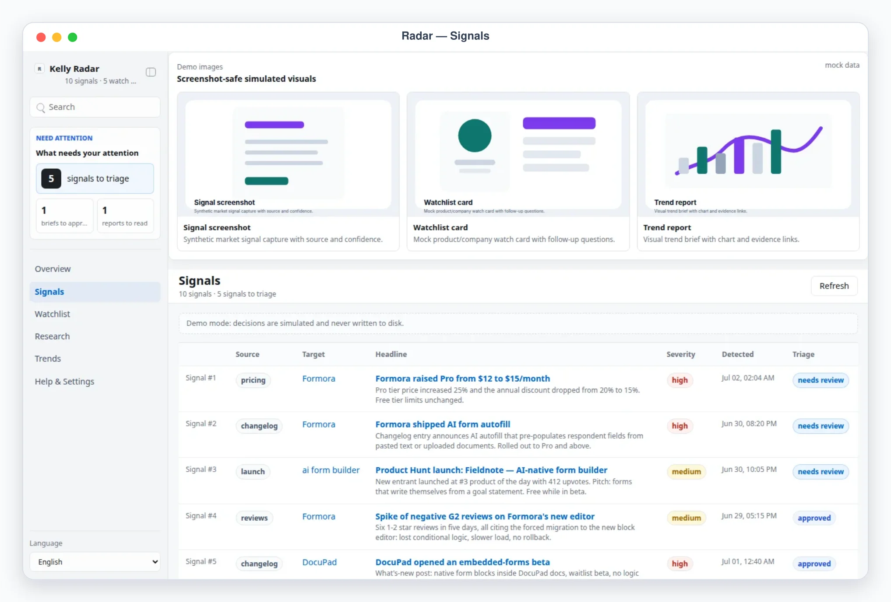</td>
    <td width="50%">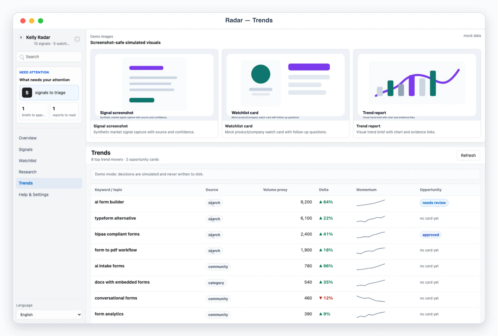</td>
  </tr>
  <tr>
    <td><strong>Signals</strong><br>Competitor pricing, changelog, launch, review, and hiring signals with severity badges and Act/Watch/Ignore triage.</td>
    <td><strong>Trends</strong><br>Rising keywords and community topics with momentum sparklines and opportunity cards for content or roadmap handoff.</td>
  </tr>
  <tr>
    <td width="50%"></td>
  </tr>
  <tr>
    <td><strong>Watchlist</strong><br>Tracked competitors with pricing and positioning change signals, review status, and last-monitored timestamps.</td>
  </tr>
</table>

### `kelly-ai-newsroom`

<table>
  <tr>
    <td width="50%">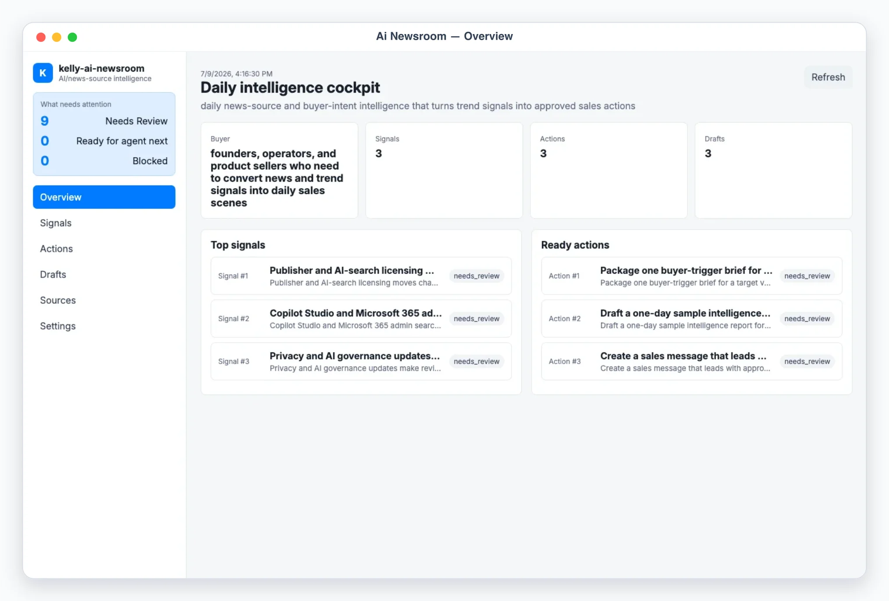</td>
    <td width="50%">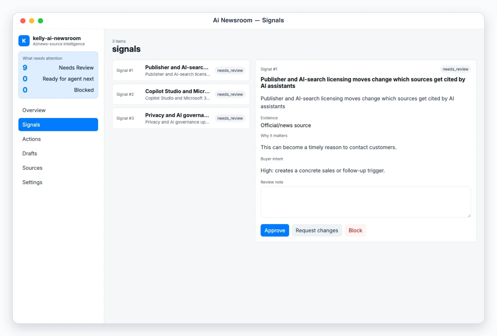</td>
  </tr>
  <tr>
    <td><strong>Overview</strong><br>Daily buyer-trigger cockpit with top AI/source signals, approved actions, blocked claims, and source coverage.</td>
    <td><strong>Signals</strong><br>Evidence-backed AI, search, and platform movement interpreted as purchase intent or watch-only noise.</td>
  </tr>
  <tr>
    <td width="50%"></td>
    <td width="50%"></td>
  </tr>
  <tr>
    <td><strong>Actions</strong><br>Sales and operating moves with approval status, risk notes, and the next concrete handoff.</td>
    <td><strong>Drafts</strong><br>Editable sales openers, LinkedIn posts, and client memos kept behind a review gate.</td>
  </tr>
</table>

### `kelly-real-estate-intel`

<table>
  <tr>
    <td width="50%"></td>
    <td width="50%"></td>
  </tr>
  <tr>
    <td><strong>Overview</strong><br>Property-agency desk showing today's market trigger, ready outreach, blocked claims, and coverage gaps.</td>
    <td><strong>Signals</strong><br>Listings, transaction, mortgage, district, and competitor-ad movement tied to buyer or owner intent.</td>
  </tr>
  <tr>
    <td width="50%"></td>
    <td width="50%">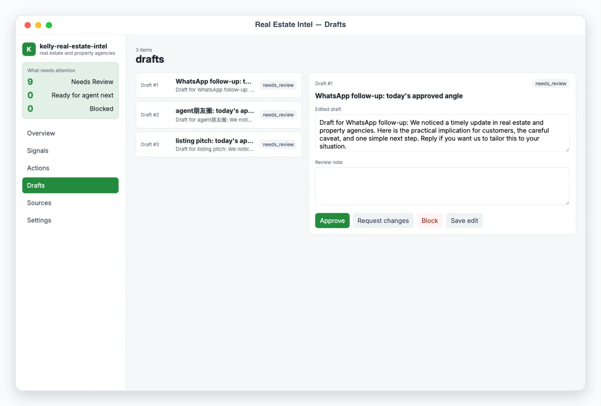</td>
  </tr>
  <tr>
    <td><strong>Actions</strong><br>Call scripts, owner notes, listing angles, and open-house talking points queued for approval.</td>
    <td><strong>Drafts</strong><br>Editable client follow-ups and property-market memos with evidence and approval controls.</td>
  </tr>
</table>

### `kelly-education-intel`

<table>
  <tr>
    <td width="50%"></td>
    <td width="50%"></td>
  </tr>
  <tr>
    <td><strong>Overview</strong><br>Education-intelligence desk with enrollment triggers, ready actions, blocked claims, and source freshness.</td>
    <td><strong>Signals</strong><br>Exam, admissions, visa, school-calendar, and parent-question movement interpreted as purchase anxiety.</td>
  </tr>
  <tr>
    <td width="50%"></td>
    <td width="50%"></td>
  </tr>
  <tr>
    <td><strong>Actions</strong><br>Parent FAQ, webinar, advisor, and course-launch actions with review status.</td>
    <td><strong>Drafts</strong><br>Editable parent memos and enrollment copy that avoid guarantees and unsupported claims.</td>
  </tr>
</table>

### `kelly-beauty-intel`

<table>
  <tr>
    <td width="50%"></td>
    <td width="50%"></td>
  </tr>
  <tr>
    <td><strong>Overview</strong><br>Beauty and medical-aesthetic desk with demand triggers, reviewable actions, and blocked medical claims.</td>
    <td><strong>Signals</strong><br>Competitor offers, treatment trends, reviews, safety notices, and seasonal demand with risk badges.</td>
  </tr>
  <tr>
    <td width="50%">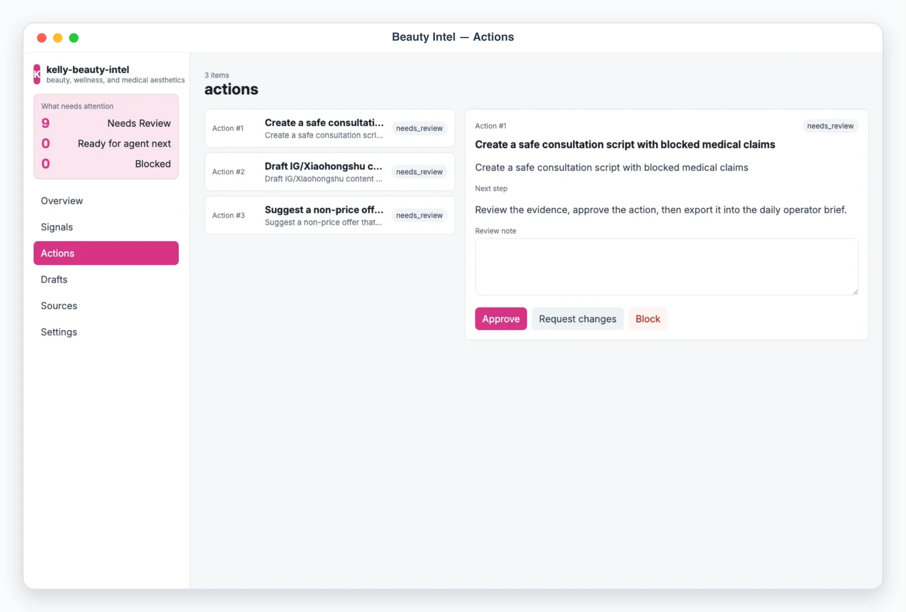</td>
    <td width="50%">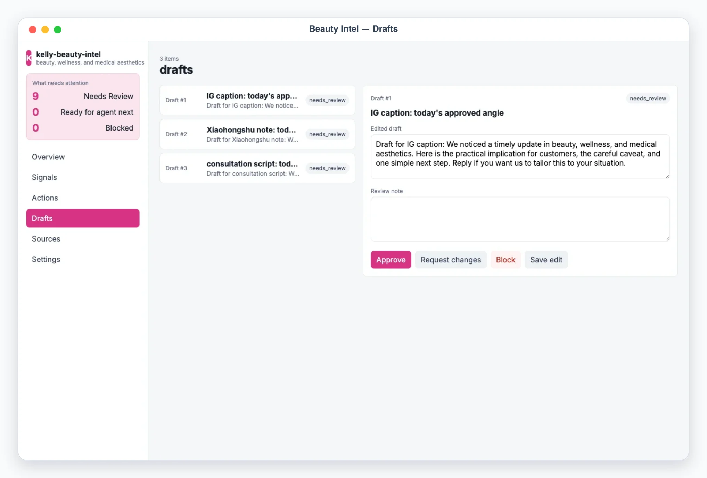</td>
  </tr>
  <tr>
    <td><strong>Actions</strong><br>Consultation scripts, staff notes, campaign angles, and review-recovery actions queued for approval.</td>
    <td><strong>Drafts</strong><br>Editable client education and promotion copy that stays within safe-claim boundaries.</td>
  </tr>
</table>

### `kelly-insurance-intel`

<table>
  <tr>
    <td width="50%"></td>
    <td width="50%">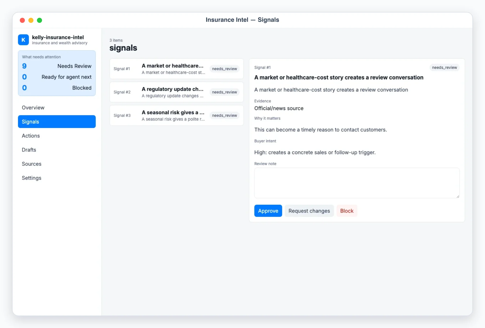</td>
  </tr>
  <tr>
    <td><strong>Overview</strong><br>Insurance-advisor desk with protection-gap triggers, renewal actions, blocked advice, and source freshness.</td>
    <td><strong>Signals</strong><br>Regulator, insurer, premium, benefit, health, travel, and lifecycle signals interpreted as review reasons.</td>
  </tr>
  <tr>
    <td width="50%">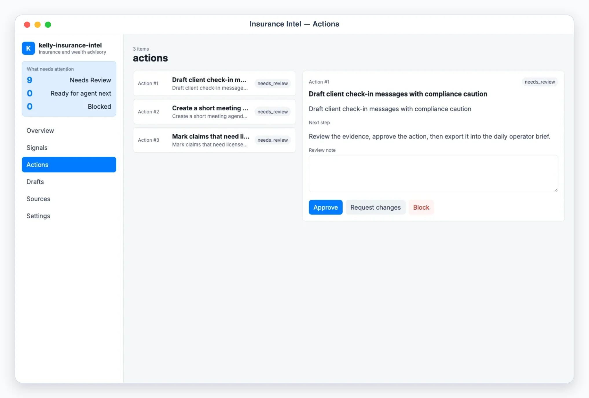</td>
    <td width="50%"></td>
  </tr>
  <tr>
    <td><strong>Actions</strong><br>Meeting agendas, renewal checklists, and education tasks with compliance-aware approval status.</td>
    <td><strong>Drafts</strong><br>Editable client education and advisor scripts that avoid suitability or return promises.</td>
  </tr>
</table>

### `kelly-insure-data`

<table>
  <tr>
    <td width="50%"></td>
    <td width="50%"></td>
  </tr>
  <tr>
    <td><strong>Overview</strong><br>Insurance data-governance cockpit with record counts, quality score, metadata coverage, and cleanup targets.</td>
    <td><strong>File Drive</strong><br>Busabase Drive-node file list with metadata completeness, missing fields, source, owner, jurisdiction, and review status.</td>
  </tr>
  <tr>
    <td width="50%"></td>
    <td width="50%"></td>
  </tr>
  <tr>
    <td><strong>QA</strong><br>Canonical insurance question-answer records from a Busabase Base, with source traceability and governance warnings.</td>
    <td><strong>News</strong><br>Insurance news and market-intelligence records with publisher, market, publish date, URL, and completeness checks.</td>
  </tr>
</table>

### `kelly-retail-intel`

<table>
  <tr>
    <td width="50%">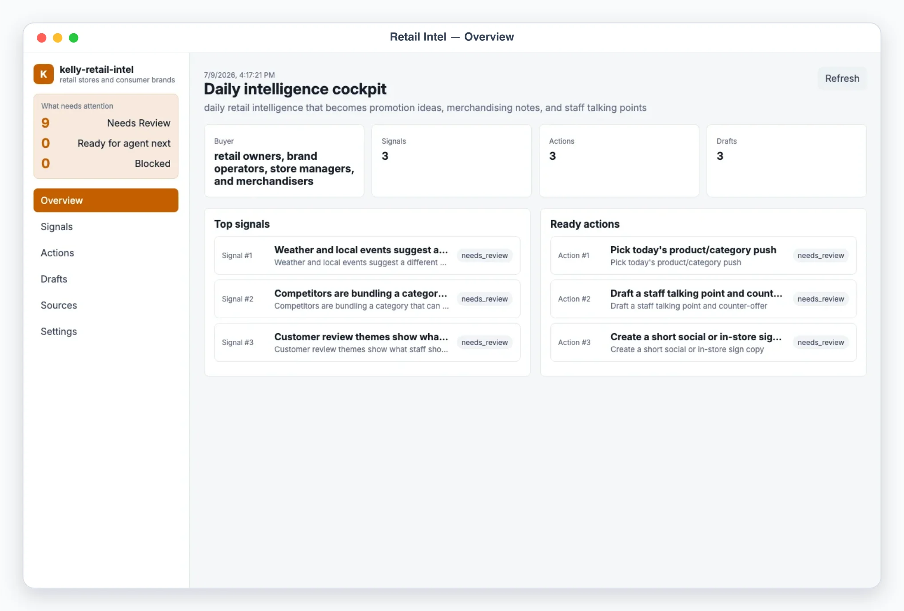</td>
    <td width="50%"></td>
  </tr>
  <tr>
    <td><strong>Overview</strong><br>Retail desk with local demand triggers, hero SKUs, ready store actions, and blocked promises.</td>
    <td><strong>Signals</strong><br>Weather, events, competitor promotions, product trends, and review themes tied to merchandising decisions.</td>
  </tr>
  <tr>
    <td width="50%">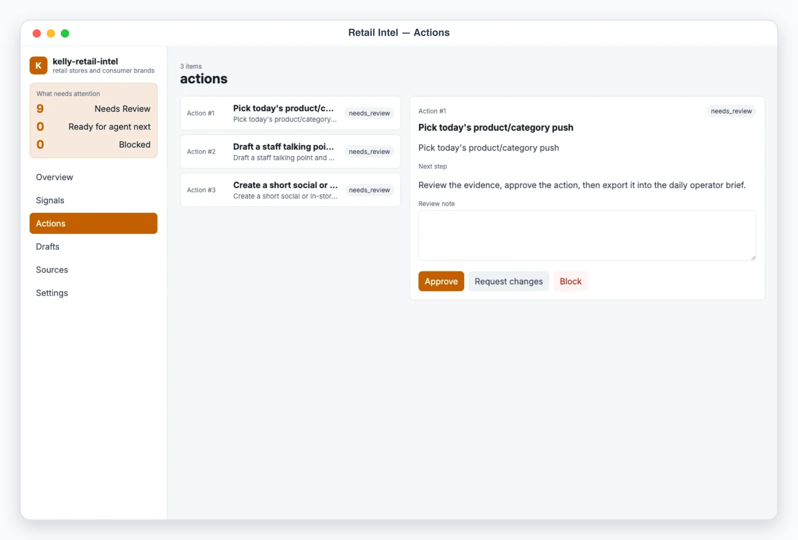</td>
    <td width="50%">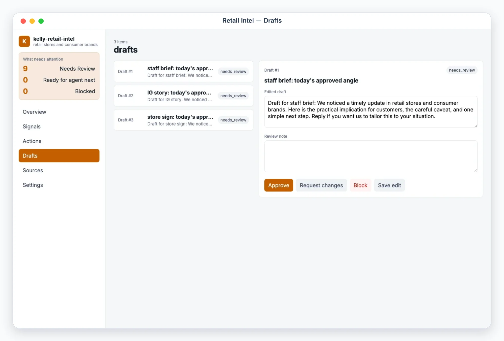</td>
  </tr>
  <tr>
    <td><strong>Actions</strong><br>Store briefs, signage, replenishment checks, and staff scripts queued for approval.</td>
    <td><strong>Drafts</strong><br>Editable campaign, signage, and customer-message copy with local source context.</td>
  </tr>
</table>

### `kelly-ecommerce-intel`

<table>
  <tr>
    <td width="50%"></td>
    <td width="50%"></td>
  </tr>
  <tr>
    <td><strong>Overview</strong><br>Ecommerce seller desk with SKU triggers, platform risks, ready optimizations, and blocked claims.</td>
    <td><strong>Signals</strong><br>Marketplace policy, competitor price, ranking, ad, review, and search-intent changes.</td>
  </tr>
  <tr>
    <td width="50%"></td>
    <td width="50%"></td>
  </tr>
  <tr>
    <td><strong>Actions</strong><br>Listing edits, ad angles, bundle tests, and review-response tasks with approval status.</td>
    <td><strong>Drafts</strong><br>Editable listing, ad, and customer-response copy held behind the review gate.</td>
  </tr>
</table>

### `kelly-restaurant-intel`

<table>
  <tr>
    <td width="50%"></td>
    <td width="50%">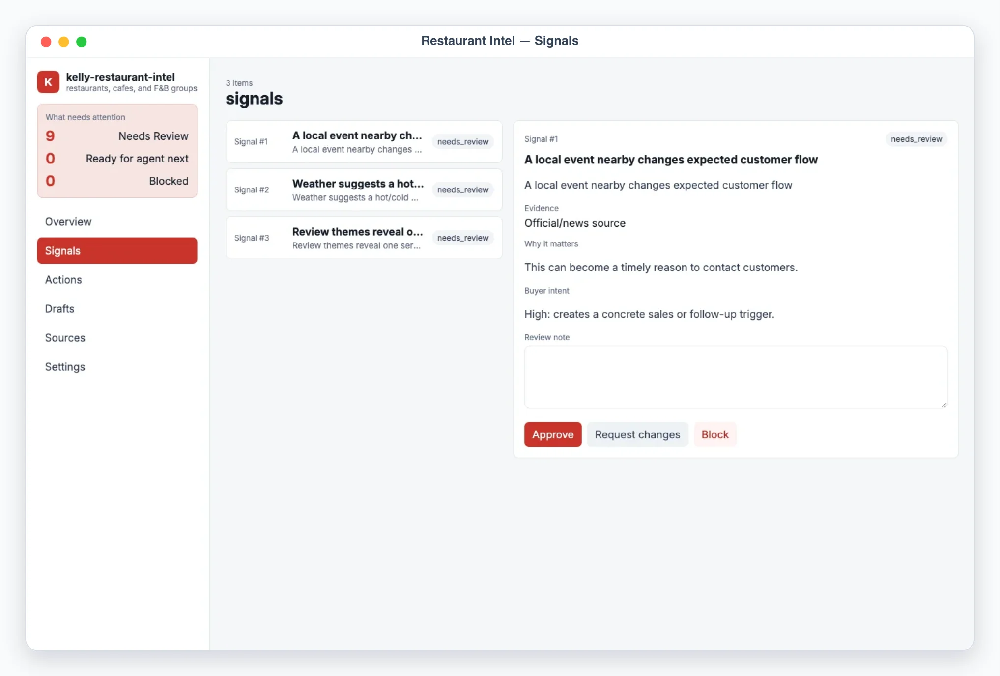</td>
  </tr>
  <tr>
    <td><strong>Overview</strong><br>Restaurant-group desk with demand triggers, meal-period focus, ready actions, and blocked food-safety claims.</td>
    <td><strong>Signals</strong><br>Weather, events, competitor menus, delivery movement, and review themes tied to operations.</td>
  </tr>
  <tr>
    <td width="50%"></td>
    <td width="50%">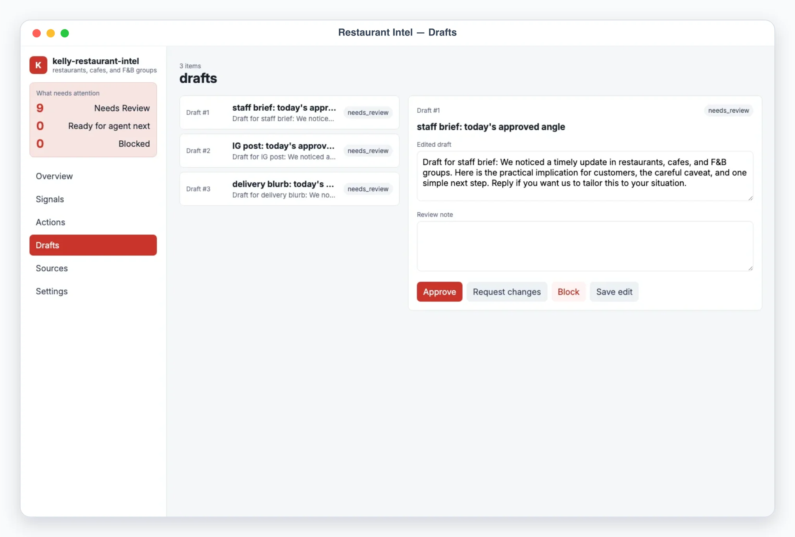</td>
  </tr>
  <tr>
    <td><strong>Actions</strong><br>Shift briefs, hero-menu picks, booking scripts, and delivery-copy actions ready for approval.</td>
    <td><strong>Drafts</strong><br>Editable guest messages, review replies, and social copy with menu and safety boundaries.</td>
  </tr>
</table>

### `kelly-financial-services-intel`

<table>
  <tr>
    <td width="50%"></td>
    <td width="50%">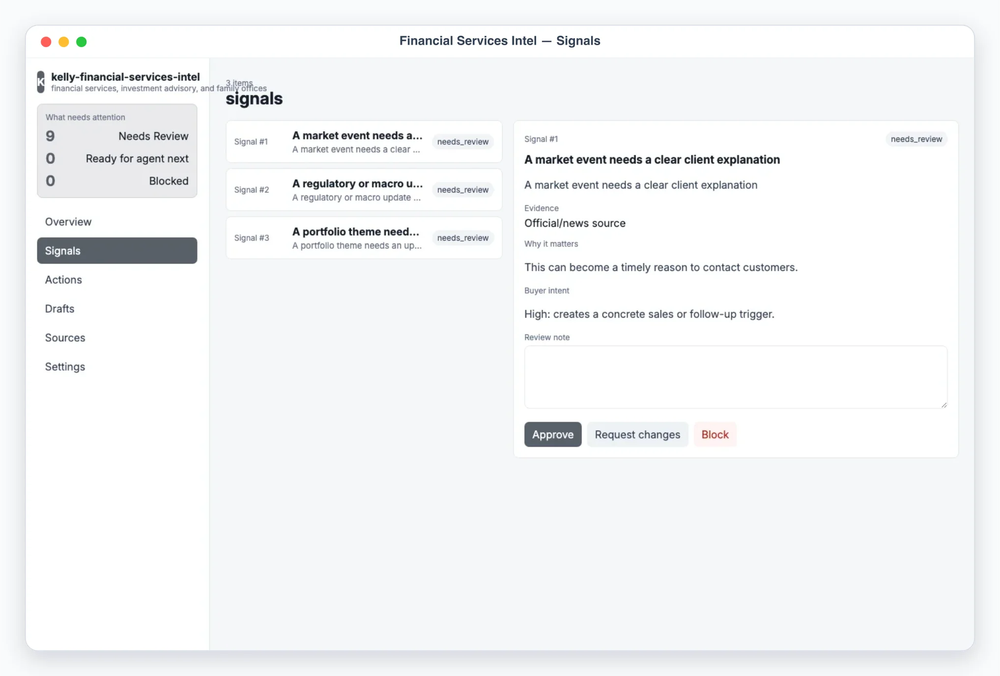</td>
  </tr>
  <tr>
    <td><strong>Overview</strong><br>Financial-services desk with client-question triggers, advisor prep, blocked advice, and source freshness.</td>
    <td><strong>Signals</strong><br>Regulatory, macro, market, portfolio-theme, and competitor movement interpreted as client concern.</td>
  </tr>
  <tr>
    <td width="50%"></td>
    <td width="50%">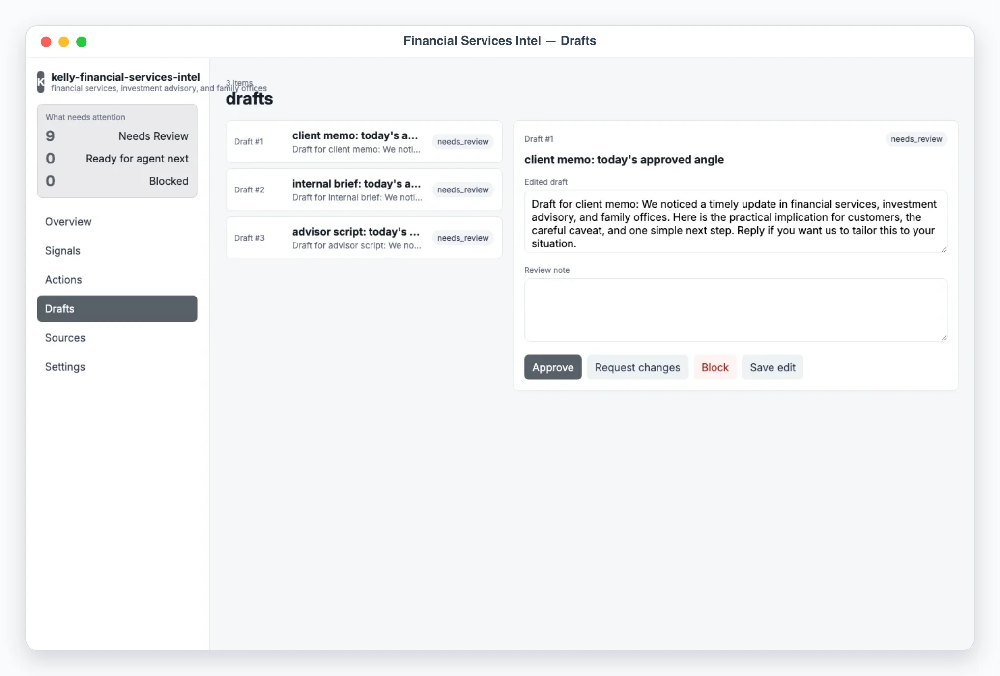</td>
  </tr>
  <tr>
    <td><strong>Actions</strong><br>Internal briefs, client education tasks, advisor scripts, and risk reminders queued for approval.</td>
    <td><strong>Drafts</strong><br>Editable explainers and meeting notes that avoid personalized advice and performance promises.</td>
  </tr>
</table>

### `kelly-devops`

<table>
  <tr>
    <td width="50%">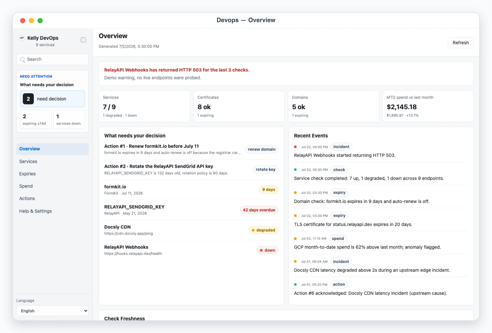</td>
    <td width="50%">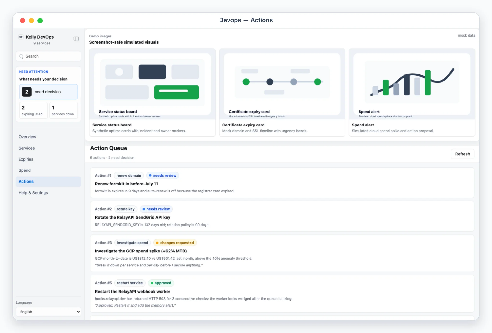</td>
  </tr>
  <tr>
    <td><strong>Overview</strong><br>Fleet health desk with service, certificate, domain, and spend summaries plus a recent events feed.</td>
    <td><strong>Action queue</strong><br>Agent-proposed renew/rotate/investigate action cards with evidence and approval controls.</td>
  </tr>
  <tr>
    <td width="50%"></td>
    <td width="50%">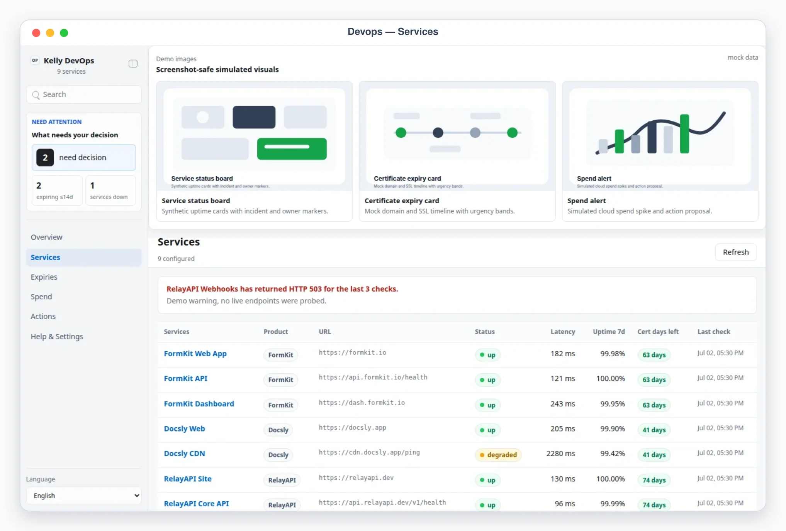</td>
  </tr>
  <tr>
    <td><strong>Expiry ledger</strong><br>Domains, SSL certificates, key rotations, and plan renewals in one table with color-coded days-left.</td>
    <td><strong>Services</strong><br>Monitored endpoints with uptime, latency sparklines, TLS certificate status, and check history.</td>
  </tr>
  <tr>
    <td width="50%"></td>
  </tr>
  <tr>
    <td><strong>Spend</strong><br>Cloud spend across AWS, Google Cloud, and Cloudflare with month-to-date totals and per-product allocation.</td>
  </tr>
</table>

### `kelly-audit`

<table>
  <tr>
    <td width="50%">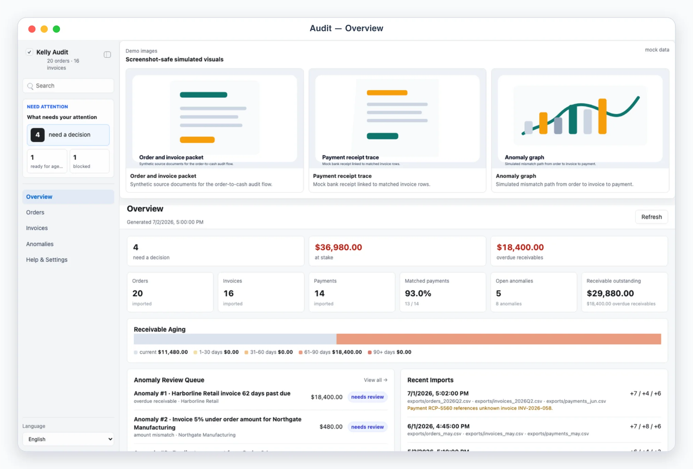</td>
    <td width="50%">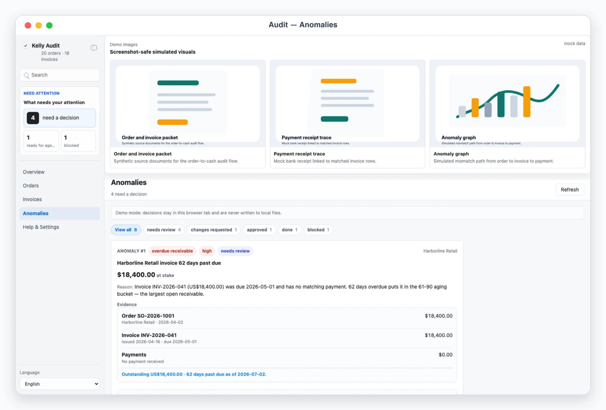</td>
  </tr>
  <tr>
    <td><strong>Overview</strong><br>Finance audit desk with amount at risk, receivable aging bar, anomaly queue preview, and import history.</td>
    <td><strong>Anomaly queue</strong><br>Rule-flagged anomalies with the order-invoice-payment evidence chain and a drafted chasing email for approval.</td>
  </tr>
  <tr>
    <td width="50%">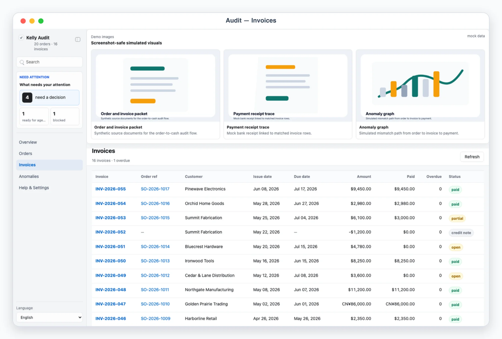</td>
    <td width="50%"></td>
  </tr>
  <tr>
    <td><strong>Invoices</strong><br>Invoice ledger with due dates, paid amounts, days overdue, and match status.</td>
    <td><strong>Orders</strong><br>Normalized orders with invoice and payment status badges and linked anomaly indicators.</td>
  </tr>
</table>

### `kelly-tickets`

<table>
  <tr>
    <td width="50%"></td>
    <td width="50%"></td>
  </tr>
  <tr>
    <td><strong>Overview</strong><br>Dispatch command desk with SLA risk, weekly intake by channel, category distribution, and crew load.</td>
    <td><strong>Board</strong><br>Tickets tracked across open, assigned, in-progress, waiting, and resolved with SLA indicators and history timelines.</td>
  </tr>
  <tr>
    <td width="50%"></td>
    <td width="50%">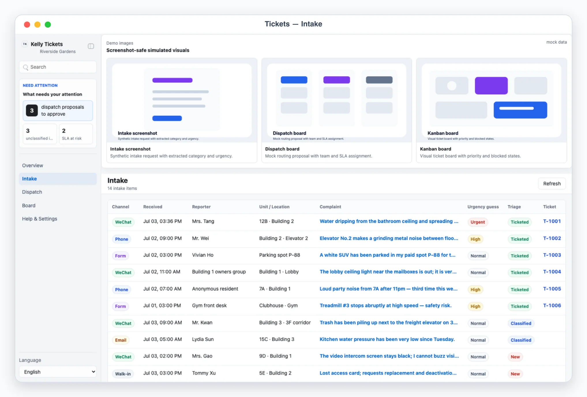</td>
  </tr>
  <tr>
    <td><strong>Dispatch queue</strong><br>Agent-proposed crew assignments with priority, SLA target, reasoning, and an editable note to the crew.</td>
    <td><strong>Intake</strong><br>Raw complaints from WeChat, phone, forms, and email with classification fields and convert-to-ticket controls.</td>
  </tr>
</table>

### `kelly-homework-coach`

<table>
  <tr>
    <td width="50%"></td>
    <td width="50%"></td>
  </tr>
  <tr>
    <td><strong>Student desk</strong><br>Photo-based homework help with a gentle step-by-step explanation, self-check, and hint-first controls for the child.</td>
    <td><strong>Mistake notebook</strong><br>Wrong-answer cards with root cause, misconception, fix strategy, similar practice, and the next review date.</td>
  </tr>
  <tr>
    <td width="50%"></td>
    <td width="50%"></td>
  </tr>
  <tr>
    <td><strong>Practice papers</strong><br>Mistake-focused paper plans with topic mix, estimated minutes, wrong-question analysis, strengths, and review sequence.</td>
    <td><strong>Review queue</strong><br>Parent/teacher approval desk for explanations, mistake cards, and paper exports before the agent continues.</td>
  </tr>
</table>

### `kelly-lesson`

<table>
  <tr>
    <td width="50%"></td>
    <td width="50%">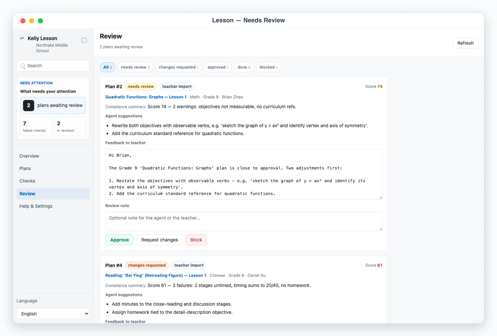</td>
  </tr>
  <tr>
    <td><strong>Overview</strong><br>Teaching-quality desk with compliance pass rate, grade-by-subject coverage, per-teacher status, and the review queue.</td>
    <td><strong>Review queue</strong><br>Plan submissions with compliance summaries, agent revision suggestions, and drafted teacher feedback for approval.</td>
  </tr>
  <tr>
    <td width="50%"></td>
    <td width="50%">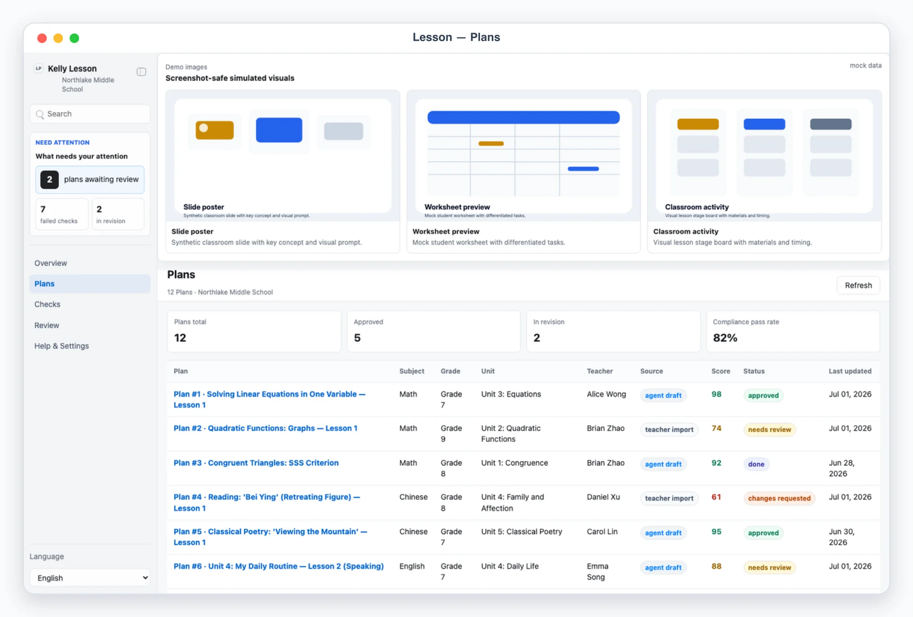</td>
  </tr>
  <tr>
    <td><strong>Compliance checks</strong><br>Per-rule pass/warn/fail results with evidence snippets, filterable by rule and teacher.</td>
    <td><strong>Plan library</strong><br>Lesson plans by subject, grade, and teacher with source badges, compliance scores, and structured plan detail.</td>
  </tr>
</table>

### `kelly-ppt-factory`

<table>
  <tr>
    <td width="50%"></td>
    <td width="50%"></td>
  </tr>
  <tr>
    <td><strong>Overview</strong><br>PPT factory dashboard with project, deck, slide-card, QA, and style-score counters.</td>
    <td><strong>Review queue</strong><br>Slide-card and deck approvals before the agent generates or revises PPTX output.</td>
  </tr>
  <tr>
    <td width="50%"></td>
    <td width="50%"></td>
  </tr>
  <tr>
    <td><strong>Slide cards</strong><br>Storyboard-style page specs: objective, layout, copy, visual brief, interaction, style checks, and QA flags.</td>
    <td><strong>Exports</strong><br>PPTX outputs, render paths, generation status, and QA evidence for each deck.</td>
  </tr>
  <tr>
    <td width="50%"></td>
    <td width="50%"></td>
  </tr>
  <tr>
    <td><strong>Projects</strong><br>Deck project list with status and per-project detail — client, dates, and slide brief.</td>
    <td><strong>Decks</strong><br>Generated decks with approval status, slide counts, and output PPTX paths.</td>
  </tr>
  <tr>
    <td width="50%"></td>
  </tr>
  <tr>
    <td><strong>Style kit</strong><br>Reusable deck style kit — palette, headings, layout rules, and components.</td>
  </tr>
</table>

### `kelly-inquiry`

<table>
  <tr>
    <td width="50%"></td>
    <td width="50%">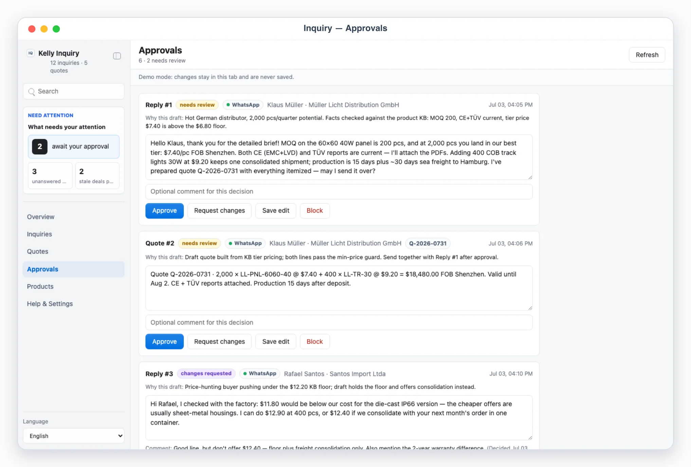</td>
  </tr>
  <tr>
    <td><strong>Overview</strong><br>Inquiry command desk with reply SLA counters, weekly channel mix, pipeline funnel, and stale-deal alerts.</td>
    <td><strong>Approvals</strong><br>Approval-gated outbox for replies and quotes — nothing is sent until reviewed.</td>
  </tr>
  <tr>
    <td width="50%"></td>
    <td width="50%">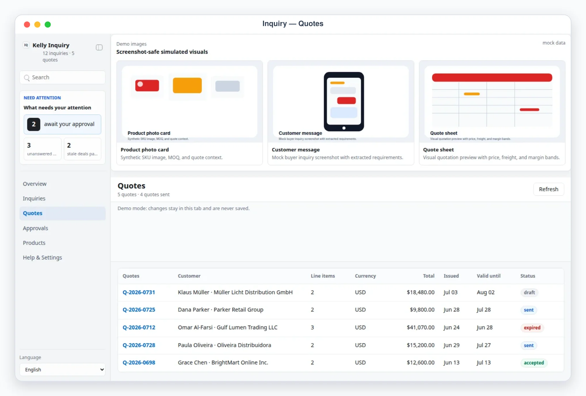</td>
  </tr>
  <tr>
    <td><strong>Pipeline</strong><br>Inquiries across WhatsApp, Instagram, and email with country, stage, value estimate, and next follow-up.</td>
    <td><strong>Quotes</strong><br>Quote worksheets with line items sourced from the product KB, validity, and min-price guards.</td>
  </tr>
  <tr>
    <td width="50%"></td>
  </tr>
  <tr>
    <td><strong>Products</strong><br>Product catalog behind quotes — specs, MOQ, price range, and lead time per SKU.</td>
  </tr>
</table>

### `kelly-picks`

<table>
  <tr>
    <td width="50%">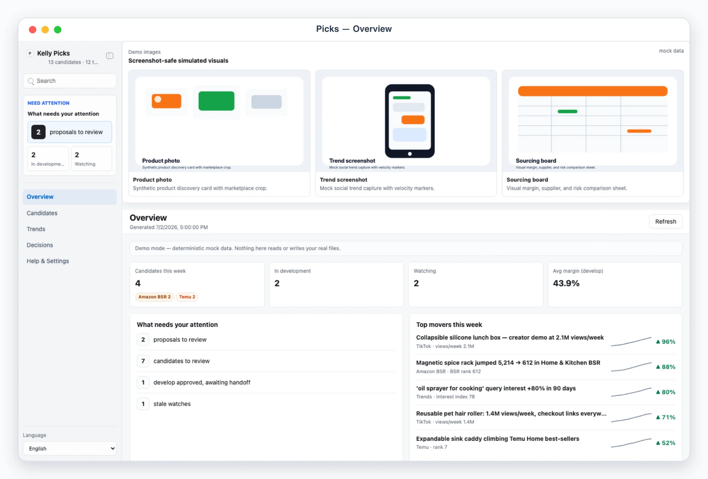</td>
    <td width="50%"></td>
  </tr>
  <tr>
    <td><strong>Overview</strong><br>Product-research desk with weekly candidates by source, top movers, and per-source sweep freshness.</td>
    <td><strong>Candidates</strong><br>Candidate table with momentum, estimated margin, competition grade, and develop/watch/drop stages.</td>
  </tr>
  <tr>
    <td width="50%">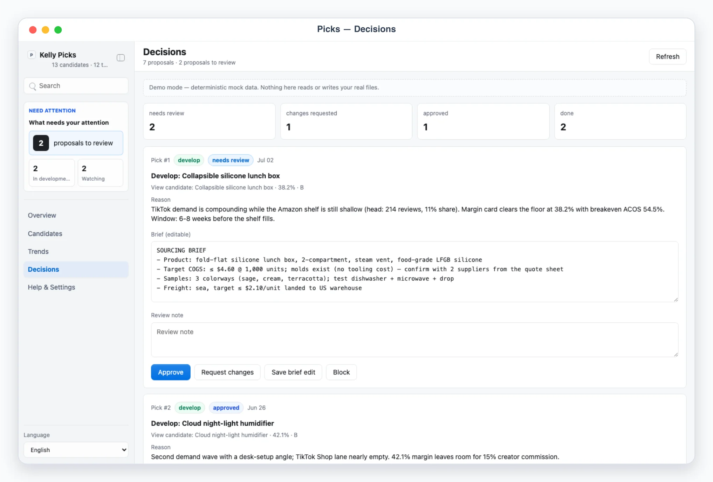</td>
    <td width="50%">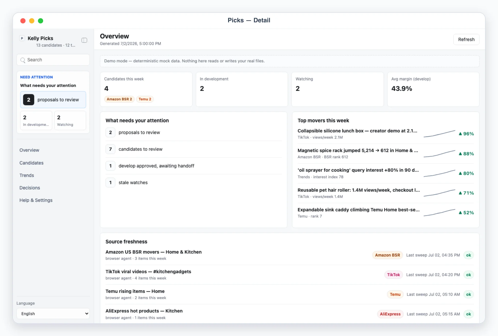</td>
  </tr>
  <tr>
    <td><strong>Decision queue</strong><br>Agent-proposed develop/watch/drop verdicts with sourcing and listing briefs for approval.</td>
    <td><strong>Margin card</strong><br>Live-editable margin math — price, landed cost, freight, fees, ad cost → margin % and breakeven ACOS — plus a top-10 review-count competition read.</td>
  </tr>
</table>

### `kelly-products`

<table>
  <tr>
    <td width="50%">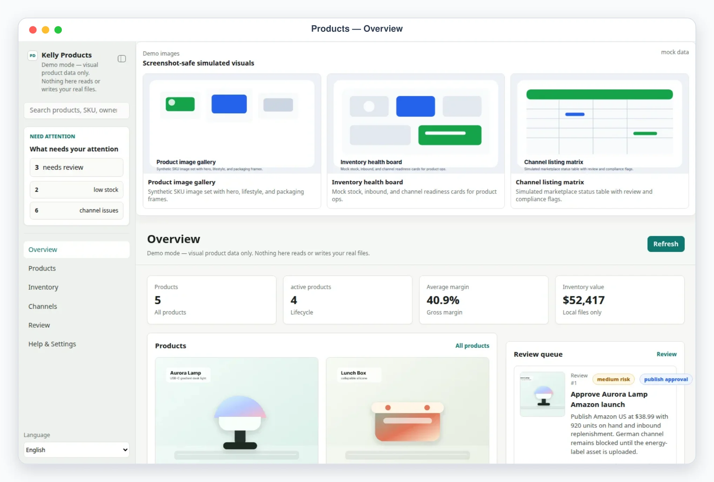</td>
    <td width="50%"></td>
  </tr>
  <tr>
    <td><strong>Overview</strong><br>Product command desk with visual product cards, margin, inventory value, activity, and approval queue.</td>
    <td><strong>Catalog</strong><br>Image-rich product library with SKU, lifecycle, owner, margin, inventory cover, and status badges.</td>
  </tr>
  <tr>
    <td width="50%"></td>
    <td width="50%"></td>
  </tr>
  <tr>
    <td><strong>Product detail</strong><br>Gallery, pricing, inventory, content readiness, compliance notes, channel matrix, and related review cards.</td>
    <td><strong>Review queue</strong><br>Approval-gated publish, price, quality-hold, and lifecycle recommendations with evidence.</td>
  </tr>
  <tr>
    <td width="50%"></td>
    <td width="50%"></td>
  </tr>
  <tr>
    <td><strong>Channels</strong><br>Per-channel listing matrix across Amazon, Shopify, and TikTok Shop with status, price, score, and channel issues.</td>
    <td><strong>Inventory</strong><br>Stock health across warehouses — on-hand, available, days of cover, and low-stock flags.</td>
  </tr>
</table>

### `kelly-listing`

<table>
  <tr>
    <td width="50%">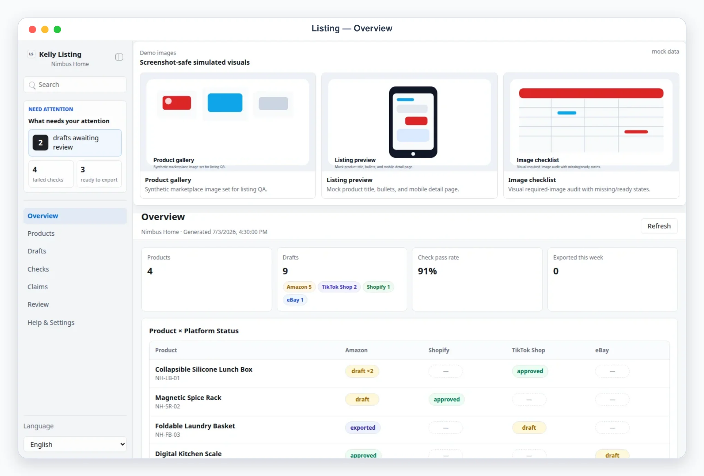</td>
    <td width="50%"></td>
  </tr>
  <tr>
    <td><strong>Overview</strong><br>Listing command desk with product × platform status matrix, compliance pass rate, and export readiness.</td>
    <td><strong>Review queue</strong><br>Draft submissions with compliance summaries and keyword-strategy notes for approval before export or publish.</td>
  </tr>
  <tr>
    <td width="50%">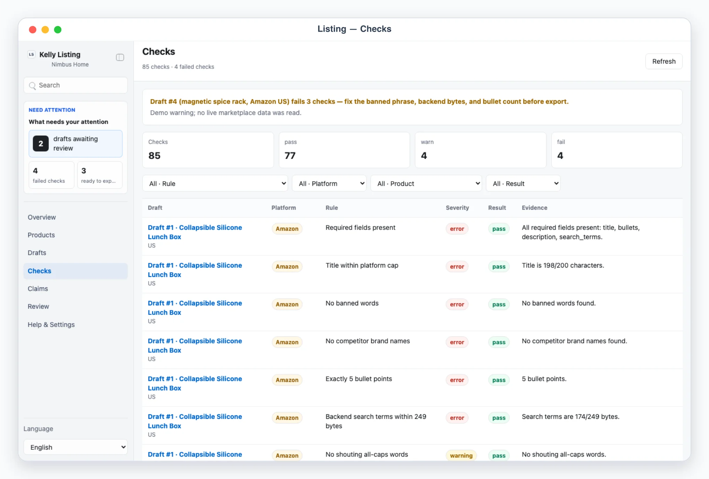</td>
    <td width="50%">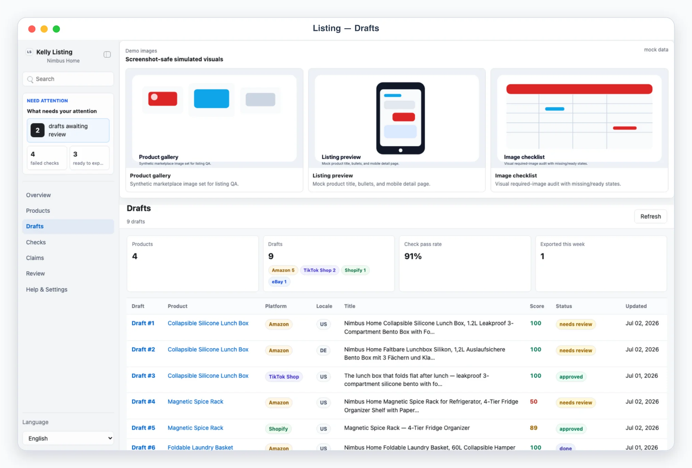</td>
  </tr>
  <tr>
    <td><strong>Compliance checks</strong><br>Per-rule pass/warn/fail results — banned words, character caps, bullet counts — across all drafts.</td>
    <td><strong>Draft workbench</strong><br>Amazon draft with live title character count, five bullets, backend search terms byte counter, A+ outline, and locale tabs.</td>
  </tr>
  <tr>
    <td width="50%"></td>
    <td width="50%"></td>
  </tr>
  <tr>
    <td><strong>Claims registry</strong><br>Approved marketing claims and banned or restricted phrases, each with evidence and compliance status.</td>
    <td><strong>Products</strong><br>Product catalog with SKU, category, source, per-platform listing status, and last-updated.</td>
  </tr>
</table>

### `kelly-legal-contracts`

<table>
  <tr>
    <td width="50%"></td>
    <td width="50%"></td>
  </tr>
  <tr>
    <td><strong>Overview</strong><br>Legal command desk with contract × workstream status, risk pass rate, review queue preview, and recent activity.</td>
    <td><strong>Review queue</strong><br>Approval-gated legal issue queue with approve / request changes / block decisions and audit notes.</td>
  </tr>
  <tr>
    <td width="50%">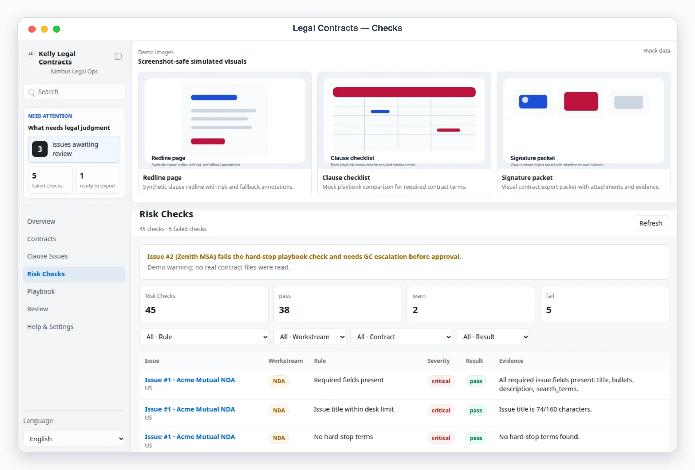</td>
    <td width="50%"></td>
  </tr>
  <tr>
    <td><strong>Risk checks</strong><br>Per-rule pass/warn/fail results across clause issues, including hard-stop terms and playbook violations.</td>
    <td><strong>Clause issues</strong><br>Editable issue detail with fallback language, memo fields, reviewer rationale, and risk-check evidence.</td>
  </tr>
  <tr>
    <td width="50%">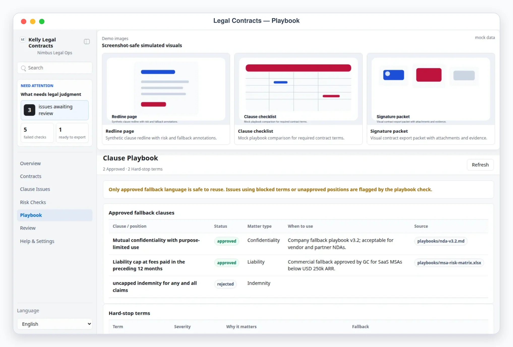</td>
    <td width="50%"></td>
  </tr>
  <tr>
    <td><strong>Clause playbook</strong><br>Approved fallback clauses by position with status, matter type, and where each is safe to use.</td>
    <td><strong>Contract register</strong><br>Contract table with counterparty, matter type, source, workstream, clause issues, and status.</td>
  </tr>
</table>

### `kelly-legal-casebase-ingest`

<table>
  <tr>
    <td width="50%">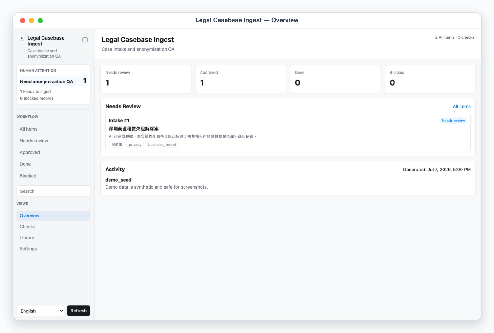</td>
    <td width="50%">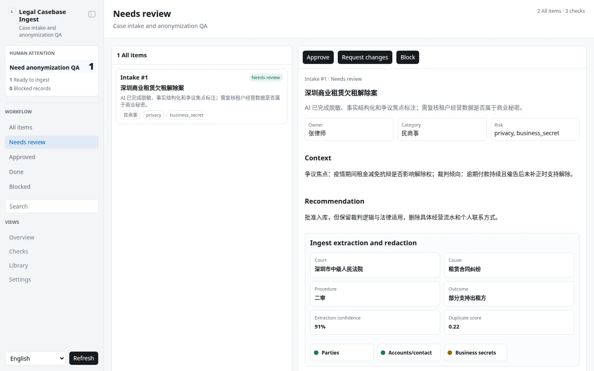</td>
  </tr>
  <tr>
    <td><strong>Overview</strong><br>Casebase command desk with intake progress, anonymization risk, review load, and recent activity.</td>
    <td><strong>Review queue</strong><br>Approval-gated case records with stable refs, anonymization evidence, review notes, and decision controls.</td>
  </tr>
  <tr>
    <td width="50%">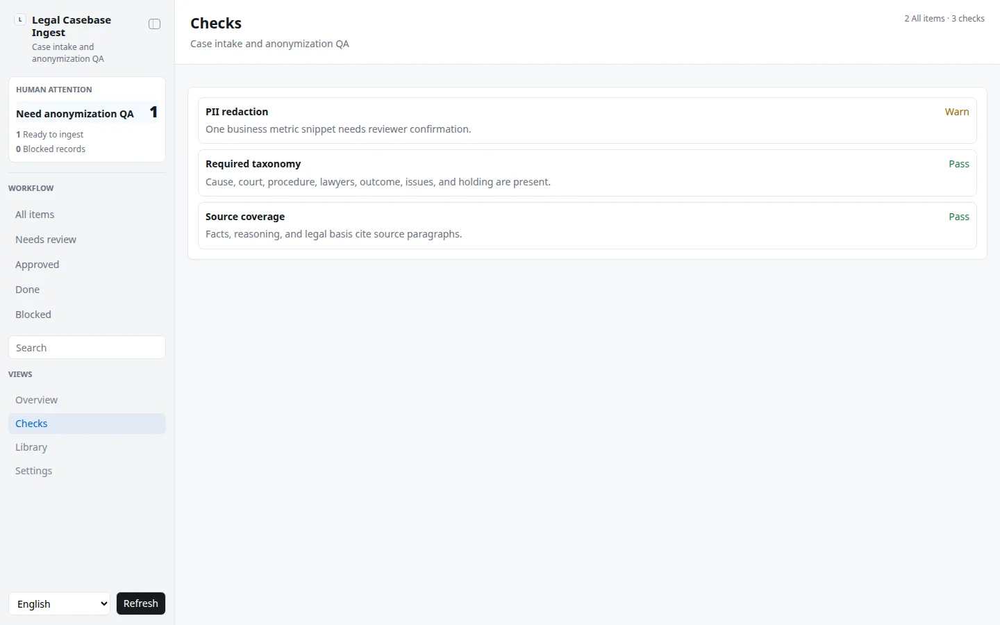</td>
    <td width="50%">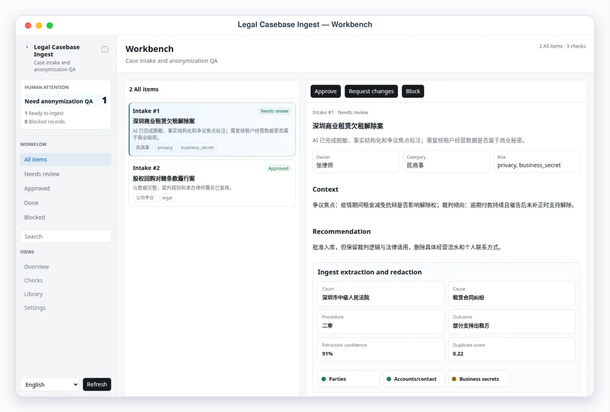</td>
  </tr>
  <tr>
    <td><strong>Checks</strong><br>Deterministic QA checks for PII leakage, taxonomy completeness, source coverage, and tag confidence.</td>
    <td><strong>Workbench</strong><br>Detail pane for facts, reasoning, legal basis, tags, editable draft, and reviewer note before ingest.</td>
  </tr>
  <tr>
    <td width="50%">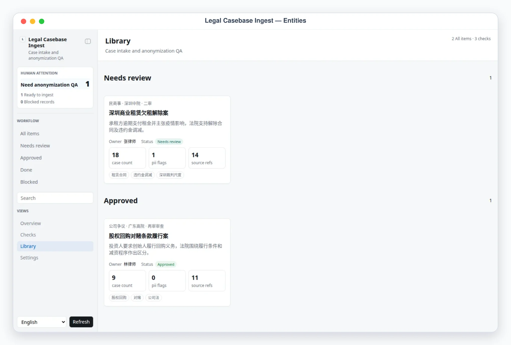</td>
  </tr>
  <tr>
    <td><strong>Library</strong><br>Ingested case library with needs-review and approved buckets and per-item counts.</td>
  </tr>
</table>

### `kelly-legal-precedent-desk`

<table>
  <tr>
    <td width="50%">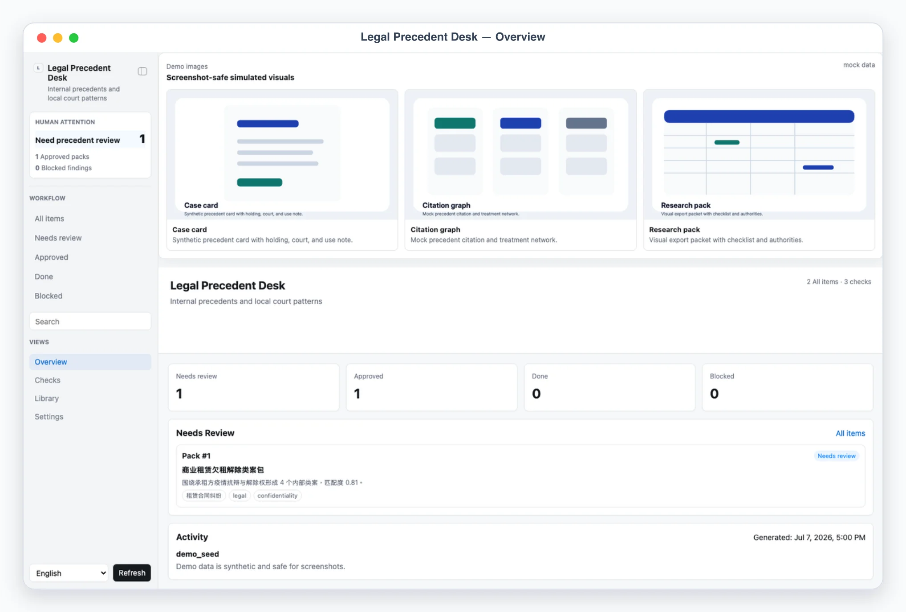</td>
    <td width="50%">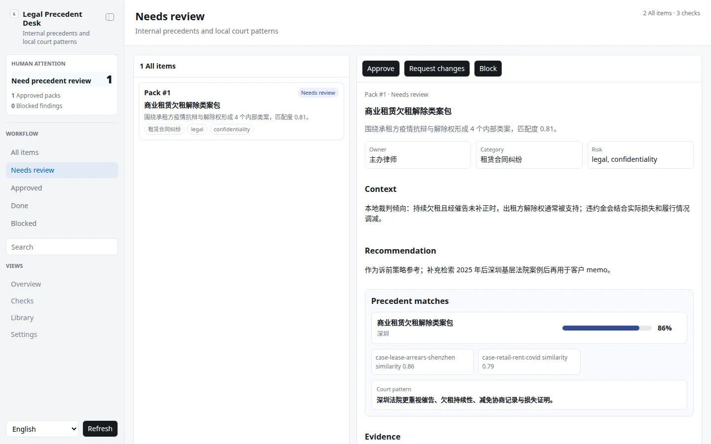</td>
  </tr>
  <tr>
    <td><strong>Overview</strong><br>Precedent command desk with packs awaiting review, high-match cases, approved packs, and recent activity.</td>
    <td><strong>Review queue</strong><br>Similar-case packs with local court-pattern notes, citations, evidence, and approval controls.</td>
  </tr>
  <tr>
    <td width="50%"></td>
    <td width="50%"></td>
  </tr>
  <tr>
    <td><strong>Checks</strong><br>Quality checks for citation traceability, similarity rationale, jurisdiction fit, and confidentiality limits.</td>
    <td><strong>Workbench</strong><br>Detail view for precedent reasoning, decisive facts, internal citations, draft memo, and review note.</td>
  </tr>
  <tr>
    <td width="50%">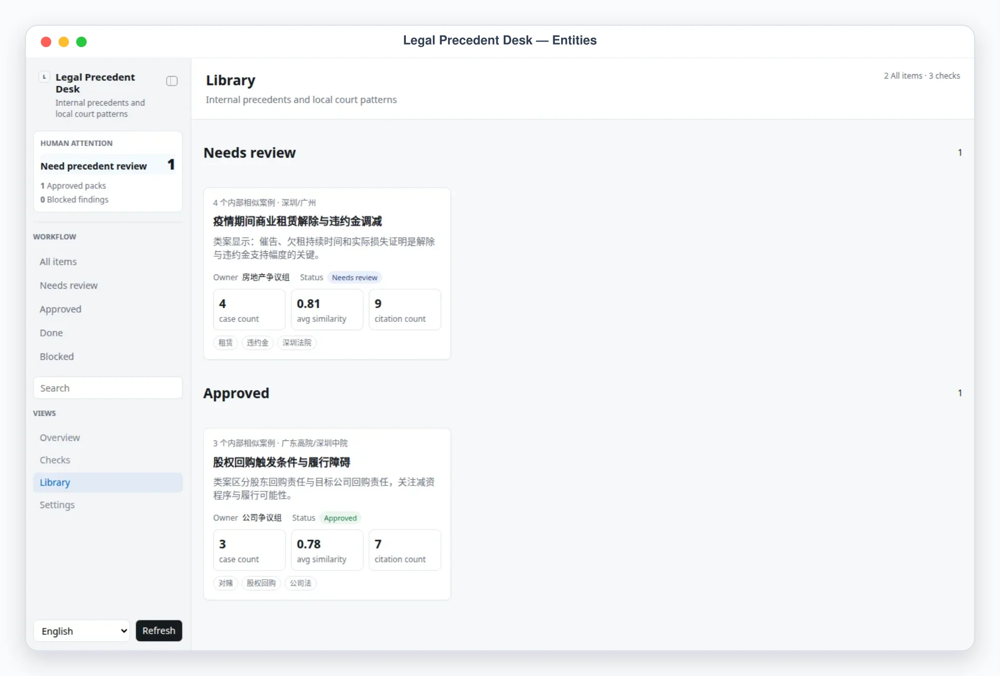</td>
  </tr>
  <tr>
    <td><strong>Library</strong><br>Internal precedent and trial-court pattern library, bucketed by review state.</td>
  </tr>
</table>

### `kelly-legal-matter-strategy`

<table>
  <tr>
    <td width="50%">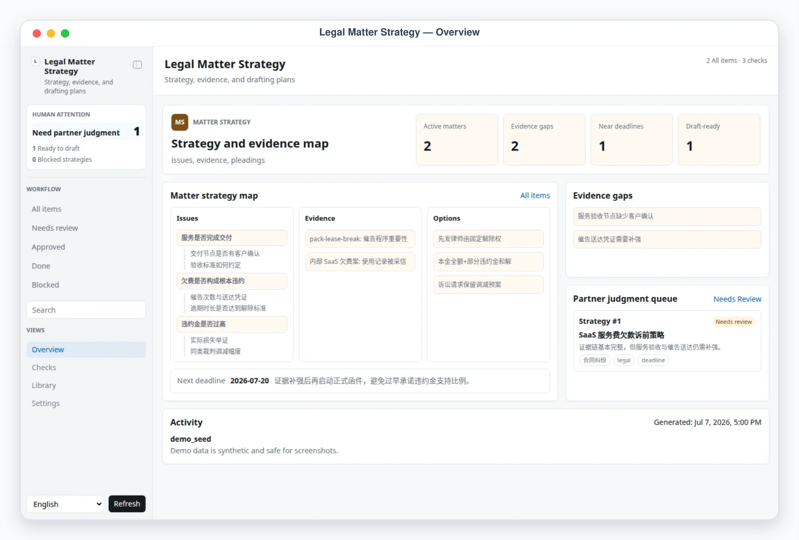</td>
    <td width="50%">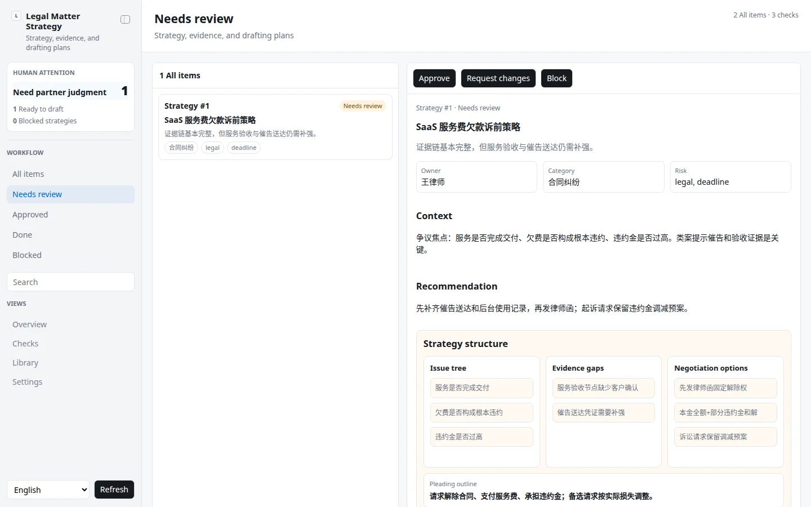</td>
  </tr>
  <tr>
    <td><strong>Overview</strong><br>Matter-strategy command desk with partner review load, ready-to-draft strategies, blocked items, and activity.</td>
    <td><strong>Review queue</strong><br>Issue-tree and evidence-map recommendations with responsible-lawyer approval controls.</td>
  </tr>
  <tr>
    <td width="50%"></td>
    <td width="50%">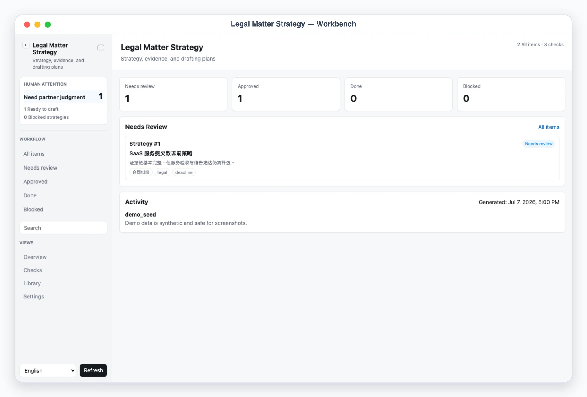</td>
  </tr>
  <tr>
    <td><strong>Checks</strong><br>Strategy QA for missing facts, evidence gaps, deadline caveats, precedent grounding, and risk warnings.</td>
    <td><strong>Workbench</strong><br>Detail pane for issue tree, evidence map, risk posture, negotiation options, and draft outline.</td>
  </tr>
  <tr>
    <td width="50%"></td>
  </tr>
  <tr>
    <td><strong>Library</strong><br>Matter-strategy library of evidence and drafting plans, bucketed by review state.</td>
  </tr>
</table>

### `kelly-legal-firm-radar`

<table>
  <tr>
    <td width="50%">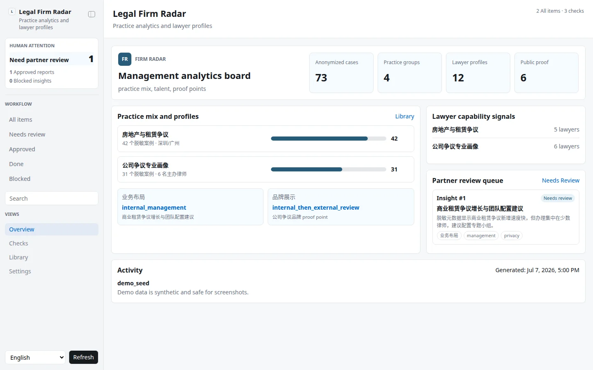</td>
    <td width="50%"></td>
  </tr>
  <tr>
    <td><strong>Overview</strong><br>Firm radar command desk with partner review load, approved reports, blocked insights, and management activity.</td>
    <td><strong>Review queue</strong><br>Approval-gated management insights for practice mix, lawyer profiles, and brand proof points.</td>
  </tr>
  <tr>
    <td width="50%">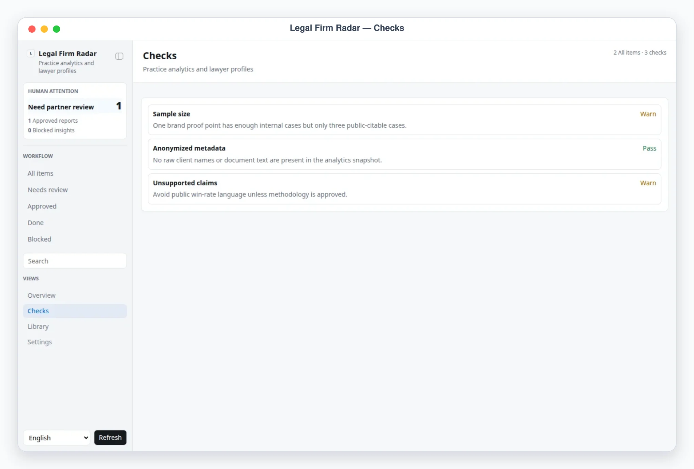</td>
    <td width="50%"></td>
  </tr>
  <tr>
    <td><strong>Checks</strong><br>Analytics QA for anonymization, sample size, attribution, bias caveats, and external-use restrictions.</td>
    <td><strong>Workbench</strong><br>Detail pane for practice analytics, talent signals, quality indicators, and approved management report text.</td>
  </tr>
  <tr>
    <td width="50%">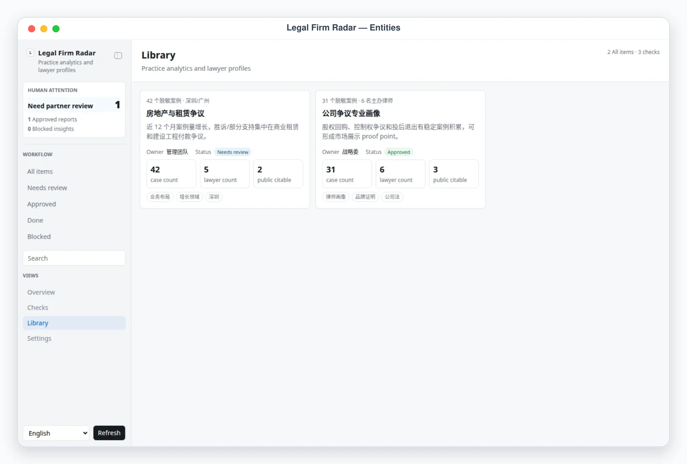</td>
  </tr>
  <tr>
    <td><strong>Library</strong><br>Firm and entity library with competitor analytics, bucketed by review state.</td>
  </tr>
</table>

### `kelly-clm`

Kelly CLM is a deliberately lightweight contract lifecycle desk for contract inventory, owners, obligations, renewal notices, and simple approval reminders. It stays separate from `kelly-legal-contracts`, which remains the detailed legal review desk.

<table>
  <tr>
    <td width="50%">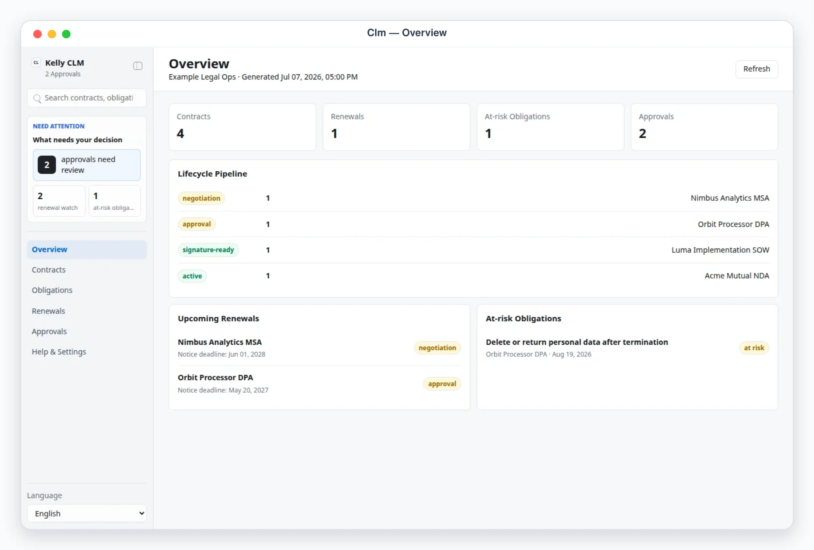</td>
    <td width="50%"></td>
  </tr>
  <tr>
    <td><strong>Overview</strong><br>Lifecycle dashboard with stage pipeline, upcoming renewals, and at-risk obligations.</td>
    <td><strong>Contracts</strong><br>Simple contract inventory with owner, counterparty, stage, value, and dates.</td>
  </tr>
  <tr>
    <td width="50%"></td>
    <td width="50%"></td>
  </tr>
  <tr>
    <td><strong>Obligations</strong><br>Owner-assigned obligation tracker with due dates and status.</td>
    <td><strong>Renewals</strong><br>Renewal board with notice deadlines and simple follow-up actions.</td>
  </tr>
  <tr>
    <td width="50%"></td>
  </tr>
  <tr>
    <td><strong>Approvals</strong><br>Approval queue for contract-lifecycle actions — renewal notices and obligation owners — with approve, request-changes, and block controls.</td>
  </tr>
</table>

### `kelly-ads`

<table>
  <tr>
    <td width="50%"></td>
    <td width="50%"></td>
  </tr>
  <tr>
    <td><strong>Overview</strong><br>Cross-platform ads board: blended ROAS/ACOS vs target, per-platform cards, spend vs revenue bars, and worst offenders.</td>
    <td><strong>Campaigns</strong><br>Campaign table with budget pace, spend, ROAS, and color-coded ACOS vs target across Amazon, Meta, TikTok, and Google.</td>
  </tr>
  <tr>
    <td width="50%"></td>
    <td width="50%"></td>
  </tr>
  <tr>
    <td><strong>Adjustment queue</strong><br>Agent-proposed bid, budget, and negative-keyword changes with evidence and expected impact, gated on approval.</td>
    <td><strong>Alerts</strong><br>Deterministic anomaly feed: ACOS breaches, budget burnouts, zero-conversion spend, CPC spikes, rejected ads.</td>
  </tr>
</table>

### `kelly-standup`

<table>
  <tr>
    <td width="50%"></td>
    <td width="50%"></td>
  </tr>
  <tr>
    <td><strong>Today board</strong><br>Daily standup at a glance: team digest, participation count, and per-member yesterday/today/blockers cards with source badges.</td>
    <td><strong>Blockers</strong><br>All blockers across the team with severity, age, and agent-suggested next actions.</td>
  </tr>
  <tr>
    <td width="50%"></td>
    <td width="50%"></td>
  </tr>
  <tr>
    <td><strong>Members</strong><br>Team roster with check-in streaks, 30-day participation, open blockers, and per-member update timelines.</td>
    <td><strong>Reminders</strong><br>Approval-gated nudges for missing check-ins — drafted by the agent, sent only after review.</td>
  </tr>
  <tr>
    <td width="50%">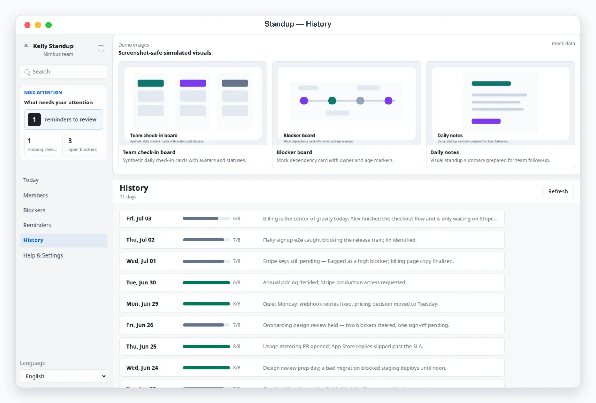</td>
  </tr>
  <tr>
    <td><strong>History</strong><br>Chronological standup log of past check-ins, blockers raised, and daily notes.</td>
  </tr>
</table>

### `kelly-creators`

Influencer/creator-marketing desk on Aaron's Discover→Plan→Activate→Measure pipeline, with C³ ACE fit scores and a SHIP/FIX/BLOCK disclosure gate.

<table>
  <tr>
    <td width="50%">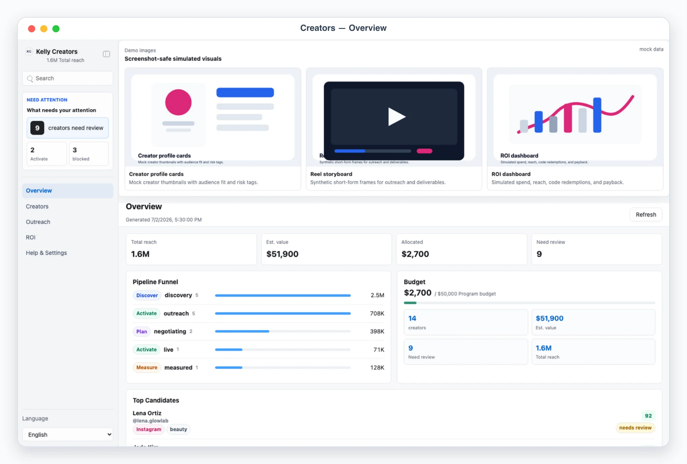</td>
    <td width="50%">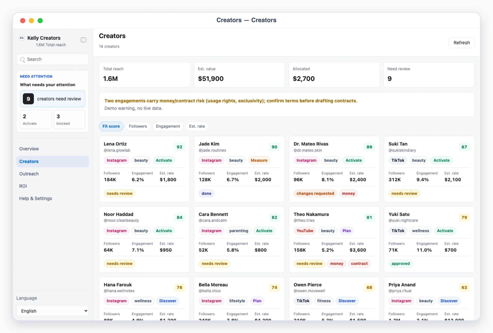</td>
  </tr>
  <tr>
    <td><strong>Overview</strong><br>Pipeline funnel across the four phases, budget allocation, total reach, and the top fit-scored candidates.</td>
    <td><strong>Creators</strong><br>Sortable candidate cards with C³ ACE fit scores, platform, niche, and audience size.</td>
  </tr>
  <tr>
    <td>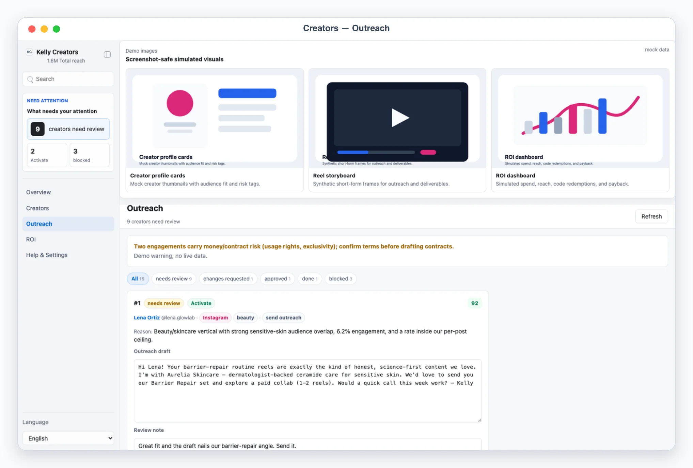</td>
    <td>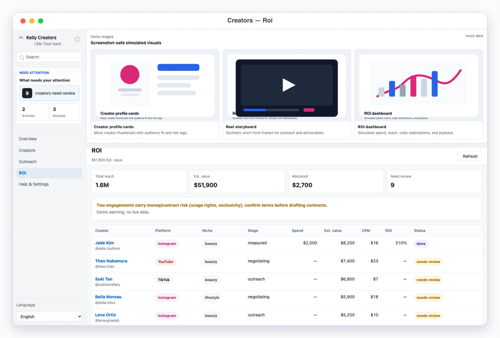</td>
  </tr>
  <tr>
    <td><strong>Outreach</strong><br>Needs-review approval queue with editable outreach drafts and the FTC/claim disclosure gate.</td>
    <td><strong>ROI</strong><br>Per-creator spend, estimated value, CPM, and return once a partnership goes live.</td>
  </tr>
</table>

### `kelly-campaigns`

Outbound email-marketing desk on the SEND lifecycle (Setup→Engage→Nurture→Deliver), with an EQS pre-send quality gate.

<table>
  <tr>
    <td width="50%"></td>
    <td width="50%">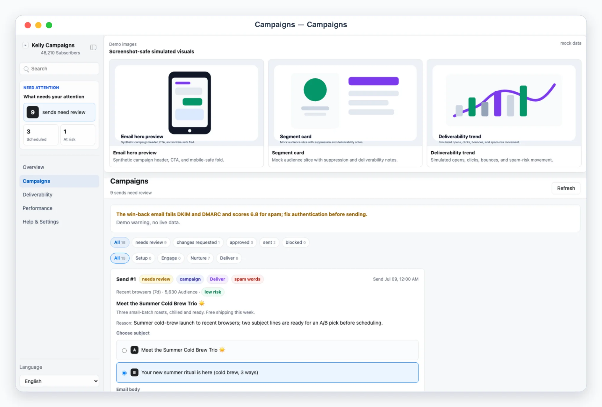</td>
  </tr>
  <tr>
    <td><strong>Overview</strong><br>Send calendar plus list health — subscribers, bounce, churn, and complaint rates.</td>
    <td><strong>Campaigns</strong><br>Draft and approval queue across campaigns, newsletters, and sequence steps.</td>
  </tr>
  <tr>
    <td></td>
    <td>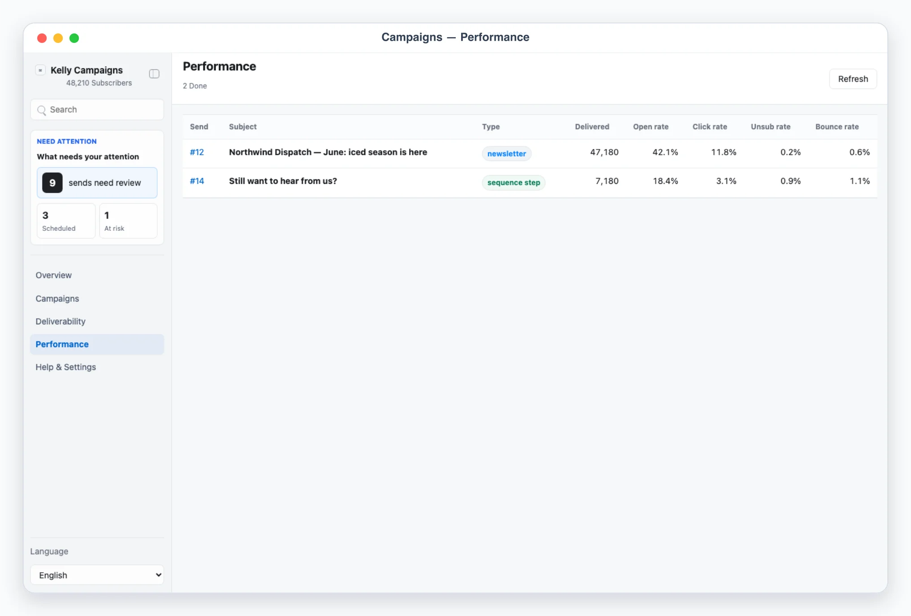</td>
  </tr>
  <tr>
    <td><strong>Deliverability</strong><br>Pre-send QA — SPF/DKIM/DMARC, spam score, and the EQS SHIP/FIX/BLOCK gate.</td>
    <td><strong>Performance</strong><br>Open, click, and unsubscribe rates by campaign.</td>
  </tr>
</table>

### `kelly-launch`

Product-launch command desk on the RAMP framework (Research→Assemble→Mobilize→Prove), gated by a launch-readiness LQS score.

<table>
  <tr>
    <td width="50%">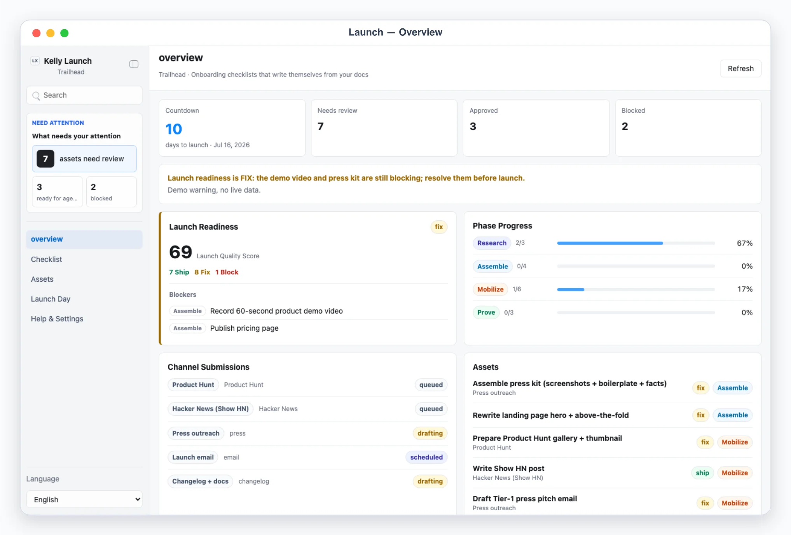</td>
    <td width="50%">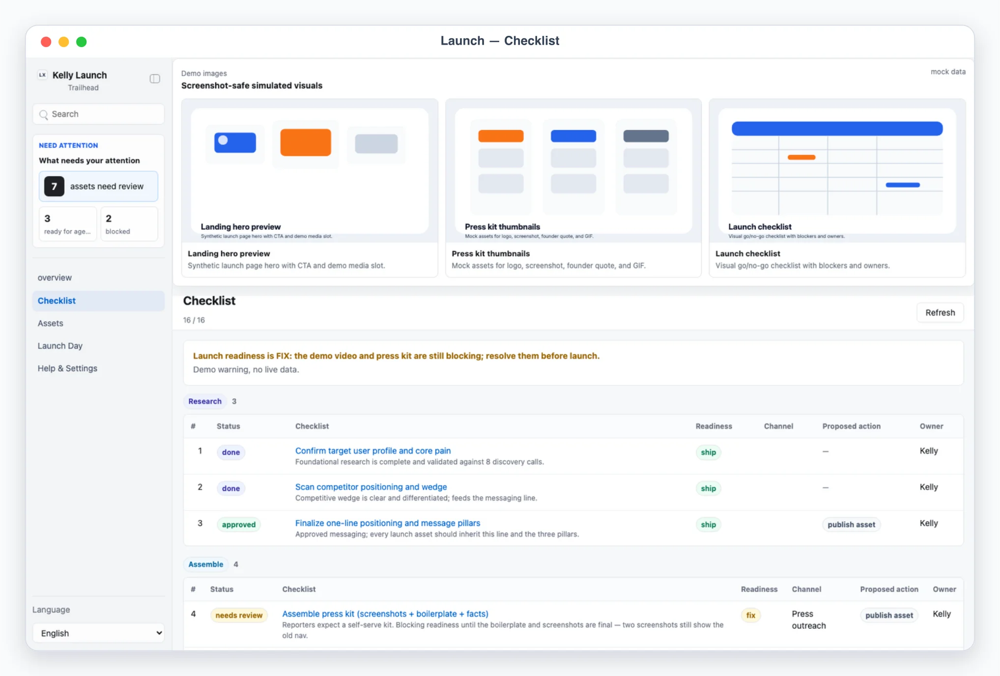</td>
  </tr>
  <tr>
    <td><strong>Overview</strong><br>Launch countdown, the RAMP readiness gate with its LQS score, phase progress, and channel status.</td>
    <td><strong>Checklist</strong><br>Launch tasks grouped by RAMP phase — Research, Assemble, Mobilize, Prove.</td>
  </tr>
  <tr>
    <td></td>
    <td></td>
  </tr>
  <tr>
    <td><strong>Assets</strong><br>Approval queue for launch assets, Product Hunt / Hacker News submissions, and press pitches.</td>
    <td><strong>Launch day</strong><br>An ordered launch-day runbook with war-room notes.</td>
  </tr>
</table>

### `kelly-brand`

Brand-narrative single source of truth on the TALE framework (Trace→Architect→Land→Evaluate), scored by NQS with a drift monitor.

<table>
  <tr>
    <td width="50%"></td>
    <td width="50%">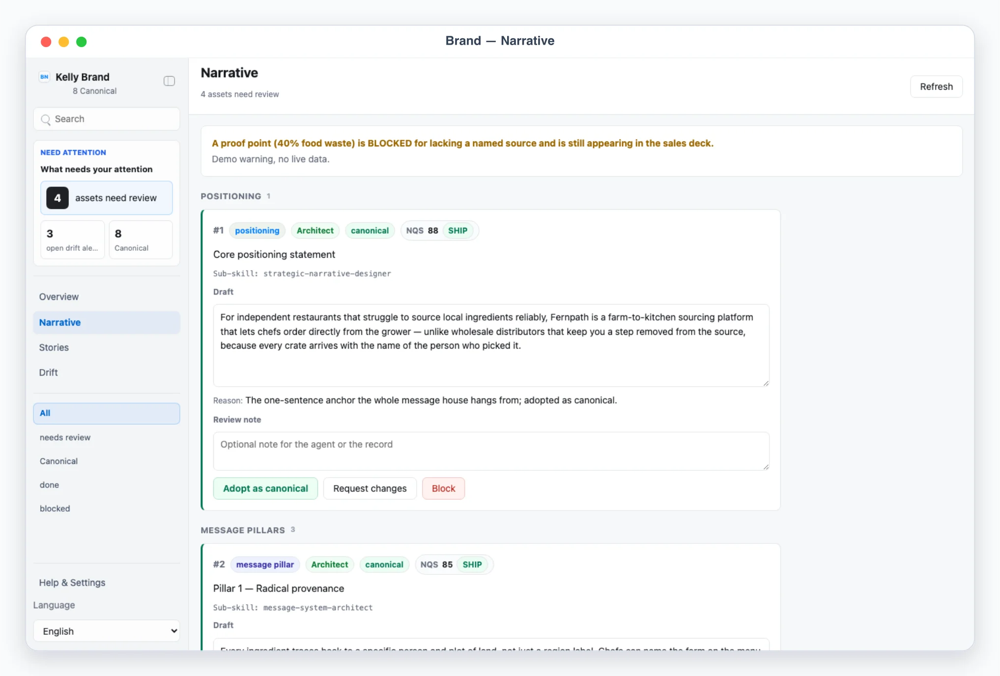</td>
  </tr>
  <tr>
    <td><strong>Overview</strong><br>The message house — positioning, value pillars, overall NQS, and the drift-alert count.</td>
    <td><strong>Narrative</strong><br>Message pillars and vocabulary guardrails, canonical versus draft.</td>
  </tr>
  <tr>
    <td></td>
    <td>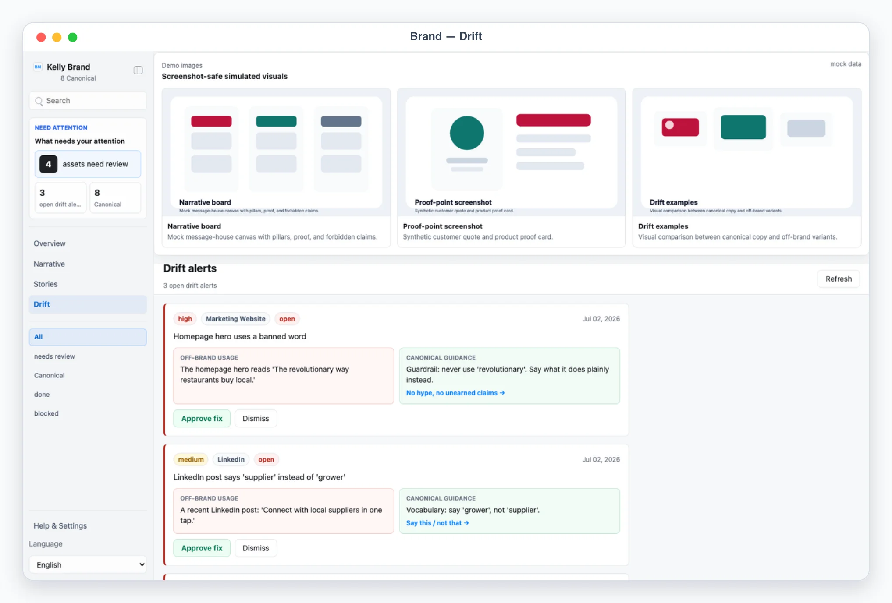</td>
  </tr>
  <tr>
    <td><strong>Story bank</strong><br>Customer stories and evidence-backed proof points.</td>
    <td><strong>Drift</strong><br>Cross-channel off-brand alerts — offending usage versus the canonical guardrail.</td>
  </tr>
</table>

### `kelly-revshare-simulator`

Control-panel workspace modeling revenue-based-financing deals: cash flow, Cash-Flow Payout Multiple, effective merchant cost, and risk flags.

<table>
  <tr>
    <td width="50%"></td>
    <td width="50%"></td>
  </tr>
  <tr>
    <td><strong>Overview</strong><br>Saved scenarios with decision status at a glance.</td>
    <td><strong>Scenario detail</strong><br>Cash-flow chart, Cash-Flow Payout Multiple, effective annualized cost, and risk flags.</td>
  </tr>
</table>

### `kelly-deal-scorer`

Review-queue desk scoring candidate SME financing deals with a deterministic, auditable rule-based rubric.

<table>
  <tr>
    <td width="50%"></td>
    <td width="50%"></td>
  </tr>
  <tr>
    <td><strong>Overview</strong><br>Score-distribution queue across candidates needing review.</td>
    <td><strong>Score breakdown</strong><br>Every sub-factor's raw score, weight, and contribution, hand-recomputable.</td>
  </tr>
</table>

### `kelly-portfolio-health`

Read-mostly dashboard for an RBF fund's portfolio: AUM, repayment progress, concentration risk, and a decline watchlist.

<table>
  <tr>
    <td width="50%"></td>
    <td width="50%"></td>
  </tr>
  <tr>
    <td><strong>Overview</strong><br>Total AUM, collected amount, weighted repayment progress, and at-risk count.</td>
    <td><strong>Watchlist</strong><br>Contracts with recent revenue decline that could threaten repayment.</td>
  </tr>
</table>

### `kelly-lead-funnel`

Kanban control panel for a BD/sourcing team triaging financing leads with a deterministic lead-quality score.

<table>
  <tr>
    <td width="50%"></td>
    <td width="50%"></td>
  </tr>
  <tr>
    <td><strong>Kanban</strong><br>Funnel-summary header with per-stage counts and conversion rates.</td>
    <td><strong>Lead detail</strong><br>Score breakdown and suggested next action for a selected lead.</td>
  </tr>
</table>

### `kelly-disclosure-tracker`

Compliance/IR workspace tracking disclosure packages per financing vehicle across three entity roles.

<table>
  <tr>
    <td width="50%"></td>
    <td width="50%"></td>
  </tr>
  <tr>
    <td><strong>Overview</strong><br>Vehicles ready, blocked, or in progress across the portfolio.</td>
    <td><strong>Flagged</strong><br>A cross-entity reconciliation mismatch caught before it reaches a filing.</td>
  </tr>
</table>

### `kelly-agent-observability`

Local dashboard visualizing a fleet of LLM agents behind a shared AI gateway.

<table>
  <tr>
    <td width="50%"></td>
    <td width="50%"></td>
  </tr>
  <tr>
    <td><strong>Overview</strong><br>Fleet-level call volume, cost, and degraded-agent counts.</td>
    <td><strong>Trace detail</strong><br>Step-by-step timeline highlighting where a chain broke.</td>
  </tr>
</table>

### `kelly-agent-eval`

Review board comparing baseline vs candidate agent versions across a fixed rubric-scored test suite.

<table>
  <tr>
    <td width="50%"></td>
    <td width="50%"></td>
  </tr>
  <tr>
    <td><strong>Overview</strong><br>Baseline vs candidate pass-rate comparison and release approve/block panel.</td>
    <td><strong>Case detail</strong><br>Rubric bars and a side-by-side transcript diff for a regression.</td>
  </tr>
</table>

### `kelly-agent-builder`

Low-code agent configuration and governance console with quota, approval, and ownership tracking.

<table>
  <tr>
    <td width="50%"></td>
    <td width="50%"></td>
  </tr>
  <tr>
    <td><strong>Overview</strong><br>Agents needing attention: over-quota, missing owner, or incomplete draft.</td>
    <td><strong>Catalog</strong><br>Status badges across draft/live/paused/over-quota agents.</td>
  </tr>
</table>

### `kelly-behavior-predict`

Predictive-recommendation analytics over mock user-behavior funnel data.

<table>
  <tr>
    <td width="50%"></td>
    <td width="50%"></td>
  </tr>
  <tr>
    <td><strong>Overview</strong><br>Funnel drop-off and per-segment predicted next actions.</td>
    <td><strong>Segment detail</strong><br>Rule triggers and a precision/recall backtest against historical sessions.</td>
  </tr>
</table>

### `kelly-llm-gateway`

Cost and model-governance dashboard for a shared LLM gateway.

<table>
  <tr>
    <td width="50%"></td>
    <td width="50%"></td>
  </tr>
  <tr>
    <td><strong>Overview</strong><br>Total daily spend trend and cost breakdown by service/model.</td>
    <td><strong>Rollouts</strong><br>Canary-rollout status board with promote/rollback/hold decisions.</td>
  </tr>
</table>

</details>

---

## Layout

- `.claude-plugin/marketplace.json` keeps the bundle installable for Claude Code.
- `skills/` contains one folder per skill.
- Each skill folder contains `SKILL.md`.
- App-based skill folders usually include `app/`, local scripts, schema references, demo mode, and a human-facing `README.md`.

---

## Star History

<a href="https://star-history.com/#mr-kelly/skills&Date">
  <picture>
    <source media="(prefers-color-scheme: dark)" srcset="https://api.star-history.com/svg?repos=mr-kelly/skills&type=Date&theme=dark" />
    <source media="(prefers-color-scheme: light)" srcset="https://api.star-history.com/svg?repos=mr-kelly/skills&type=Date" />
    
  </picture>
</a>

<div align="center">

Built by Kelly · Licensed under [MIT](LICENSE) · [🌐 Skills gallery](https://mr-kelly.github.io/skills/)

</div>
