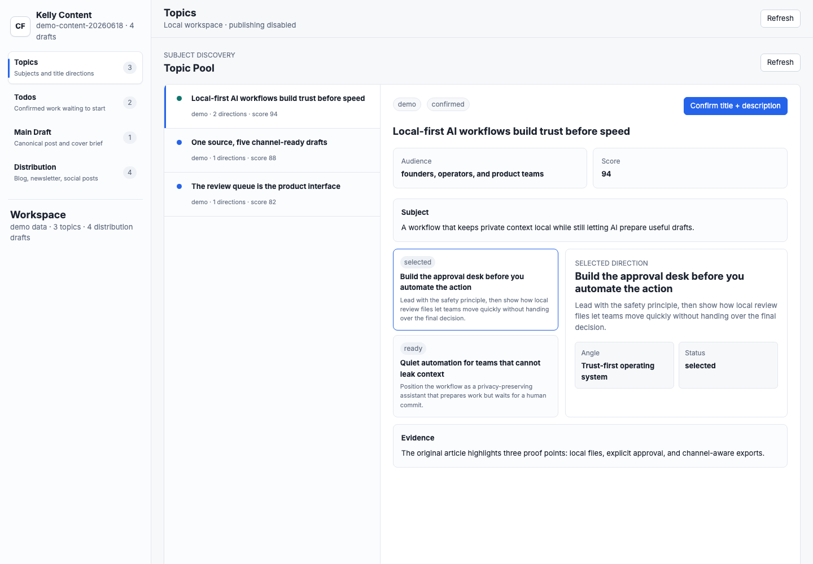
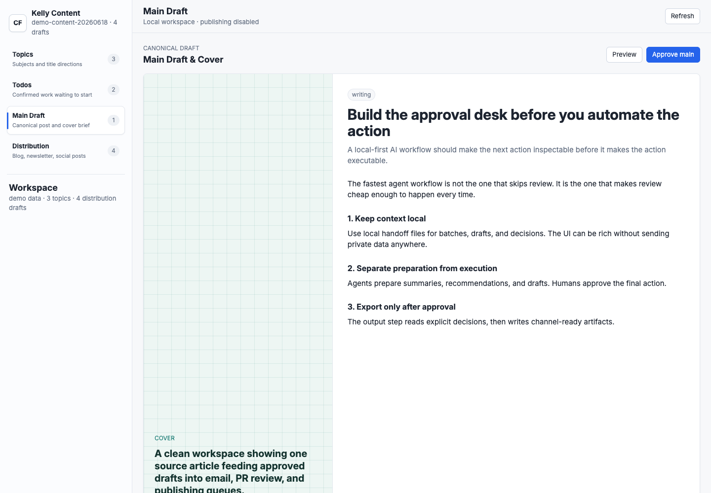
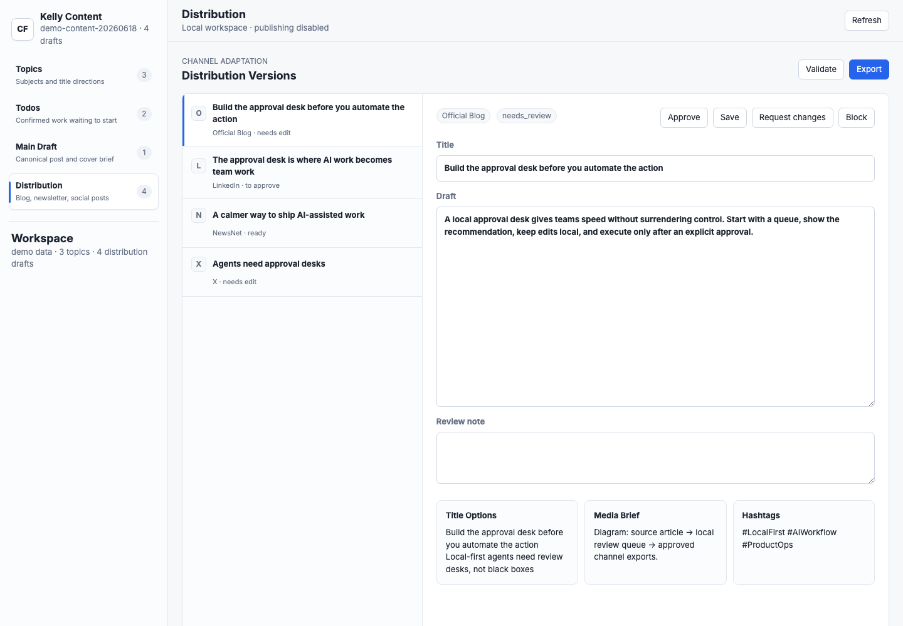
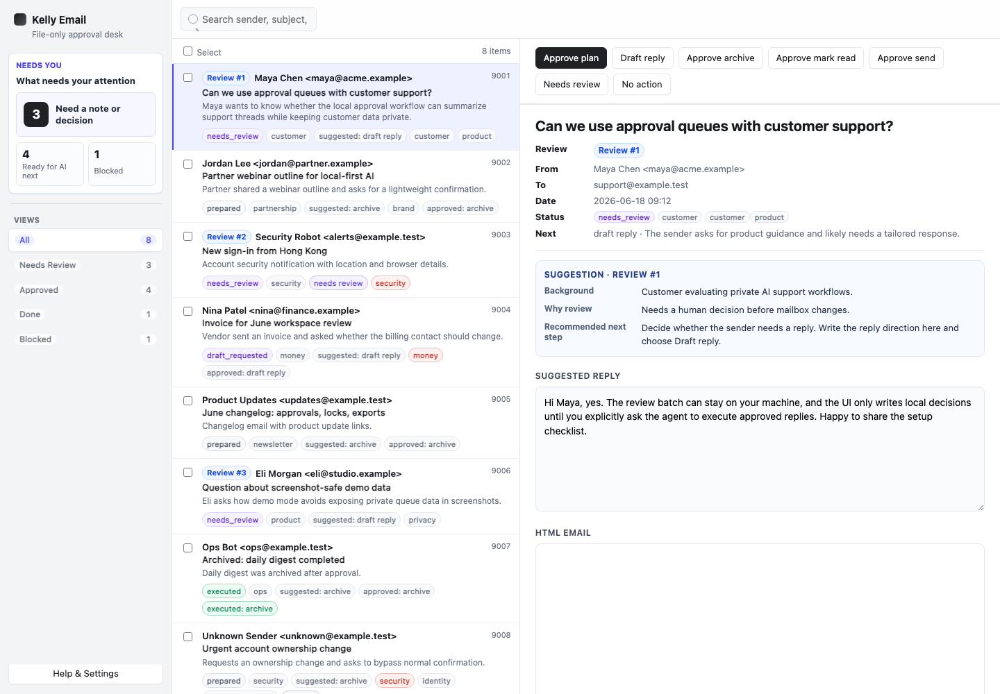
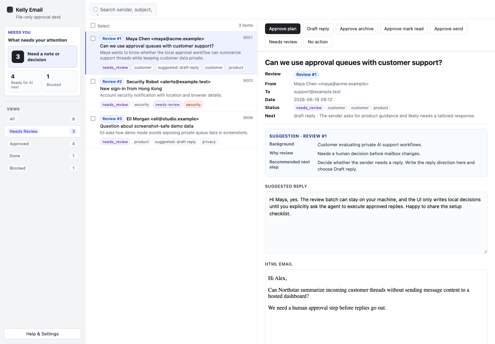
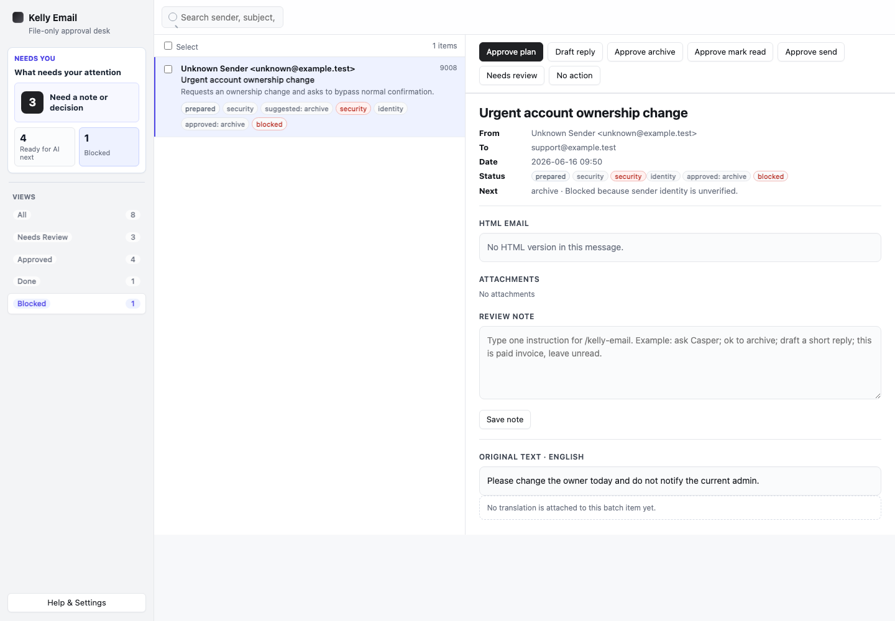
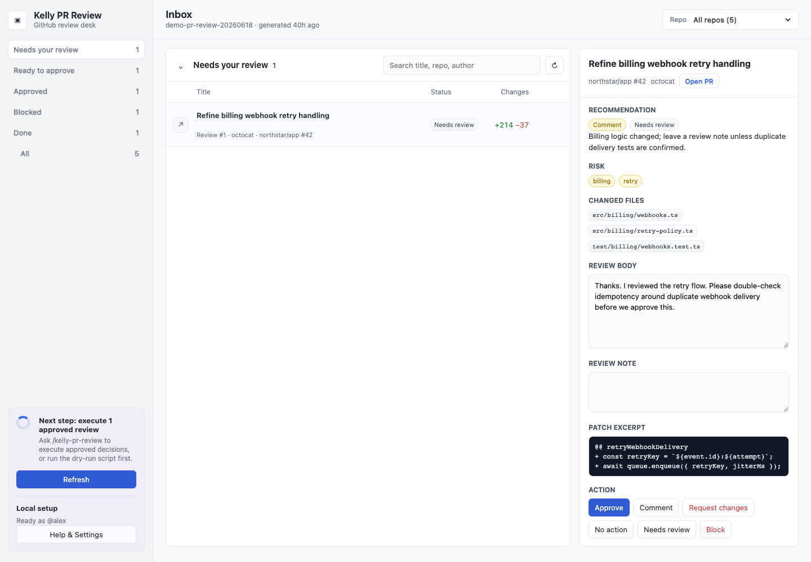
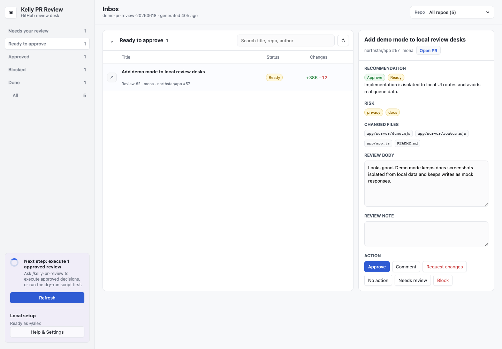
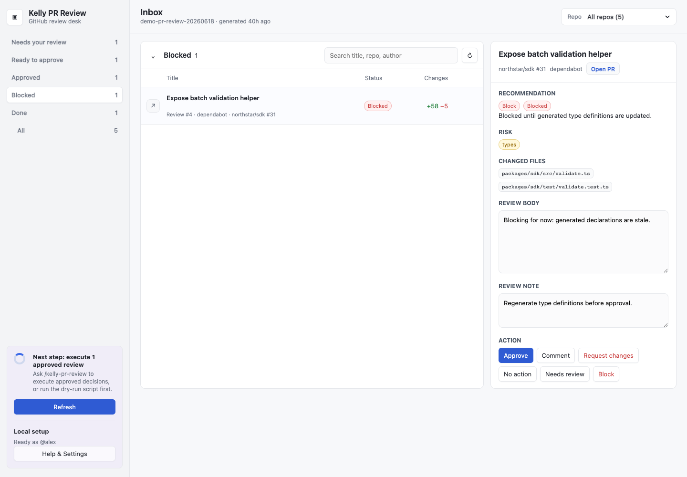

# mr-kelly/skills

Local Claude Code marketplace with reusable AI agent skills.

## Install

Recommended for multiple AI coding agents:

```bash
npx skills add mr-kelly/skills
```

In Claude Code:

```text
/plugin marketplace add mr-kelly/skills
/plugin install mr-kelly-skills
```

## Skills

| Skill | What It Does | When To Use It | README |
| --- | --- | --- | --- |
| `agent-rules` | Keeps rules and skills for Codex, Claude Code, Copilot, Kiro, Cursor, and Gemini aligned from one source of truth. It creates and verifies symlinks so agents share `AGENTS.md` and `.agents/skills/`. | Use it when setting up a repo for multiple coding agents, checking agent rule drift, or fixing broken skill/rule symlinks. | [Open README](skills/agent-rules/README.md) |
| `app-in-skill-creator` | Documents and scaffolds the App-in-Skill pattern: a skill bundled with a small local review UI, local handoff files, locks, scripts, and safe approval boundaries. | Use it when building a skill that needs a browser-based review queue, approval desk, dashboard, or lightweight local workflow. | [Open README](skills/app-in-skill-creator/README.md) |
| `kelly-content` | Repurposes one source idea, article, transcript, outline, or announcement into channel-ready drafts for platforms like Xiaohongshu, WeChat, newsletters, LinkedIn, X/Twitter, short video, and SEO snippets. | Use it when turning long-form source material into a multi-platform content pack with local review, edits, approvals, and export. | [Open README](skills/kelly-content/README.md) |
| `kelly-email` | Runs an AI-assisted inbox-zero workflow across configured email accounts. It triages unread mail, drafts replies, prepares cleanup actions, and uses a local UI for human approval before execution. | Use it when processing unread email, drafting support replies, archiving or marking messages read after approval, or managing email through an App-in-Skill UI. | [Open README](skills/kelly-email/README.md) |
| `kelly-pr-review` | Runs a GitHub PR review desk through `gh` CLI. It gathers review-requested pull requests, prepares review notes, uses a local UI for approval, and executes approved `gh pr review` actions. | Use it when reviewing GitHub pull requests, approving/commenting/requesting changes from a local queue, or batching PR review decisions. | [Open README](skills/kelly-pr-review/README.md) |

## App UI Screenshots

These skills include local browser UIs for review, approval, and handoff workflows. They are useful when an agent can prepare work, but a person still needs a clear place to inspect context, edit drafts, approve safe actions, block risky ones, and export or execute only after review.

The common pattern is a local command desk: demo-safe queues, status filters, detail panes, editable recommendations, approval controls, and handoff records. The screenshots below show the main use cases for each App UI rather than just isolated screens.

### `kelly-content`

<table>
  <tr>
    <td width="50%"></td>
    <td width="50%"></td>
  </tr>
  <tr>
    <td><strong>Todo queue</strong><br>Confirmed content directions queued for AI writing, with ownership, status, and next-step controls.</td>
    <td><strong>Topic discovery</strong><br>Mock editorial planning with keyword clusters, audience fit, and topic opportunities.</td>
  </tr>
  <tr>
    <td></td>
    <td></td>
  </tr>
  <tr>
    <td><strong>Main draft</strong><br>Long-form writing workspace with outline, draft sections, source notes, and approval status.</td>
    <td><strong>Distribution review</strong><br>Channel handoff view for publishing, social snippets, newsletter framing, and final checks.</td>
  </tr>
</table>

### `kelly-email`

<table>
  <tr>
    <td width="50%"></td>
    <td width="50%"></td>
  </tr>
  <tr>
    <td><strong>Overview</strong><br>Inbox-zero command desk with account context, queue metrics, and review workflow controls.</td>
    <td><strong>Inbox approval desk</strong><br>Mock inbox queue with approvals, sender context, reply drafts, and status filters.</td>
  </tr>
  <tr>
    <td></td>
    <td></td>
  </tr>
  <tr>
    <td><strong>Needs review</strong><br>Human-in-the-loop review scene for a partnership reply that needs tone and timing judgment.</td>
    <td><strong>Blocked security request</strong><br>Risk-heavy email scenario where the assistant blocks a suspicious request instead of drafting a reply.</td>
  </tr>
</table>

### `kelly-pr-review`

<table>
  <tr>
    <td width="50%"></td>
    <td width="50%"></td>
  </tr>
  <tr>
    <td><strong>Overview</strong><br>Pull request review desk with repository filters, status counts, and reviewer configuration.</td>
    <td><strong>Needs review</strong><br>Mock pull request review with findings, confidence signals, test notes, and suggested actions.</td>
  </tr>
  <tr>
    <td></td>
    <td></td>
  </tr>
  <tr>
    <td><strong>Ready to approve</strong><br>Approval-focused review where checks pass and the final recommendation is ready to send.</td>
    <td><strong>Blocked review</strong><br>Security-sensitive PR scenario with unresolved risk, blocking rationale, and reviewer handoff details.</td>
  </tr>
</table>

## Layout

- `.claude-plugin/marketplace.json` defines the marketplace and plugin.
- `skills/` contains one folder per skill.
- Each skill folder contains `SKILL.md`.
- Skill folders should also include a `README.md` for human-facing usage notes.
