<div align="center">

# 🧰 mr-kelly/skills

**Kelly 的个人 AI skills 工作区，用来处理日常业务里的重复工作。**

64 个 skills，其中 61 个是 App-in-Skill 工作流，配本地浏览器 UI 用于 review、审批和看板。

[](https://github.com/mr-kelly/skills)
[](https://github.com/mr-kelly/skills/commits/main)
[](https://mr-kelly.github.io/skills/?lang=zh)
[](../LICENSE)

[](#安装)

[English](../README.md) · **简体中文** · [🌐 在线浏览全部 skills](https://mr-kelly.github.io/skills/?lang=zh)

<table>
  <tr>
    <td width="50%">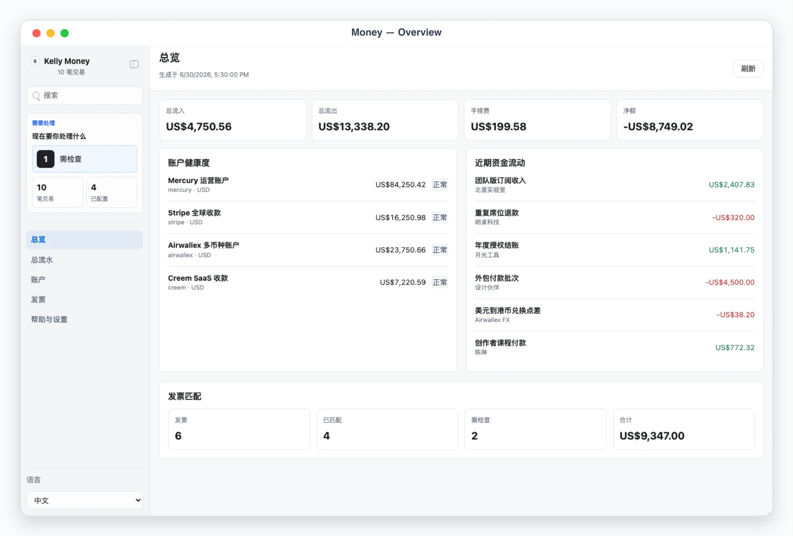</td>
    <td width="50%"></td>
  </tr>
  <tr>
    <td width="50%"></td>
    <td width="50%"></td>
  </tr>
  <tr>
    <td width="50%"></td>
    <td width="50%">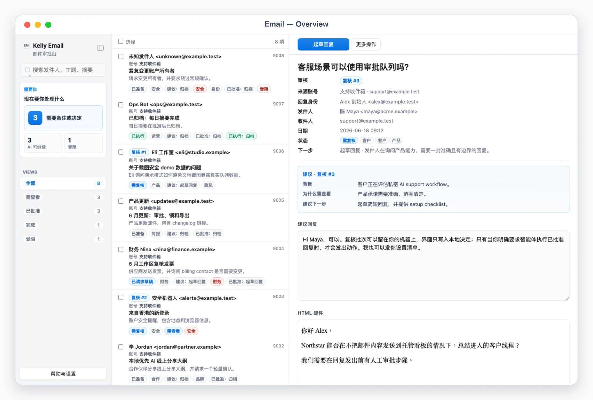</td>
  </tr>
</table>

<sub>不是 prompt，而是能干活的 skills：需要 UI 的有本地应用，需要模型的有生成器和检查流程。</sub>

</div>

---

## 目录

- [有什么不一样](#有什么不一样)
- [App-in-Skill 规范基线](#app-in-skill-规范基线)
- [快速开始](#快速开始)
- [Skills](#skills)
- [App UI 截图](#app-ui-截图)
- [目录结构](#目录结构)

---

这个仓库收集 Kelly 在邮件、资金台账、CRM、聊天聚合、社媒运营、SEO、用户反馈、市场情报、运维监控、内容生产、PR review、短剧制作、MV 策划和 agent 配置里经常使用的 skills。它可以作为 skill/plugin bundle 安装，但重点不是通用 marketplace，而是一组 Kelly 自己日常业务里真的会用的工具。

---

## 有什么不一样

大多数 skill 库只是 prompt。**Kelly 的 skills 是 App-in-Skill 工作流** —— 每个都把一份 agent 操作手册和一个本地浏览器 UI 配在一起，让你在任何事情发生前，总有一个稳的地方可以 review：

- **agent 干活** —— 对着你真实的账户和导出数据做 triage、起草、对账、调研和规划。
- **你在本地 UI 里 review** —— 一个操作台，带 dashboard、可编辑草稿、详情面板和状态筛选，跑在 `localhost` 上，默认用 demo-safe 数据。
- **有风险的动作不经批准不执行** —— 安全动作一键通过；高风险动作卡在明确的审批边界上，你随时可以带备注把任务交回给 agent。

结果是：agent 的速度 + 人在回路，而不是一个黑盒。

这不是随手拼的：整套模式遵循 **[App-in-Skill 规范论文](https://mr-kelly.github.io/research/app-in-skill-specification-for-pairing-agent-skills-with-a-local-companion-ui.pdf)** —— 一份关于「给 agent skill 配一个本地伴随 UI」的研究规范（文件交接、五态评审模型、data-provider 分层、onboarding、安全门）。这里每个 skill 都是这份规范的一个实现。

---

## App-in-Skill 规范基线

全部 60 个 `kelly-*` 工作流都按仓库内的 `app-in-skill-creator` contract 完成审计。这套共同基线落实在代码里，不只是文档约定：

- **首次使用 onboarding** —— 每个 App 在读取 live data 前都有识别 provider 的 setup route。浏览器只引导用户进入 provider 自己的安全配置流程，不收集密码或 API key。
- **确定性 handoff** —— 每个工作流都带 UI state validator；agent 到 App 的交接文件缺失或格式错误时会明确失败。使用 Busabase 的工作流还声明带 fingerprint 的 schema manifest。
- **Review 安全边界** —— 默认使用 demo data；外部写入、发布、发送、生成等有实际影响的动作，必须经过明确审批或进入 agent-task 边界。
- **可维护前端** —— 大型浏览器脚本拆成原生 ESM modules，入口文件保持在 800 行以内；大型样式表按稳定 cascade layer 拆成有序 CSS modules。
- **可复现证据** —— 截图使用确定性 demo state 和规范桌面/手机 viewport；GitHub Pages 画廊由中英文 README 与 skill 内本地 assets 统一重建。

审计门会运行仓库 lint 与 type check、校验每个 skill package、检查启动脚本与 setup route，并在桌面和手机尺寸实际执行 App UI。

---

## 快速开始

1. **安装** —— Claude Code 里：
   ```text
   /plugin marketplace add mr-kelly/skills
   /plugin install mr-kelly-skills
   ```
   或给 Codex 和其他支持 skills 的 agent：
   ```bash
   npx skills add mr-kelly/skills
   ```
2. **唤起一个 skill** —— 比如 `$kelly-money` 看现金流，或 `$kelly-email` 做 inbox zero。
3. **打开本地 App UI** —— skill 会在浏览器里拉起一个审阅台（默认 demo-safe 数据），你在这里查看 dashboard、编辑草稿、批准或阻止动作。

---

## Skills

`kelly-*` 是日常业务工具；`agent-rules`、`app-in-skill-creator`、`publish-skills` 这类 helper skills 用来维护这个工作区本身。

| Skill | 做什么 | 什么时候用 | 详情 |
| --- | --- | --- | --- |
| `agent-rules` | 让 Codex、Claude Code、Copilot、Kiro、Cursor、Gemini 等 agent 共享同一套规则和 skills。 | 设置多 agent repo、检查规则漂移、修复 rule/skill symlink 时使用。 | [查看 ↗](https://mr-kelly.github.io/skills/s/agent-rules.html?lang=zh) |
| `app-in-skill-creator` | 记录和脚手架化 App-in-Skill 模式：本地 review UI、handoff 文件、锁、脚本、安全边界，以及可选截图规范——只有明确需要或已有截图时，才放进 skill 内部的 `assets/screenshots/`。 | 构建带浏览器 review queue、approval desk、dashboard 或本地 workflow 的 skill 时使用。 | [查看 ↗](https://mr-kelly.github.io/skills/s/app-in-skill-creator.html?lang=zh) |
| `publish-skills` | 把 agent skills 和 MCP servers 发布到各大市场和注册表：扫描私密数据、用 `gh skill` 校验、切版本、接 Claude `/plugin` 和 Codex marketplace，并准备 MCP Registry 和精选商店。 | 发布、上架、分发 skills、plugins 或 MCP servers 到 skills.sh、Claude Code、Codex 或 MCP Registry 时使用。 | [查看 ↗](https://mr-kelly.github.io/skills/s/publish-skills.html?lang=zh) |
| `kelly-email` | AI 辅助 inbox-zero：跨邮箱 triage 未读邮件、起草回复、准备清理动作，并在本地 UI 里人工批准后执行。 | 处理未读邮件、写 support 回复、批准后归档/标记已读，或用 App-in-Skill UI 管理邮件时使用。 | [查看 ↗](https://mr-kelly.github.io/skills/s/kelly-email.html?lang=zh) |
| `kelly-finance` | 构建和审计财务三表模型、经营预测、预算、现金 runway、SaaS/unit economics 包，以及可交付的 Excel 财务输出。 | 做财务三表、融资预测、董事会财务包、情景分析、资产负债表检查、营运资本/资本开支/债务 schedule，或修三表勾稽错误时使用。 | [查看 ↗](https://mr-kelly.github.io/skills/s/kelly-finance.html?lang=zh) |
| `kelly-money` | 聚合 Mercury、Stripe、Airwallex、Creem，形成本地资金台账 dashboard、总流水、账户健康、发票匹配和对账详情。 | 查看余额、付款、payout、手续费、退款、转账、provider sync 状态、发票和流水匹配时使用。 | [查看 ↗](https://mr-kelly.github.io/skills/s/kelly-money.html?lang=zh) |
| `kelly-invoice-sheet` | 把发票、收据、红字/贷项通知单和 statement 抽取成类似 spreadsheet 的本地审阅表，带字段置信度、明细行、审批决定和 CSV/JSON 导出。 | 做 Invoice转表格、发票 OCR、收据转表格、记账导入准备，或需要类似 Lido Extract Data 的本地 App-in-Skill workflow 时使用。 | [查看 ↗](https://mr-kelly.github.io/skills/s/kelly-invoice-sheet.html?lang=zh) |
| `kelly-invest-webull` | 通过 Webull OpenAPI 把个人券商账户聚合成本地只读投资组合 dashboard：持仓、成本、市值、未实现盈亏、当日涨跌和按资产类别的配置。只读——绝不下单或撤单。 | 查看个人投资、持仓、组合市值、未实现盈亏、现金或资产配置时使用。 | [查看 ↗](https://mr-kelly.github.io/skills/s/kelly-invest-webull.html?lang=zh) |
| `kelly-family-office` | 通过 CSV 导入和手工录入，把多个主体/成员的持仓合并成家族办公室 dashboard：以基准货币计的总资产管理规模（AUM），按主体、资产类别、机构的配置和业绩汇总。只读——绝不动钱。 | 汇总个人、信托、公司等多主体的家族办公室，查看合并 AUM、资产配置、机构敞口或未实现业绩时使用。 | [查看 ↗](https://mr-kelly.github.io/skills/s/kelly-family-office.html?lang=zh) |
| `kelly-family-fund` | 把两位老人的退休金汇入一个由管理人统一记账的统筹基金，按月记录养老院固定支出和大家庭共享开销（折算基准货币），让每个兄弟姐妹家庭都能看到分摊是公平的。只读——绝不动钱。 | 一家人共同赡养老人、统一管理退休金时使用：记录养老院费用，并把结余（交通、聚餐、生日礼物、人情）透明地分摊到各兄弟姐妹家庭。 | [查看 ↗](https://mr-kelly.github.io/skills/s/kelly-family-fund.html?lang=zh) |
| `kelly-crm` | 个人 CRM：联系人、公司、交易和互动记录，带 pipeline dashboard 和 agent 起草的跟进审批队列。 | 跟踪交易和人脉、查看 pipeline 健康度、批准/编辑跟进草稿（由 agent 经其他渠道发出）时使用。 | [查看 ↗](https://mr-kelly.github.io/skills/s/kelly-crm.html?lang=zh) |
| `kelly-messenger` | 把 WhatsApp、Discord、Slack、Telegram 聚合成一个本地统一收件箱：完整会话记录 + 审批制回复 outbox。 | 在一个地方读所有聊天平台的消息、用一个 composer 写回复、批准后由 agent 经平台连接器发送时使用。 | [查看 ↗](https://mr-kelly.github.io/skills/s/kelly-messenger.html?lang=zh) |
| `kelly-social` | 既监控又发布的社媒指挥台（Aaron 的 ECHO）：监控侧有统一时间线、账号数据、粉丝趋势和 share-of-voice；发布侧有内容日历、agent 起草的成稿台、短视频脚本、审批制互动收件箱和危机剧本——每条草稿都过 social-qa 的 SHIP/FIX/BLOCK 门。 | 查看社媒表现和 share-of-voice、排内容日历、审批帖子和短视频脚本，或跨平台分诊 mention 和回复时使用。 | [查看 ↗](https://mr-kelly.github.io/skills/s/kelly-social.html?lang=zh) |
| `kelly-support` | 客服台：agent 把邮件、WhatsApp、网页在线、表单、微信来的工单分诊，基于知识库起草回复并提议动作；你在本地 UI review、编辑、批准后才发出，带 SLA 看板、CSAT 跟踪和 support-qa 门（未经批准的退款/承诺直接 BLOCK）。 | 跨渠道处理客服工单、基于知识库起草回复、跟踪 SLA 和 CSAT，或批准退款/升级等敏感动作时使用。 | [查看 ↗](https://mr-kelly.github.io/skills/s/kelly-support.html?lang=zh) |
| `kelly-seo` | 覆盖 SEO + GEO 的搜索台：Google Search Console 分析（点击/曝光/CTR/排名、机会）+ 生成式引擎优化侧——跨 ChatGPT/Perplexity/Gemini/Claude/Copilot 的 AI 可见度追踪、可引用性优化队列、品牌实体/知识面板就绪度，由 geo-qa 门把关。 | 分析搜索表现、追踪并提升 AI 引擎对品牌的引用、审批 GEO 内容改动，或修复知识图谱和实体信号时使用。 | [查看 ↗](https://mr-kelly.github.io/skills/s/kelly-seo.html?lang=zh) |
| `kelly-feedback` | 聚合全渠道用户反馈，聚类成带权重的 feature requests，并运行带草稿回复和 changelog 的 roadmap 裁决队列。 | 分诊用户反馈、给需求排优先级、做有证据支撑的 roadmap 采纳/拒绝决定时使用。 | [查看 ↗](https://mr-kelly.github.io/skills/s/kelly-feedback.html?lang=zh) |
| `kelly-radar` | 市场情报台：竞品信号监控（定价、changelog、发布、口碑 diff）+ 带 brief 审批和引用报告的研究课题工作台 + 关键词/话题趋势跟踪。 | 盯竞品、发起深度研究报告、把上升的搜索和社区趋势转成机会卡时使用。 | [查看 ↗](https://mr-kelly.github.io/skills/s/kelly-radar.html?lang=zh) |
| `kelly-ai-newsroom` | AI/新闻源情报台：把平台、搜索、监管、企业软件和新闻源变化拆成真正影响采购的 buyer-trigger，而不是泛泛热点。 | 追踪 AI 新闻、Microsoft/Meta/OpenAI/Google/Perplexity 动向、新闻源变化，或寻找会影响产品采购的销售角度时使用。 | [查看 ↗](https://mr-kelly.github.io/skills/s/kelly-ai-newsroom.html?lang=zh) |
| `kelly-real-estate-intel` | 地产中介情报台：围绕 listing、成交、按揭、片区动态、竞品广告和客户跟进，生成可 review 的销售动作。 | 把地产市场变化转成业主更新、买家跟进、房源卖点、开放日话术或 agency review batch 时使用。 | [查看 ↗](https://mr-kelly.github.io/skills/s/kelly-real-estate-intel.html?lang=zh) |
| `kelly-education-intel` | 教育招生情报台：跟踪考试日期、升学政策、签证、学校通知、家长问题和竞品课程，转成招生动作。 | 学校、培训机构、留学/升学服务需要家长 FAQ、招生动作、课程推广角度、讲座主题或教育备忘录时使用。 | [查看 ↗](https://mr-kelly.github.io/skills/s/kelly-education-intel.html?lang=zh) |
| `kelly-beauty-intel` | 美容医美情报台：把竞品套餐、项目趋势、安全通知、评价主题和季节需求转成安全的咨询与营销动作。 | 门店或医美团队需要活动角度、咨询话术、差评修复、客户教育，且要避开医疗宣称风险时使用。 | [查看 ↗](https://mr-kelly.github.io/skills/s/kelly-beauty-intel.html?lang=zh) |
| `kelly-insurance-intel` | 保险顾问情报台：跟踪监管、险司/产品、保费/理赔、生命周期事件和客户风险问题，生成合规跟进。 | 经纪人或代理团队需要会议议程、续保话术、客户教育、保障缺口 checklist，且不能越界做适配结论时使用。 | [查看 ↗](https://mr-kelly.github.io/skills/s/kelly-insurance-intel.html?lang=zh) |
| `kelly-insure-data` | 保险行业高质量数据录入与治理工作台，基于 Busabase：Drive node 文件 metadata、治理后的问答对、保险新闻资讯 Base 记录。 | 导入、审核、清洗保险文件、metadata 完整度、问答对或市场/新闻记录，在进入可信知识库前做数据治理时使用。 | [查看 ↗](https://mr-kelly.github.io/skills/s/kelly-insure-data.html?lang=zh) |
| `kelly-retail-intel` | 零售运营情报台：把天气、活动、竞品促销、商品趋势、评价主题、供应变化转成门店陈列和销售动作。 | 门店或消费品牌需要主推 SKU、标牌文案、补货检查、店员 briefing 或本地需求动作时使用。 | [查看 ↗](https://mr-kelly.github.io/skills/s/kelly-retail-intel.html?lang=zh) |
| `kelly-ecommerce-intel` | 电商卖家情报台：跟踪平台政策、竞品价格/listing、搜索趋势、广告、评价语言和 SKU 活动机会。 | 跨境/平台/DTC 卖家需要 listing 优化、广告角度、组合测试、评价回复、campaign brief 或政策风险检查时使用。 | [查看 ↗](https://mr-kelly.github.io/skills/s/kelly-ecommerce-intel.html?lang=zh) |
| `kelly-restaurant-intel` | 餐饮集团情报台：把天气、活动、菜单、外卖、订座和评价主题转成每日菜单、班次和促销动作。 | 餐厅、咖啡店或餐饮集团需要主推菜、班次 briefing、外卖文案、订座话术或客诉修复草稿时使用。 | [查看 ↗](https://mr-kelly.github.io/skills/s/kelly-restaurant-intel.html?lang=zh) |
| `kelly-financial-services-intel` | 金融服务情报台：跟踪监管、宏观、市场、组合主题、竞品和客户问题，生成可 review 的教育与客户经营动作。 | 顾问、家族办公室或金融服务团队需要内部 brief、客户教育 memo、会议议程或风险提醒，且不能给个性化投资建议时使用。 | [查看 ↗](https://mr-kelly.github.io/skills/s/kelly-financial-services-intel.html?lang=zh) |
| `kelly-devops` | 盯产品矩阵的运维面：服务可用性和延迟、SSL 证书和域名到期、API key 轮换、云支出异常，带 agent 提出的行动卡审批。 | 检查服务健康、避免域名/证书过期、review 云支出异常、批准续费和轮换动作时使用。 | [查看 ↗](https://mr-kelly.github.io/skills/s/kelly-devops.html?lang=zh) |
| `kelly-audit` | 导入订单、发票、回款三表并互相稽核：缺发票、金额不符、逾期应收（带账龄）、重复回款、无主回款，每条异常带证据链和催收草稿。 | 对账订单-发票-回款链条、催收应收账款、月底前 review 财务异常时使用。 | [查看 ↗](https://mr-kelly.github.io/skills/s/kelly-audit.html?lang=zh) |
| `kelly-tickets` | 把微信群导出、来电记录、表单、邮件里的投诉分类成工单，生成带 SLA 的派单建议供审批，并在看板上跟踪到解决。 | 管理物业/设施投诉、给班组派工单，或运行任何「接入-分类-派单-跟踪」流程时使用。 | [查看 ↗](https://mr-kelly.github.io/skills/s/kelly-tickets.html?lang=zh) |
| `kelly-lesson` | 从教材和校内模板生成教案草稿，按校内要求跑合规检查清单，给教导主任一个带教师反馈草稿和文档导出的审核队列。 | 统一全校教案格式、检查教案合规性、批量审核批准教学计划时使用。 | [查看 ↗](https://mr-kelly.github.io/skills/s/kelly-lesson.html?lang=zh) |
| `kelly-scale-pptx` | 项目制 PPTX 课件工厂：把客户风格样张和课程内容变成可审核的页面卡，批量生成风格一致的 PowerPoint，并跟踪渲染 QA 和导出记录。 | 大批量制作教学 PPTX、建立可复用课件风格系统、审核页面分镜卡、批量生成客户可交付 PPTX 时使用。 | [查看 ↗](https://mr-kelly.github.io/skills/s/kelly-scale-pptx.html?lang=zh) |
| `kelly-demo-video-factory` | 端到端规划产品演示/营销视频：钩子/痛点/分镜起草、对照真实代码库核实产品说法、逐镜录制进度追踪，数据存在 Busabase 里，本地有一个只读审核 App 展示；再交接给后期/HyperFrame（Remotion）。 | 规划一条产品演示视频、写分镜表格、录制前核实脚本里的产品说法、追踪哪些镜头已录制，或把定稿分镜交给剪辑/Remotion 时使用。 | [查看 ↗](https://mr-kelly.github.io/skills/s/kelly-demo-video-factory.html?lang=zh) |
| `kelly-inquiry` | 把 WhatsApp、Instagram、Messenger、邮件询盘聚合成销售 pipeline：商品知识库、带底价护栏的报价单、审批制外发和跟进提醒。 | 处理外贸/跨境询盘、基于商品库起草准确回复和报价、防止商机逾期漏单时使用。 | [查看 ↗](https://mr-kelly.github.io/skills/s/kelly-inquiry.html?lang=zh) |
| `kelly-picks` | 跨境选品雷达：agent 扫 BSR 飙升、TikTok 爆款、上升搜索词产出候选品，每个候选带可实时改数的利润卡（售价、到岸成本、费用、保本 ACOS）和竞争解读。 | 找品、上架前压测利润空间、带采购/上架 brief 做「立项/观察/放弃」决策时使用。 | [查看 ↗](https://mr-kelly.github.io/skills/s/kelly-picks.html?lang=zh) |
| `kelly-products` | 电商商品管理台：图文 SKU 商品库、价格、库存覆盖、渠道状态、素材资产、合规备注、生命周期，以及审批制商品操作。 | 管商品主数据、库存/补货风险、各平台渠道状态、调价、质检暂停、SKU 下架归档或发布审批时使用。 | [查看 ↗](https://mr-kelly.github.io/skills/s/kelly-products.html?lang=zh) |
| `kelly-listing` | 上架工厂：生成各平台 listing（Amazon 标题/五点/描述/后台词/A+、Shopify、TikTok Shop、eBay）和多站点语言变体，跑平台合规检查，批准后导出。 | 写或本地化平台 listing、执行禁用词和字数规则、批量审核上架文案时使用。 | [查看 ↗](https://mr-kelly.github.io/skills/s/kelly-listing.html?lang=zh) |
| `kelly-legal-casebase-ingest` | 法律案例库入库与脱敏质检台：agent 把归档判决书、裁定书、仲裁裁决提取成结构化、脱敏案例记录，审核人批准/修改/拦截后才进入 canonical 案例库。 | 建内部智能案例库、处理裁判文书、复核脱敏、分类标注、案例审核或做数据质量验收时使用。 | [查看 ↗](https://mr-kelly.github.io/skills/s/kelly-legal-casebase-ingest.html?lang=zh) |
| `kelly-legal-precedent-desk` | 内部类案检索与裁判尺度台：agent 检索已批准案例库，准备类案包、本地裁判尺度、引用片段和 AI 问答答案，律师复核后复用。 | 律师需要内部案例库检索、类案匹配、本地法院倾向、类案研究包，或导出基于本所经验的研究结论时使用。 | [查看 ↗](https://mr-kelly.github.io/skills/s/kelly-legal-precedent-desk.html?lang=zh) |
| `kelly-legal-matter-strategy` | 案件策略与文书辅助台：agent 基于新案事实和内部类案生成争议焦点树、证据地图、风险判断、谈判选项和文书大纲，交由主办律师/合伙人审核。 | 准备诉讼、仲裁、咨询、证据或文书策略，且需要负责人复核后才能用于客户事项时使用。 | [查看 ↗](https://mr-kelly.github.io/skills/s/kelly-legal-matter-strategy.html?lang=zh) |
| `kelly-legal-firm-radar` | 律所经营画像台：基于脱敏案例库元数据做业务结构、案件质量、律师能力画像、人才信号、品牌 proof point 和管理报告审批。 | 合伙人需要业务布局分析、案件质量评估、律师画像、专业梯队建设，或从内部案例库提炼品牌证明时使用。 | [查看 ↗](https://mr-kelly.github.io/skills/s/kelly-legal-firm-radar.html?lang=zh) |
| `kelly-clm` | 轻量合同生命周期台：合同库、生命周期阶段、负责人、义务、续约通知和简单审批提醒。 | 管一个简单合同台账、跟踪续约或通知截止日、分配合同负责人，或跟进合同义务但不做详细法务红线时使用。 | [查看 ↗](https://mr-kelly.github.io/skills/s/kelly-clm.html?lang=zh) |
| `kelly-legal-contracts` | 法务合同审阅台：覆盖 NDA、MSA、DPA、SOW，agent 准备条款风险项、fallback language、条款库检查和 issue list 导出，法务在本地 UI 审核批准。 | 审合同、分诊条款风险、维护 fallback playbook、批准红线立场，或导出法务 issue list 但不自动外发时使用。 | [查看 ↗](https://mr-kelly.github.io/skills/s/kelly-legal-contracts.html?lang=zh) |
| `kelly-ads` | 投放指挥台：聚合 Amazon、Meta、TikTok、Google 广告到一块看板，跟踪 ACOS/ROAS，确定性异常检测，审批制调整卡（否定词、出价、预算）。 | 跨平台看广告花费、抓零转化烧钱和预算烧穿、带证据批准出价和关键词调整时使用。 | [查看 ↗](https://mr-kelly.github.io/skills/s/kelly-ads.html?lang=zh) |
| `kelly-standup` | 团队晨会看板：被调用时 agent 从聊天渠道收集成员日报，整理成「昨天/今天/阻塞」卡片和团队摘要，给缺交的人起草审批制催交提醒。 | 异步开晨会、一眼看到每个人在干什么、跟踪阻塞和参与率时使用。 | [查看 ↗](https://mr-kelly.github.io/skills/s/kelly-standup.html?lang=zh) |
| `kelly-writer` | 把一个想法、文章、 transcript、outline 或公告改写成适合小红书、公众号、newsletter、LinkedIn、X/Twitter、短视频、SEO 的内容包。 | 把长内容拆成多平台内容包，并在本地 review、编辑、批准、导出时使用。 | [查看 ↗](https://mr-kelly.github.io/skills/s/kelly-writer.html?lang=zh) |
| `kelly-pr-review` | 通过 `gh` CLI 做 GitHub PR review desk：收集待 review PR、准备 review notes、在本地 UI 批准后执行 `gh pr review`。 | review PR、批准/comment/request changes，或批量处理 PR review decision 时使用。 | [查看 ↗](https://mr-kelly.github.io/skills/s/kelly-pr-review.html?lang=zh) |
| `kelly-drama` | 短剧生产工作台：剧集概览、角色库、关系图、分集表、shot sheet，并协调角色参考图和 AI/人工任务。 | 从策划到分镜管理短剧系列，写分集、建角色、管理 storyboard、review AI 生成图时使用。 | [查看 ↗](https://mr-kelly.github.io/skills/s/kelly-drama.html?lang=zh) |
| `kelly-mv` | 纯视觉 MV 工作台：上传 MP3、写 MV concept、建立角色和参考卡、生成/上传镜头图和视频，并围绕音乐做 storyboard。 | 做没有旁白/字幕的纯视觉 MV，用歌曲驱动镜头和画面规划时使用。 | [查看 ↗](https://mr-kelly.github.io/skills/s/kelly-mv.html?lang=zh) |
| `kelly-digital-human` | 数字人方案台和多模态 demo：在低成本 2D 写实数字人服务与高自由度 UE/Unity 3D 定制数字人之间做选择，并用本地 Studio 展示语音/文本输入、唇形视频流、服务路由延迟和上线 QA。 | 规划 AI 主持人、客服数字人、产品讲解员、直播助理或数字人 demo；对比硅基智能、腾讯智影、即构/ZEGO 式实时服务；或设计 3D UE/Unity 数字人管线时使用。 | [查看 ↗](https://mr-kelly.github.io/skills/s/kelly-digital-human.html?lang=zh) |
| `kelly-creators` | 达人营销指挥台，跑 Discover→Plan→Activate→Measure 管道：agent 扫描并按 C³ ACE 给达人候选打匹配分，起草外联、brief 和合同，发布前质量门（SHIP/FIX/BLOCK）核查 FTC 披露与宣称真实性，全部在本地 UI 审阅，带 ROI 看板。 | 发现和筛选达人、审批外联和 brief、跑达人投放管道，或跟踪红人 ROI 与预算时使用。 | [查看 ↗](https://mr-kelly.github.io/skills/s/kelly-creators.html?lang=zh) |
| `kelly-campaigns` | 外发邮件营销台，跑 SEND 生命周期（Setup→Engage→Nurture→Deliver）：agent 建分群，起草 campaign、newsletter 和序列，发送前跑送达率 + 主题行 QA，背后有 EQS 质量门（SHIP/FIX/BLOCK），排期或发送前先过审。 | 策划邮件 campaign、newsletter 或生命周期序列、检查送达率和 A/B 主题、审批群发时使用——与 `kelly-email` 收件箱清零区分开。 | [查看 ↗](https://mr-kelly.github.io/skills/s/kelly-campaigns.html?lang=zh) |
| `kelly-launch` | 产品发布指挥台，跑 RAMP 框架（Research→Assemble→Mobilize→Prove）：agent 组装发布清单，起草素材、Product Hunt / Hacker News 提交、媒体推介和发布日 runbook，发布就绪门给出发布质量分（LQS → SHIP/FIX/BLOCK）。 | 策划和执行产品发布：搭清单、审批素材和渠道提交、把关发布就绪度，或指挥发布日时使用。 | [查看 ↗](https://mr-kelly.github.io/skills/s/kelly-launch.html?lang=zh) |
| `kelly-brand` | 品牌叙事唯一真源，跑 TALE 框架（Trace→Architect→Land→Evaluate）：agent 起草定位、message house、story bank、带证据的 proof point 和用词护栏，给叙事质量打分（NQS → SHIP/FIX/BLOCK），并标记跨渠道漂移；你决定哪些草稿升为 canonical。 | 定义或审计品牌定位和信息、维护 canonical 叙事和 story bank，或捕捉跨渠道跑偏时使用。 | [查看 ↗](https://mr-kelly.github.io/skills/s/kelly-brand.html?lang=zh) |
| `kelly-revshare-simulator` | 收益分成融资（RBF）合约模拟工作台：推算现金流和累计回款、计算 Cash-Flow Payout Multiple 和商户实际年化成本，并用纯确定性数学标记风险（回款上限未达标、成本过高）。 | 给收益分成/商户预付款交易做尽调、并排比较多个融资方案，或记录批准/需修改/拒绝决定时使用。 | [查看 ↗](https://mr-kelly.github.io/skills/s/kelly-revshare-simulator.html?lang=zh) |
| `kelly-deal-scorer` | 审核队列台，用可审计的确定性规则打分（营收稳定性、增长趋势、行业风险、本金比例、经营记录）给候选中小企融资项目打分——从不调用 LLM。 | 审阅尽调打分队列、查看分数拆解、获取建议分成比例区间，或记录批准/退回/拒绝决定时使用。 | [查看 ↗](https://mr-kelly.github.io/skills/s/kelly-deal-scorer.html?lang=zh) |
| `kelly-portfolio-health` | 面向 RBF 基金或私募信贷组合的只读看板：总 AUM、加权回款进度、行业集中度风险，以及营收下滑合约的观察名单。 | 检查投资组合健康状况、标记合约待复核，或查看行业集中度和风险敞口时使用。 | [查看 ↗](https://mr-kelly.github.io/skills/s/kelly-portfolio-health.html?lang=zh) |
| `kelly-lead-funnel` | 面向 BD/获客团队的看板控制台，用确定性规则给商户融资线索打分，并跟踪各阶段转化率。 | 审阅获客漏斗、推进/驳回线索、或查看漏斗转化率时使用。 | [查看 ↗](https://mr-kelly.github.io/skills/s/kelly-lead-funnel.html?lang=zh) |
| `kelly-disclosure-tracker` | 合规/IR 工作台，跨发行地实体、基金管理人实体和挂牌交易场所三方，跟踪每个融资载体的标准化披露清单和跨方对账异常。 | 审阅披露清单进度、载体就绪状态，或申报前的对账异常时使用。 | [查看 ↗](https://mr-kelly.github.io/skills/s/kelly-disclosure-tracker.html?lang=zh) |
| `kelly-agent-observability` | 本地看板，展示运行在共享 AI 网关背后的一批 LLM agent：调用量、延迟、错误率、成本，以及链路级故障追踪。 | 审阅 agent 集群健康状况，或排查某条失败链路断在哪一步时使用。 | [查看 ↗](https://mr-kelly.github.io/skills/s/kelly-agent-observability.html?lang=zh) |
| `kelly-agent-eval` | 评测看板，跑固定测试集对比 baseline 与候选版本 agent，在发版前用打分规则揪出回归问题。 | 排查 agent 版本回归、对比 baseline 与候选质量，或记录发版批准/阻止决定时使用。 | [查看 ↗](https://mr-kelly.github.io/skills/s/kelly-agent-eval.html?lang=zh) |
| `kelly-agent-builder` | 低代码 agent 配置与治理控制台：维护一批 mock agent 配置的配额、审批和归属，未填齐字段前禁止上线。 | 管理 agent 目录、检查配额使用、把草稿激活为上线，或归档某个 agent 时使用。 | [查看 ↗](https://mr-kelly.github.io/skills/s/kelly-agent-builder.html?lang=zh) |
| `kelly-behavior-predict` | 基于 mock 用户行为漏斗数据的看板，给每个用户分群提供预测下一步动作的启发式规则，并跑准确率回测。 | 查看漏斗流失、各分群预测结果，或回测规则式推荐启发式时使用。 | [查看 ↗](https://mr-kelly.github.io/skills/s/kelly-behavior-predict.html?lang=zh) |
| `kelly-llm-gateway` | 共享 LLM 网关的成本与模型治理看板：花费趋势、按服务/模型的成本拆分、灰度发布状态板，以及确定性成本/错误异常检测。 | 查看 LLM 网关花费、灰度发布状态，或确认成本/错误异常时使用。 | [查看 ↗](https://mr-kelly.github.io/skills/s/kelly-llm-gateway.html?lang=zh) |

---

## App UI 截图

大多数 Kelly skills 不只是 chat prompt：它们带本地浏览器 UI，用于 review、approval、dashboard、planning 和 handoff。当 agent 能先准备工作，但 Kelly 还需要一个清楚的地方查看上下文、编辑草稿、比较表格、批准安全动作、阻止高风险动作，或者带备注把任务交回给 agent 时，这些 UI 就很有用。

共同模式是本地操作台：demo-safe data、状态筛选、详情面板、可编辑建议、批准控件、dashboard 和本地 handoff 记录。下面的截图展示每个 App UI 的主要使用场景。

<details>
<summary><b>📸 展开全部 App UI 截图</b></summary>

### `kelly-email`

<table>
  <tr>
    <td width="50%"></td>
    <td width="50%">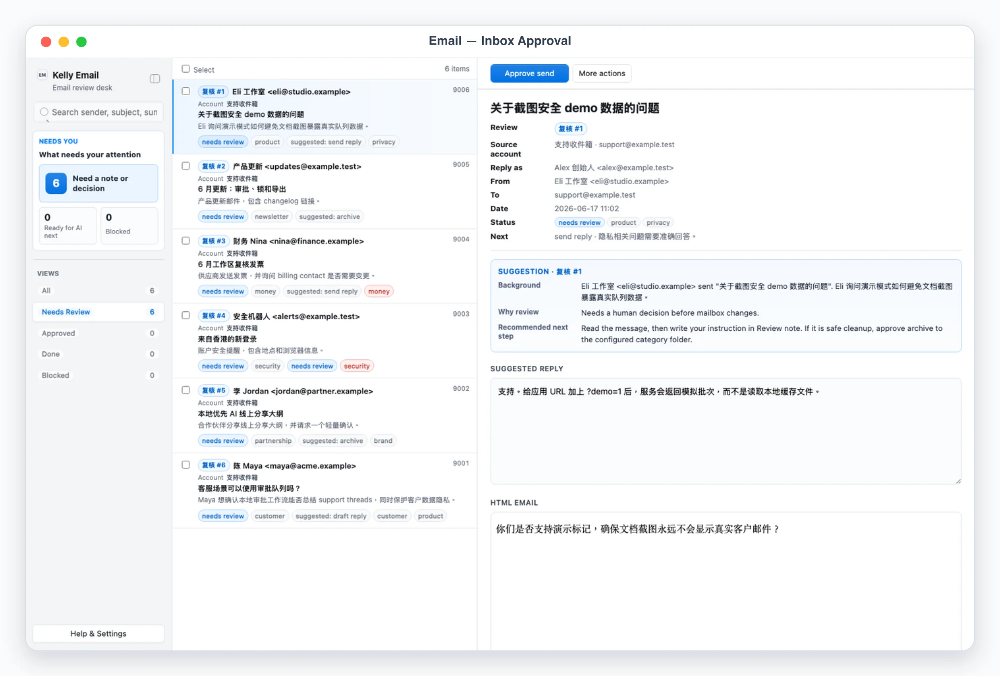</td>
  </tr>
  <tr>
    <td><strong>总览</strong><br>Inbox-zero 操作台，显示账户上下文、队列指标和 review workflow 控件。</td>
    <td><strong>邮件审批台</strong><br>Mock 邮件队列，带批准动作、发件人上下文、回复草稿和状态筛选。</td>
  </tr>
  <tr>
    <td width="50%"></td>
    <td width="50%"></td>
  </tr>
  <tr>
    <td><strong>需要 review</strong><br>需要人工判断语气、时机或下一步的邮件 review 场景。</td>
    <td><strong>高风险阻止</strong><br>遇到可疑或安全相关请求时，assistant 阻止处理而不是直接起草回复。</td>
  </tr>
</table>

### `kelly-money`

Kelly Money 是本地财务 dashboard，用来查看 Mercury、Stripe、Airwallex 和 Creem 的资金流动，并在文档截图里避免暴露真实凭证或 provider 数据。Demo 展示总流水、provider/account 列、账户健康、发票匹配、异常 review 和对账详情。

<table>
  <tr>
    <td width="50%"></td>
    <td width="50%">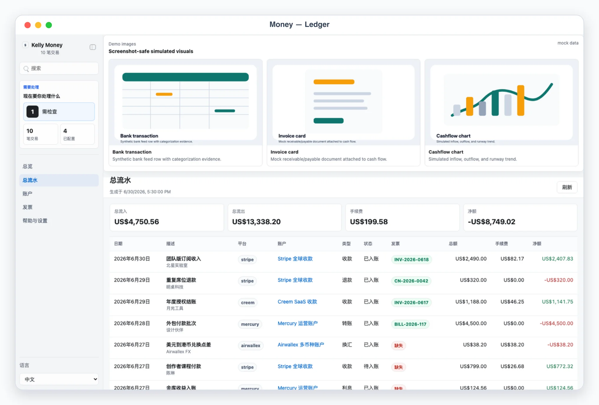</td>
  </tr>
  <tr>
    <td><strong>总览</strong><br>资金操作台，显示账户健康、近期资金流动、总流入、总流出、手续费和净额。</td>
    <td><strong>总流水</strong><br>跨 provider 的标准化流水表，包含账户、交易类型、手续费、状态和净额。</td>
  </tr>
  <tr>
    <td>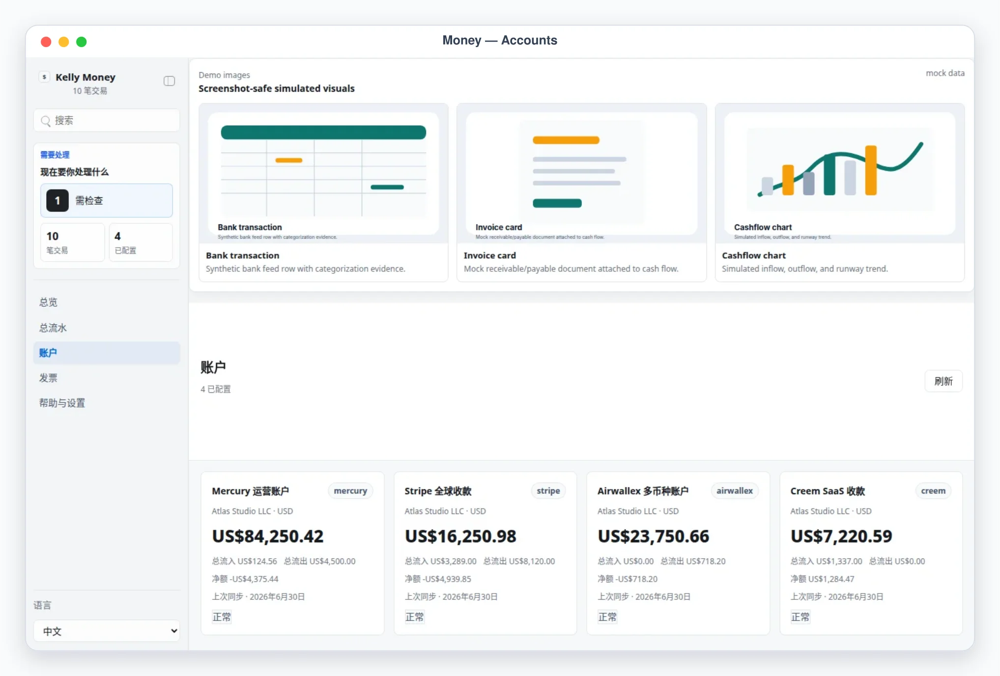</td>
    <td></td>
  </tr>
  <tr>
    <td><strong>账户</strong><br>Provider 账户清单，显示余额、币种、同步状态、流入、手续费和净额。</td>
    <td><strong>发票匹配</strong><br>发票和流水的对账视图，展示已匹配、缺失发票、金额不一致和复核状态。</td>
  </tr>
  <tr>
    <td>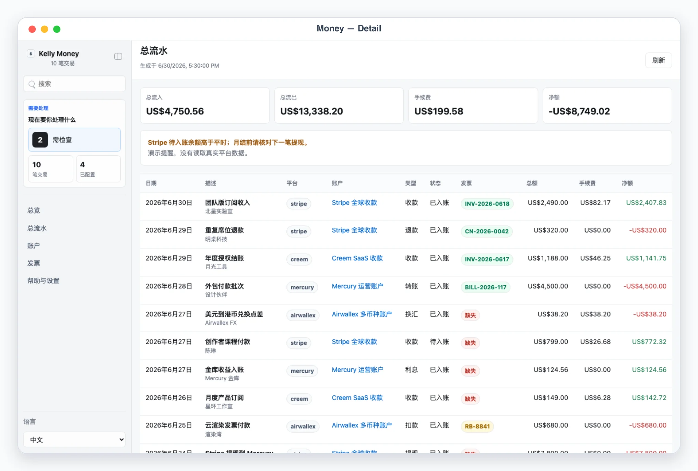</td>
    <td></td>
  </tr>
  <tr>
    <td><strong>异常详情</strong><br>发票异常页，显示金额/日期差异、匹配规则、容差、候选交易和审计轨迹。</td>
    <td></td>
  </tr>
</table>

### `kelly-finance`

Kelly Finance 是本地财务模型审阅台。它用于生成和审计三表 workbook，把假设和公式分开，并给 Kelly 一个浏览器 UI，用来看模型指标、检查队列、review note、审批决定和 agent handoff report。

<table>
  <tr>
    <td width="50%"></td>
    <td width="50%"></td>
  </tr>
  <tr>
    <td><strong>三表生成器</strong><br>展示 Assumptions、利润表、资产负债表、现金流量表和 Checks 的 workbook 预览。</td>
    <td><strong>模型勾稽检查</strong><br>交付前检查三表联动、hardcode、公式方向、债务和营运资本勾稽。</td>
  </tr>
  <tr>
    <td width="50%"></td>
  </tr>
  <tr>
    <td><strong>工作簿</strong><br>生成的工作簿路径与页签契约——假设、利润表、资产负债表、现金流量表、检查——导出前先复核。</td>
  </tr>
</table>

### `kelly-invest-webull`

Kelly Invest（Webull）是本地只读投资组合 dashboard，通过 Webull OpenAPI（App Key/Secret，region `us`）连接个人券商账户，并有严格的"绝不交易"边界。Demo 在不暴露真实凭证的前提下展示操作界面：组合市值、未实现盈亏、资产配置、持仓，以及按账户和按标的的详情。

<table>
  <tr>
    <td width="50%">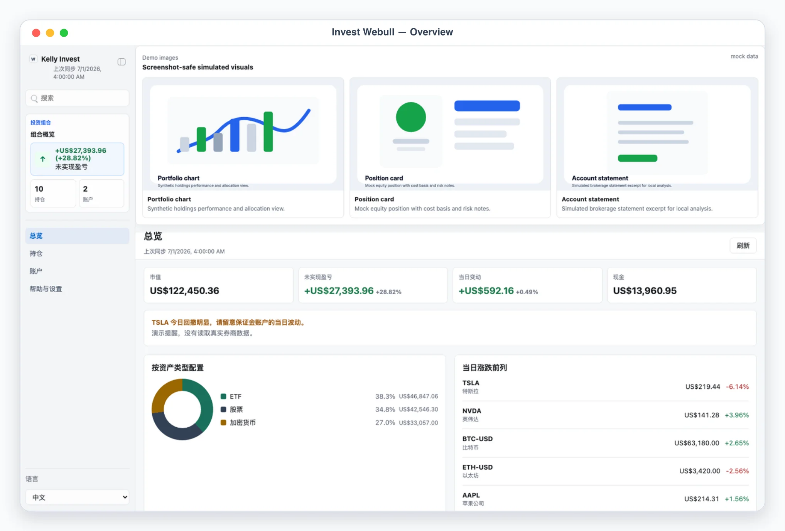</td>
    <td width="50%"></td>
  </tr>
  <tr>
    <td><strong>总览</strong><br>投资组合操作台，显示市值、未实现盈亏、当日涨跌、现金、按资产类别的环形配置图和当日涨跌榜。</td>
    <td><strong>持仓</strong><br>可排序的持仓表，含标的、资产类别、数量、平均成本、现价、市值、未实现盈亏和组合权重。</td>
  </tr>
  <tr>
    <td>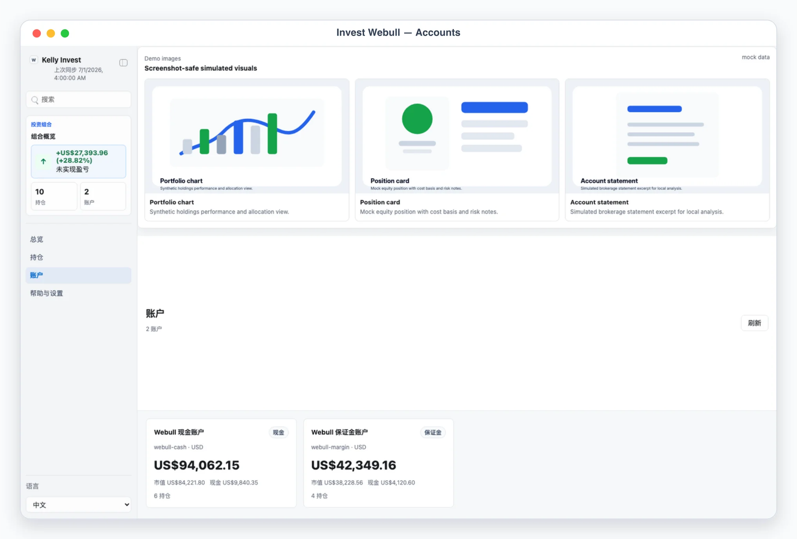</td>
    <td>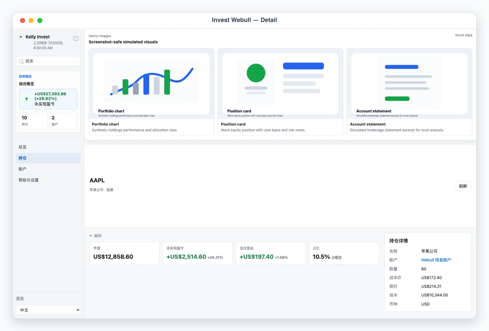</td>
  </tr>
  <tr>
    <td><strong>账户</strong><br>按账户（现金/融资）显示净清算价值、现金、购买力，以及每个账户下的持仓。</td>
    <td><strong>标的详情</strong><br>单个标的视图，显示成本、市值、未实现盈亏及百分比、当日涨跌、权重和所属账户。</td>
  </tr>
</table>

### `kelly-invoice-sheet`

Kelly Invoice Sheet 把发票、收据、红字/贷项通知单和 statement 变成本地 spreadsheet 风格审阅表。界面参考 Lido 的 Extract Data 流程：默认先显示可审阅表格，需要时再打开上传/抽取弹窗；右侧可编辑发票字段、明细行、置信度提示，并通过审批后导出 CSV/JSON。

<table>
  <tr>
    <td width="33%"></td>
    <td width="33%"></td>
    <td width="33%">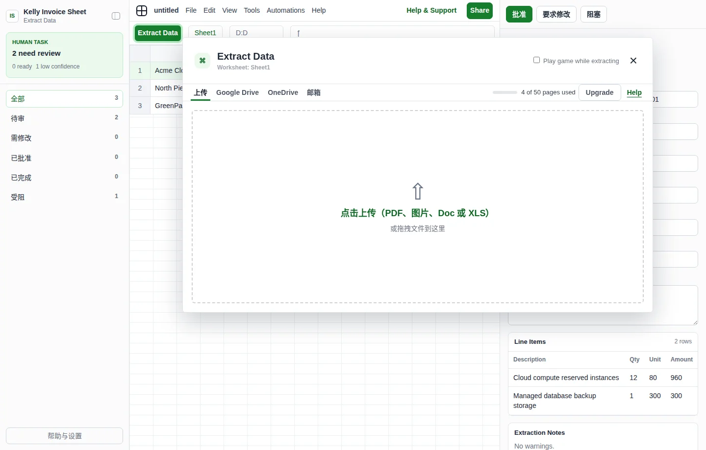</td>
  </tr>
  <tr>
    <td><strong>表格抽取台</strong><br>sheet 风格发票表直接展示抽取结果、状态筛选、置信度标记和人工关注计数。</td>
    <td><strong>发票详情审核</strong><br>可编辑发票字段、明细行、置信度备注，以及批准/要求修改/阻塞控件。</td>
    <td><strong>Extract Data 上传</strong><br>类似 Lido 的上传弹窗，提供本地文件、Google Drive、OneDrive 和 Email 来源入口。</td>
  </tr>
</table>

### `kelly-family-office`

Kelly Family Office 通过 CSV 导入和手工录入，把个人、信托、公司等多个主体和成员的持仓合并成一个只读 dashboard，并换算成基准货币。Demo 在不使用真实账户数据的前提下展示操作界面：总 AUM 和未实现盈亏，以及按主体、资产类别、机构和业绩的汇总。

<table>
  <tr>
    <td width="50%">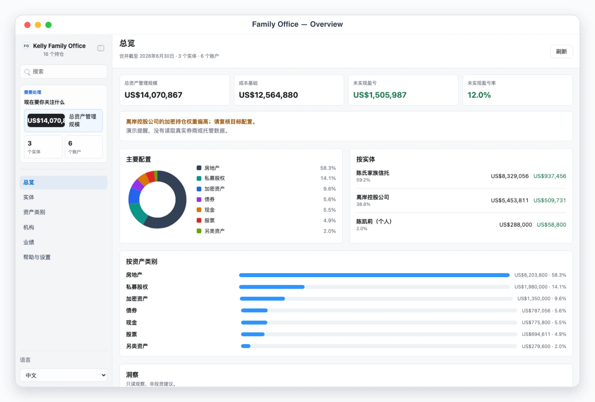</td>
    <td width="50%"></td>
  </tr>
  <tr>
    <td><strong>总览</strong><br>合并操作台，显示以基准货币计的总 AUM、未实现盈亏、主体和账户数量，以及总体配置。</td>
    <td><strong>按主体/成员</strong><br>每个家族主体（个人、信托、公司）及其合并 AUM、组合权重和未实现盈亏。</td>
  </tr>
  <tr>
    <td></td>
    <td></td>
  </tr>
  <tr>
    <td><strong>按资产类别</strong><br>股票、债券、现金、加密、房地产、私募股权和另类资产的配置，含环形图、权重条和数值表。</td>
    <td><strong>按账户/机构</strong><br>按托管机构和券商合并，查看资产存放位置以及在各银行和券商之间的集中度。</td>
  </tr>
  <tr>
    <td></td>
    <td></td>
  </tr>
  <tr>
    <td><strong>业绩</strong><br>以基准货币计的成本与市值对比及未实现盈亏，按主体和整个家族办公室汇总。</td>
    <td></td>
  </tr>
</table>

### `kelly-family-fund`

Kelly Family Fund 是一个本地、只读的家庭统筹基金台账：把两位老人的退休金汇入一个由管理人统一记账的基金，支付养老院固定费用，并把结余——交通、聚餐、生日礼物、人情——公平地分摊到各兄弟姐妹家庭，让记账本身成为公平的保证。演示模式展示一个六个月、人民币计价的基金，不含真实账户数据。

<table>
  <tr>
    <td width="50%">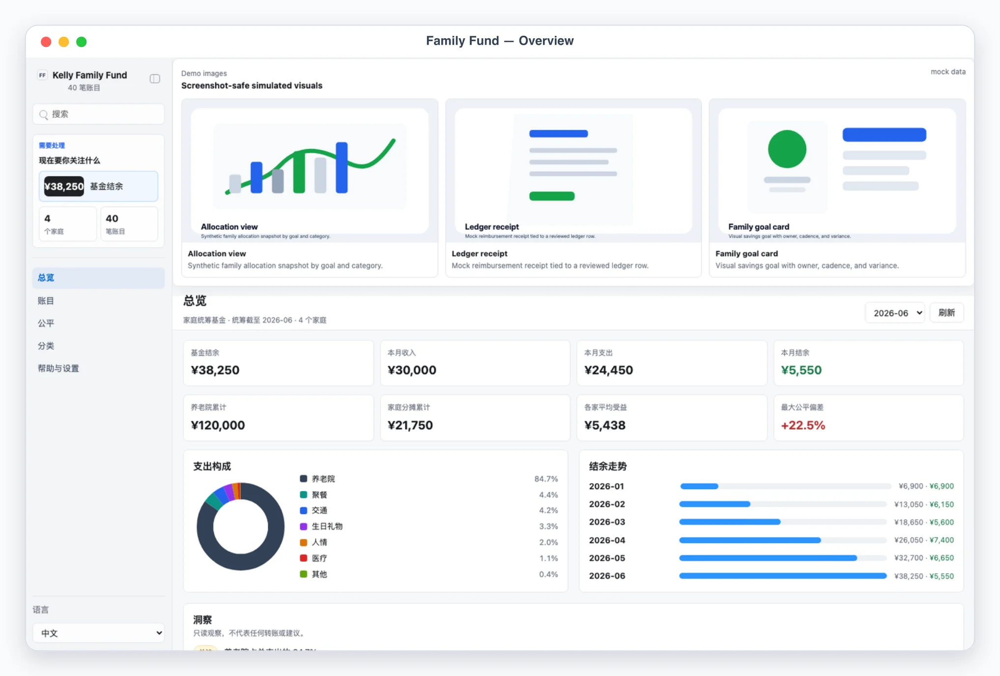</td>
    <td width="50%"></td>
  </tr>
  <tr>
    <td><strong>总览</strong><br>基金结余、本月收入/支出/结余、养老院与家庭分摊累计、支出构成环形图、结余走势，以及只读洞察。</td>
    <td><strong>账目</strong><br>按月的收支统一时间线，每笔标注分类和受益的兄弟姐妹家庭。</td>
  </tr>
  <tr>
    <td></td>
    <td></td>
  </tr>
  <tr>
    <td><strong>家庭公平</strong><br>每个兄弟姐妹家庭的累计受益、占比和相对平均的偏差——养老院不计入、共享支出按家庭均分——谁都能核对是否均衡。</td>
    <td><strong>按分类</strong><br>养老院、交通、聚餐、礼物、人情等各项支出，以及养老院与家庭的占比拆分。</td>
  </tr>
</table>

### `kelly-writer`

<table>
  <tr>
    <td width="50%"></td>
    <td width="50%">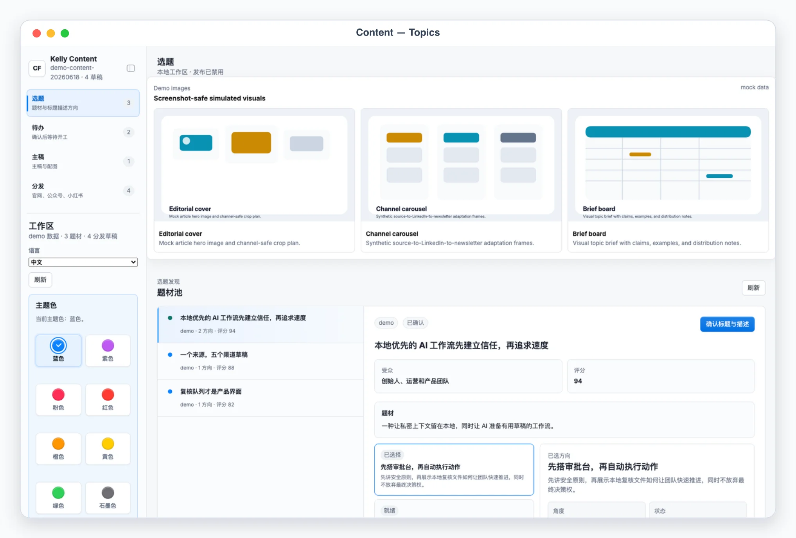</td>
  </tr>
  <tr>
    <td><strong>Todo 队列</strong><br>已确认的内容方向排队等待 AI 写作，显示 owner、状态和下一步。</td>
    <td><strong>选题发现</strong><br>Mock 编辑策划视图，展示关键词 cluster、受众匹配和选题机会。</td>
  </tr>
  <tr>
    <td width="50%">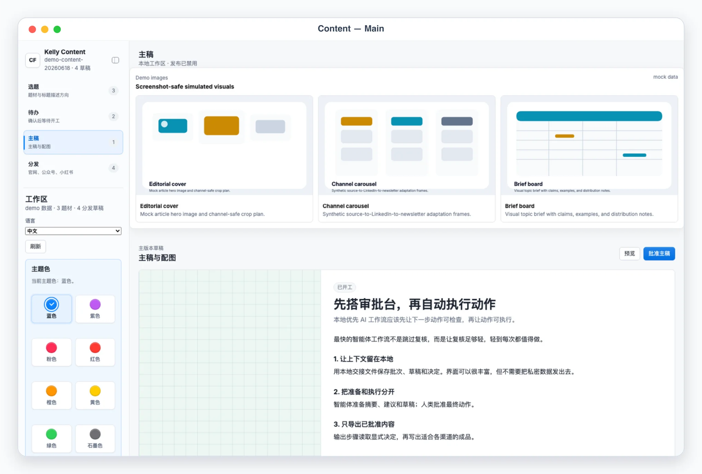</td>
    <td width="50%"></td>
  </tr>
  <tr>
    <td><strong>主文草稿</strong><br>长文写作工作台，包含 outline、草稿段落、来源 notes 和批准状态。</td>
    <td><strong>分发 review</strong><br>发布、社交 snippet、newsletter framing 和最终检查的 channel handoff 视图。</td>
  </tr>
</table>

### `kelly-pr-review`

<table>
  <tr>
    <td width="50%"></td>
    <td width="50%"></td>
  </tr>
  <tr>
    <td><strong>总览</strong><br>PR review desk，包含 repo 筛选、状态计数和 reviewer 配置。</td>
    <td><strong>需要 review</strong><br>Mock PR review，展示 findings、confidence、测试 notes 和建议动作。</td>
  </tr>
  <tr>
    <td width="50%">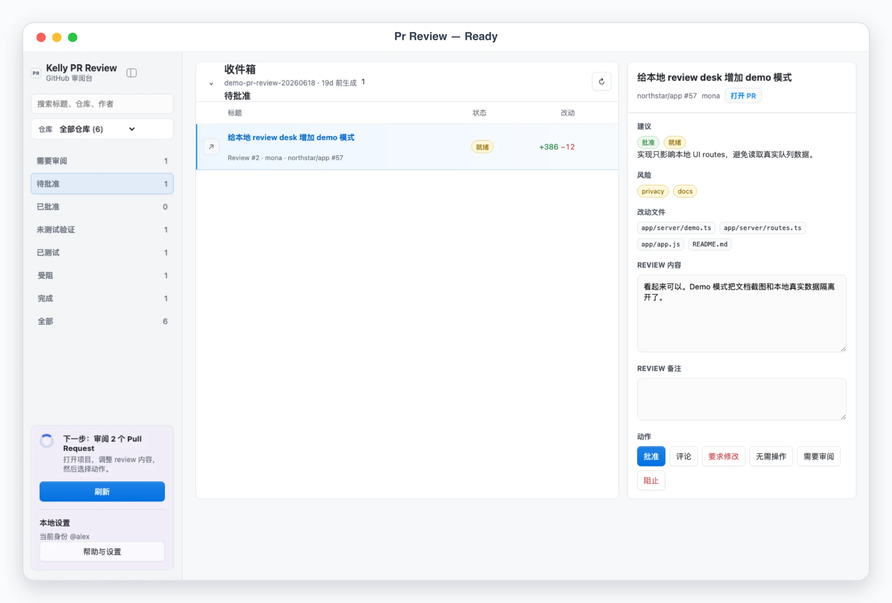</td>
    <td width="50%">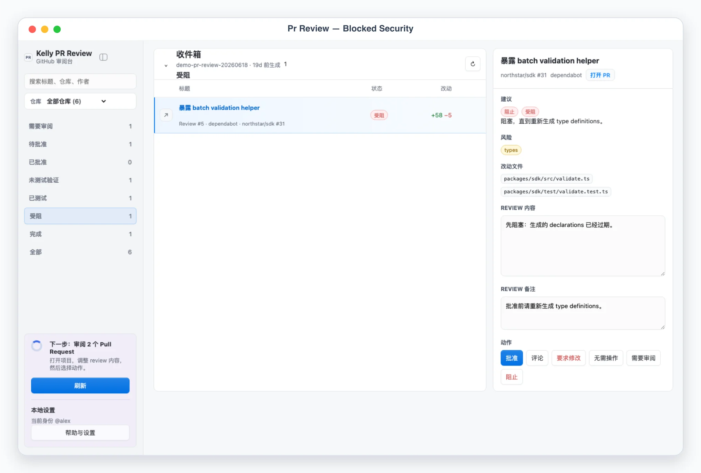</td>
  </tr>
  <tr>
    <td><strong>可以批准</strong><br>检查通过、最终建议可发送的 approval 场景。</td>
    <td><strong>阻止 review</strong><br>有安全/质量风险未解决时，展示 blocking rationale 和 handoff 信息。</td>
  </tr>
  <tr>
    <td width="50%">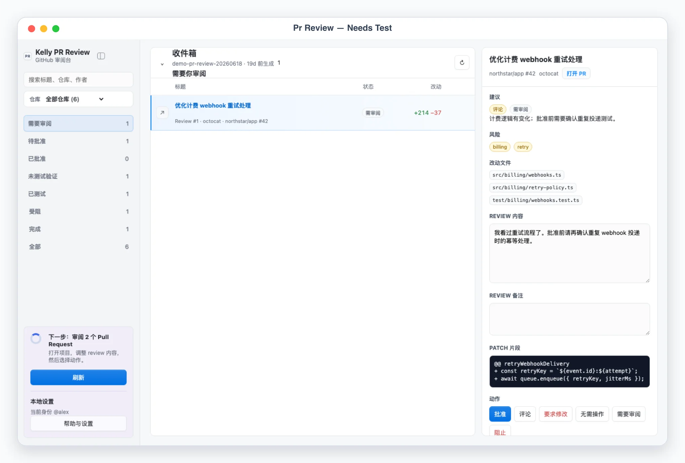</td>
    <td width="50%">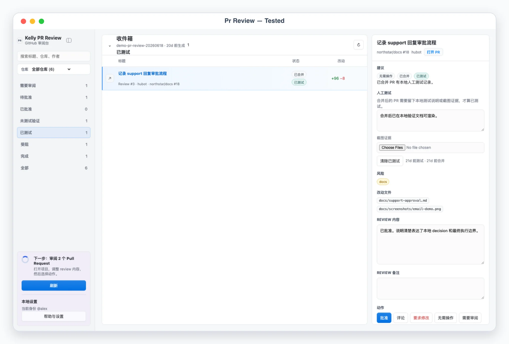</td>
  </tr>
  <tr>
    <td><strong>需要测试</strong><br>已 merge PR 等待人工验证，需要测试 note 或截图证据。</td>
    <td><strong>已测试</strong><br>Post-merge 验证记录，展示本地测试说明。</td>
  </tr>
</table>

### `kelly-drama`

<table>
  <tr>
    <td width="50%"></td>
    <td width="50%">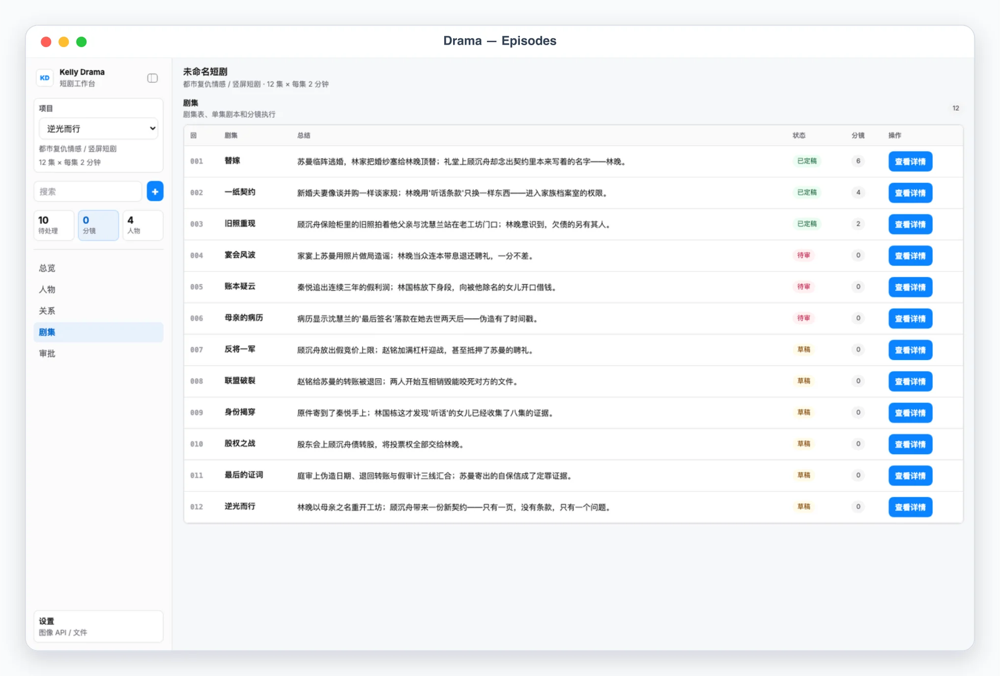</td>
  </tr>
  <tr>
    <td><strong>总览</strong><br>短剧系列工作台，包含健康度 dashboard、执行时间线、统计和系列设置。</td>
    <td><strong>分集表</strong><br>分集列表展示剧本和 storyboard 状态、镜头准备度和分集详情。</td>
  </tr>
  <tr>
    <td width="50%"></td>
    <td width="50%"></td>
  </tr>
  <tr>
    <td><strong>角色库</strong><br>角色列表显示三视图状态、演员设定、服装和声音预览控制。</td>
    <td><strong>关系图</strong><br>角色关系视图，展示权力动态、证据链接和关系详情。</td>
  </tr>
</table>

### `kelly-mv`

<table>
  <tr>
    <td width="50%">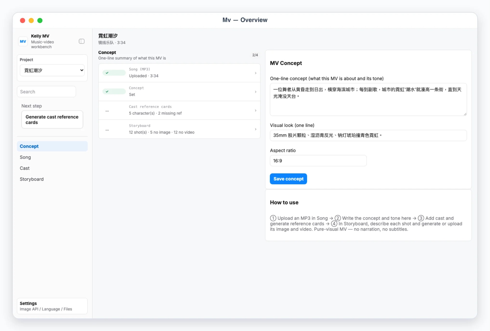</td>
    <td width="50%">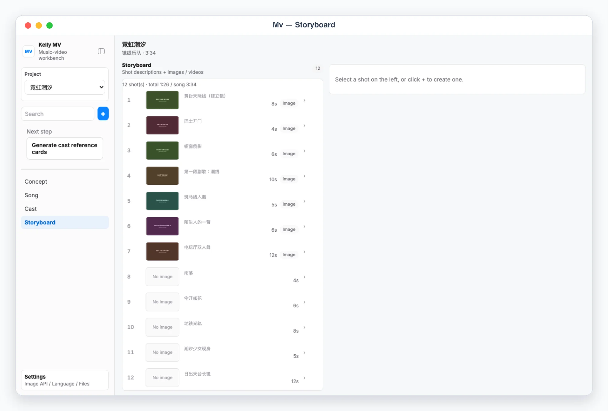</td>
  </tr>
  <tr>
    <td><strong>概念</strong><br>MV 概念工作台，包含项目 checklist、下一步指引、概念表单和 walkthrough。</td>
    <td><strong>分镜</strong><br>镜头列表显示时长、图片状态，以及描述、图片生成和视频上传详情。</td>
  </tr>
  <tr>
    <td width="50%">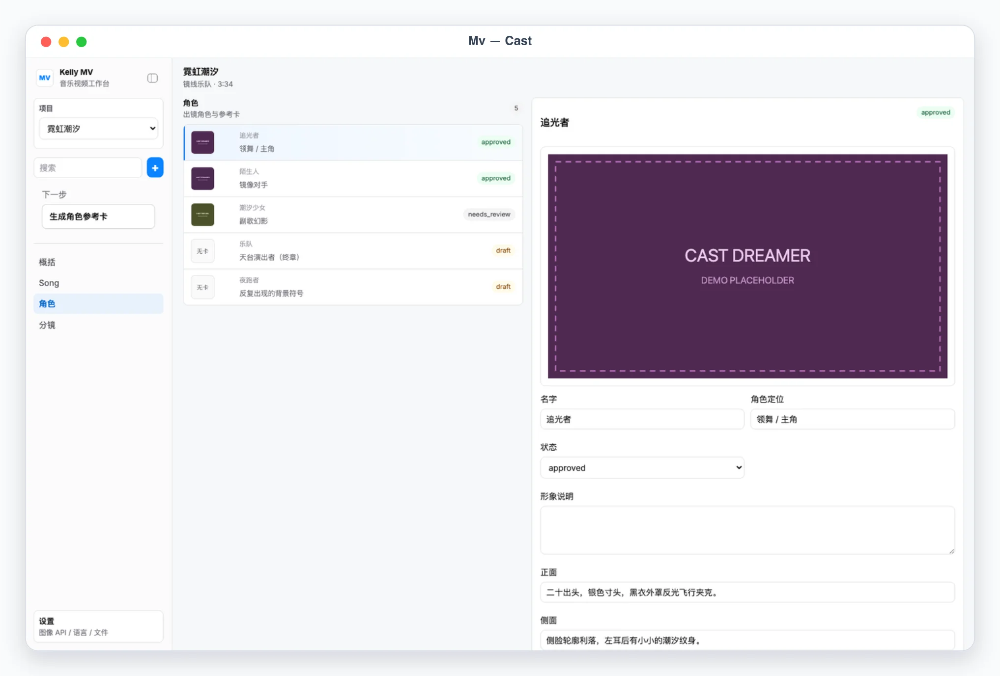</td>
    <td width="50%">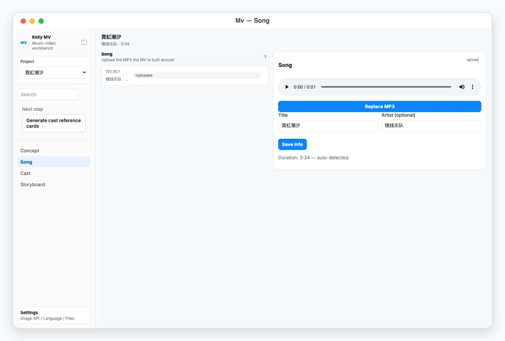</td>
  </tr>
  <tr>
    <td><strong>角色</strong><br>角色列表和参考卡状态，支持视觉描述、服装和一致性锚点。</td>
    <td><strong>歌曲</strong><br>MP3 上传和歌曲信息表单，展示时长识别和 song-gen backend 状态。</td>
  </tr>
</table>

### `kelly-digital-human`

数字人方案台：先用 2D 服务快速做可信 demo，再决定是否投入 UE/Unity 3D 定制资产。

<table>
  <tr>
    <td width="50%">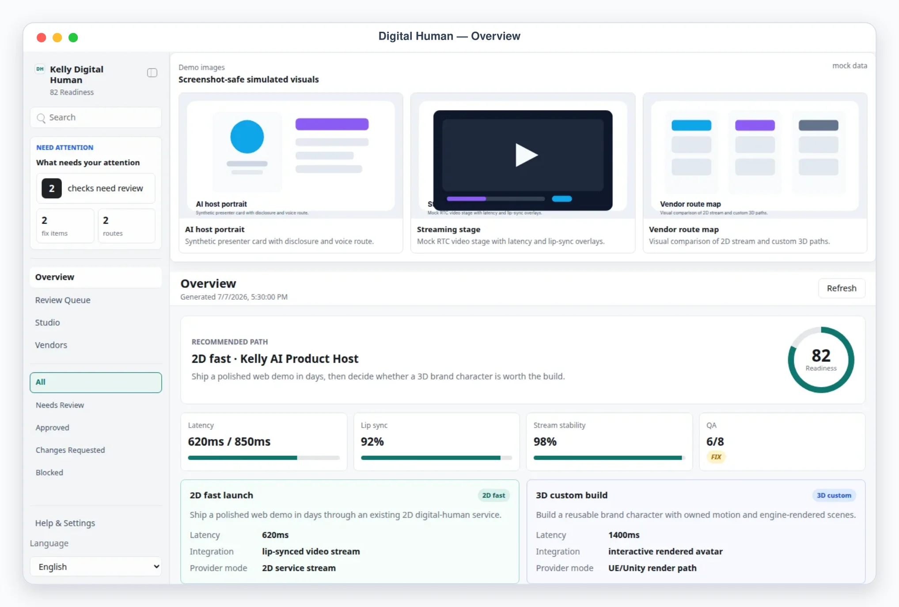</td>
    <td width="50%"></td>
  </tr>
  <tr>
    <td><strong>方案总览</strong><br>并排展示 2D 快上线与 3D 定制两条路径，带就绪度、延迟目标和上线阻塞项。</td>
    <td><strong>多模态 Studio</strong><br>动画数字人视频流，展示口型、音频波形、字幕、服务模式、链路延迟和流事件。</td>
  </tr>
  <tr>
    <td width="50%">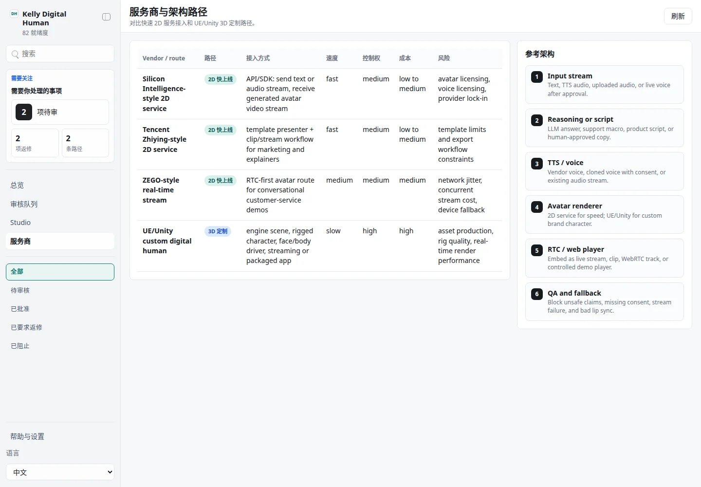</td>
    <td width="50%"></td>
  </tr>
  <tr>
    <td><strong>服务商与架构台</strong><br>对比 2D 服务接入、实时 RTC 渲染和 UE/Unity 3D 架构的成本、速度和控制权。</td>
    <td><strong>上线 QA 门</strong><br>上线前检查唇形、流延迟、授权同意、脚本安全、降级策略和生产交接状态。</td>
  </tr>
</table>

### `kelly-crm`

<table>
  <tr>
    <td width="50%"></td>
    <td width="50%"></td>
  </tr>
  <tr>
    <td><strong>总览</strong><br>CRM 操作台：分阶段 pipeline 金额、到期跟进、近期互动和人脉统计。</td>
    <td><strong>交易</strong><br>跨阶段的 pipeline 表格，包含金额、概率、下一步和每笔交易的互动时间线。</td>
  </tr>
  <tr>
    <td width="50%"></td>
    <td width="50%">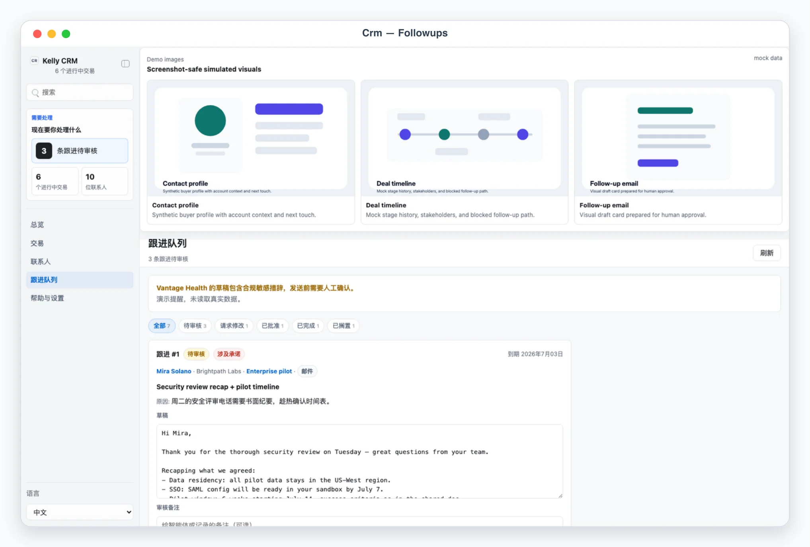</td>
  </tr>
  <tr>
    <td><strong>联系人</strong><br>联系人列表：关系强度、最近接触，以及每个联系人的互动历史和进行中交易。</td>
    <td><strong>跟进队列</strong><br>Agent 起草的跟进消息，带可编辑草稿、风险标记和批准/请求修改/搁置决定。</td>
  </tr>
</table>

### `kelly-messenger`

<table>
  <tr>
    <td width="50%">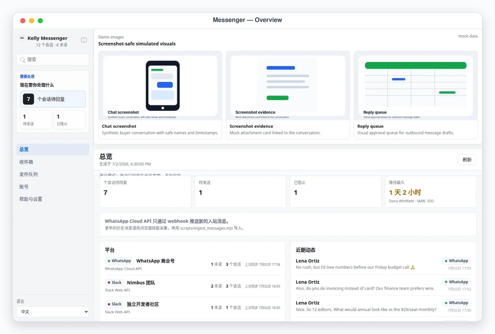</td>
    <td width="50%">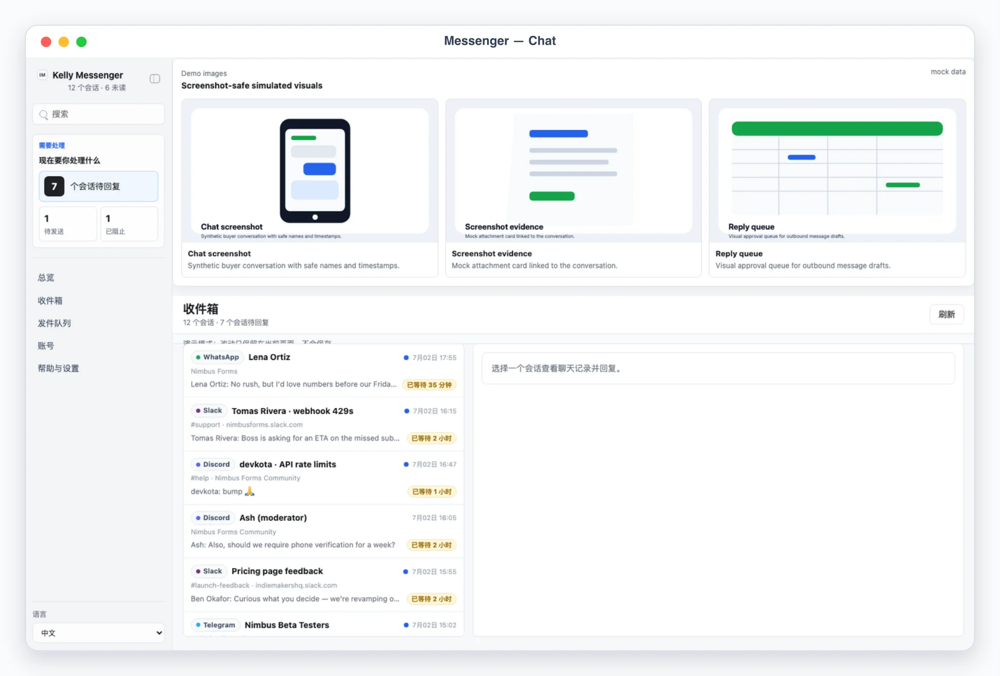</td>
  </tr>
  <tr>
    <td><strong>总览</strong><br>消息操作台：待回复决定计数、各平台同步状态和最久等待指示。</td>
    <td><strong>会话</strong><br>聊天记录视图，composer 预填 agent 建议回复，可直接编辑后进入队列。</td>
  </tr>
  <tr>
    <td width="50%"></td>
    <td width="50%"></td>
  </tr>
  <tr>
    <td><strong>统一收件箱</strong><br>WhatsApp、Slack、Discord、Telegram 的会话按最新活动排序，带等待时长标记。</td>
    <td><strong>回复 outbox</strong><br>外发回复的审批队列：每条消息先经人工批准，再由 agent 通过平台连接器发送。</td>
  </tr>
  <tr>
    <td width="50%"></td>
  </tr>
  <tr>
    <td><strong>账户</strong><br>已连接的消息账户（WhatsApp、Telegram），含连接器状态与密钥就绪情况。</td>
  </tr>
</table>

### `kelly-social`

<table>
  <tr>
    <td width="50%">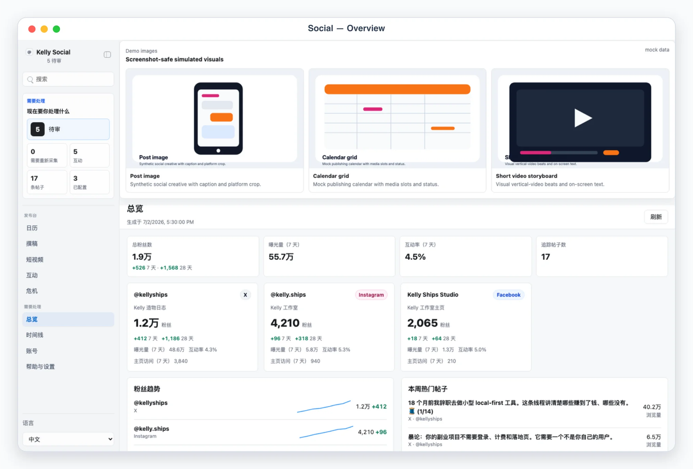</td>
    <td width="50%">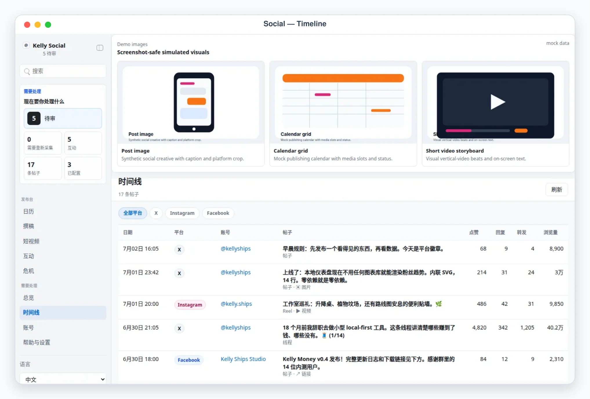</td>
  </tr>
  <tr>
    <td><strong>总览</strong><br>X、Instagram、Facebook 的跨平台 KPI 卡片，带粉丝趋势和本周热门帖子。</td>
    <td><strong>统一时间线</strong><br>所有平台的帖子在一条流里，带每帖点赞、回复、转发和浏览数据。</td>
  </tr>
  <tr>
    <td width="50%">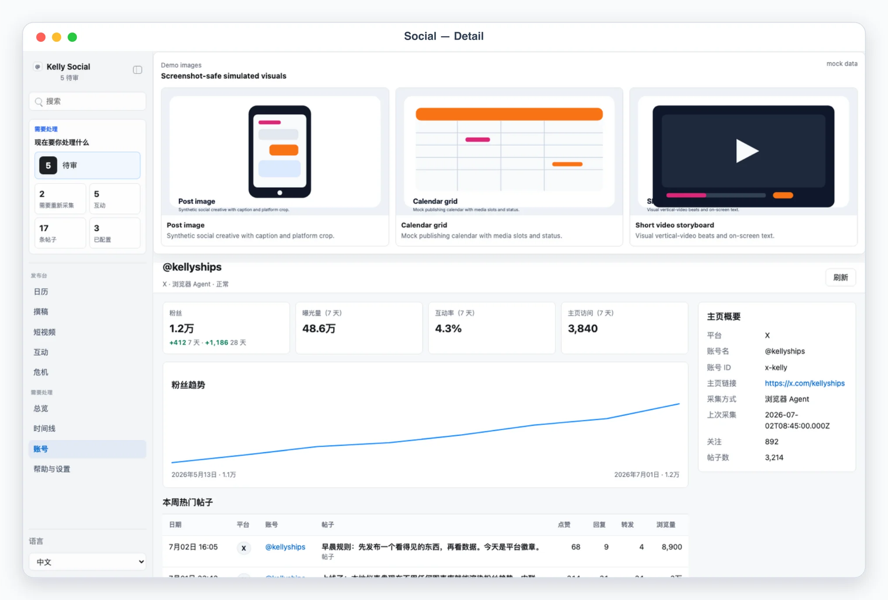</td>
    <td width="50%">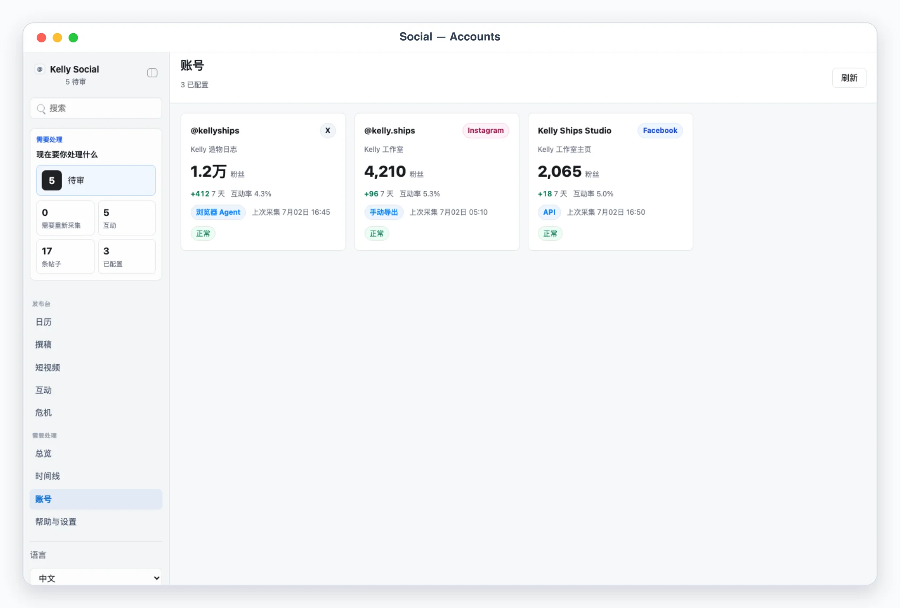</td>
  </tr>
  <tr>
    <td><strong>详情</strong><br>Kelly social 的 详情 场景截图。</td>
    <td><strong>账户</strong><br>Kelly social 的 账户 场景截图。</td>
  </tr>
  <tr>
    <td width="50%">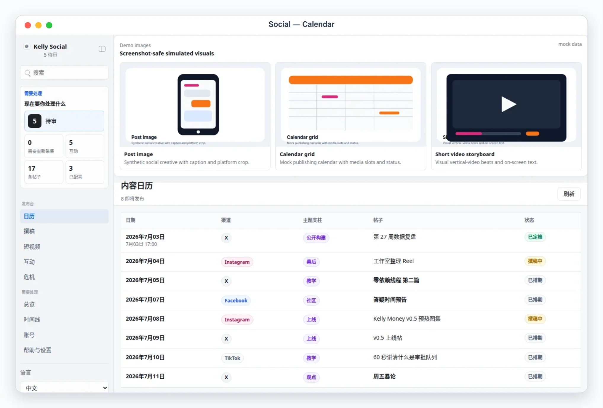</td>
    <td width="50%">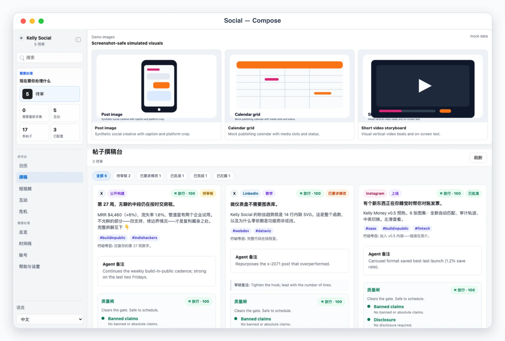</td>
  </tr>
  <tr>
    <td><strong>内容日历</strong><br>跨渠道按主题支柱和日期排期的帖子，带状态和审批。</td>
    <td><strong>成稿（发布）</strong><br>agent 起草的帖子审批队列，带 hook、话题标签和 CTA，背后有 social-qa 的 SHIP/FIX/BLOCK 门——一条因违禁宣称被 BLOCK。</td>
  </tr>
  <tr>
    <td width="50%">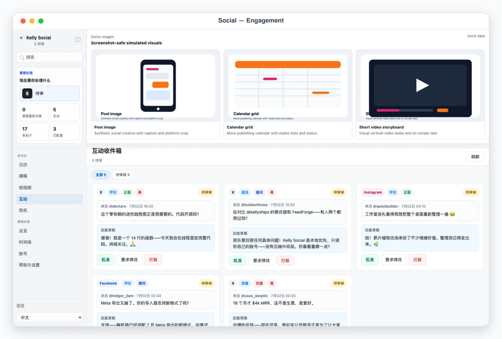</td>
  </tr>
  <tr>
    <td><strong>互动</strong><br>Kelly social 的 互动 场景截图。</td>
  </tr>
  <tr>
    <td width="50%"></td>
    <td width="50%"></td>
  </tr>
  <tr>
    <td><strong>短视频脚本</strong><br>面向 Instagram/TikTok/YouTube 的短视频脚本队列，含钩子、分镜与审批状态。</td>
    <td><strong>危机预案</strong><br>事件状态板，含分级处置步骤、暂停发布控制与发言人指定。</td>
  </tr>
</table>

### `kelly-support`

客服台——基于知识库起草回复 + SLA/CSAT + support-qa 门。访客聊天挂件作为文档化的未来扩展。

<table>
  <tr>
    <td width="50%"></td>
    <td width="50%">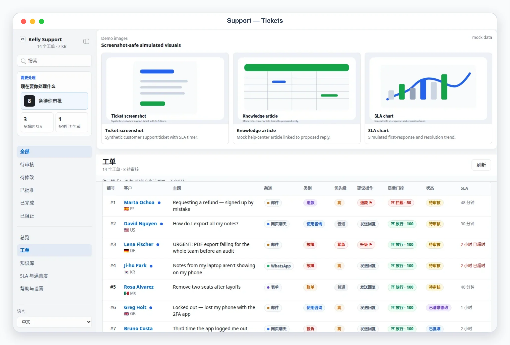</td>
  </tr>
  <tr>
    <td><strong>总览</strong><br>队列健康度——待处理、SLA 超时、待审批数量，CSAT 趋势，以及按渠道和分类的量。</td>
    <td><strong>工单</strong><br>审批队列，带基于知识库的草稿回复和 support-qa 门——一条退款草稿待人工批准前被 BLOCK。</td>
  </tr>
  <tr>
    <td></td>
    <td>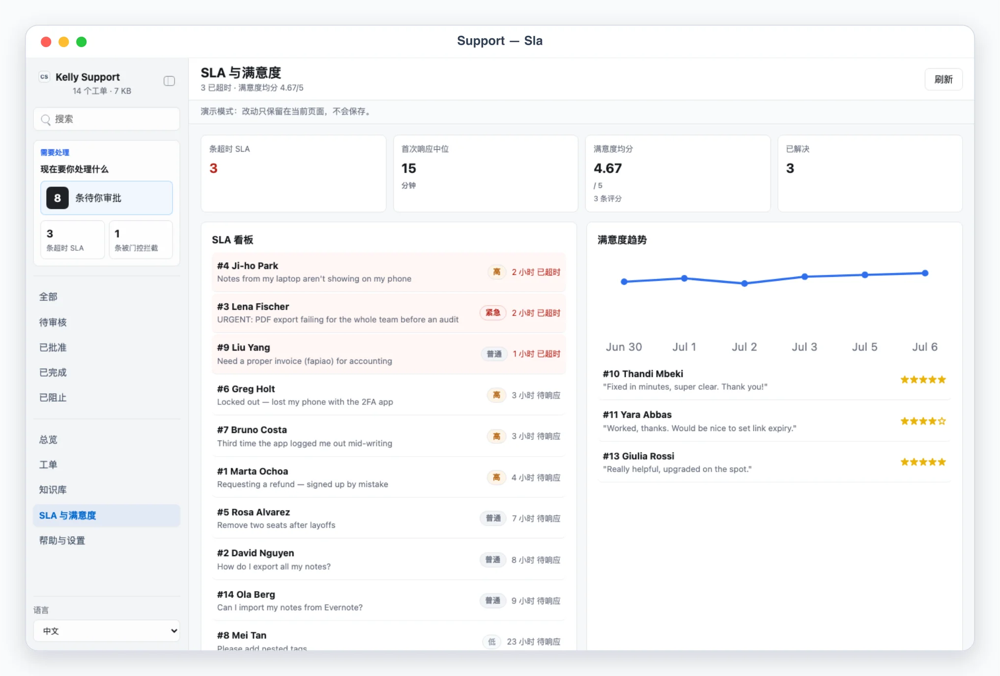</td>
  </tr>
  <tr>
    <td><strong>知识库</strong><br>agent 起草回复时引用的文章和常用话术宏。</td>
    <td><strong>SLA & CSAT</strong><br>待处理和超时工单的 SLA 看板，以及已解决工单的 CSAT 分。</td>
  </tr>
</table>

### `kelly-seo`

<table>
  <tr>
    <td width="50%">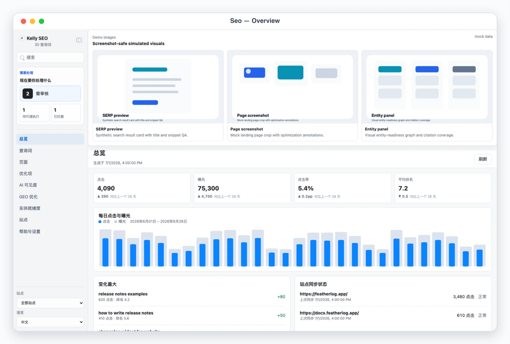</td>
    <td width="50%"></td>
  </tr>
  <tr>
    <td><strong>总览</strong><br>Search Console KPI 卡片、每日点击/曝光图表、Top movers 和各站点同步状态。</td>
    <td><strong>查询</strong><br>Top 查询表：点击、曝光、CTR、排名、周期变化和机会标记。</td>
  </tr>
  <tr>
    <td width="50%">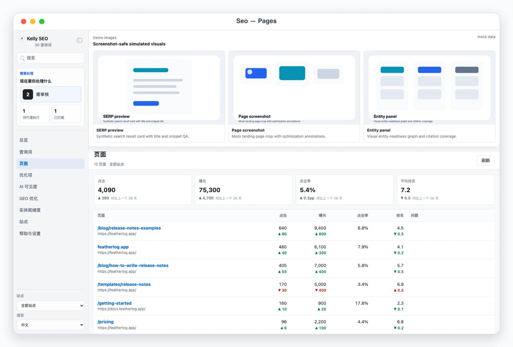</td>
    <td width="50%"></td>
  </tr>
  <tr>
    <td><strong>页面</strong><br>Kelly seo 的 页面 场景截图。</td>
    <td><strong>优化机会</strong><br>Kelly seo 的 优化机会 场景截图。</td>
  </tr>
  <tr>
    <td width="50%">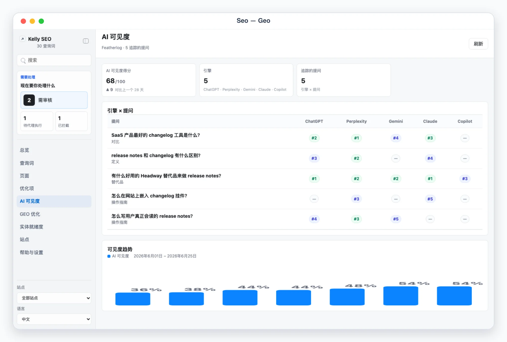</td>
    <td width="50%">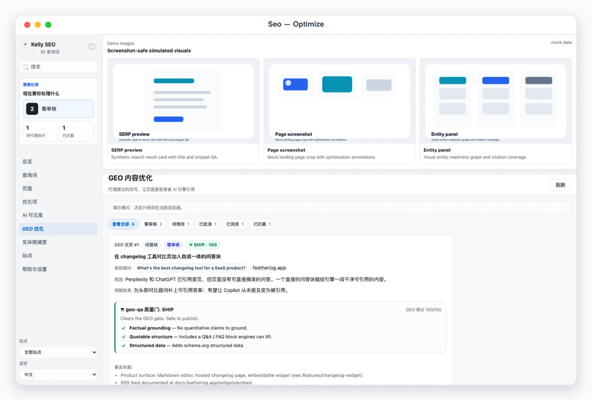</td>
  </tr>
  <tr>
    <td><strong>AI 可见度（GEO）</strong><br>引擎×prompt 矩阵：品牌在 ChatGPT、Perplexity、Gemini、Claude、Copilot 的被引用情况，带总可见度分和趋势。</td>
    <td><strong>GEO 优化</strong><br>agent 提出让页面更易被 AI 引擎引用的改写，由 geo-qa 把关——一条因编造统计被 BLOCK。</td>
  </tr>
  <tr>
    <td width="50%">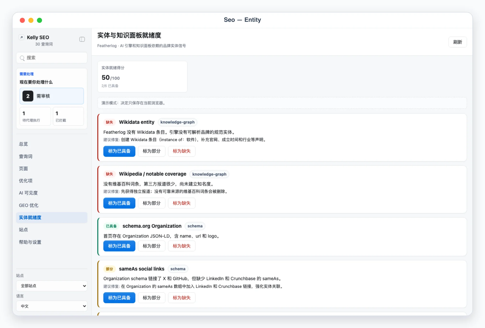</td>
  </tr>
  <tr>
    <td><strong>实体就绪度</strong><br>Kelly seo 的 实体就绪度 场景截图。</td>
  </tr>
  <tr>
    <td width="50%"></td>
  </tr>
  <tr>
    <td><strong>站点</strong><br>已配置的 Search Console 属性，含验证方式、上次同步与 28 天点击/曝光汇总。</td>
  </tr>
</table>

### `kelly-feedback`

<table>
  <tr>
    <td width="50%">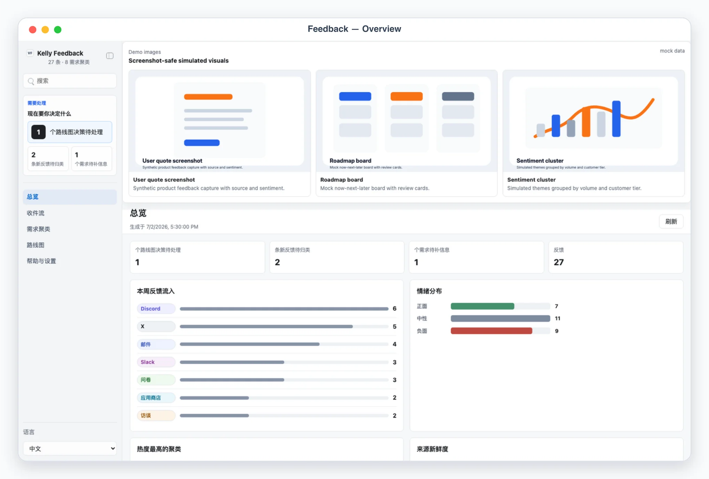</td>
    <td width="50%">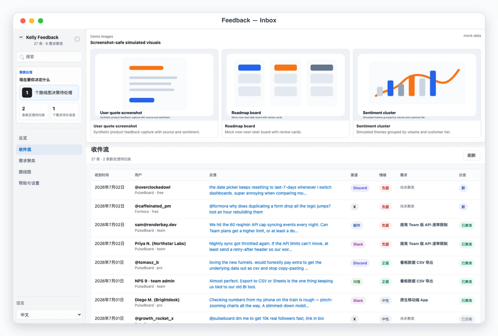</td>
  </tr>
  <tr>
    <td><strong>总览</strong><br>用户之声操作台：每周各渠道流入、情绪分布、热门聚类和来源新鲜度。</td>
    <td><strong>收件箱</strong><br>来自邮件、Discord、Slack、X 和应用商店评论的原始反馈流，带分诊控件。</td>
  </tr>
  <tr>
    <td width="50%">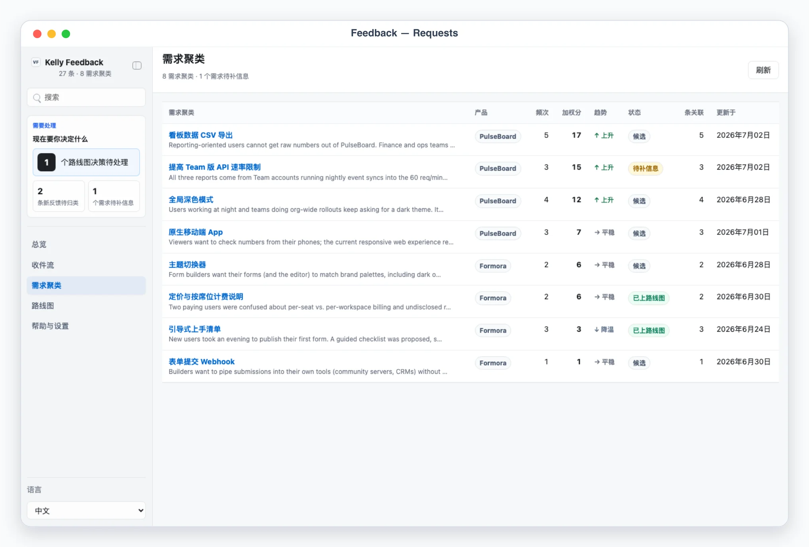</td>
    <td width="50%"></td>
  </tr>
  <tr>
    <td><strong>需求</strong><br>聚类后的 feature requests：频次、加权分数、趋势和代表性引述。</td>
    <td><strong>Roadmap 裁决</strong><br>Agent 提出的采纳/拒绝/合并提案，带 changelog 草稿和用户回复草稿供审批。</td>
  </tr>
</table>

### `kelly-radar`

<table>
  <tr>
    <td width="50%">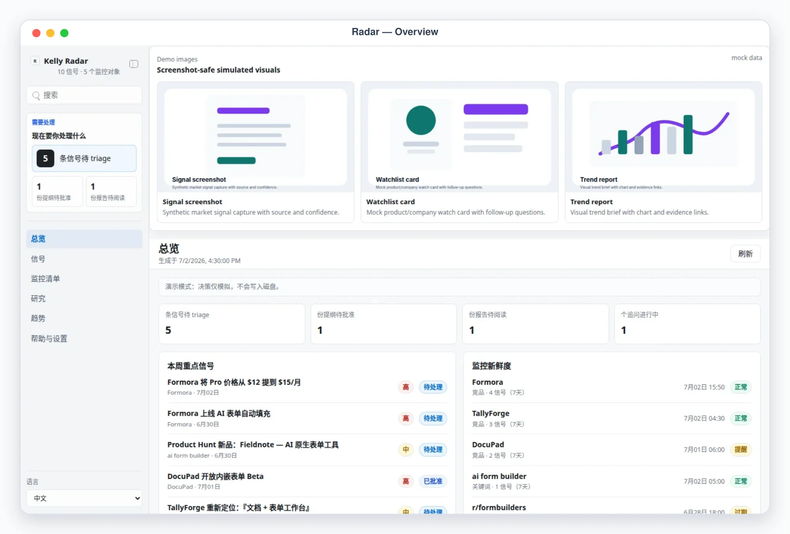</td>
    <td width="50%"></td>
  </tr>
  <tr>
    <td><strong>总览</strong><br>市场情报台：待分诊信号、watchlist 新鲜度、趋势 movers 和研究 pipeline。</td>
    <td><strong>研究台</strong><br>研究课题按 brief 审批 → 深度研究 → 引用报告的流程推进。</td>
  </tr>
  <tr>
    <td width="50%"></td>
    <td width="50%"></td>
  </tr>
  <tr>
    <td><strong>信号</strong><br>竞品定价、changelog、发布、口碑和招聘信号，带严重度标记和 Act/Watch/Ignore 分诊。</td>
    <td><strong>趋势</strong><br>上升关键词和社区话题，带动量 sparkline 和可移交内容/roadmap 的机会卡。</td>
  </tr>
  <tr>
    <td width="50%">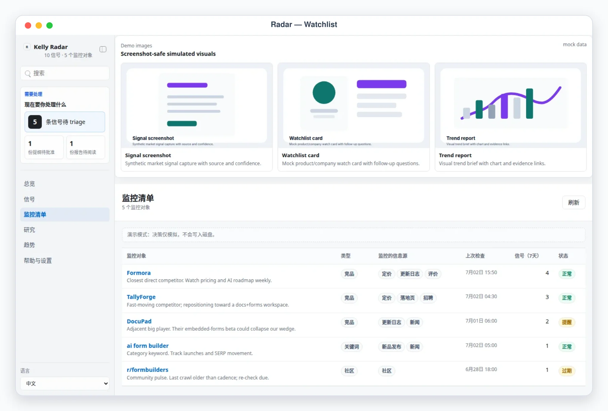</td>
  </tr>
  <tr>
    <td><strong>监测清单</strong><br>追踪的竞品及其定价/定位变化信号、复核状态与上次监测时间。</td>
  </tr>
</table>

### `kelly-ai-newsroom`

<table>
  <tr>
    <td width="50%">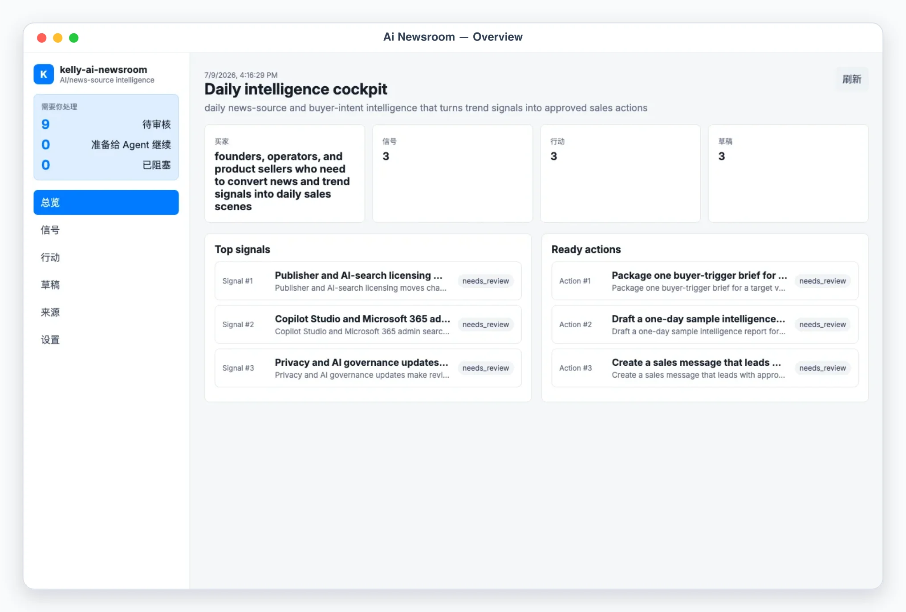</td>
    <td width="50%">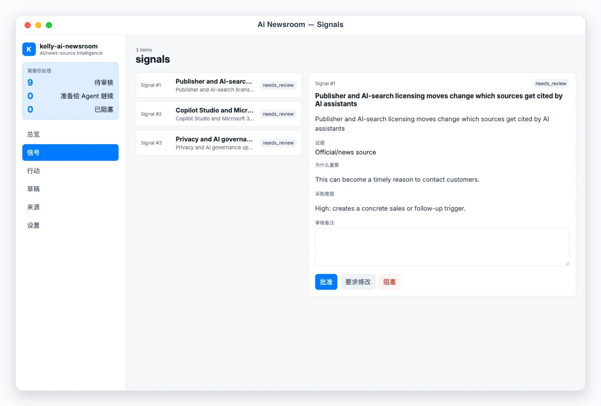</td>
  </tr>
  <tr>
    <td><strong>总览</strong><br>每日 buyer-trigger 情报台：AI/新闻源信号、已批准动作、被拦截宣称和来源覆盖。</td>
    <td><strong>信号</strong><br>把 AI、搜索和平台变化拆成采购意图或 watch-only 噪音，并保留证据链接。</td>
  </tr>
  <tr>
    <td width="50%"></td>
    <td width="50%"></td>
  </tr>
  <tr>
    <td><strong>动作</strong><br>销售和运营动作带审批状态、风险提示和下一步 handoff。</td>
    <td><strong>草稿</strong><br>销售开场白、LinkedIn 帖子和客户 memo 都先留在 review gate 后面。</td>
  </tr>
</table>

### `kelly-real-estate-intel`

<table>
  <tr>
    <td width="50%"></td>
    <td width="50%">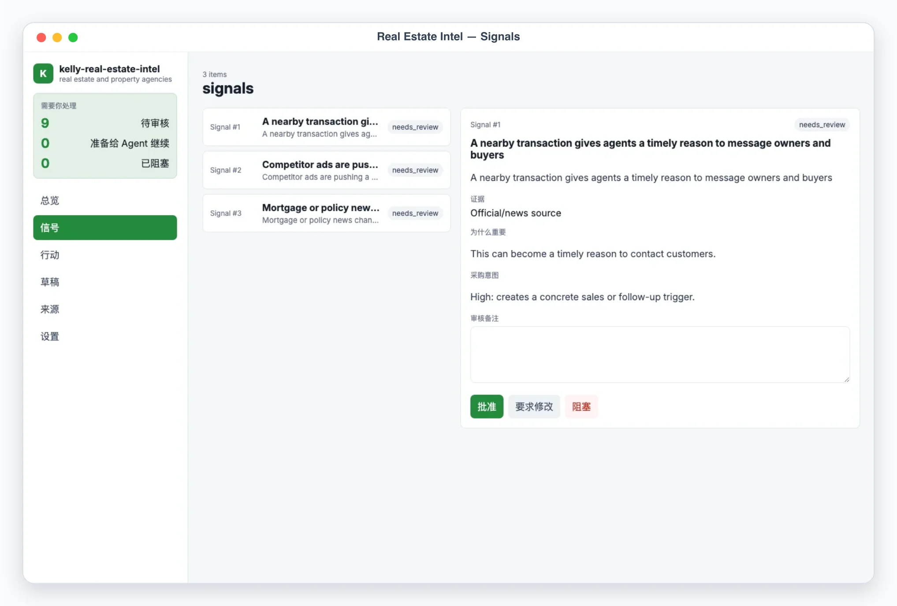</td>
  </tr>
  <tr>
    <td><strong>总览</strong><br>地产中介情报台：今日市场触发、可跟进动作、被拦截宣称和覆盖缺口。</td>
    <td><strong>信号</strong><br>房源、成交、按揭、片区和竞品广告变化，映射到买家或业主意图。</td>
  </tr>
  <tr>
    <td width="50%">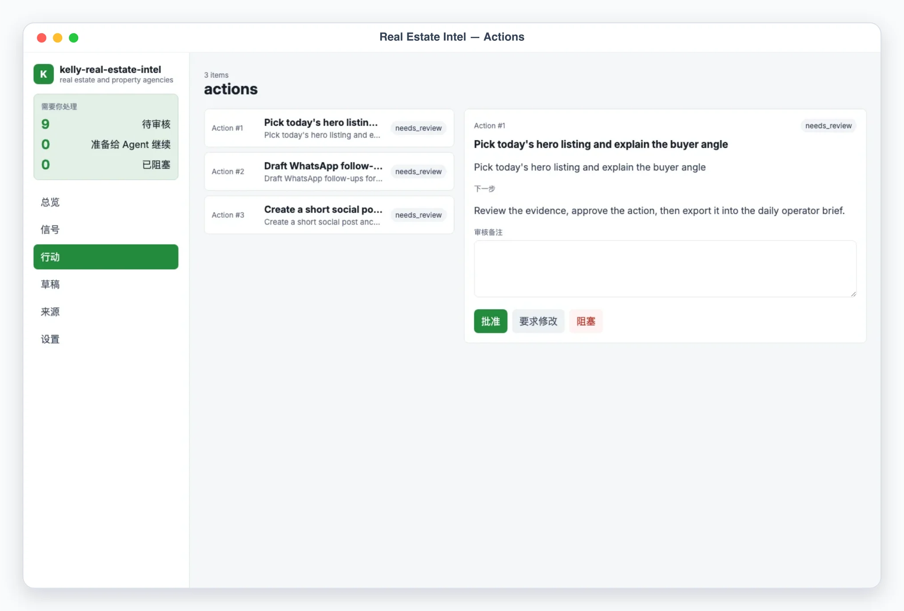</td>
    <td width="50%">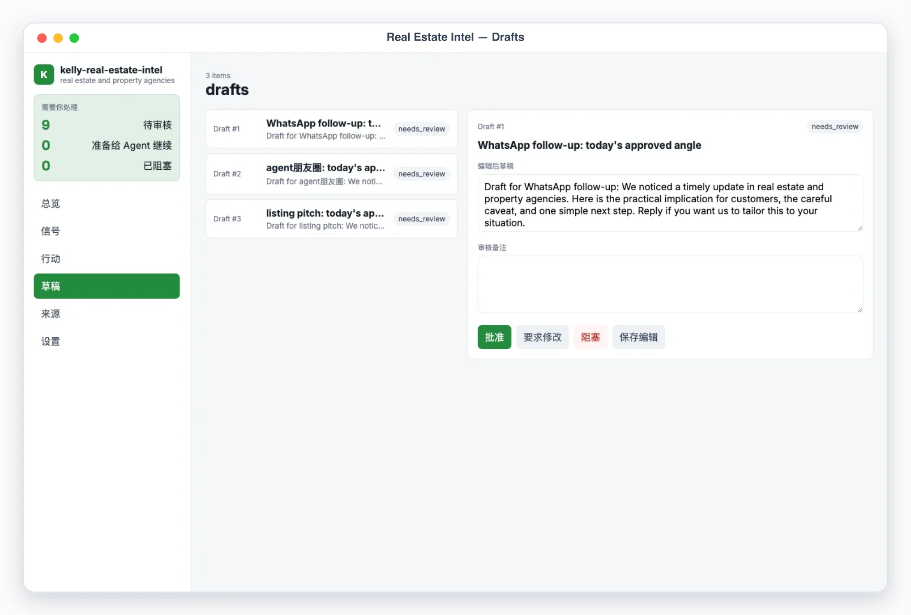</td>
  </tr>
  <tr>
    <td><strong>动作</strong><br>电话脚本、业主更新、房源卖点和开放日话术进入审批队列。</td>
    <td><strong>草稿</strong><br>可编辑客户跟进和市场 memo，带证据与审批控件。</td>
  </tr>
</table>

### `kelly-education-intel`

<table>
  <tr>
    <td width="50%"></td>
    <td width="50%"></td>
  </tr>
  <tr>
    <td><strong>总览</strong><br>教育情报台：招生触发、可执行动作、被拦截宣称和来源新鲜度。</td>
    <td><strong>信号</strong><br>考试、录取、签证、校历和家长问题，解释成具体购买焦虑。</td>
  </tr>
  <tr>
    <td width="50%"></td>
    <td width="50%"></td>
  </tr>
  <tr>
    <td><strong>动作</strong><br>家长 FAQ、讲座、顾问脚本和课程推广动作带 review 状态。</td>
    <td><strong>草稿</strong><br>家长 memo 和招生文案可编辑，并避开录取/成绩保证。</td>
  </tr>
</table>

### `kelly-beauty-intel`

<table>
  <tr>
    <td width="50%"></td>
    <td width="50%">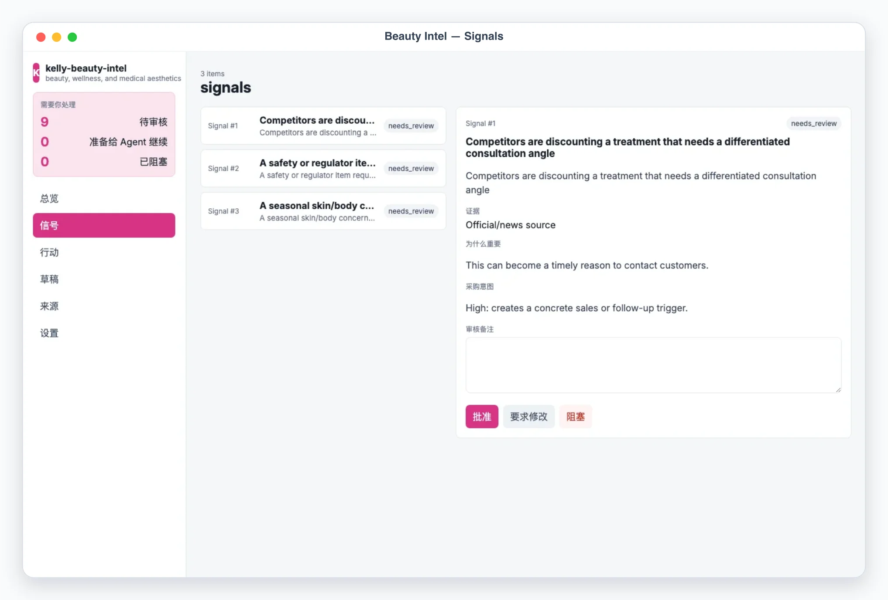</td>
  </tr>
  <tr>
    <td><strong>总览</strong><br>美容医美情报台：需求触发、可 review 动作和被拦截医疗宣称。</td>
    <td><strong>信号</strong><br>竞品套餐、项目趋势、评价、安全通知和季节需求，附风险标记。</td>
  </tr>
  <tr>
    <td width="50%"></td>
    <td width="50%">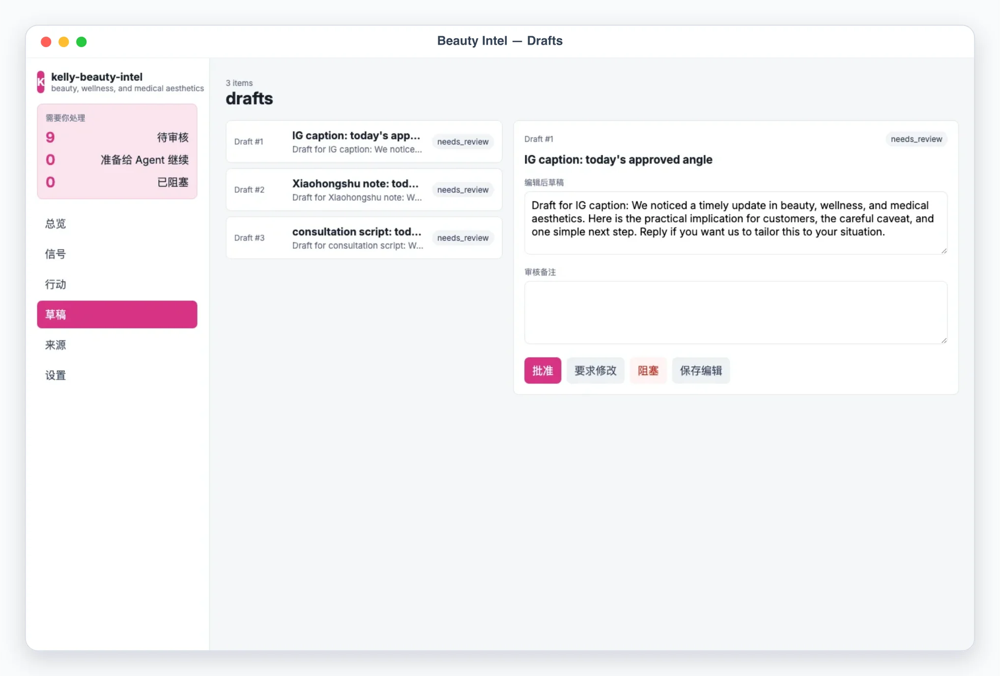</td>
  </tr>
  <tr>
    <td><strong>动作</strong><br>咨询脚本、员工话术、活动角度和评价修复动作进入审批。</td>
    <td><strong>草稿</strong><br>客户教育和促销文案先在安全宣称边界内编辑。</td>
  </tr>
</table>

### `kelly-insurance-intel`

<table>
  <tr>
    <td width="50%">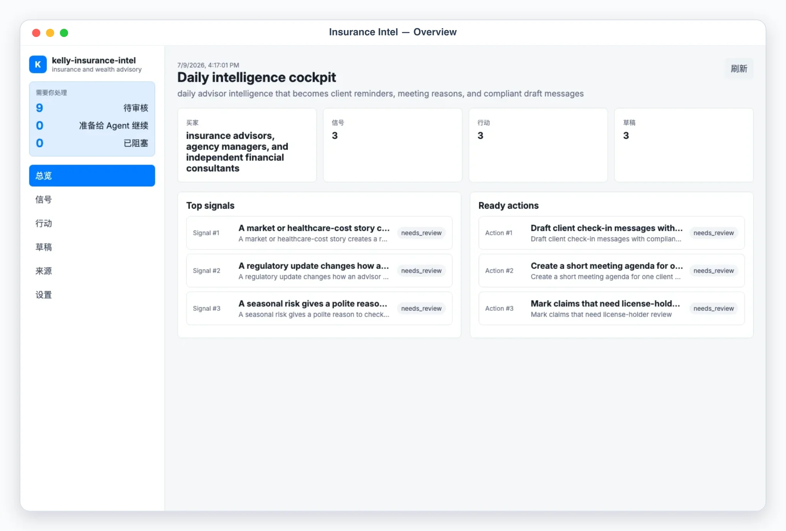</td>
    <td width="50%"></td>
  </tr>
  <tr>
    <td><strong>总览</strong><br>保险顾问情报台：保障缺口触发、续保动作、被拦截建议和来源新鲜度。</td>
    <td><strong>信号</strong><br>监管、险司、保费、权益、健康、旅行和生命周期信号，解释成 review reason。</td>
  </tr>
  <tr>
    <td width="50%">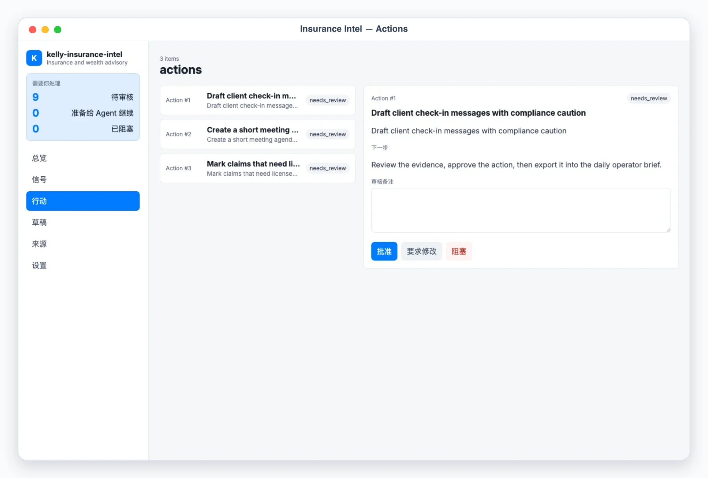</td>
    <td width="50%"></td>
  </tr>
  <tr>
    <td><strong>动作</strong><br>会议议程、续保 checklist 和客户教育任务带合规审批状态。</td>
    <td><strong>草稿</strong><br>客户教育和顾问脚本避免适配结论与收益承诺。</td>
  </tr>
</table>

### `kelly-insure-data`

<table>
  <tr>
    <td width="50%"></td>
    <td width="50%"></td>
  </tr>
  <tr>
    <td><strong>Overview</strong><br>保险数据治理总览：记录数、质量分、metadata 覆盖率和待清洗目标。</td>
    <td><strong>文件盘</strong><br>Busabase Drive node 文件列表，展示 metadata 完整度、缺失字段、来源、负责人、地区和审核状态。</td>
  </tr>
  <tr>
    <td width="50%"></td>
    <td width="50%"></td>
  </tr>
  <tr>
    <td><strong>问答</strong><br>来自 Busabase Base 的标准保险 QA 对，带来源追踪和治理警告。</td>
    <td><strong>新闻资讯</strong><br>保险新闻和市场资讯记录，展示发布方、市场、发布时间、链接和完整性检查。</td>
  </tr>
</table>

### `kelly-retail-intel`

<table>
  <tr>
    <td width="50%"></td>
    <td width="50%"></td>
  </tr>
  <tr>
    <td><strong>总览</strong><br>零售情报台：本地需求触发、主推 SKU、门店动作和被拦截承诺。</td>
    <td><strong>信号</strong><br>天气、活动、竞品促销、商品趋势和评价主题，映射到陈列决策。</td>
  </tr>
  <tr>
    <td width="50%"></td>
    <td width="50%">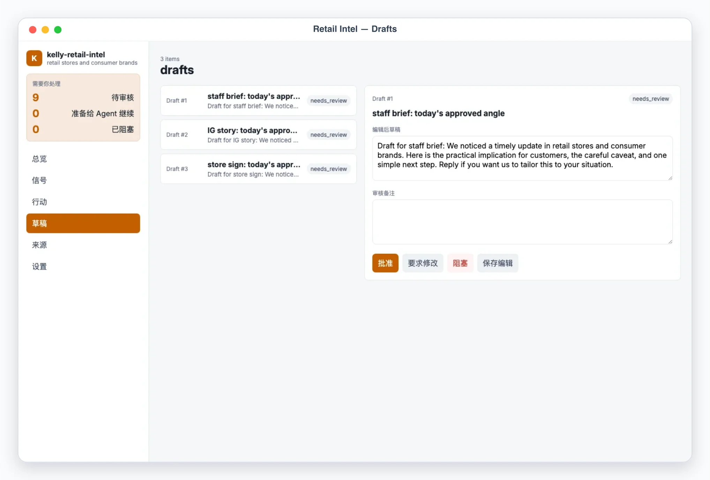</td>
  </tr>
  <tr>
    <td><strong>动作</strong><br>门店 brief、标牌、补货检查和店员脚本进入审批队列。</td>
    <td><strong>草稿</strong><br>活动、标牌和客户消息文案带本地来源上下文。</td>
  </tr>
</table>

### `kelly-ecommerce-intel`

<table>
  <tr>
    <td width="50%"></td>
    <td width="50%"></td>
  </tr>
  <tr>
    <td><strong>总览</strong><br>电商卖家情报台：SKU 触发、平台风险、可执行优化和被拦截宣称。</td>
    <td><strong>信号</strong><br>平台政策、竞品价格、排名、广告、评价和搜索意图变化。</td>
  </tr>
  <tr>
    <td width="50%"></td>
    <td width="50%"></td>
  </tr>
  <tr>
    <td><strong>动作</strong><br>Listing 修改、广告角度、组合测试和评价回复任务带审批状态。</td>
    <td><strong>草稿</strong><br>Listing、广告和客户回复文案先留在 review gate 后面。</td>
  </tr>
</table>

### `kelly-restaurant-intel`

<table>
  <tr>
    <td width="50%"></td>
    <td width="50%"></td>
  </tr>
  <tr>
    <td><strong>总览</strong><br>餐饮集团情报台：需求触发、餐段重点、可执行动作和被拦截食品安全宣称。</td>
    <td><strong>信号</strong><br>天气、活动、竞品菜单、外卖变化和评价主题，映射到运营动作。</td>
  </tr>
  <tr>
    <td width="50%"></td>
    <td width="50%">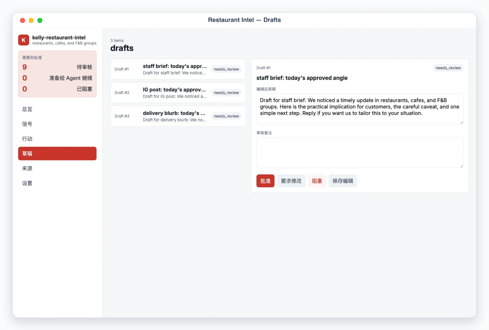</td>
  </tr>
  <tr>
    <td><strong>动作</strong><br>班次 brief、主推菜、订座话术和外卖文案动作等待审批。</td>
    <td><strong>草稿</strong><br>顾客消息、评价回复和社媒文案带菜单与安全边界。</td>
  </tr>
</table>

### `kelly-financial-services-intel`

<table>
  <tr>
    <td width="50%"></td>
    <td width="50%"></td>
  </tr>
  <tr>
    <td><strong>总览</strong><br>金融服务情报台：客户问题触发、顾问准备、被拦截建议和来源新鲜度。</td>
    <td><strong>信号</strong><br>监管、宏观、市场、组合主题和竞品变化，解释成客户关注点。</td>
  </tr>
  <tr>
    <td width="50%"></td>
    <td width="50%">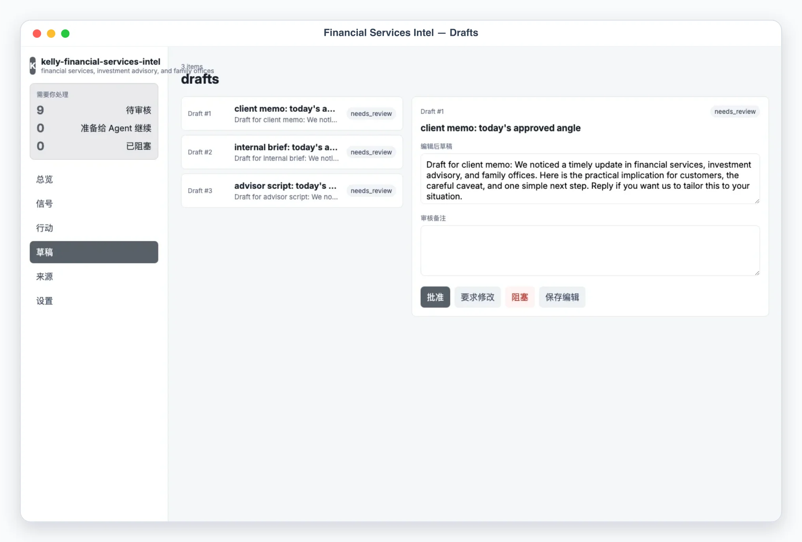</td>
  </tr>
  <tr>
    <td><strong>动作</strong><br>内部 brief、客户教育、顾问脚本和风险提醒进入审批队列。</td>
    <td><strong>草稿</strong><br>解释稿和会议 notes 可编辑，并避开个性化建议与收益承诺。</td>
  </tr>
</table>

### `kelly-devops`

<table>
  <tr>
    <td width="50%"></td>
    <td width="50%">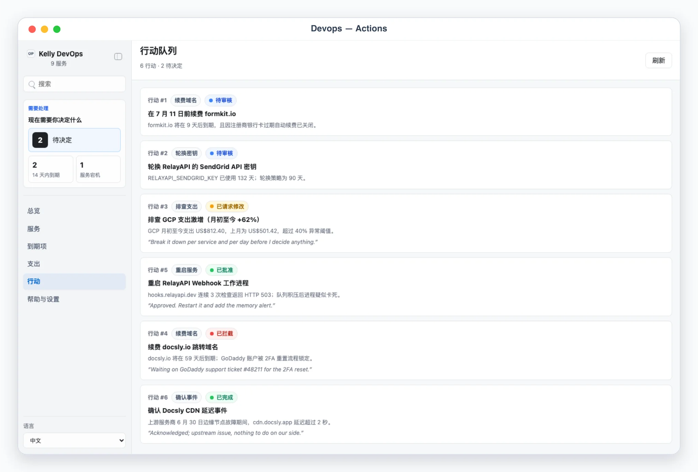</td>
  </tr>
  <tr>
    <td><strong>总览</strong><br>产品矩阵健康台：服务、证书、域名和支出摘要，以及近期事件流。</td>
    <td><strong>行动队列</strong><br>Agent 提出的续费/轮换/排查行动卡，带证据和审批控件。</td>
  </tr>
  <tr>
    <td width="50%">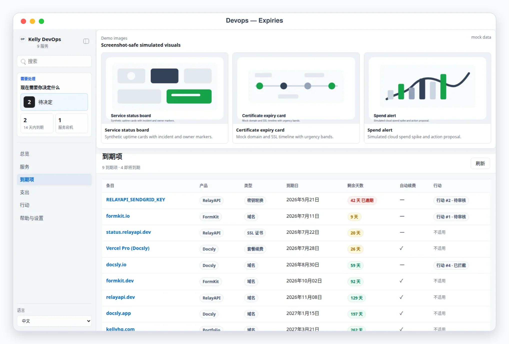</td>
    <td width="50%">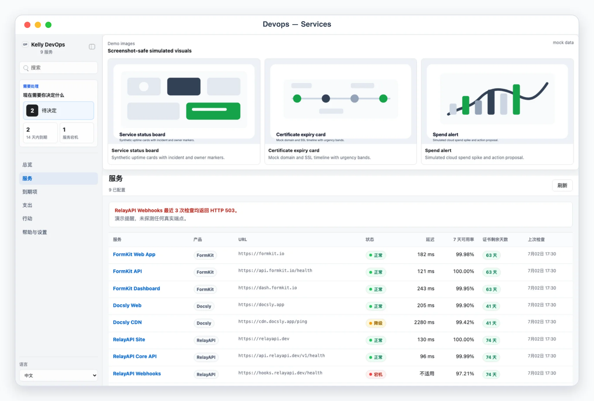</td>
  </tr>
  <tr>
    <td><strong>到期台账</strong><br>域名、SSL 证书、key 轮换和套餐续费在一张表里，按剩余天数分级着色。</td>
    <td><strong>服务</strong><br>被监控端点的可用性、延迟 sparkline、TLS 证书状态和检查历史。</td>
  </tr>
  <tr>
    <td width="50%"></td>
  </tr>
  <tr>
    <td><strong>开销</strong><br>AWS、Google Cloud、Cloudflare 的云开销，含当月累计与按产品分摊。</td>
  </tr>
</table>

### `kelly-audit`

<table>
  <tr>
    <td width="50%"></td>
    <td width="50%"></td>
  </tr>
  <tr>
    <td><strong>总览</strong><br>财务稽核台：风险金额、应收账龄条、异常复核队列预览和导入历史。</td>
    <td><strong>异常队列</strong><br>规则命中的异常，带订单-发票-回款证据链和可审批的催款邮件草稿。</td>
  </tr>
  <tr>
    <td width="50%"></td>
    <td width="50%">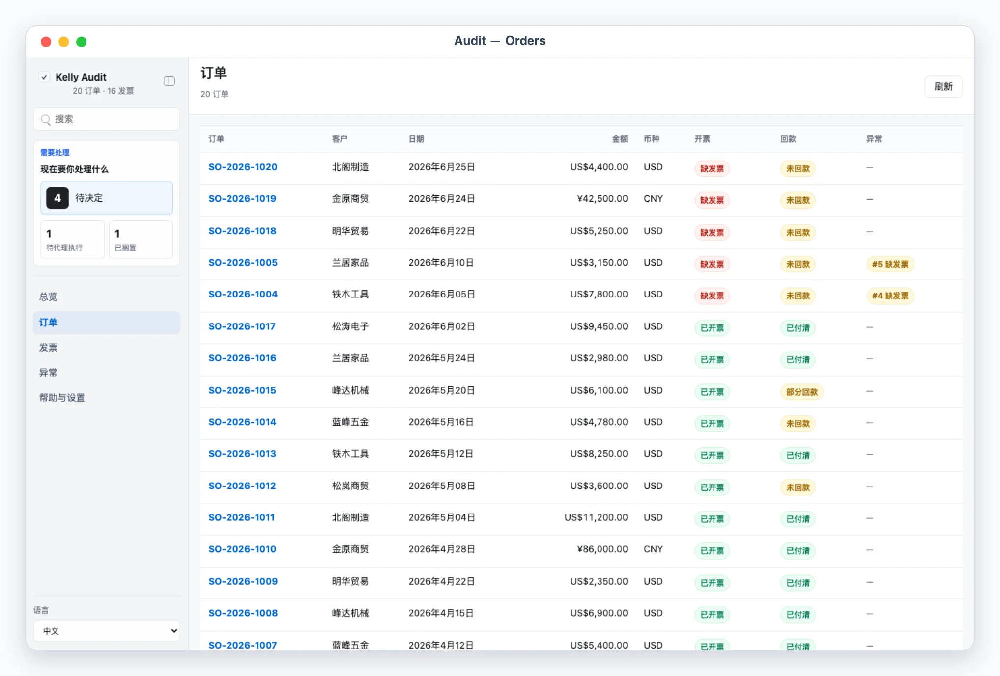</td>
  </tr>
  <tr>
    <td><strong>发票</strong><br>发票台账：到期日、已回款金额、逾期天数和匹配状态。</td>
    <td><strong>订单</strong><br>标准化订单表，带开票/回款状态标记和关联异常指示。</td>
  </tr>
</table>

### `kelly-tickets`

<table>
  <tr>
    <td width="50%"></td>
    <td width="50%">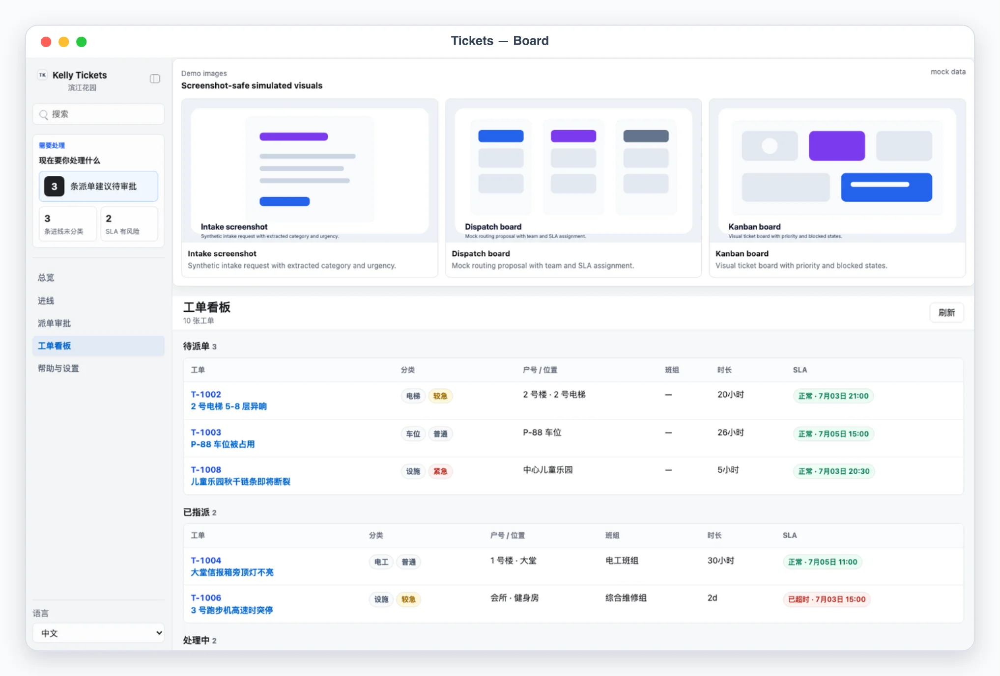</td>
  </tr>
  <tr>
    <td><strong>总览</strong><br>派单指挥台：SLA 风险、本周各渠道进线、工单分类分布和班组负载。</td>
    <td><strong>工单看板</strong><br>工单沿「未结-已派-处理中-等待-已解决」跟踪，带 SLA 指示和历史时间线。</td>
  </tr>
  <tr>
    <td width="50%"></td>
    <td width="50%"></td>
  </tr>
  <tr>
    <td><strong>派单审批</strong><br>Agent 提出的班组指派：优先级、SLA 目标、派单理由和给班组的可编辑备注。</td>
    <td><strong>进线</strong><br>微信、电话、表单、邮件的原始投诉，带分类字段和转工单控件。</td>
  </tr>
</table>

### `kelly-lesson`

<table>
  <tr>
    <td width="50%"></td>
    <td width="50%"></td>
  </tr>
  <tr>
    <td><strong>总览</strong><br>教学质量台：合规通过率、年级×学科覆盖、教师概览和审核队列。</td>
    <td><strong>审核队列</strong><br>教案提交带合规摘要、智能体修改建议和给教师的反馈草稿，供审批。</td>
  </tr>
  <tr>
    <td width="50%">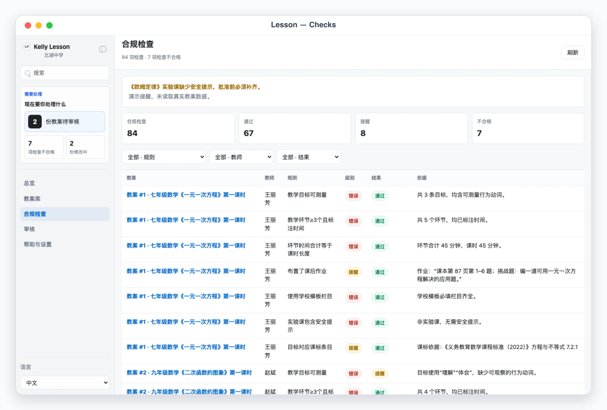</td>
    <td width="50%">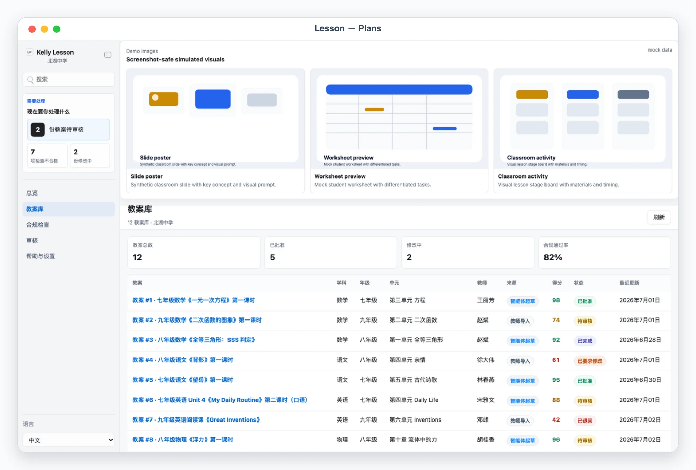</td>
  </tr>
  <tr>
    <td><strong>合规检查</strong><br>逐条规则的通过/提醒/不合格结果，带证据片段，可按规则和教师筛选。</td>
    <td><strong>教案库</strong><br>按学科、年级、教师组织的教案，带来源标记、合规得分和结构化教案详情。</td>
  </tr>
</table>

### `kelly-scale-pptx`

<table>
  <tr>
    <td width="50%"></td>
    <td width="50%">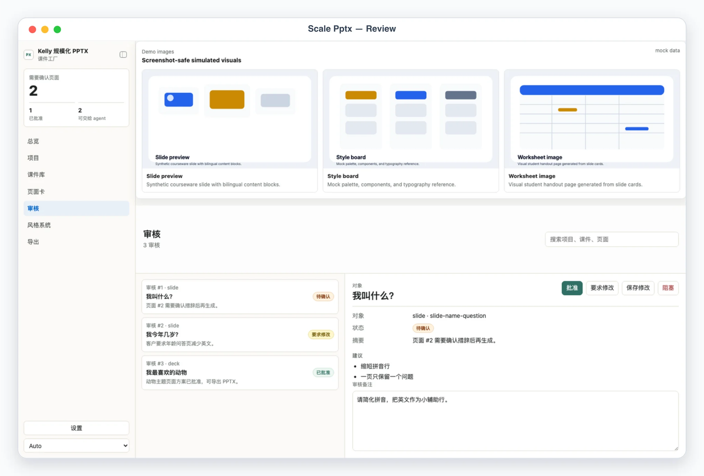</td>
  </tr>
  <tr>
    <td><strong>总览</strong><br>课件工厂 dashboard：项目、课件、页面卡、QA 和风格分一眼可见。</td>
    <td><strong>审核队列</strong><br>页面卡和整套课件先确认，再交给 agent 生成或修改 PPTX。</td>
  </tr>
  <tr>
    <td width="50%"></td>
    <td width="50%">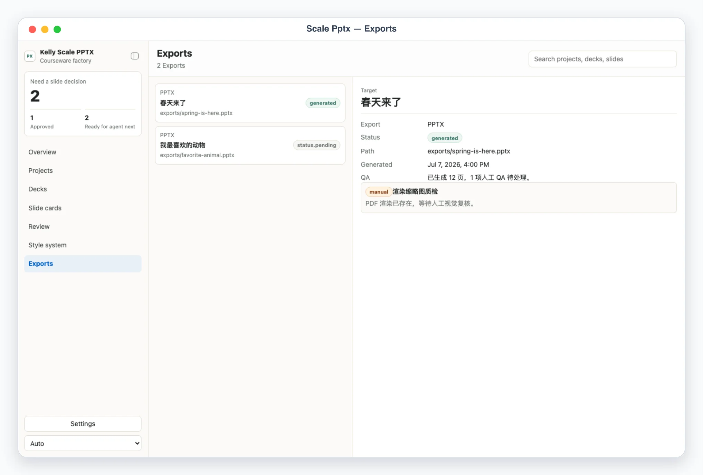</td>
  </tr>
  <tr>
    <td><strong>页面卡</strong><br>分镜式页面规格：目标、版式、文案、视觉说明、互动、风格检查和 QA 标记。</td>
    <td><strong>导出</strong><br>每套 PPTX 的输出路径、渲染路径、生成状态和 QA 证据。</td>
  </tr>
  <tr>
    <td width="50%"></td>
    <td width="50%"></td>
  </tr>
  <tr>
    <td><strong>项目</strong><br>演示项目列表，含状态与逐项目详情（品牌、日期、幻灯片纲要）。</td>
    <td><strong>演示</strong><br>已生成的演示文稿，含审批状态、页数与导出 PPTX 路径。</td>
  </tr>
  <tr>
    <td width="50%"></td>
  </tr>
  <tr>
    <td><strong>样式系统</strong><br>可复用的演示样式系统——配色、标题、版式规则与组件。</td>
  </tr>
</table>

### `kelly-demo-video-factory`

<table>
  <tr>
    <td width="50%"></td>
    <td width="50%"></td>
  </tr>
  <tr>
    <td><strong>视频列表</strong><br>每条视频的状态、镜头数、按录制状态汇总的进度，实时读自 Busabase。</td>
    <td><strong>视频详情</strong><br>目的/钩子/痛点/概念字段、核实结论对照表，以及完整的逐镜分镜表格和录制状态。</td>
  </tr>
</table>

### `kelly-inquiry`

<table>
  <tr>
    <td width="50%">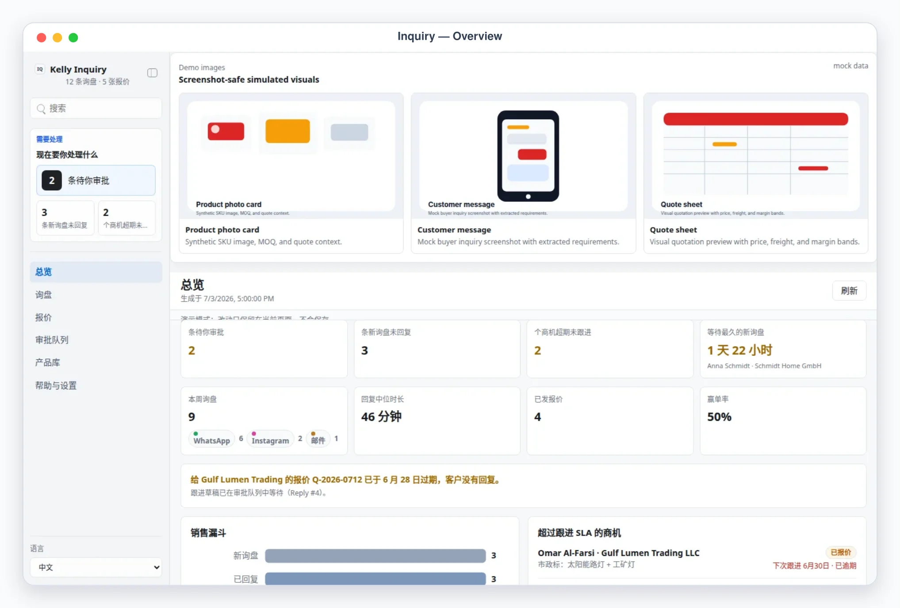</td>
    <td width="50%">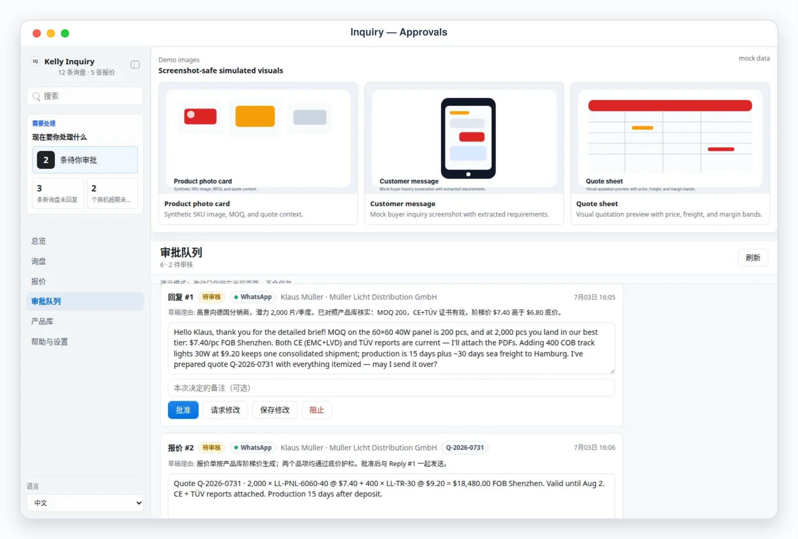</td>
  </tr>
  <tr>
    <td><strong>总览</strong><br>询盘指挥台：回复 SLA 计数、本周渠道构成、销售漏斗和逾期商机提醒。</td>
    <td><strong>审批队列</strong><br>回复和报价的审批制 outbox——未经批准不会发出任何消息。</td>
  </tr>
  <tr>
    <td width="50%">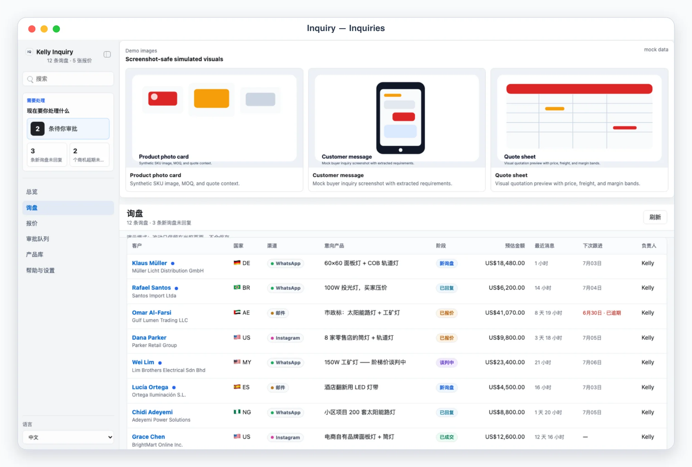</td>
    <td width="50%">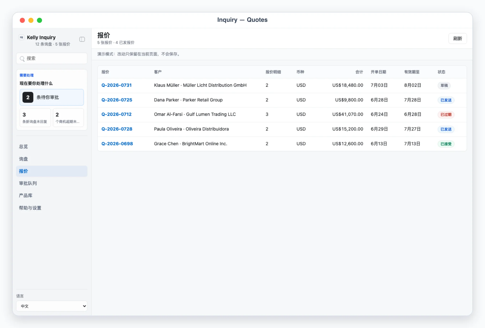</td>
  </tr>
  <tr>
    <td><strong>询盘</strong><br>WhatsApp、Instagram、邮件询盘：国家、阶段、预估金额和下次跟进。</td>
    <td><strong>报价</strong><br>报价单工作台：行项目来自商品知识库，带有效期和底价护栏。</td>
  </tr>
  <tr>
    <td width="50%"></td>
  </tr>
  <tr>
    <td><strong>产品</strong><br>报价背后的产品目录——每个 SKU 的规格、起订量、价格区间与交期。</td>
  </tr>
</table>

### `kelly-picks`

<table>
  <tr>
    <td width="50%"></td>
    <td width="50%">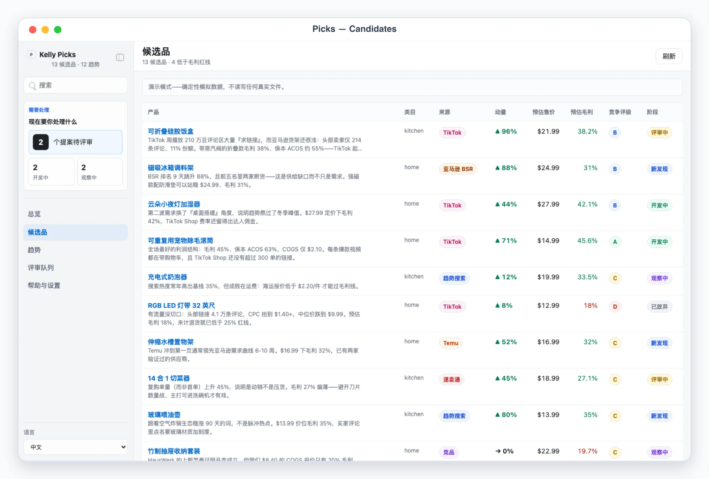</td>
  </tr>
  <tr>
    <td><strong>总览</strong><br>选品台：本周各来源候选品、Top movers 和各来源扫描新鲜度。</td>
    <td><strong>候选品</strong><br>候选品表：动量、预估毛利率、竞争评级和「立项/观察/放弃」阶段。</td>
  </tr>
  <tr>
    <td width="50%"></td>
    <td width="50%"></td>
  </tr>
  <tr>
    <td><strong>评审队列</strong><br>Agent 提出的立项/观察/放弃提案，带采购和上架 brief 供审批。</td>
    <td><strong>利润卡</strong><br>可实时改数的利润测算——售价、到岸成本、运费、平台费、广告费 → 毛利率和保本 ACOS——外加前 10 名评论数竞争解读。</td>
  </tr>
</table>

### `kelly-products`

<table>
  <tr>
    <td width="50%"></td>
    <td width="50%">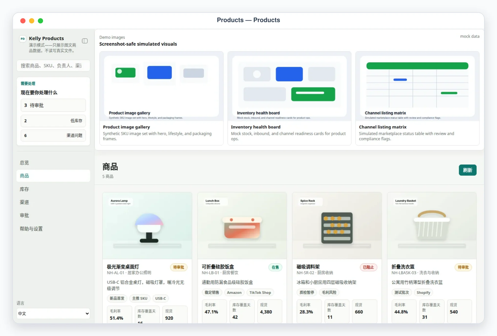</td>
  </tr>
  <tr>
    <td><strong>总览</strong><br>商品管理台：图文商品卡、毛利、库存货值、近期动态和审批队列。</td>
    <td><strong>商品库</strong><br>图文并茂的 SKU 商品库，显示生命周期、负责人、毛利、库存覆盖和状态标签。</td>
  </tr>
  <tr>
    <td width="50%">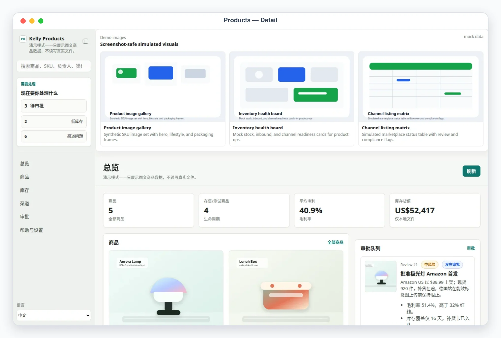</td>
    <td width="50%"></td>
  </tr>
  <tr>
    <td><strong>商品详情</strong><br>商品图库、价格、库存、素材就绪度、合规备注、渠道矩阵和相关审批卡。</td>
    <td><strong>审批队列</strong><br>发布、调价、质检暂停和生命周期建议，全部带证据并需人工批准。</td>
  </tr>
  <tr>
    <td width="50%"></td>
    <td width="50%"></td>
  </tr>
  <tr>
    <td><strong>渠道</strong><br>各渠道上架矩阵（Amazon、Shopify、TikTok Shop），含状态、价格、评分与渠道问题。</td>
    <td><strong>库存</strong><br>跨仓库的库存健康度——在库、可用、可售天数与低库存标记。</td>
  </tr>
</table>

### `kelly-listing`

<table>
  <tr>
    <td width="50%">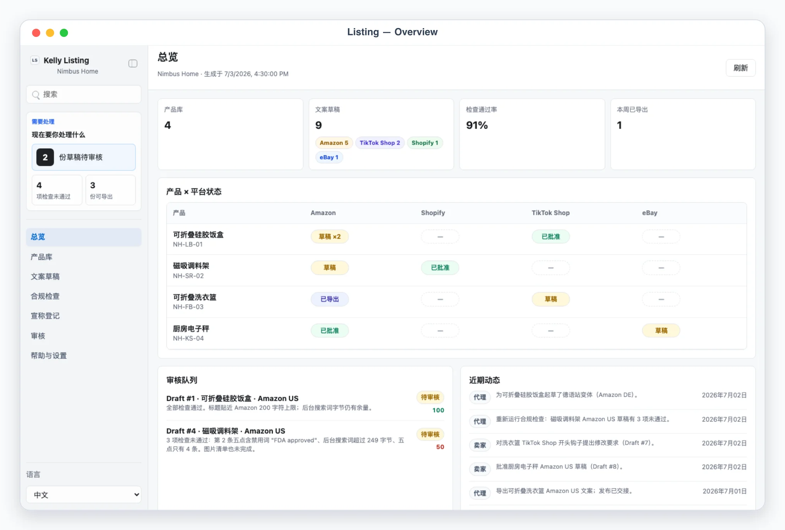</td>
    <td width="50%"></td>
  </tr>
  <tr>
    <td><strong>总览</strong><br>上架指挥台：产品 × 平台状态矩阵、合规通过率和可导出数。</td>
    <td><strong>审核队列</strong><br>草稿提交带合规摘要和关键词策略说明，批准后才能导出或发布。</td>
  </tr>
  <tr>
    <td width="50%"></td>
    <td width="50%">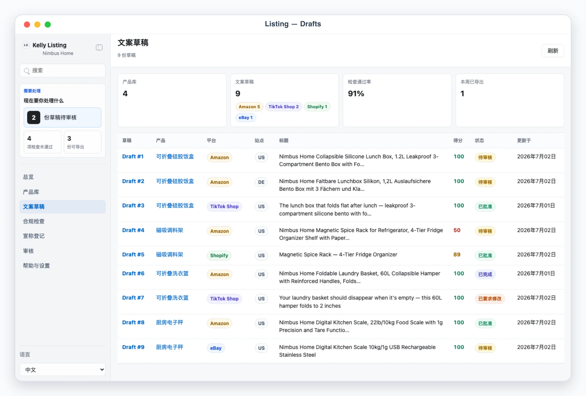</td>
  </tr>
  <tr>
    <td><strong>合规检查</strong><br>逐条规则的通过/提醒/不合格——禁用词、字数上限、五点条数——覆盖全部草稿。</td>
    <td><strong>草稿工作台</strong><br>Amazon 草稿：标题实时字数、五点描述、后台搜索词字节计数、A+ 大纲和站点语言变体切换。</td>
  </tr>
  <tr>
    <td width="50%"></td>
    <td width="50%"></td>
  </tr>
  <tr>
    <td><strong>声明库</strong><br>已批准的营销声明与禁用/受限措辞，每项带证据与合规状态。</td>
    <td><strong>产品</strong><br>产品目录，含 SKU、类目、来源、各平台上架状态与更新时间。</td>
  </tr>
</table>

### `kelly-legal-contracts`

<table>
  <tr>
    <td width="50%">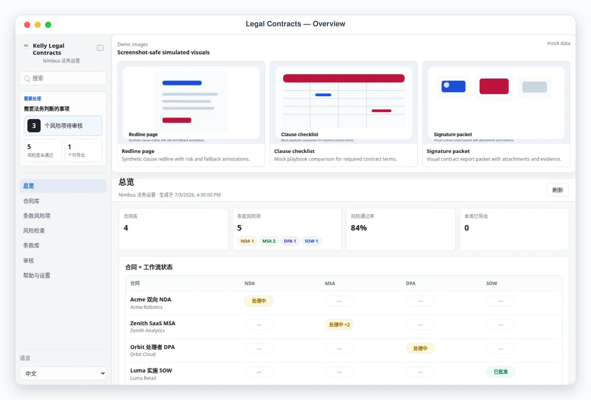</td>
    <td width="50%">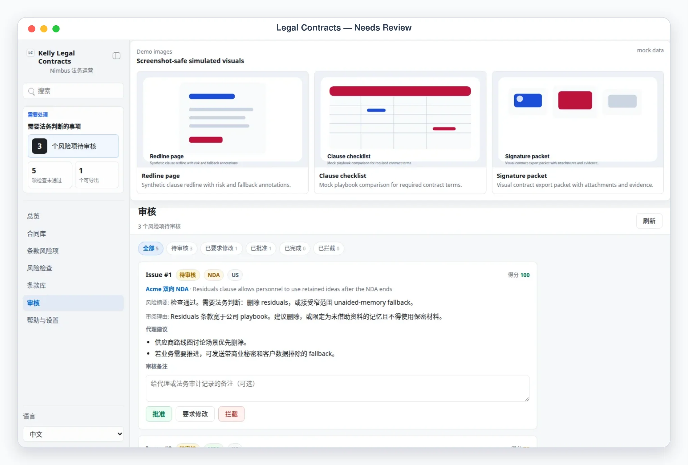</td>
  </tr>
  <tr>
    <td><strong>总览</strong><br>法务合同指挥台：合同 × 工作流状态、风险通过率、审核队列预览和近期动态。</td>
    <td><strong>审核队列</strong><br>审批制法务风险队列，支持批准、要求修改、拦截，并记录审计备注。</td>
  </tr>
  <tr>
    <td width="50%"></td>
    <td width="50%">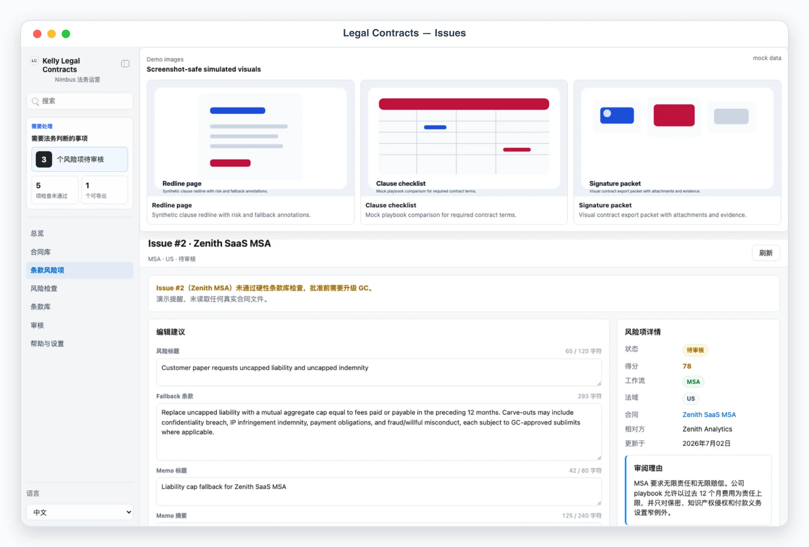</td>
  </tr>
  <tr>
    <td><strong>风险检查</strong><br>逐条规则的通过/提醒/不通过结果，覆盖硬性禁止条款和 playbook 违规。</td>
    <td><strong>条款风险项</strong><br>可编辑风险详情：fallback language、memo 字段、审阅理由和风险检查证据。</td>
  </tr>
  <tr>
    <td width="50%"></td>
    <td width="50%"></td>
  </tr>
  <tr>
    <td><strong>条款库</strong><br>按立场归类的已批准回退条款，含状态、事项类型与适用范围。</td>
    <td><strong>合同台账</strong><br>合同表，含对手方、事项类型、来源、工作流、条款问题与状态。</td>
  </tr>
</table>

### `kelly-legal-casebase-ingest`

<table>
  <tr>
    <td width="50%">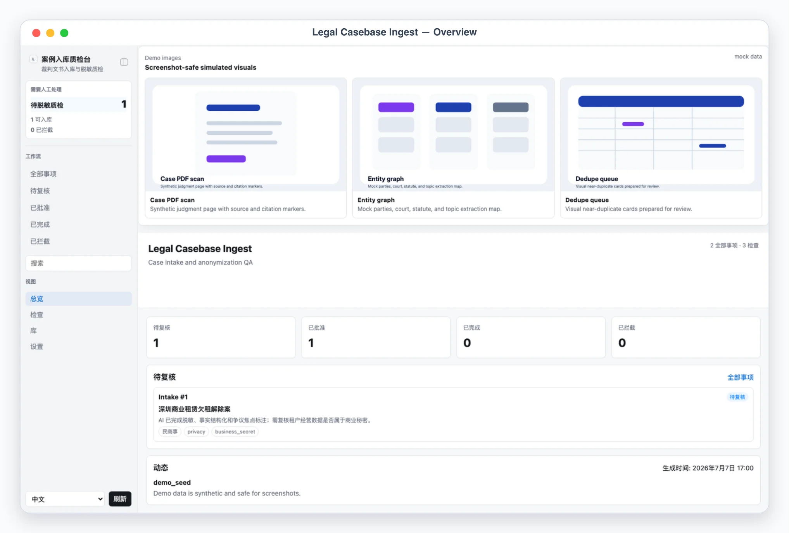</td>
    <td width="50%">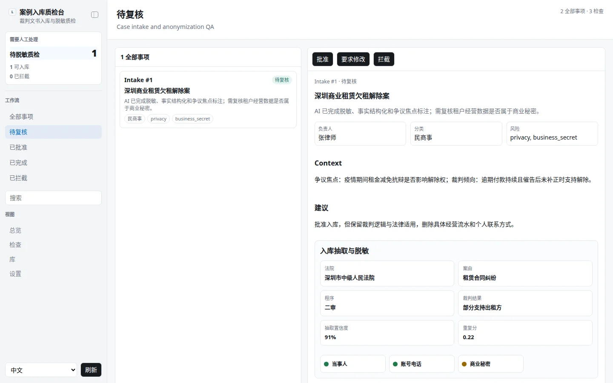</td>
  </tr>
  <tr>
    <td><strong>总览</strong><br>案例库入库指挥台：入库进度、脱敏风险、复核负担和近期动态。</td>
    <td><strong>审核队列</strong><br>审批制案例记录，带稳定编号、脱敏证据、复核备注和决策控件。</td>
  </tr>
  <tr>
    <td width="50%"></td>
    <td width="50%">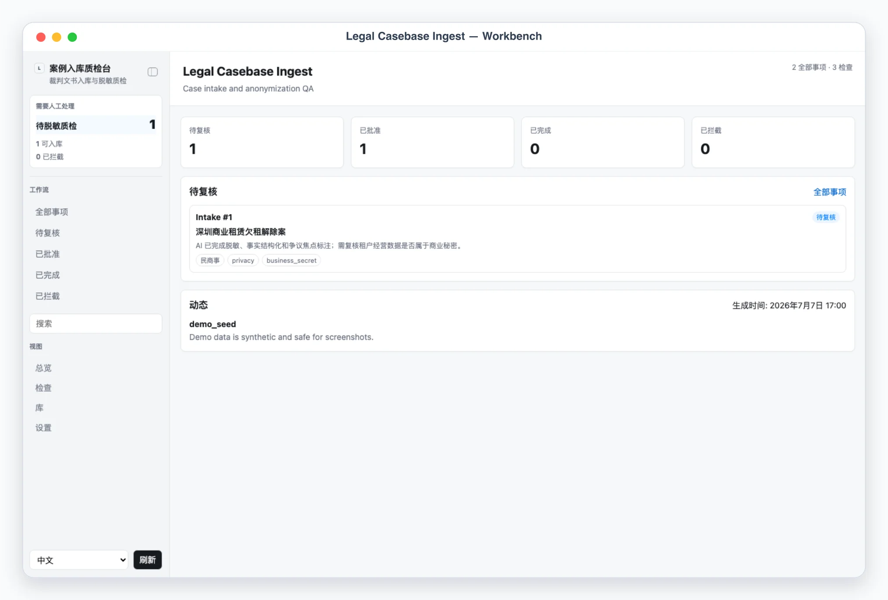</td>
  </tr>
  <tr>
    <td><strong>检查</strong><br>确定性 QA：PII 泄漏、分类完整性、来源覆盖和标签置信度。</td>
    <td><strong>工作台</strong><br>事实、裁判逻辑、法律依据、标签、可编辑草稿和入库前复核备注。</td>
  </tr>
  <tr>
    <td width="50%">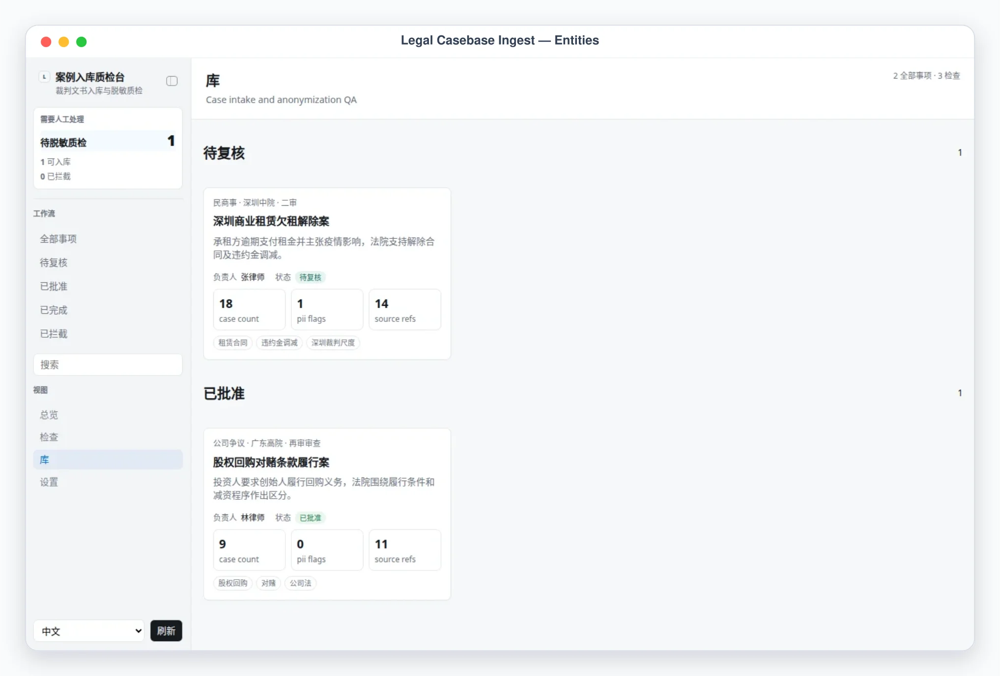</td>
  </tr>
  <tr>
    <td><strong>案例库</strong><br>已入库的案例库，含待复核与已批准分组及逐项计数。</td>
  </tr>
</table>

### `kelly-legal-precedent-desk`

<table>
  <tr>
    <td width="50%"></td>
    <td width="50%">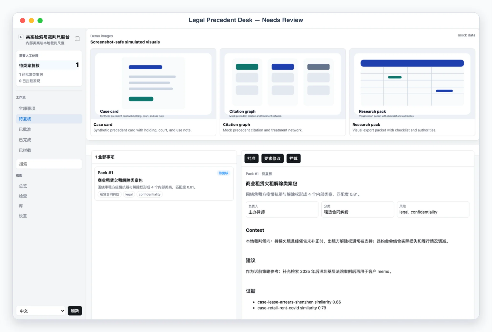</td>
  </tr>
  <tr>
    <td><strong>总览</strong><br>类案检索指挥台：待复核类案包、高相似案例、已批准类案包和近期动态。</td>
    <td><strong>审核队列</strong><br>类案包带本地裁判尺度、引用、证据和批准控件。</td>
  </tr>
  <tr>
    <td width="50%"></td>
    <td width="50%">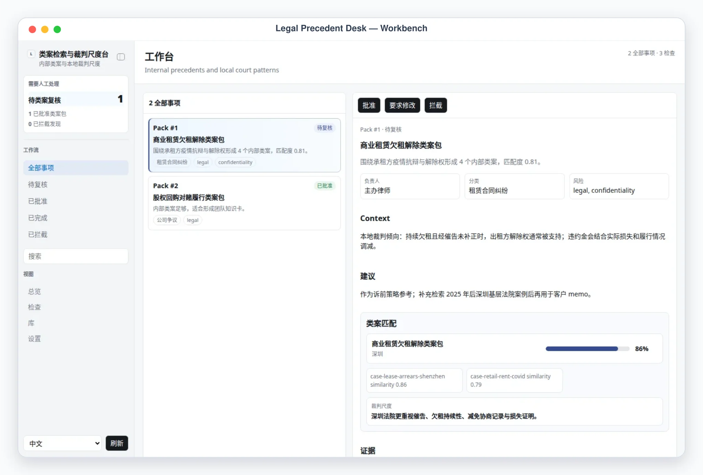</td>
  </tr>
  <tr>
    <td><strong>检查</strong><br>引用可追溯性、相似度理由、地域适配和保密边界质量检查。</td>
    <td><strong>工作台</strong><br>类案裁判逻辑、关键事实、内部引用、备忘录草稿和复核备注。</td>
  </tr>
  <tr>
    <td width="50%">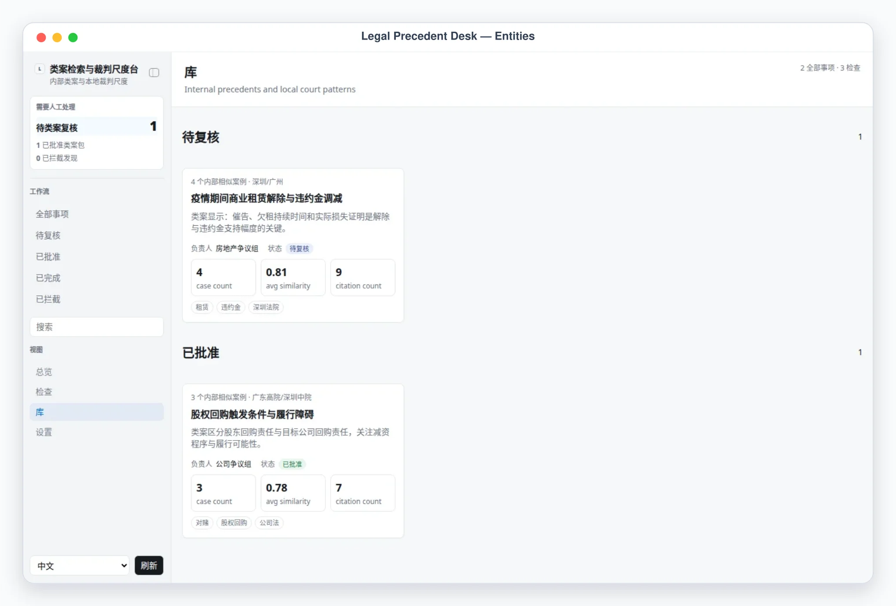</td>
  </tr>
  <tr>
    <td><strong>库</strong><br>内部先例与庭审模式库，按复核状态分组。</td>
  </tr>
</table>

### `kelly-legal-matter-strategy`

<table>
  <tr>
    <td width="50%">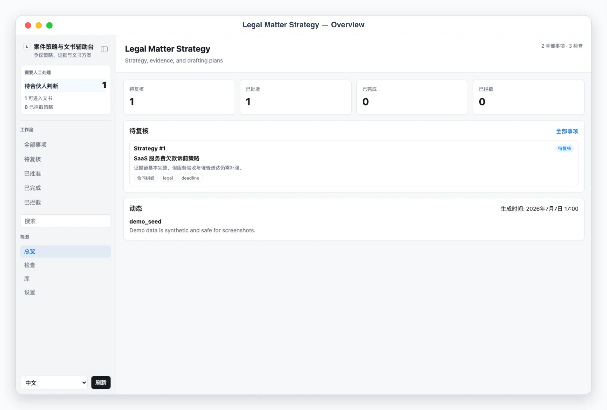</td>
    <td width="50%">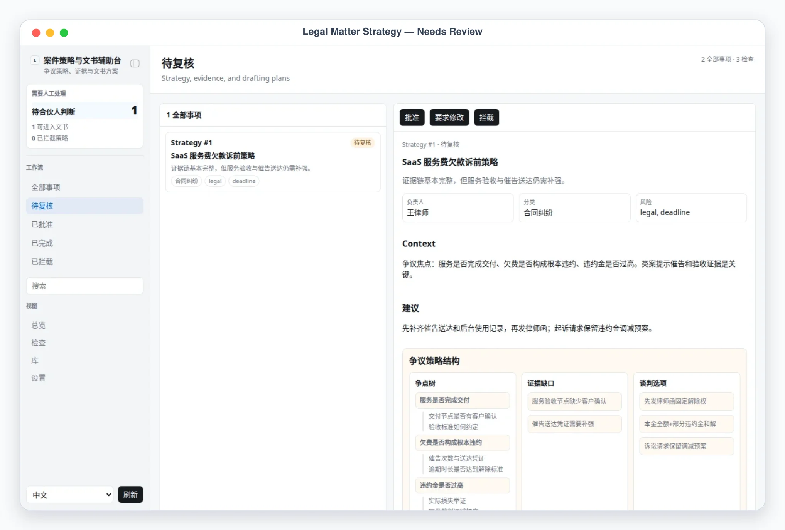</td>
  </tr>
  <tr>
    <td><strong>总览</strong><br>案件策略指挥台：合伙人复核负担、可进入文书的策略、已拦截事项和动态。</td>
    <td><strong>审核队列</strong><br>争议焦点树、证据地图和策略建议，需负责人判断后使用。</td>
  </tr>
  <tr>
    <td width="50%">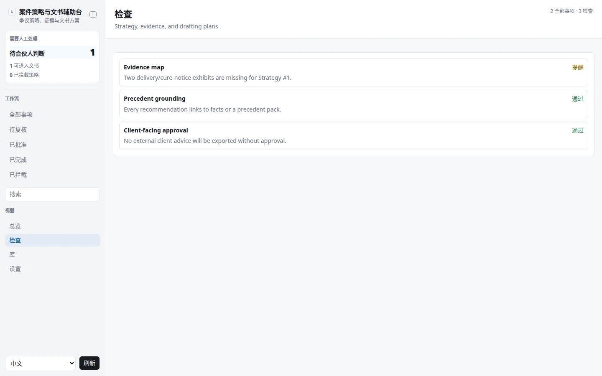</td>
    <td width="50%">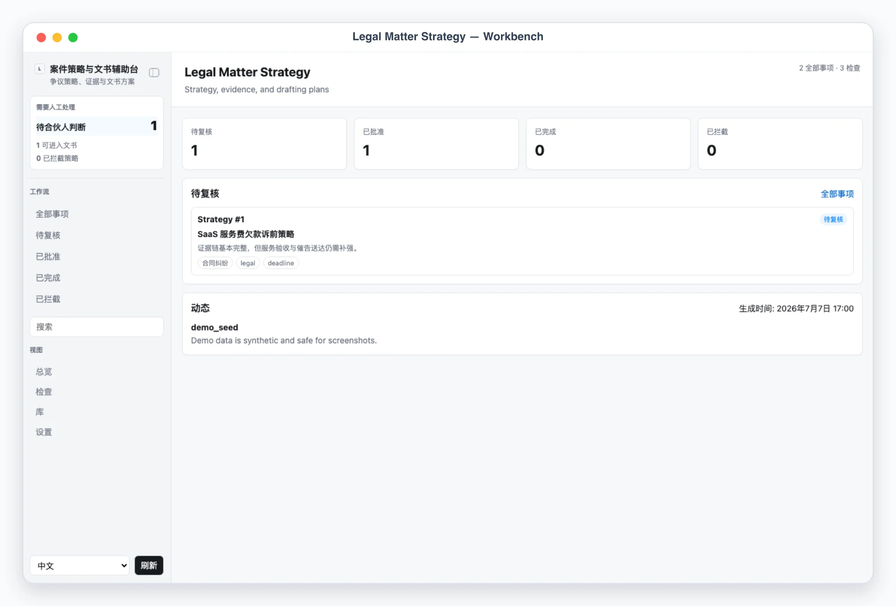</td>
  </tr>
  <tr>
    <td><strong>检查</strong><br>事实缺口、证据不足、期限 caveat、类案依据和风险提示检查。</td>
    <td><strong>工作台</strong><br>争议焦点、证据地图、风险姿态、谈判选项和文书大纲草稿。</td>
  </tr>
  <tr>
    <td width="50%">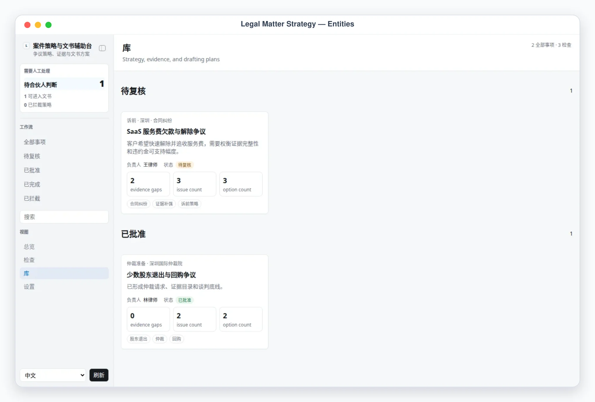</td>
  </tr>
  <tr>
    <td><strong>库</strong><br>事项策略库，含证据与起草计划，按复核状态分组。</td>
  </tr>
</table>

### `kelly-legal-firm-radar`

<table>
  <tr>
    <td width="50%">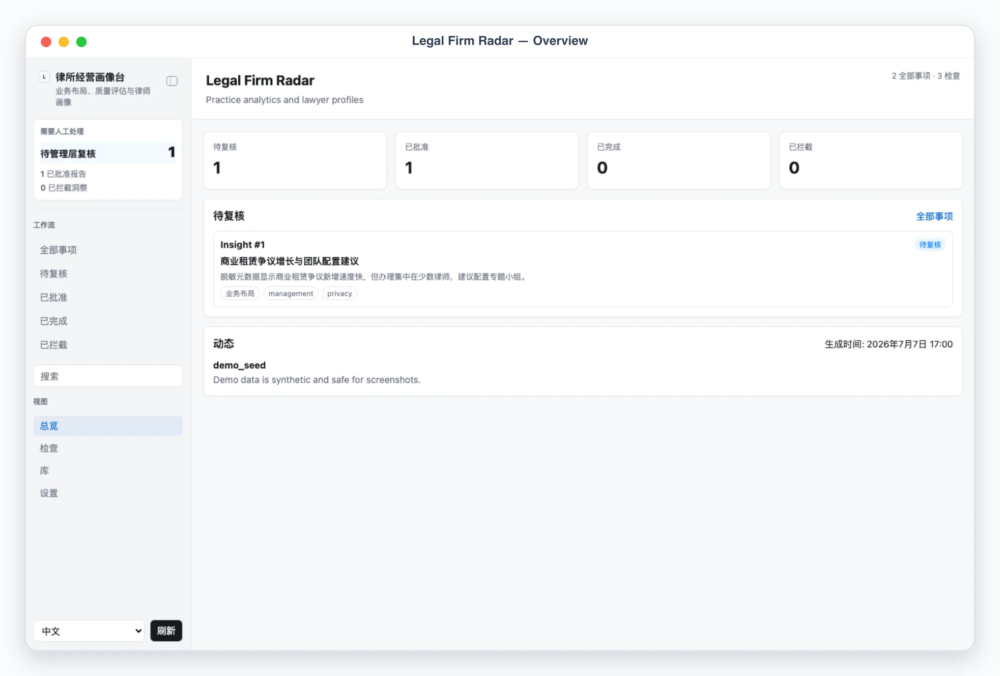</td>
    <td width="50%">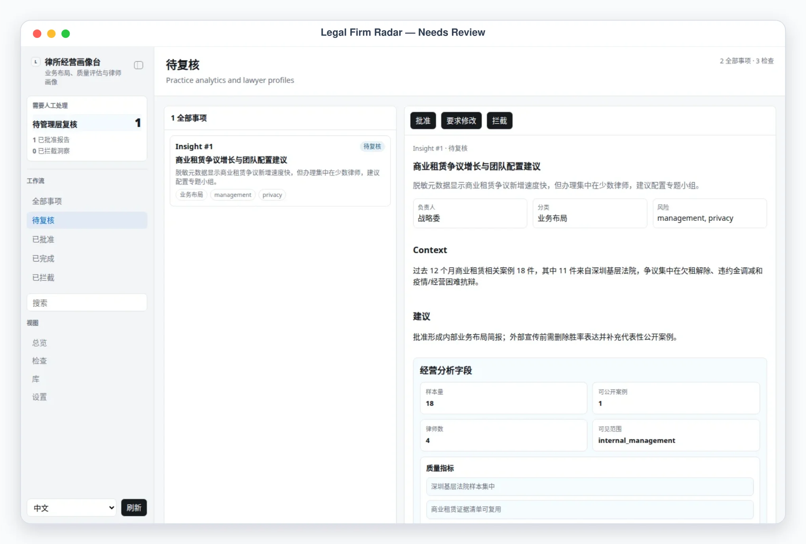</td>
  </tr>
  <tr>
    <td><strong>总览</strong><br>律所经营画像台：管理层复核负担、已批准报告、已拦截洞察和动态。</td>
    <td><strong>审核队列</strong><br>业务结构、律师画像和品牌 proof point 等管理洞察需审批后导出。</td>
  </tr>
  <tr>
    <td width="50%">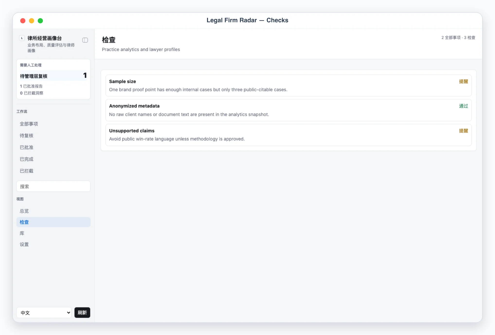</td>
    <td width="50%"></td>
  </tr>
  <tr>
    <td><strong>检查</strong><br>匿名化、样本量、归因、偏差 caveat 和外部使用限制检查。</td>
    <td><strong>工作台</strong><br>业务分析、人才信号、质量指标和可审批的管理报告文本。</td>
  </tr>
  <tr>
    <td width="50%"></td>
  </tr>
  <tr>
    <td><strong>库</strong><br>机构/实体库，含竞品分析，按复核状态分组。</td>
  </tr>
</table>

### `kelly-clm`

Kelly CLM 是一个刻意保持轻量的合同生命周期台，用于合同台账、负责人、义务、续约通知和简单审批提醒。它和 `kelly-legal-contracts` 分开：后者继续负责详细法务审阅。

<table>
  <tr>
    <td width="50%">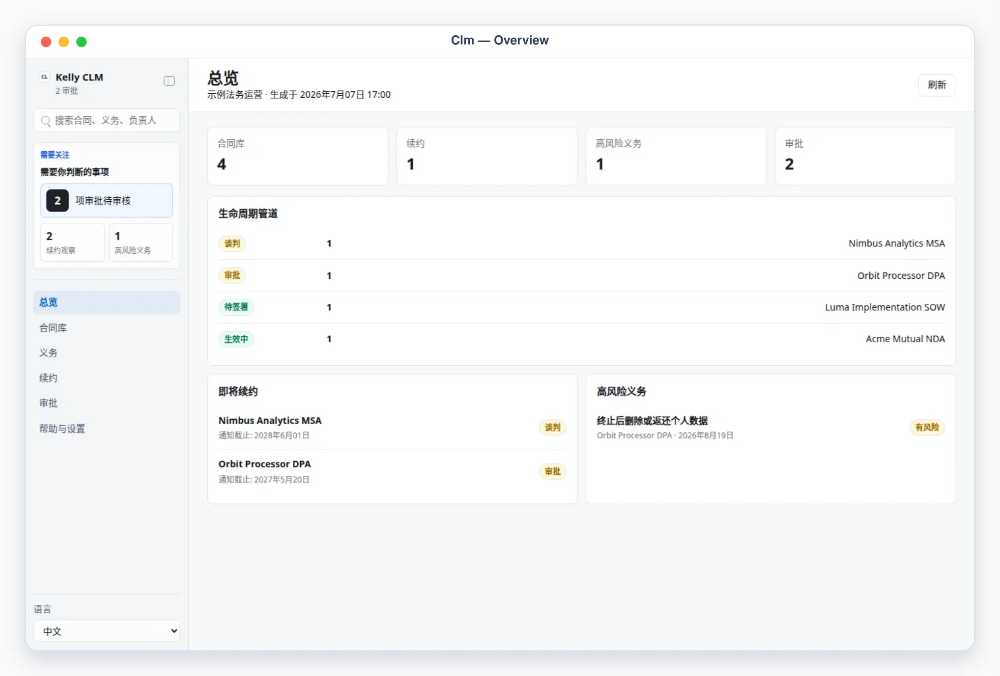</td>
    <td width="50%"></td>
  </tr>
  <tr>
    <td><strong>总览</strong><br>生命周期 dashboard，显示阶段管道、即将续约和高风险义务。</td>
    <td><strong>合同库</strong><br>简单合同台账，包含负责人、相对方、阶段、金额/事项和日期。</td>
  </tr>
  <tr>
    <td width="50%">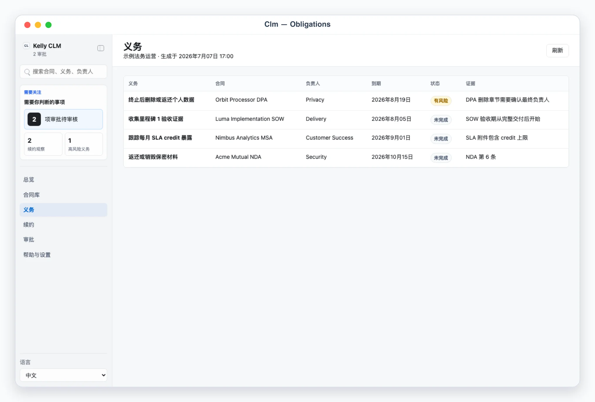</td>
    <td width="50%">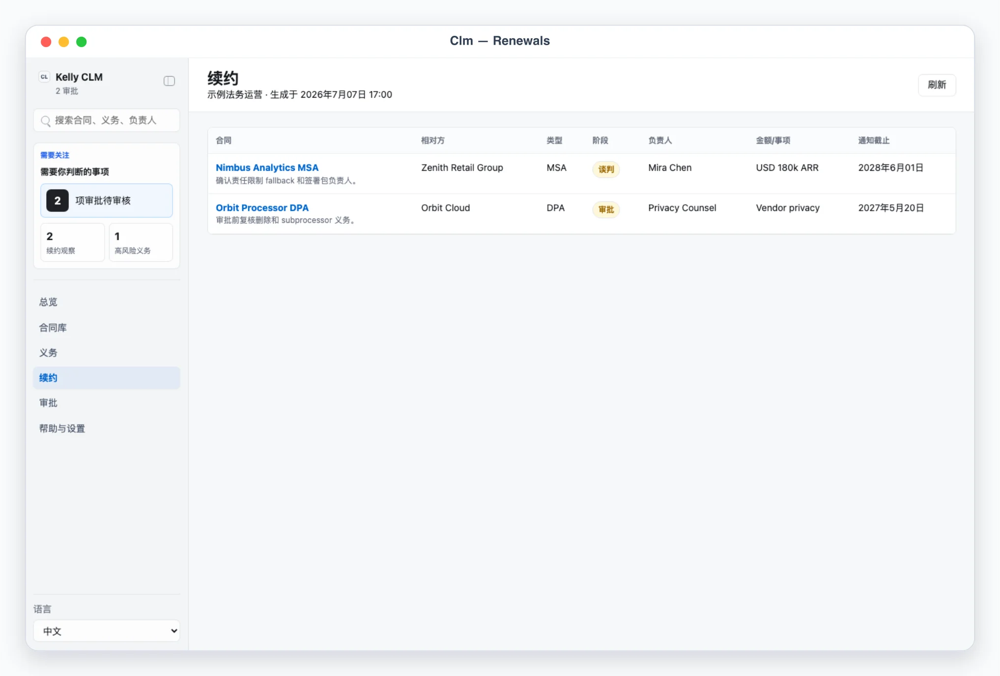</td>
  </tr>
  <tr>
    <td><strong>义务</strong><br>按负责人分配的义务跟踪，带到期日和状态。</td>
    <td><strong>续约</strong><br>续约看板，显示通知截止日和简单跟进行动。</td>
  </tr>
  <tr>
    <td width="50%">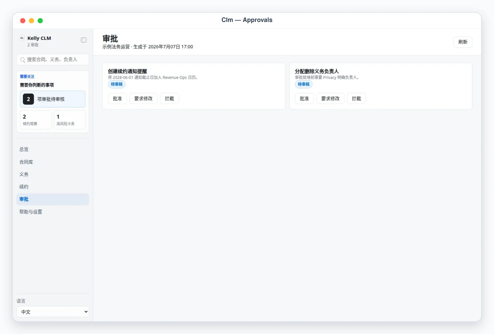</td>
  </tr>
  <tr>
    <td><strong>审批</strong><br>合同生命周期动作（续约提醒、义务归属）的审批队列，可批准/要求修改/拦截。</td>
  </tr>
</table>

### `kelly-ads`

<table>
  <tr>
    <td width="50%"></td>
    <td width="50%"></td>
  </tr>
  <tr>
    <td><strong>总览</strong><br>跨平台投放看板：综合 ROAS/ACOS 对比目标、各平台卡片、花费收入柱状图和「只花钱不出单排行」。</td>
    <td><strong>广告活动</strong><br>Amazon、Meta、TikTok、Google 的活动表：预算进度、花费、ROAS 和按目标着色的 ACOS。</td>
  </tr>
  <tr>
    <td width="50%"></td>
    <td width="50%">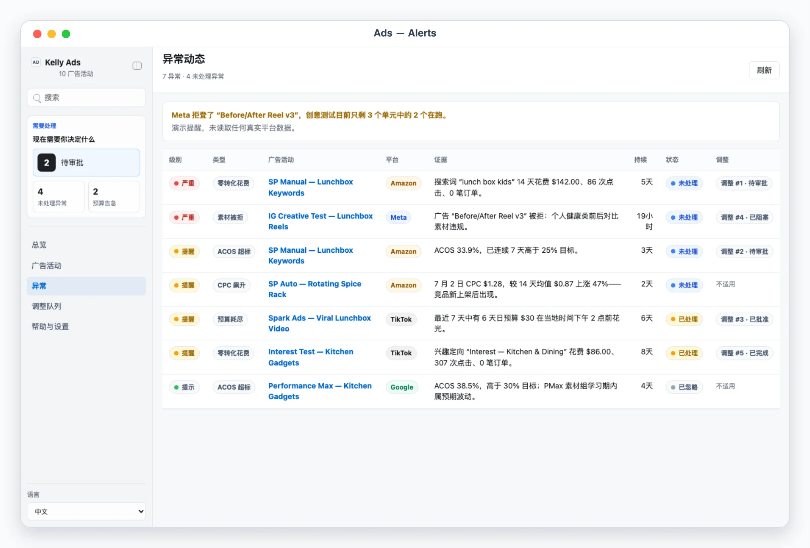</td>
  </tr>
  <tr>
    <td><strong>调整队列</strong><br>Agent 提出的出价/预算/否定词调整，带证据和影响预估，批准后才执行。</td>
    <td><strong>异常</strong><br>确定性异常流：ACOS 超标、预算烧穿、零转化花费、CPC 飙升、素材被拒。</td>
  </tr>
</table>

### `kelly-standup`

<table>
  <tr>
    <td width="50%">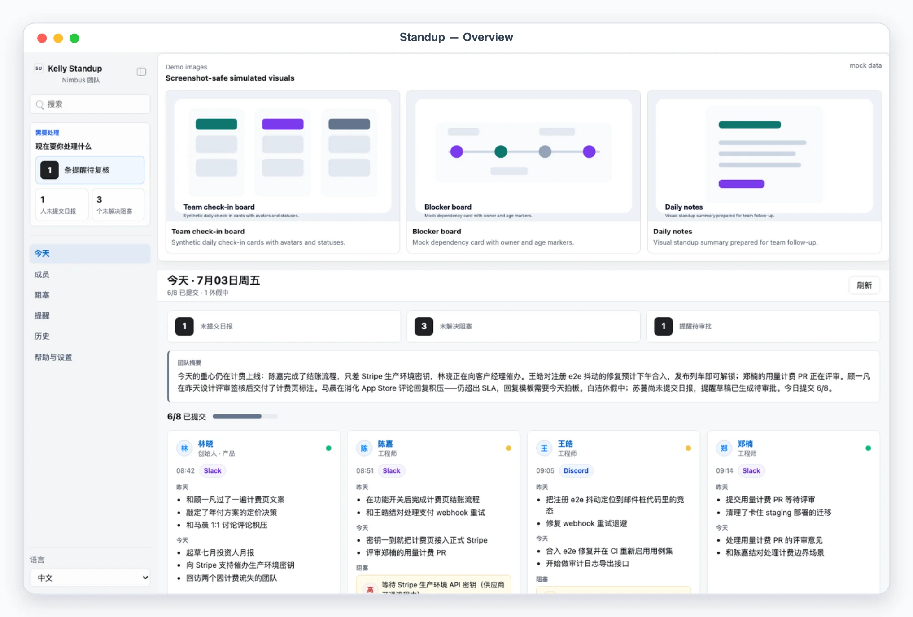</td>
    <td width="50%">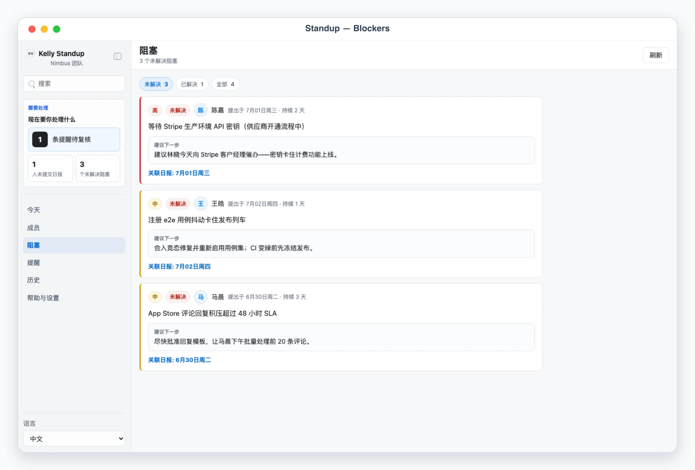</td>
  </tr>
  <tr>
    <td><strong>今日看板</strong><br>晨会一屏看全：团队摘要、提交统计、每人「昨天/今天/阻塞」卡片和来源渠道标记。</td>
    <td><strong>阻塞</strong><br>全团队阻塞汇总：严重度、挂起时长和 agent 建议的下一步。</td>
  </tr>
  <tr>
    <td width="50%">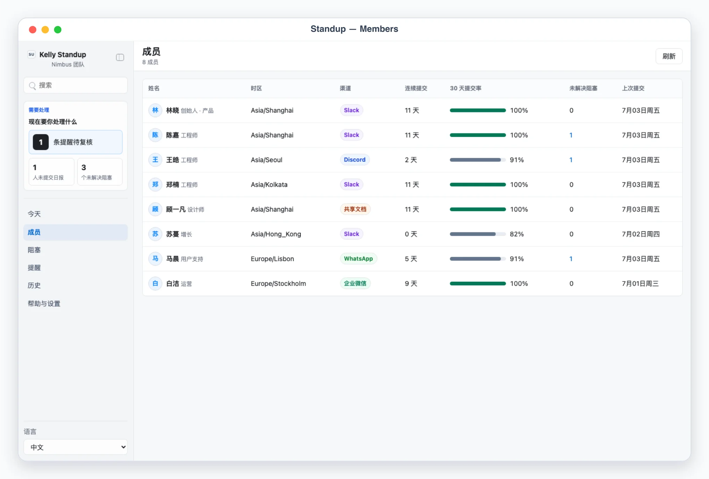</td>
    <td width="50%"></td>
  </tr>
  <tr>
    <td><strong>成员</strong><br>团队名册：连续打卡、30 天参与率、未解决阻塞和每人更新时间线。</td>
    <td><strong>提醒</strong><br>催交提醒审批队列——agent 起草，批准后才发出。</td>
  </tr>
  <tr>
    <td width="50%">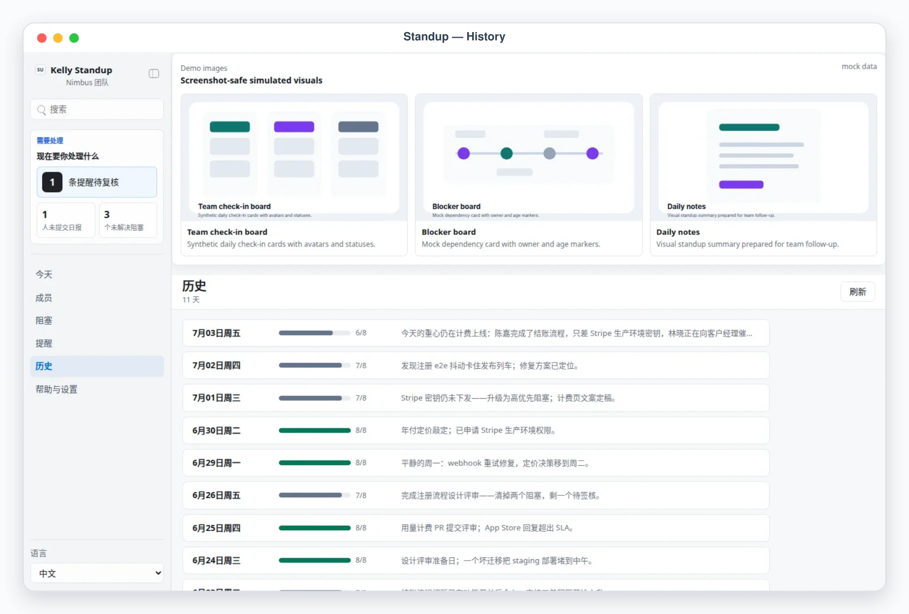</td>
  </tr>
  <tr>
    <td><strong>历史</strong><br>过往站会签到、提出的阻碍与每日备注的时间线记录。</td>
  </tr>
</table>

### `kelly-creators`

达人营销台，跑 Aaron 的 Discover→Plan→Activate→Measure 管道，带 C³ ACE 匹配分和 SHIP/FIX/BLOCK 披露门。

<table>
  <tr>
    <td width="50%">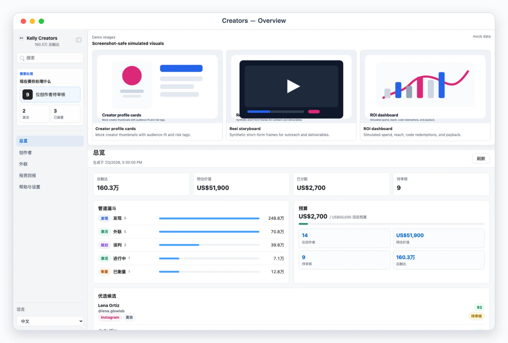</td>
    <td width="50%">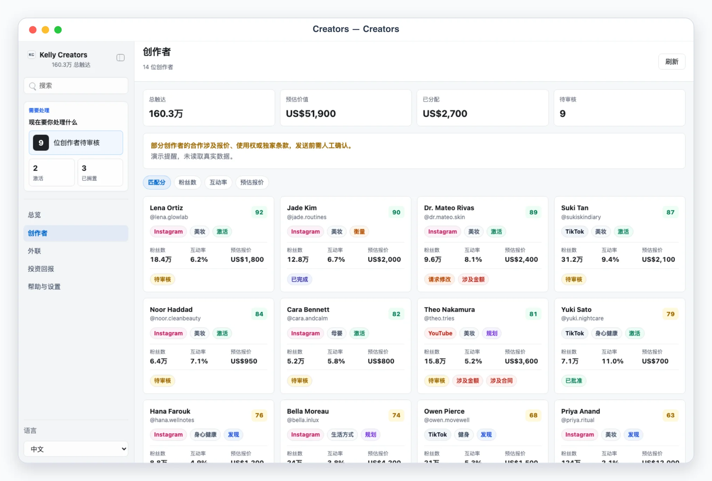</td>
  </tr>
  <tr>
    <td><strong>总览</strong><br>四相位管道漏斗、预算分配、总触达，和匹配分最高的候选。</td>
    <td><strong>达人</strong><br>可排序的候选卡，带 C³ ACE 匹配分、平台、赛道和粉丝量。</td>
  </tr>
  <tr>
    <td></td>
    <td></td>
  </tr>
  <tr>
    <td><strong>外联</strong><br>待审批队列，可编辑外联草稿，含 FTC/宣称披露门。</td>
    <td><strong>ROI</strong><br>每个达人的花费、预估价值、CPM 和上线后的回报。</td>
  </tr>
</table>

### `kelly-campaigns`

外发邮件营销台，跑 SEND 生命周期（Setup→Engage→Nurture→Deliver），带 EQS 发送前质量门。

<table>
  <tr>
    <td width="50%"></td>
    <td width="50%">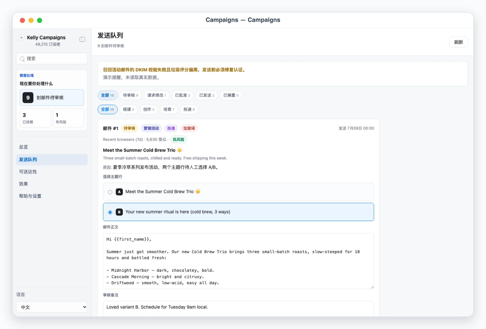</td>
  </tr>
  <tr>
    <td><strong>总览</strong><br>发送日历 + 列表健康度——订阅数、退信、流失和投诉率。</td>
    <td><strong>Campaign</strong><br>campaign、newsletter 和序列步骤的草稿/审批队列。</td>
  </tr>
  <tr>
    <td>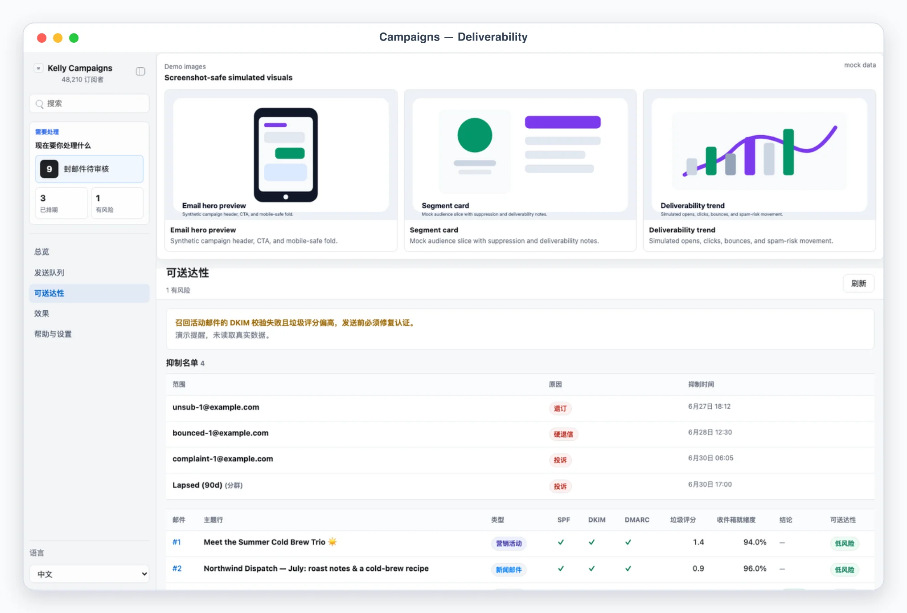</td>
    <td></td>
  </tr>
  <tr>
    <td><strong>送达率</strong><br>发送前 QA——SPF/DKIM/DMARC、垃圾分，和 EQS SHIP/FIX/BLOCK 门。</td>
    <td><strong>表现</strong><br>各 campaign 的打开、点击和退订率。</td>
  </tr>
</table>

### `kelly-launch`

产品发布指挥台，跑 RAMP 框架（Research→Assemble→Mobilize→Prove），以发布就绪 LQS 分把关。

<table>
  <tr>
    <td width="50%"></td>
    <td width="50%"></td>
  </tr>
  <tr>
    <td><strong>总览</strong><br>发布倒计时、RAMP 就绪门及 LQS 分、相位进度和渠道状态。</td>
    <td><strong>清单</strong><br>按 RAMP 相位分组的发布任务——Research、Assemble、Mobilize、Prove。</td>
  </tr>
  <tr>
    <td>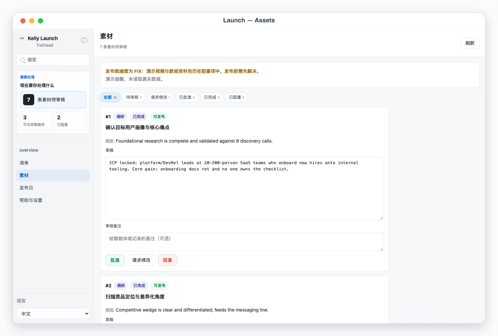</td>
    <td></td>
  </tr>
  <tr>
    <td><strong>素材</strong><br>发布素材、Product Hunt / Hacker News 提交和媒体推介的审批队列。</td>
    <td><strong>发布日</strong><br>有序的发布日 runbook，带 war-room 备注。</td>
  </tr>
</table>

### `kelly-brand`

品牌叙事唯一真源，跑 TALE 框架（Trace→Architect→Land→Evaluate），以 NQS 打分并带漂移监控。

<table>
  <tr>
    <td width="50%"></td>
    <td width="50%">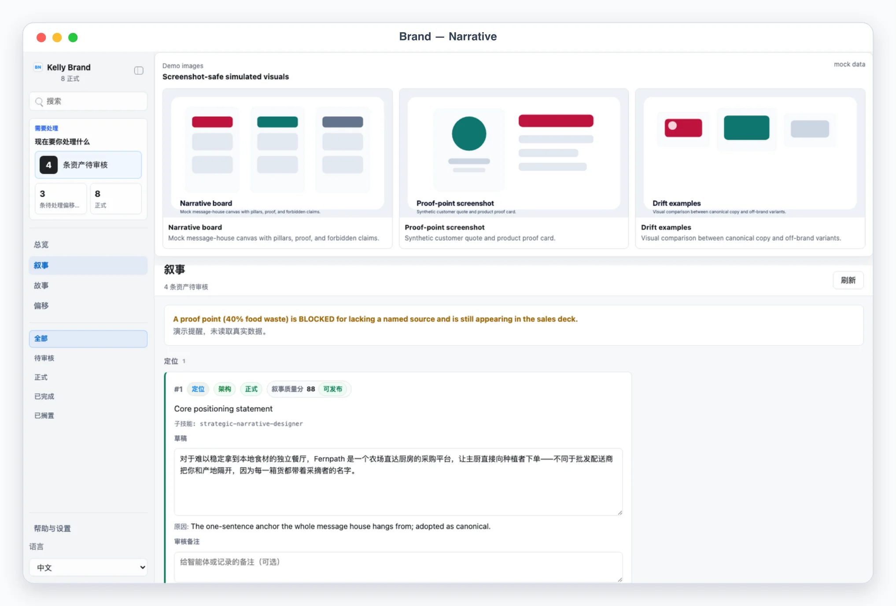</td>
  </tr>
  <tr>
    <td><strong>总览</strong><br>message house——定位、价值支柱、总 NQS，和漂移告警数。</td>
    <td><strong>叙事</strong><br>message pillar 和用词护栏，canonical 与草稿对照。</td>
  </tr>
  <tr>
    <td>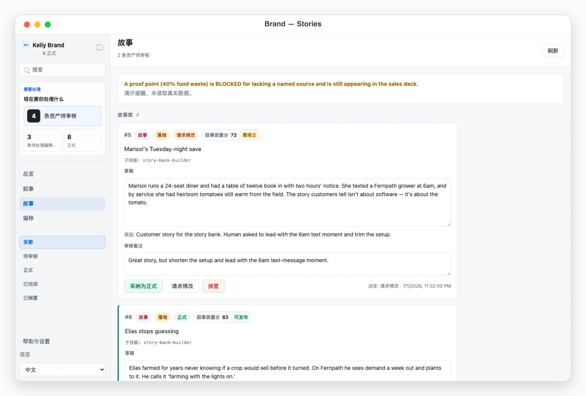</td>
    <td></td>
  </tr>
  <tr>
    <td><strong>Story bank</strong><br>客户故事和带证据的 proof point。</td>
    <td><strong>漂移</strong><br>跨渠道跑偏告警——违规用法 vs canonical 护栏。</td>
  </tr>
</table>

</details>

---

## 目录结构

- `.claude-plugin/marketplace.json` 让这个 bundle 仍可被 Claude Code 安装。
- `skills/` 每个子目录对应一个 skill。
- 每个 skill 至少包含 `SKILL.md`。
- App-based skills 通常还包含 `app/`、本地脚本、schema references、demo mode 和面向人的 `README.md`。

---

## Star History

<a href="https://star-history.com/#mr-kelly/skills&Date">
  <picture>
    <source media="(prefers-color-scheme: dark)" srcset="https://api.star-history.com/svg?repos=mr-kelly/skills&type=Date&theme=dark" />
    <source media="(prefers-color-scheme: light)" srcset="https://api.star-history.com/svg?repos=mr-kelly/skills&type=Date" />
    
  </picture>
</a>

<div align="center">

由 Kelly 构建 · 基于 [MIT](../LICENSE) 许可 · [🌐 Skills 在线画廊](https://mr-kelly.github.io/skills/?lang=zh)

</div>
