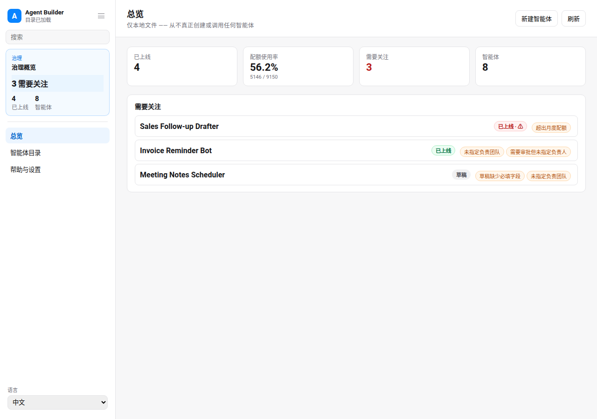

# Agent Builder & Governance Console

Agent Builder & Governance Console is a local, file-backed App-in-Skill for a
platform team that wants to let other teams safely spin up simple LLM agent
configs. It is a **mock** governance tool: it never provisions or calls a real
agent. Every create, edit, activate, pause, and archive action reads or writes
a local JSON handoff file under `app/.data/`.

## What It Shows

- **Overview**: live agent count, aggregate quota usage (calls vs. total
  quota), and a list of agents that need attention with the specific reason
  (draft missing required fields, no owning team, over quota, or approval
  required with no owner).
- **Catalog**: sortable, searchable table of every agent config — name,
  owning team, status badge, and quota usage.
- **Agent detail / edit**: trigger/intent description, a checklist of allowed
  tools from a fixed catalog, an approval-required toggle, a monthly quota
  input, the owning team field, current status, and lifecycle actions
  (activate, pause, archive).

## App UI Screenshots

<table>
  <tr>
    <td width="50%"></td>
    <td width="50%"></td>
  </tr>
  <tr>
    <td><strong>Overview</strong><br>Governance summary with live count, quota usage, and agents needing attention.</td>
    <td><strong>Catalog</strong><br>Sortable, searchable agent config table.</td>
  </tr>
  <tr>
    <td width="50%"></td>
    <td width="50%"></td>
  </tr>
  <tr>
    <td><strong>Agent detail / edit</strong><br>Tool checklist, quota, approval toggle, owning team, and lifecycle actions.</td>
    <td><strong>Overview (中文)</strong><br>Full zh-CN UI parity via <code>app/i18n/messages.js</code>.</td>
  </tr>
</table>

## Demo Mode

Run the app and open a safe mock-data scene:

```bash
skills/kelly-agent-builder/app/start.sh
```

Use the URL printed by the launcher, then add the demo query param:

```text
/?demo=1&lang=en#/overview
/?demo=1&lang=en#/catalog
/?demo=1&lang=zh#/overview
```

Demo mode is fully offline and never reads or writes `app/.data/agents.json`.

## Local Data

Seed a mock catalog (8 agent configs spanning draft/live/paused/archived, one
over-quota, one missing an owning team):

```bash
node skills/kelly-agent-builder/scripts/generate_demo_snapshot.ts
```

Validate the local catalog file against the schema:

```bash
node skills/kelly-agent-builder/scripts/validate_ui_schema.ts app/.data/agents.json
```

See `references/agent-config-schema.md` for the full schema and governance rules
(draft → live gating, needs-attention rules, archive/pause semantics).

## Boundary

This console never provisions, deploys, or calls any real agent, model, or
external tool. All state lives in local JSON files under `app/.data/`, which
are git-ignored and never committed.
