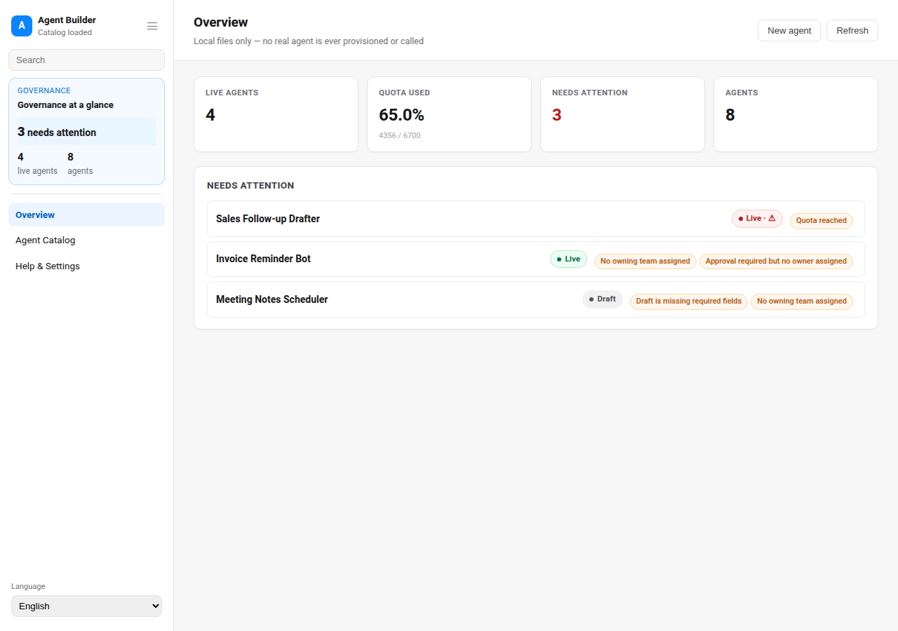
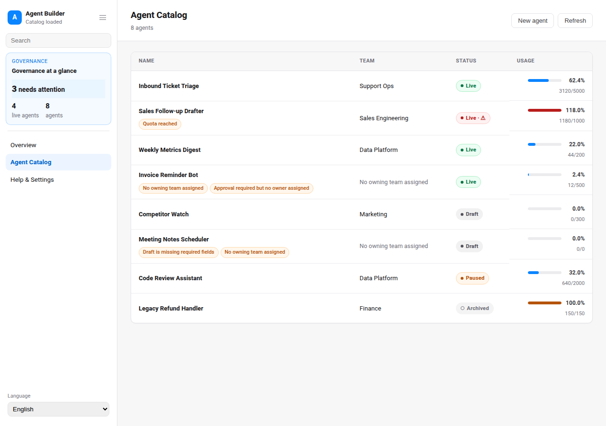
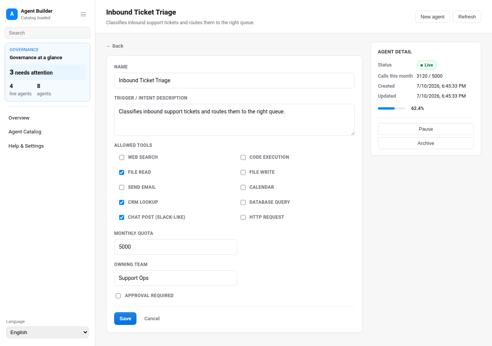

# Agent Builder & Governance Console

## Overview

Use this skill as a platform team's local, file-backed governance console for a
catalog of **mock** agent configs. It never provisions or calls a real agent —
every action reads or writes a local JSON handoff file under `app/.data/`. This
is a generic, brand-free tool: teams define a name, a trigger/intent
description, a set of allowed tools (from a fixed catalog), an approval flag,
and a monthly call quota, and this console tracks status and usage and gates
the risky transition (draft → live) behind required-field validation.

Default interaction mode: App UI. Unless the user explicitly asks for
chat-only handling, start/reuse the local app with `app/start.sh` and give the
actual local URL.

## App UI Screenshots

<table>
  <tr>
    <td width="50%"></td>
    <td width="50%"></td>
  </tr>
  <tr>
    <td><strong>Overview</strong><br>Governance summary: live agent count, aggregate quota usage, and a list of agents that need attention with reasons.</td>
    <td><strong>Catalog</strong><br>Sortable, searchable table of every agent config with status badges, owning team, and quota usage.</td>
  </tr>
  <tr>
    <td width="50%"></td>
    <td width="50%"></td>
  </tr>
  <tr>
    <td><strong>Agent detail / edit</strong><br>Tool checklist, quota input, approval toggle, owning team field, trigger/intent textarea, status, and lifecycle actions (activate / pause / archive).</td>
    <td></td>
  </tr>
</table>

## Boundary

- This is a **mock** governance console. It never provisions, deploys, or
  calls any real agent, model, or external tool. The "allowed tools" checklist
  is a fixed local catalog (`lib/tool-catalog.ts`) used only for governance
  bookkeeping — selecting a tool here does not grant or invoke it anywhere.
- The app reads and writes local files only: `app/.data/agents.json`,
  `app/.data/onboarding.json`, `app/.data/agent.lock`. It must not call any
  remote system.
- No brand-specific integration exists or is implied. Configure `org_name` in
  `config.local.json` for cosmetic display only.

## First Run

On invocation, start/reuse the local app with:

```bash
skills/kelly-agent-builder/app/start.sh
```

First run installs `hono` and `@hono/node-server`; the frontend is zero-build
vanilla. If `app/.data/agents.json` does not exist yet, seed a mock catalog
with:

```bash
node skills/kelly-agent-builder/scripts/generate_demo_snapshot.ts
```

This also writes the `app/.data/onboarding.json` completion marker — this
skill has no external accounts or secrets to configure, so seeding the mock
catalog for the first time is itself "setup complete."

## Demo Mode

- `?demo=1` opens a deterministic, fully offline mock catalog (8 agent
  configs spanning draft/live/paused/archived, one over-quota, one missing an
  owning team) for documentation and screenshots.
- `lang=en` or `lang=zh` forces UI chrome language for screenshots.
- Demo API responses never read or write `app/.data/agents.json`.

UI language: support English and Chinese chrome with `Auto` default.

## Governance Rules

Read `references/agent-config-schema.md` before editing the app, store, or scripts. In
short:

- **Draft → live** (`POST /api/agents/:id/activate`) is only allowed when
  `name`, `trigger_description`, at least one `allowed_tools` entry,
  non-empty `owning_team`, and `monthly_quota > 0` are all present. This is
  enforced **server-side** in `app/server/store.ts#activateAgent`; on failure
  the API returns `422` with `missing_fields` and the UI surfaces the exact
  reason.
- **Archive** (`POST /api/agents/:id/archive`) is allowed from any status.
  Archived agents become read-only (`PUT` returns `409`).
- **Pause** (`POST /api/agents/:id/pause`) is only allowed from `live`.
- **Needs attention** = a draft with missing required fields, OR an agent
  (any status) with no owning team, OR a quota-reached live agent
  (`calls_this_month >= monthly_quota` — reached, not strictly exceeded), OR
  `approval_required: true` with no owning team assigned.
- **PUT validation**: a `PUT` that would leave an already-`live` agent
  missing any required field (e.g. clearing `owning_team` or
  `allowed_tools`) is rejected with `422` + `missing_fields`, the same gate
  `activate` uses. Draft agents remain freely editable.

All writes persist to `app/.data/agents.json`; there is no approval workflow
beyond this local file and no outbound network call anywhere in this skill's
app.

## Local App

- `app/index.html` + `app/app.js` + `app/styles.css` + `app/i18n/messages.js`:
  zero-build vanilla frontend with hash routing (`#/overview`, `#/catalog`,
  `#/agent/:id`, `#/agent/new`, `#/settings`).
- `app/server/hono.ts`: platform-neutral Hono routes for state, tool catalog,
  and agent CRUD/lifecycle actions.
- `app/server/store.ts`: status derivation, CRUD/lifecycle helpers, and the
  read/write surface, all delegated to `lib/data-provider/` (never `node:fs`
  directly).
- `lib/config-validation.ts`: pure governance rules (`missingRequiredFields`,
  `isQuotaReached`, `deriveAgent`) shared by the server and `scripts/`.
- `lib/data-provider/`: the `DataProvider` contract
  (`provider-interface.ts`) and the default `local-file-provider.ts`; selected
  via `KELLY_AGENT_BUILDER_DATA_PROVIDER` (default `local`).
- `lib/tool-catalog.ts`: the fixed tool catalog (`web_search`, `code_exec`,
  `file_read`, `file_write`, `send_email`, `calendar`, `crm_lookup`,
  `db_query`, `slack_post`, `http_request`).

## Safety

- Never provision or call a real agent, tool, or external system from this
  skill's app.
- Do not commit `config.local.json`, `app/.data/`, or `app/.cache/`.
- Keep `owning_team` values as free text; do not validate against a real
  directory service.
