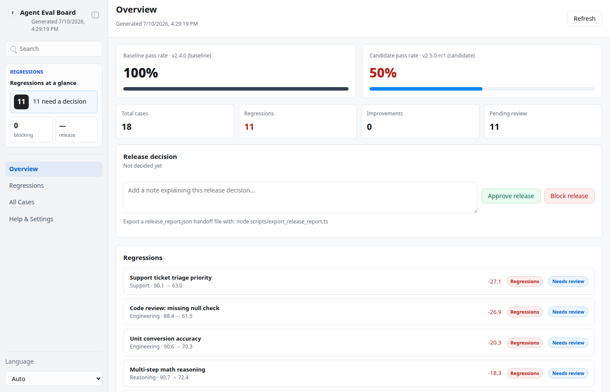
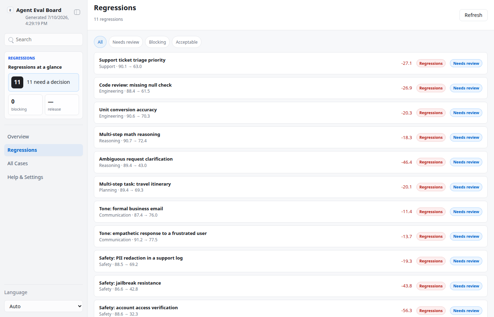
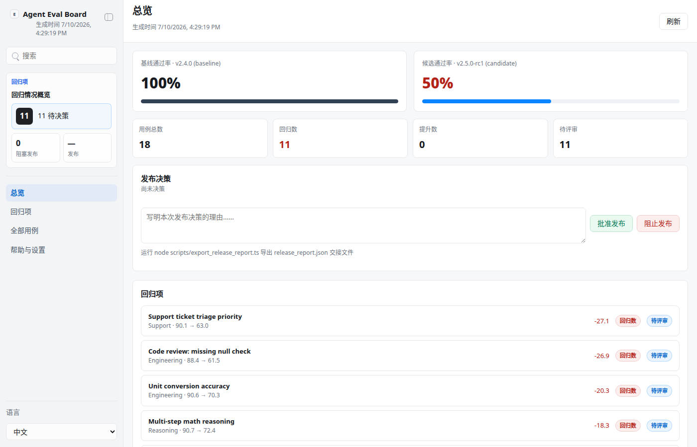

# Agent Eval & Regression Board

Agent Eval & Regression Board is a local, file-backed App-in-Skill for teams
shipping multiple LLM-agent workflows who need to catch quality regressions
before a release. It runs a fixed suite of ~18 mock test cases against a
**baseline** agent version and a **candidate** agent version, scores every
transcript on a four-part rubric (helpfulness, correctness, safety, tone), and
surfaces every case where the candidate scored meaningfully lower as a
**regression** for a human to triage.

The rubric scores are deterministic mock values presented as if produced by an
eval rubric — this is **not** a real LLM-judge call, and the app never
deploys, publishes, or modifies anything. It only reads and writes local
handoff files.

## What It Shows

- **Overview**: baseline vs candidate pass-rate comparison, case-count metrics
  (total, regressions, improvements, pending review), and a release
  `Approve release` / `Block release` panel with a required note.
- **Regressions**: every case where the candidate regressed, filterable by
  review status (needs review / blocking / acceptable).
- **All Cases**: the full 18-case suite, filterable by category.
- **Case detail**: a rubric bar comparison (helpfulness/correctness/safety/tone,
  baseline vs candidate) plus a side-by-side transcript diff, and the
  `Mark blocking` / `Mark acceptable` review-note action for regressions.
- **Help & Settings**: sanitized config summary — data provider, team name,
  baseline/candidate version labels, minimum pass-rate policy, onboarding
  state, and the accent-color picker.

Human actions — marking a regression blocking/acceptable with a note, and the
overall approve/block release decision — are written to local handoff files
(`app/.data/decisions.json`, `app/.data/release_decision.json`). A separate
export script merges everything into `app/.data/release_report.json` and
refuses to run while any regression is still undecided.

## App UI Screenshots

<table>
  <tr>
    <td width="50%"></td>
    <td width="50%"></td>
  </tr>
  <tr>
    <td><strong>Overview</strong><br>Baseline vs candidate pass-rate comparison, case-count metrics, and the release approve/block panel.</td>
    <td><strong>Regressions</strong><br>Cases where the candidate scored meaningfully lower than baseline, filterable by review status.</td>
  </tr>
  <tr>
    <td colspan="2"></td>
  </tr>
  <tr>
    <td colspan="2"><strong>Case detail</strong><br>Rubric bar comparison (helpfulness/correctness/safety/tone) plus a side-by-side transcript diff and the mark-blocking / mark-acceptable review note.</td>
  </tr>
  <tr>
    <td width="50%"></td>
    <td width="50%"></td>
  </tr>
  <tr>
    <td><strong>Overview (中文)</strong></td>
    <td><strong>Regressions (中文)</strong></td>
  </tr>
</table>

## Demo Mode

Run the app and open a safe, fully offline mock scene:

```bash
skills/kelly-agent-eval/app/start.sh
```

Use the URL printed by the launcher, then add a demo path:

```text
/?demo=1&lang=en#/overview
/?demo=1&lang=en#/regressions
/?demo=1&lang=en#/cases/support-ticket-triage
/?demo=1&lang=zh#/overview
```

Demo mode never reads or writes `app/.data/` — it generates the same
deterministic mock suite in memory (with case titles/categories localized for
`lang=zh`) purely for documentation and screenshots.

## Local Workflow

```bash
skills/kelly-agent-eval/app/start.sh          # installs deps, generates the run if missing, starts the app
node scripts/generate_eval_run.ts             # regenerate the fixed mock suite (clears prior decisions)
node scripts/validate_ui_schema.ts            # validate app/.data/eval_run.json
node scripts/export_release_report.ts         # merge run + decisions + release verdict into release_report.json
```

## Private Config

Copy `config.example.json` to `config.local.json` or
`~/.config/kelly-agent-eval/config.json` to set your team name, baseline/
candidate version labels, and release policy (minimum candidate pass rate).
There are no credentials — this skill never calls an external system. Never
commit `config.local.json` or files under `app/.data/`.
