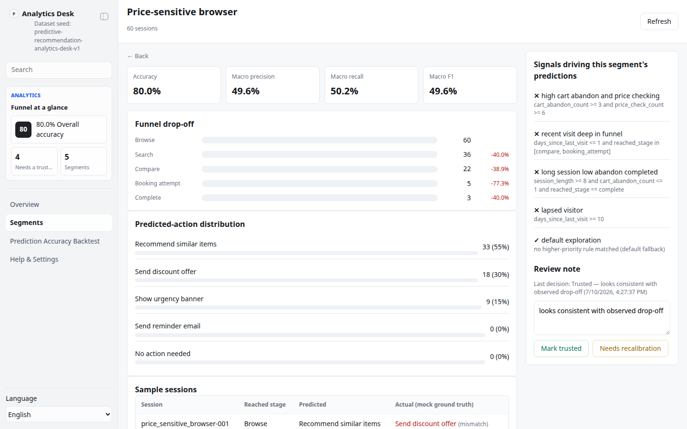

# Predictive Recommendation Analytics Desk

## Overview

Use this skill as a local, read-mostly analytics operator for a **generic,
brand-free** consumer booking/e-commerce product. It aggregates a fully
deterministic mock user-behavior dataset — session archetypes ("segments"),
their funnel drop-off, a rule-based "predicted next action" per segment, and a
prediction-accuracy backtest — into one file-backed App-in-Skill dashboard.

Default interaction mode: App UI. Unless the user explicitly asks for
chat-only handling, ensure the mock dataset exists (`scripts/generate_batch.ts`),
start/reuse the local app with `app/start.sh`, and give the actual local URL.
Use chat-only mode only when the user says "纯聊天", "chat only", "不要打开
UI", or similar.

This is primarily a **dashboard** app type (read-mostly, no approval
lifecycle). It carries exactly one narrow human-review surface: marking a
segment's prediction rule "trusted" or "needs recalibration" with a note,
recorded in `app/.data/decisions.json`. That review never edits the rule
itself, the dataset, or any live system — it is a review record only.

## App UI Screenshots

<table>
  <tr>
    <td width="50%"></td>
    <td width="50%"></td>
  </tr>
  <tr>
    <td><strong>Overview</strong><br>Overall funnel drop-off (browse → search → compare → booking attempt → complete), total sessions, overall backtest accuracy, and how many segments still need a trust decision.</td>
    <td><strong>Segments</strong><br>Per-segment cards: session count, dominant predicted action, backtest accuracy/F1, and the current trusted / needs-recalibration badge.</td>
  </tr>
  <tr>
    <td width="50%"></td>
    <td width="50%"></td>
  </tr>
  <tr>
    <td><strong>Segment detail</strong><br>Segment funnel, predicted-action distribution, sample sessions (predicted vs. mock actual), the matched/unmatched rule triggers that drove the prediction, and the trusted / needs-recalibration review panel.</td>
    <td></td>
  </tr>
</table>

## Boundary

- Fully mock, fully offline. There is no real user data, no live product
  integration, and no real ML/LLM call anywhere in this skill — every
  "predicted next action" comes from a fixed if/else rule in `lib/predict.ts`.
- The app reads and writes local files only. It must not call any external
  service.
- The one human action (mark trusted / needs recalibration + note) writes
  `app/.data/decisions.json` only. It never changes the rule, regenerates the
  dataset, or triggers any other system.
- Do not name any real company, brand, or product. Keep the product profile
  generic ("Example Booking Co.", configurable in `config.local.json`).

## First Run

On invocation, ensure the mock dataset exists:

```bash
node skills/kelly-behavior-predict/scripts/generate_batch.ts
node skills/kelly-behavior-predict/scripts/validate_ui_schema.ts
```

This writes `app/.data/dataset.json` (deterministic — same seed always
produces byte-identical output) and an empty `app/.data/decisions.json` if one
doesn't already exist. There is no external onboarding required (no
credentials, no live connection) — the dataset generator IS the setup step.

## Local App

Start the dashboard with:

```bash
skills/kelly-behavior-predict/app/start.sh
```

The app uses local HTTP on `127.0.0.1`, preferring port `3000` through `4000`,
or `KELLY_BEHAVIOR_PREDICT_UI_PORT` when set. First run installs `hono` and
`@hono/node-server`; the frontend is zero-build vanilla.

## Demo Mode

- `?demo=1` opens the same deterministic mock dataset the app always uses (it
  has no live data source to demo *against*) at the Overview.
- `?demo=segments`, `?demo=backtest`, and `?demo=detail` select a starting
  route for screenshots/docs (segments grid, backtest view, or the
  `price_sensitive_browser` detail pane).
- `lang=en` or `lang=zh` forces UI chrome language for screenshots.

## Data Model

Read `references/ui-schema.md` before editing the app, scripts, or `lib/`.
Primary local files:

- `app/.data/dataset.json`: the generated mock funnel/segment/backtest dataset.
- `app/.data/decisions.json`: human review decisions, keyed by segment id.
- `app/.data/onboarding.json`, `app/.data/agent.lock`: standard App-in-Skill
  scaffolding, present for consistency even though this skill needs no
  external onboarding.

Data provider: `lib/data-provider/local-file-provider.ts` (default,
env-selected via `KELLY_BEHAVIOR_PREDICT_DATA_PROVIDER=local`). The Hono app
and scripts reach storage only through `lib/data-provider/`, never
`node:fs` directly, so the same app stays platform-neutral.

## The Rule (not a model)

`lib/predict.ts` documents and implements the entire prediction rule: a
short, ordered list of if/else triggers over four mock session signals
(`cart_abandon_count`, `price_check_count`, `days_since_last_visit`,
`session_length`) plus `reached_stage`. The first matching trigger determines
`predicted_action`; the segment detail view shows every trigger and whether it
matched, so "why this prediction" is always inspectable. `lib/backtest.ts`
computes a standard precision/recall/F1 confusion-matrix summary comparing
`predicted_action` against a seeded mock `actual_action` per session — this is
what the Backtest view renders, at both the overall and per-segment level.

## Views

- `#/overview`: overall funnel drop-off, total sessions, overall backtest
  accuracy, and how many segments still need a trust decision.
- `#/segments`: per-segment cards (funnel size, dominant predicted action,
  backtest accuracy/F1, decision badge).
- `#/segments/<id>`: segment detail — funnel, predicted-action distribution,
  sample sessions (predicted vs. actual), rule triggers, and the decision
  panel (mark trusted / needs recalibration + note).
- `#/backtest`: prediction-accuracy backtest — overall and per-segment
  precision/recall/F1 tables.
- `#/settings`: sanitized config summary — data provider, product profile,
  target-precision note, and dataset seed.

## Safety

- Never invent real user data or a real ML/LLM call; keep the rule in
  `lib/predict.ts` the single source of truth for every prediction shown.
- Do not commit `app/.data/`, `config.local.json`, or any local env file.
- The decision panel is a review record only — it must never regenerate the
  dataset, edit the rule, or reach any external system.
