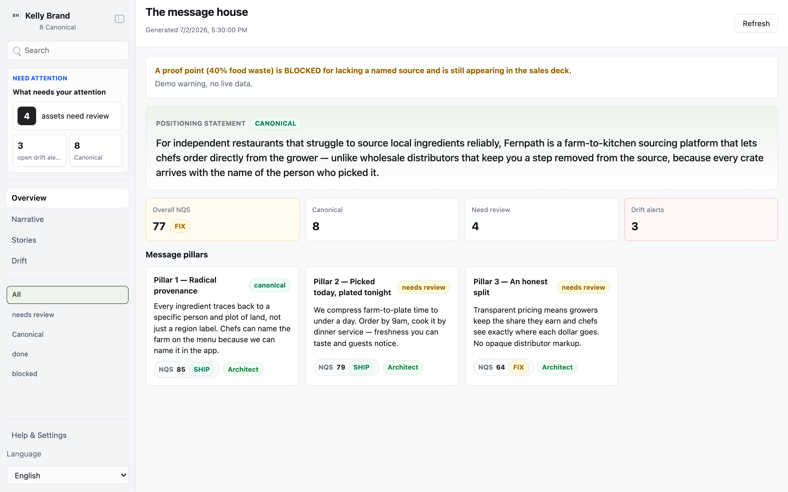
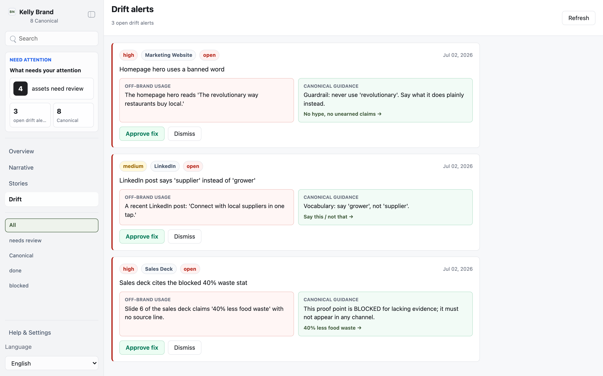
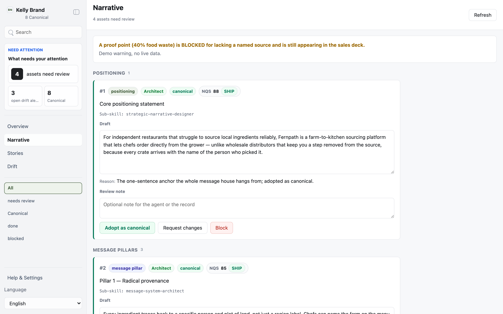
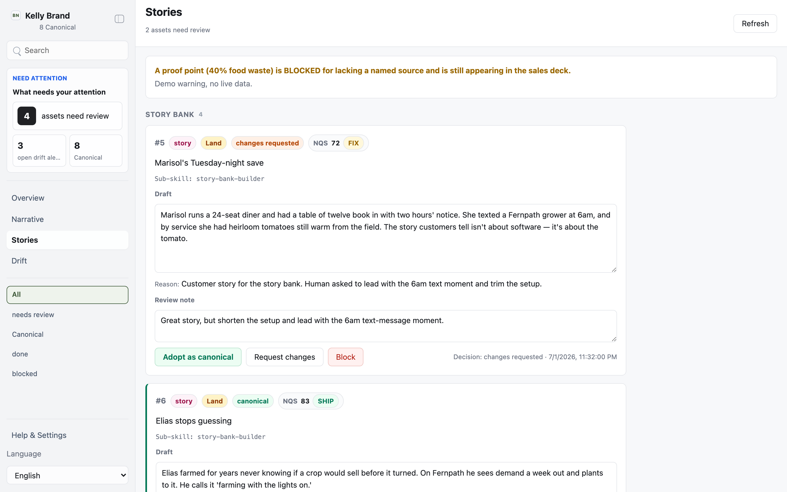

# Kelly Brand

Kelly Brand is a local App-in-Skill workbench for a brand's **narrative single source of truth**, organized around the **TALE** framework — **Trace → Architect → Land → Evaluate**. The agent drafts the message house; you curate which drafts become the **canonical** narrative; a drift monitor flags off-brand usage across channels.

## What It Shows

- Overview — the **message house**: the positioning statement, the value pillars, the overall Narrative Quality Score (NQS) with its SHIP / FIX / BLOCK gate, and the open drift-alert count.
- Narrative — message pillars plus vocabulary and guardrails, canonical vs draft, each editable with its NQS and TALE phase. Adopt / Request changes / Block per asset.
- Stories — the story bank and the proof points with their evidence (a named source and stat). A proof point with no source is blocked.
- Drift — off-brand usage the drift monitor flagged, each showing the offending copy vs the canonical guidance, with Approve fix / Dismiss.
- The app never publishes anything. Adopting a draft as canonical and exporting the narrative are executed by the skill only after your explicit approval.

The left sidebar keeps fixed workflow filters (All / Needs Review / Canonical / Done / Blocked) alongside the views. "Canonical" is the label for the adopted (`approved`) state.

## TALE and the 16 sub-skills

Every narrative asset carries a TALE phase and names the sub-skill that produced it:

- **Trace** — narrative-baseline-mapper, category-narrative-mapper, audience-belief-mapper, positioning-truth-tracer.
- **Architect** — strategic-narrative-designer, message-system-architect, brand-language-codifier, story-bank-builder.
- **Land** — narrative-cascade-planner, pitch-narrative-builder, narrative-enablement-kit, proof-point-packager.
- **Evaluate** — message-test-designer, narrative-resonance-monitor, narrative-drift-monitor, and the gate: **narrative-quality-auditor ⛩** (NQS → SHIP / FIX / BLOCK).

## App UI Screenshots

<table>
  <tr>
    <td width="50%"></td>
    <td width="50%"></td>
  </tr>
  <tr>
    <td><strong>Overview</strong><br>The message house — positioning, value pillars, overall NQS, and the drift-alert count.</td>
    <td><strong>Drift</strong><br>Cross-channel off-brand alerts — offending usage versus the canonical guardrail.</td>
  </tr>
  <tr>
    <td width="50%"></td>
    <td width="50%"></td>
  </tr>
  <tr>
    <td><strong>Narrative</strong><br>Message pillars and vocabulary guardrails, canonical versus draft.</td>
    <td><strong>Story bank</strong><br>Customer stories and evidence-backed proof points.</td>
  </tr>
</table>

## Demo Mode

Run the app and open a safe mock-data scene for the invented brand "Fernpath":

```bash
skills/kelly-brand/app/start.sh
```

Use the URL printed by the launcher (default port `3230`), then add one of these demo paths:

```text
/?demo=overview&lang=en#/overview
/?demo=narrative&lang=en#/narrative
/?demo=stories&lang=en#/stories
/?demo=drift&lang=en#/drift
/?demo=settings&lang=en#/settings
```

Demo mode never reads local brand files or private config.

## Private Config

Copy `config.example.json` to `config.local.json` or `~/.config/kelly-brand/config.json`, then put channel source URLs/tokens in local env files only. Never commit real brand data, tokens, or files under `app/.data/`.

## Design

Kelly Brand follows the App-in-Skill specification: a skill-launched local UI, a file handoff, a lock, a data provider, private config, onboarding, and a chat-only fallback. See the spec paper: <https://mr-kelly.github.io/research/app-in-skill-specification-for-pairing-agent-skills-with-a-local-companion-ui.pdf>
