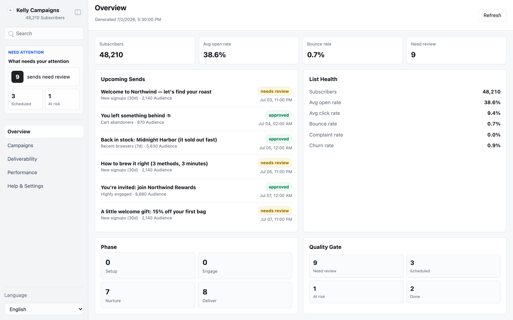
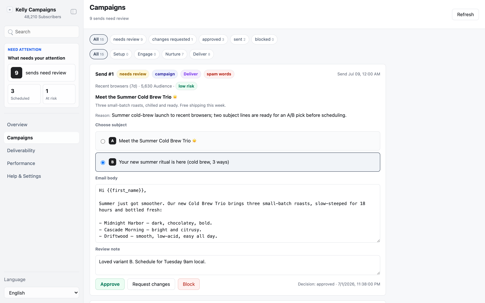
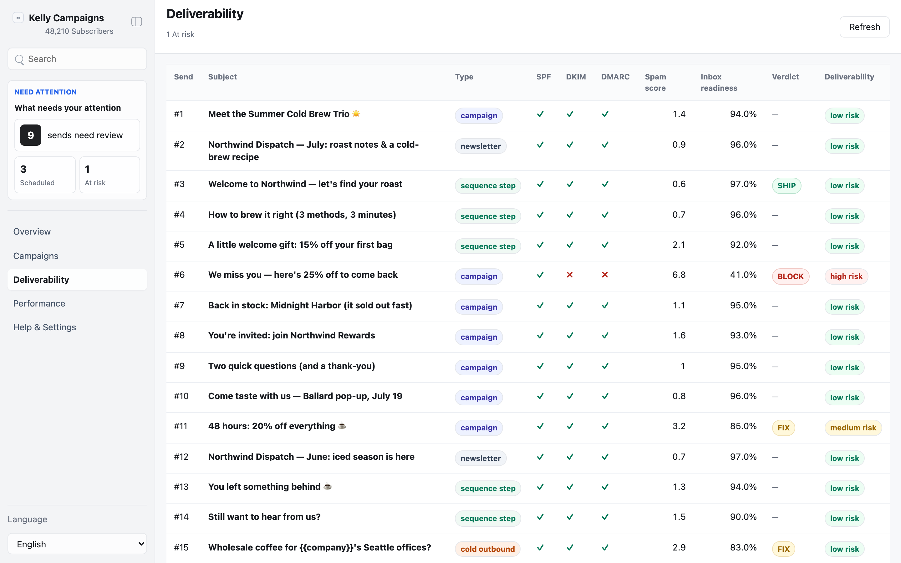
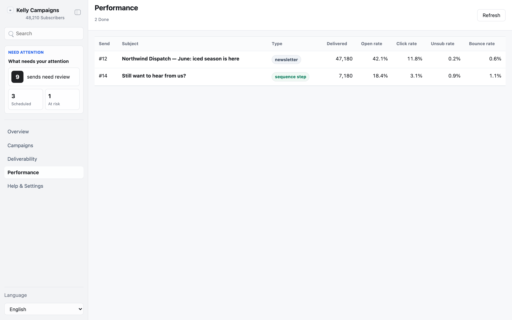

# Kelly Campaigns

Kelly Campaigns is a local App-in-Skill desk for **outbound email marketing**: building segments, drafting campaigns / newsletters / sequences, running pre-send deliverability and subject-line QA, and approving every send before it is scheduled. It is structured around the **SEND** discipline — Setup, Engage, Nurture, Deliver — with an `email-quality-auditor` gate that scores each send (EQS) and returns **SHIP / FIX / BLOCK**.

This is outbound marketing to a subscriber list — distinct from `kelly-email`, which triages an incoming inbox.

## What It Shows

- Overview: upcoming sends, list health (subscribers, bounce/complaint/churn rates, avg open/click), and a SEND-phase breakdown.
- Campaigns: the review queue of drafted sends with type + phase + quality-gate badges, segment and audience size, deliverability risk, an editable body draft, an A/B subject picker, review notes, and Approve / Request changes / Block decisions.
- Deliverability: a pre-send QA table — SPF/DKIM/DMARC, spam score, inbox readiness, and the SEND verdict per send.
- Performance: open / click / unsub / bounce by sent campaign.
- The app never sends anything. Approved sends are scheduled by the skill through the configured ESP only after explicit approval, and a BLOCK verdict is a hard stop.

## App UI Screenshots

<table>
  <tr>
    <td width="50%"></td>
    <td width="50%"></td>
  </tr>
  <tr>
    <td><strong>Overview</strong><br>Send calendar plus list health — subscribers, bounce, churn, and complaint rates.</td>
    <td><strong>Campaigns</strong><br>Draft and approval queue across campaigns, newsletters, and sequence steps.</td>
  </tr>
  <tr>
    <td width="50%"></td>
    <td width="50%"></td>
  </tr>
  <tr>
    <td><strong>Deliverability</strong><br>Pre-send QA — SPF/DKIM/DMARC, spam score, and the EQS SHIP/FIX/BLOCK gate.</td>
    <td><strong>Performance</strong><br>Open, click, and unsubscribe rates by campaign.</td>
  </tr>
</table>

## Demo Mode

Run the app and open a safe mock-data scene:

```bash
skills/kelly-campaigns/app/start.sh
```

Use the URL printed by the launcher, then add one of these demo paths:

```text
/?demo=overview&lang=en#/overview
/?demo=campaigns&lang=en#/campaigns
/?demo=deliverability&lang=en#/deliverability
/?demo=performance&lang=en#/performance
/?demo=detail&lang=en#/campaigns/send-summer-launch
```

Demo mode never reads local campaign files or private config.

## Private Config

Copy `config.example.json` to `config.local.json` or `~/.config/kelly-campaigns/config.json`, then put the ESP API key in a local env file only (referenced from config by `*_env` name). Never commit real subscriber data, tokens, or files under `app/.data/`.
