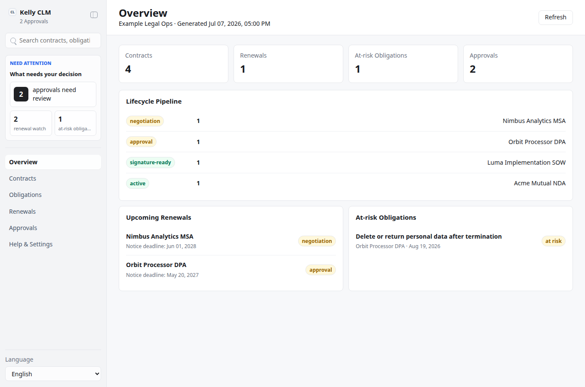
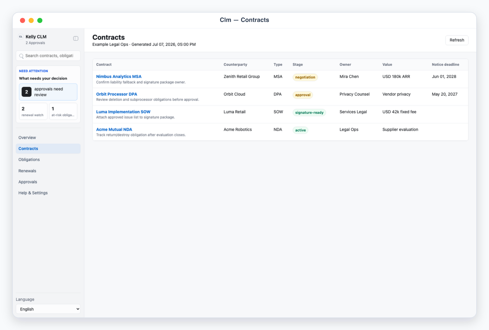
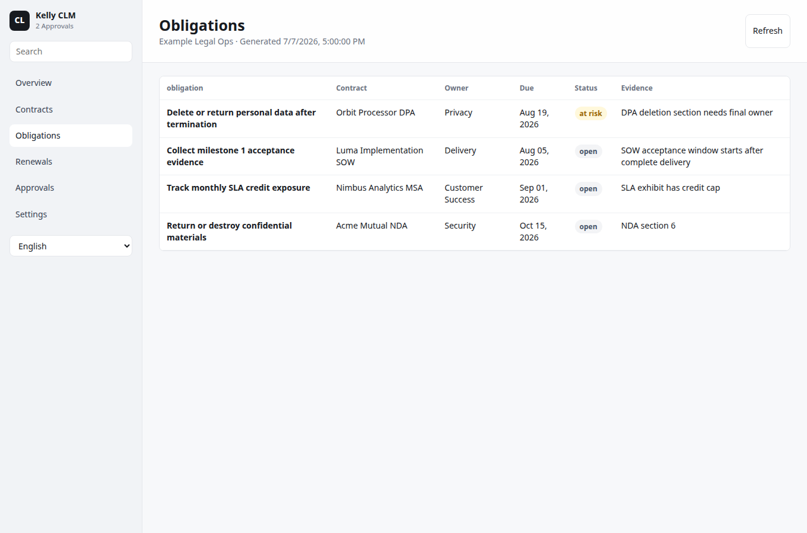
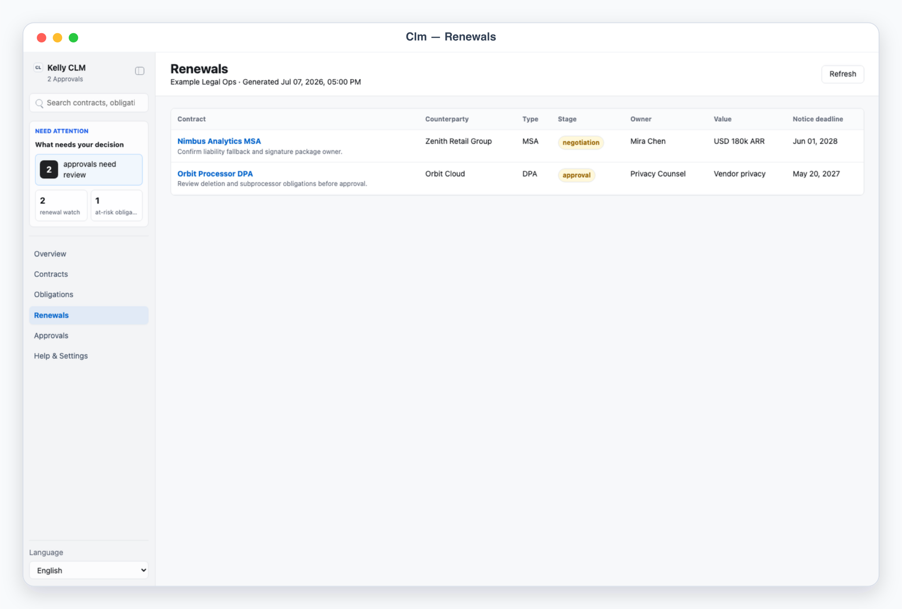

# Kelly CLM

Kelly CLM is a lightweight App-in-Skill contract lifecycle desk. It keeps a simple local view of contract inventory, lifecycle stage, owners, obligations, renewal notices, and approval reminders.

It is deliberately separate from `kelly-legal-contracts`: use this for contract operations and reminders, not detailed clause review or redline strategy.

## What It Shows

- Overview: lifecycle pipeline, metrics, upcoming renewals, and at-risk obligations.
- Contracts: searchable contract inventory with owner, stage, value, and dates.
- Obligations: due dates, owners, status, and evidence notes.
- Renewals: notice deadlines and renewal windows.
- Approvals: local-only handoff queue for reminders and operational follow-up.

## Demo

```bash
skills/kelly-clm/app/start.sh
```

Open the printed URL, then use:

```text
/?demo=overview&lang=en#/overview
/?demo=contracts&lang=en#/contracts
/?demo=obligations&lang=en#/obligations
/?demo=renewals&lang=en#/renewals
/?demo=approvals&lang=en#/approvals
```

## App UI Screenshots

<table>
  <tr>
    <td width="50%"></td>
    <td width="50%"></td>
  </tr>
  <tr>
    <td><strong>Overview</strong><br>Lifecycle dashboard with stage pipeline, upcoming renewals, and at-risk obligations.</td>
    <td><strong>Contracts</strong><br>Simple contract inventory with owner, counterparty, stage, value, and dates.</td>
  </tr>
  <tr>
    <td width="50%"></td>
    <td width="50%"></td>
  </tr>
  <tr>
    <td><strong>Obligations</strong><br>Owner-assigned obligation tracker with due dates and status.</td>
    <td><strong>Renewals</strong><br>Renewal board with notice deadlines and simple follow-up actions.</td>
  </tr>
</table>

## Boundary

The app never updates an external CLM, starts e-signature, contacts counterparties, signs contracts, accepts terms, or provides legal advice. Approval buttons write local decision records only.
