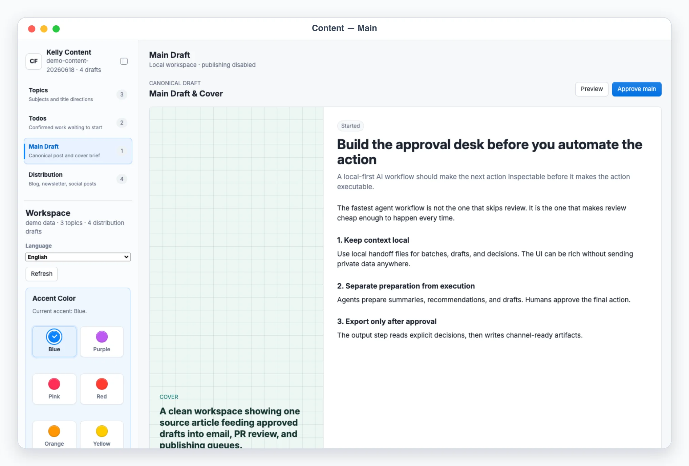
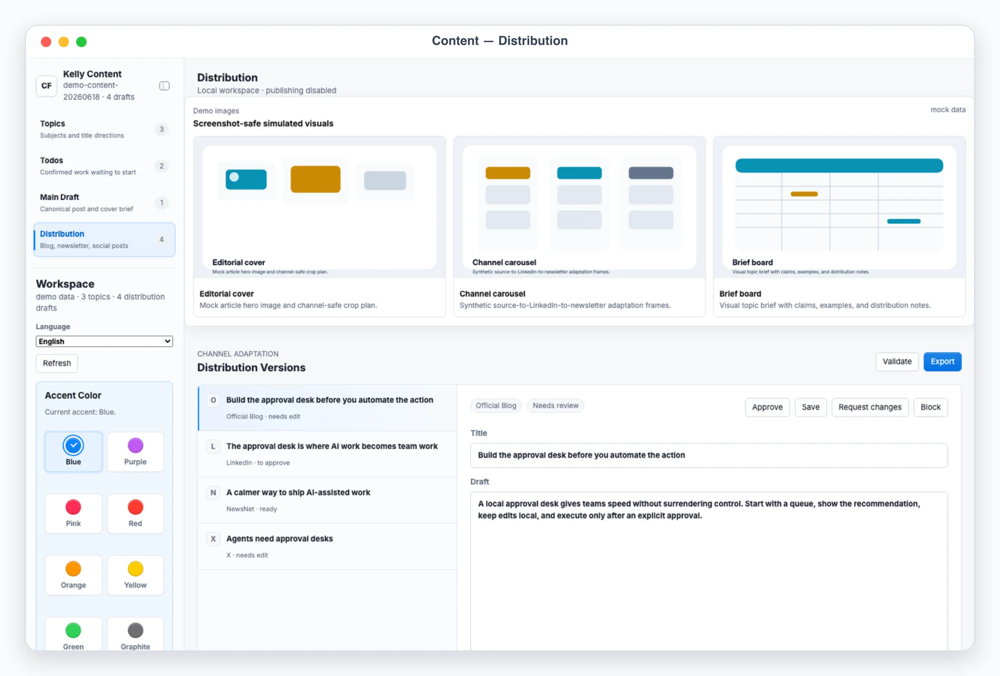

# Kelly Content

## App UI Screenshots

<table>
  <tr>
    <td width="50%"></td>
    <td width="50%"></td>
  </tr>
  <tr>
    <td><strong>Todo queue</strong> Confirmed content directions queued for AI writing, with ownership, status, and next-step controls.</td>
    <td><strong>Topic discovery</strong> Mock editorial planning with keyword clusters, audience fit, and topic opportunities.</td>
  </tr>
  <tr>
    <td width="50%"></td>
    <td width="50%"></td>
  </tr>
  <tr>
    <td><strong>Main draft</strong> Long-form writing workspace with outline, draft sections, source notes, and approval status.</td>
    <td><strong>Distribution review</strong> Channel handoff view for publishing, social snippets, newsletter framing, and final checks.</td>
  </tr>
</table>

## Overview

Use this skill to turn one source idea, blog post, transcript, outline, or product announcement into an editable multi-channel content batch. Default to a local App-in-Skill review UI for batches; use chat-only mode when the user says "chat only", "no UI", "纯聊天", "不要打开 UI", or similar.

The skill prepares and exports content. It does not publish to external platforms, schedule posts, upload media, send messages, or mutate remote systems unless a future implementation adds an explicit connector and the user approves the exact action.

## Default Workflow

1. Clarify or infer the source, target audience, desired channels, language, and offer/CTA.
2. If private config exists, use brand voice, channel defaults, official URLs, and taboo/risk terms from it. Otherwise use `config.example.json` only as a template, not as live context.
3. Extract the source's core idea, proof points, examples, keywords, reusable quotes, and action the reader should take.
4. Generate a batch with one item per channel/content unit using `scripts/generate_batch.ts`.
5. Validate the batch with `scripts/validate_batch.ts`.
6. Launch or reuse the local UI with `app/start.sh` and send the user to the actual started URL, preferring `http://127.0.0.1:3000/` and the `3000-4000` port range unless an env override is set.
7. After the user approves or edits items in the UI, run `scripts/export_decisions.ts` to export approved drafts to Markdown and JSON.
8. If the user requested chat-only mode, present numbered drafts in chat and ask for approval there.

## App UI Contract

Use these local files as the contract between Codex, scripts, and the UI:

- `app/.data/current_batch.json`: current generated content batch.
- `app/.data/decisions.json`: per-item user decisions, edits, notes, and approval status.
- `app/.data/export_report.json`: latest export report.
- `app/.data/agent.lock`: temporary lock while Codex or scripts write local state.

Workflow statuses:

- `needs_review`: generated item needs user edits or guidance.
- `to_approve`: item is polished enough for approval.
- `approved`: user approved export.
- `done`: item has been exported or intentionally completed.
- `blocked`: item needs missing information, media, permission, or facts.

When writing a batch, keep stable item IDs so comments like "change #2" can be resolved.

## Data Providers (local + busabase)

The UI and scripts talk to a `ReviewProvider` (`lib/data-provider/`), not directly to files. Select it with `KELLY_CONTENT_DATA_PROVIDER` (or `data_provider` in config); default `local`.

- `local` — zero-dependency JSON handoff files in `app/.data/` (the contract above). This is the offline reference implementation.
- `busabase` — a thin HTTP client to a Busabase base. A content piece is a Busabase **record**; an agent draft is a **change request**; the human verdict is a **review**; an edit is an **operation revision**; publishing is a **merge**. Configure `config.busabase.{base_url,base_id}` (open-source single-tenant `apps/busabase` needs no token; `busabase-cloud` reads `KELLY_CONTENT_BUSABASE_API_KEY`).

Both implement the same review verbs, so switching providers is a config change, not a rewrite. The `saveDecision` actions are provider-neutral:

- `approve` → review verdict approved (eligible for export/merge).
- `revise` → save the human's edited title/body as a new version (Busabase: an operation revision; stays in review).
- `request_changes` → ask the agent to revise; queues an agent task (Busabase: verdict reject → `changes_requested`; the CR auto-returns to review after the agent revises).
- `block` → close/reject the item.

Field mapping for busabase mode: `title, body, channel, summary, format, cta, hashtags, media_brief, hook` map to a record commit's `fields`.

Provider notes:
- The ideation stages below (`topics`, `todos`, `main_content`) are **local-only**; in busabase mode plan locally, then publish drafts to Busabase for review/merge.
- `listAgentTasks()` exposes items the agent should revise (local: derived from `request_changes`/noted `revise` decisions in `app/.data/agent_tasks.json`; busabase: `GET /api/v1/agent/tasks`).

## Content Repository Stages

Model the local app as a staged content repository, not only a draft queue:

1. `topics`: subject discovery. Treat each topic as a broad subject/material area, not a final headline. Show candidate subjects from automated search, system generation, or preset editorial plans. For each subject, provide multiple `directions` with `title`, `description`, `angle`, and `status`; the user confirms a title + description direction before moving to the main draft.
2. `todos`: production queue. After the user confirms a title + description direction, create a todo item. Do not treat the direction as ready for AI main-draft work until the user marks the todo as `开工` / `in_progress`.
3. `main_content`: canonical source draft. Show the approved title + description direction's main blog/article with rich preview, cover/image brief, embedded media slots, and rendered HTML when available. Markdown is acceptable as storage, but the UI should render a polished editorial preview. Generate or update the main draft only for todos marked `in_progress`.
4. `distribution`: channel adaptations and final channel records. Show Official Blog, WeChat, Xiaohongshu, NewsNet/newsletter, LinkedIn, X/Twitter, and other platform versions with review/edit/approve controls. Keep publish/export status, URLs, and performance signals on these distribution items instead of maintaining a separate outputs stage.

If a future automation writes `topics`, `todos`, `main_content`, or `distribution` into `current_batch.json`, the UI should prefer those explicit fields. If they are missing, it may derive a temporary repository view from `items`.

## Content Generation Rules

- Preserve the source's claims. Do not invent results, dates, customer stories, statistics, prices, legal/compliance statements, or endorsements.
- Ask or mark `blocked` when the source lacks needed proof, product details, screenshots, links, or policy facts.
- Separate platform adaptation from translation: changing channel format is allowed; changing the promise is not.
- Prefer concrete hooks, specifics, and reader benefit over generic motivational copy.
- Keep CTA and links consistent with private config or the user's explicit request.
- For Chinese-language work, support natural Simplified Chinese by default unless the source/user asks for another language.
- For Xiaohongshu, produce a scroll-stopping title, short structured body, optional image/carousel brief, and hashtag set.
- For long-form derivatives such as newsletter or WeChat, preserve nuance and structure; avoid shrinking the idea into slogans.
- For short social posts, make each post independently understandable; do not rely on the reader seeing the original blog.

Read `references/channel-playbook.md` when choosing or adapting channel-specific formats.

## Private Configuration

Keep user-specific operating context out of committed files. If the user wants persistent brand/channel settings, create one of:

1. `KELLY_CONTENT_CONFIG=/absolute/path/to/config.json`
2. `skills/kelly-content/config.local.json`
3. `~/.config/kelly-content/config.json`

Use `config.example.json` as the starting template only. Store non-secret settings there: brand profile, audience, tone, official URLs, CTA defaults, channel defaults, risk terms, and export preferences. Store secrets only in private env files if future connectors need them; this skill currently has no publishing connector and should not need secrets. Keep this skill zero-dependency and do not add YAML parsing packages.

## Scripts

- `scripts/generate_batch.ts --source path-or-text --channels official_blog,xiaohongshu,wechat,newsletter,linkedin,x --audience "..." --cta "..."`
  Persists the batch via the active provider (local: `app/.data/current_batch.json`; busabase: one change request per item). The generator uses deterministic heuristics and is meant as a first pass; Codex should improve drafts with judgment before handing them to the user.
- `scripts/validate_batch.ts [batch-path]`
  Validates the required batch shape and status values (local batch files).
- `scripts/export_decisions.ts`
  Publishes approved/edited content via the active provider (local: Markdown + JSON under `exports/<batch-id>/`; busabase: merge approved change requests into canonical records).

Run the validator after creating or editing any batch file. Run export only after the user has approved items in the UI or in chat.

## Chat-Only Mode

When the user asks to avoid the UI:

1. Produce a compact channel plan.
2. Present numbered drafts with channel, title/hook, body, CTA, and notes.
3. Ask for approval or edits.
4. After approval, write the final approved pack to local Markdown if the user wants files.

Never claim content is published unless the user explicitly used a publishing connector and it succeeded.
