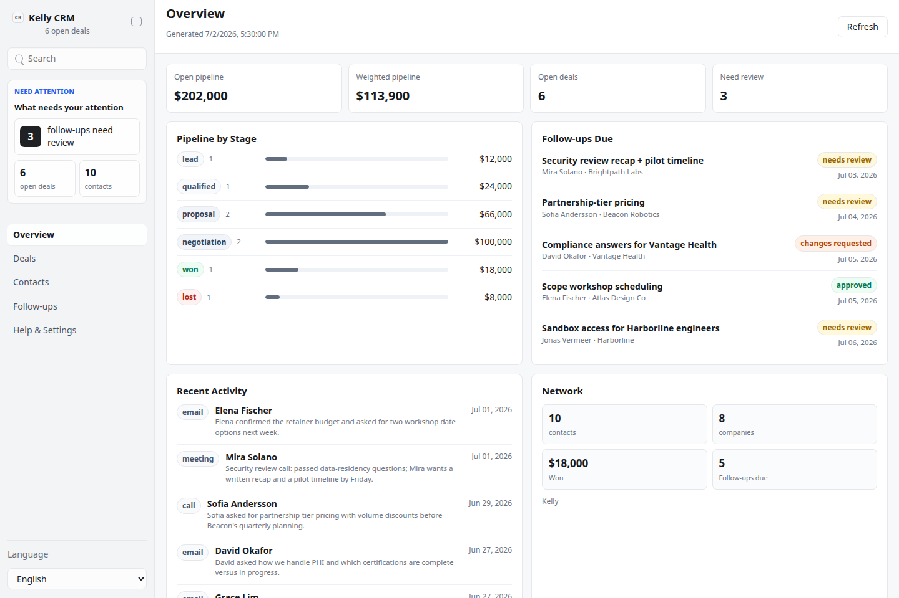
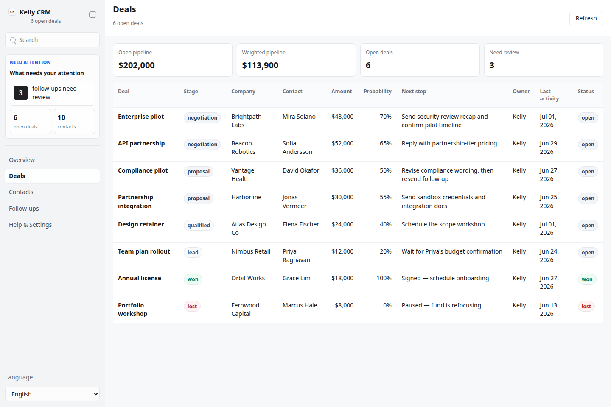
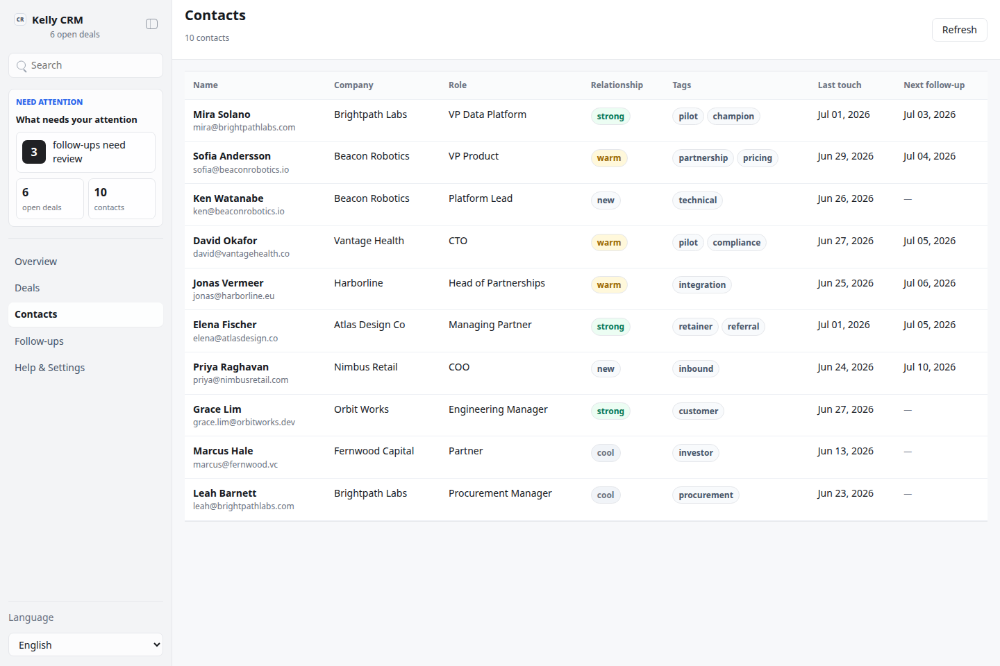
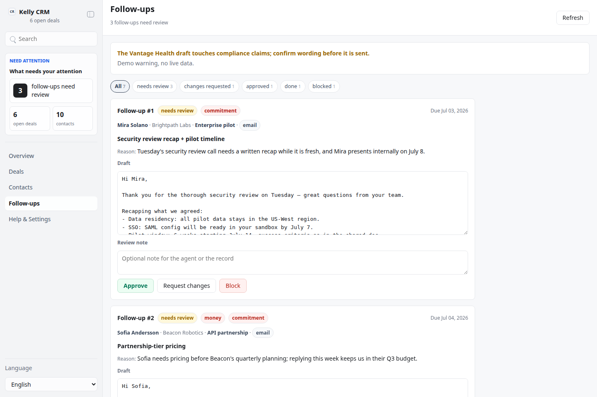

# Kelly CRM

## Overview

Use this skill as Kelly's personal CRM operator. It keeps a file-backed App-in-Skill dashboard over contacts, companies, deals, and interactions, plus a review queue of agent-drafted follow-up messages. The skill gathers and updates CRM data from whatever Kelly feeds it — emails, meeting notes, chat asks — drafts follow-ups, and executes approved follow-ups only through other channels (for example `kelly-email`) after explicit approval.

Default interaction mode: App UI. Unless the user explicitly asks for chat-only handling, check onboarding/config, refresh or regenerate the local CRM snapshot, start/reuse the local app with `app/start.sh`, and give the actual local URL. Use chat-only mode only when the user says "纯聊天", "chat only", "不要打开 UI", or similar; in that mode present numbered follow-ups (`Follow-up #1`) and take verdicts in the conversation.

## App UI Screenshots

<table>
  <tr>
    <td width="50%"></td>
    <td width="50%"></td>
  </tr>
  <tr>
    <td><strong>Overview</strong><br>CRM command desk with pipeline totals by stage, follow-ups due, recent activity, and network counts.</td>
    <td><strong>Deals</strong><br>Pipeline table across stages with amounts, probability, next steps, and a per-deal interaction timeline.</td>
  </tr>
  <tr>
    <td width="50%"></td>
    <td width="50%"></td>
  </tr>
  <tr>
    <td><strong>Contacts</strong><br>Contact list with relationship strength, last touch, and per-contact interaction history and open deals.</td>
    <td><strong>Follow-up queue</strong><br>Agent-drafted follow-up messages with editable drafts, risk badges, and approve/request-changes/block decisions.</td>
  </tr>
</table>

## Boundary

- The skill may read sources Kelly provides, normalize CRM data, draft follow-up messages, validate schemas, and write local handoff files.
- The app reads and writes local files only. It must never send emails or messages, call external APIs, mutate remote CRMs, or perform any external side effect.
- Outbound follow-up messages are always approval-required. Sending is delegated to other skills (for example `kelly-email`) and happens only after the user approves the specific follow-up in the app or in chat. `scripts/execute_decisions.mjs` only records handoff operations in `execution_report.json`; it performs no sending itself.
- Treat all contact and deal data as sensitive. Do not commit `config.local.json`, env files, `app/.data/`, exports, or personal contact details.

## First Run And Onboarding

On invocation, check `app/.data/onboarding.json` and private config readiness. If onboarding is absent/incomplete, guide setup before doing real CRM work.

Private config priority:

1. `KELLY_CRM_CONFIG=/absolute/path/to/config.json`
2. `skills/kelly-crm/config.local.json`
3. `~/.config/kelly-crm/config.json`
4. `skills/kelly-crm/config.example.json` as template only

Env priority:

1. Existing environment variables
2. `KELLY_CRM_ENV_FILE=/absolute/path/to/.env`
3. Repository root `.env`
4. `skills/kelly-crm/.env.local`
5. `~/.config/kelly-crm/.env`

Ask for non-secret setup details only: operator profile (name, role, company, timezone), pipeline stages, currencies, outbound channels and which skill handles each, style/tone for drafts, and which env var names hold channel tokens. Never ask the user to paste secret values into chat. Secrets belong only in local env files.

When setup is complete and the user confirms, write `app/.data/onboarding.json`:

```json
{
  "completed": true,
  "completed_at": "ISO timestamp",
  "config_version": "1"
}
```

## Local App

Start the dashboard with:

```bash
skills/kelly-crm/app/start.sh
```

The app uses local HTTP on `127.0.0.1`, preferring port `3000` through `4000`, or `KELLY_CRM_UI_PORT` when set. The launcher reuses a running instance only when `/api/state` proves it is the same app (`app: "kelly-crm"`).

Required app views:

- `#/overview`: CRM command desk. Human-attention counts, pipeline summary by stage (lead → qualified → proposal → negotiation → won/lost) with deal counts and amounts, follow-ups due, recent activity feed, and contact/company totals.
- `#/deals` and `#/deals/<deal_id>`: pipeline table with stage, company, contact, amount, currency, probability, next step, owner, last activity, and status badges. Detail shows the deal timeline of interactions, notes, linked contacts, and the agent-suggested next action.
- `#/contacts` and `#/contacts/<contact_id>`: contact list with name, company, role, relationship strength, tags, last touch, and next follow-up. Detail shows profile, interaction timeline (email/meeting/social/note entries), open deals, and agent notes.
- `#/followups`: review queue over agent-drafted follow-ups in workflow states `needs_review`, `changes_requested`, `approved`, `done`, `blocked`. Each item shows a stable row ref (`Follow-up #1`), reason, risk badges, an editable `suggested_reply` draft, a `Review note` textarea, and decision buttons Approve / Request changes / Block that write to `decisions.json`. The queue is read-only while `agent.lock` exists.
- `#/settings`: sanitized config summary. Operator profile, pipeline stages, configured channels, env readiness booleans, data provider name, and onboarding state. Never expose secret values.

Demo mode:

- `?demo=1` opens a deterministic mock CRM for documentation and screenshots.
- `?demo=overview`, `?demo=deals`, `?demo=contacts`, `?demo=followups`, and `?demo=detail` select named mock scenes; `detail` deep-links to a deal detail.
- `lang=en` or `lang=zh` forces UI chrome language for screenshots.
- Demo API responses must never read or write files under `app/.data/` or any private config.

UI language: support English and Chinese chrome with `Auto` default. Keep contact names, company names, deal names, notes, and drafts in their original language.

## File Contract

Read `references/crm-schema.md` before editing the app, scripts, or any generated CRM JSON.

Primary local files:

- `app/.data/crm_snapshot.json`: normalized CRM snapshot (contacts, companies, deals, interactions, followups, metrics) generated by the skill/scripts.
- `app/.data/decisions.json`: user verdicts and review notes keyed by followup id, written by the app.
- `app/.data/agent_tasks.json`: queued agent work — follow-ups in `changes_requested` with the user's comment. The skill polls this to pick up revisions.
- `app/.data/execution_report.json`: latest handoff/execution results written by `scripts/execute_decisions.mjs`.
- `app/.data/onboarding.json`: onboarding completion marker.
- `app/.data/agent.lock`: temporary lock while the skill is generating or executing. The app rejects decision writes while it exists.
- `config.local.json`: private operator configuration, ignored by git.

Use `scripts/validate_ui_schema.mjs` before relying on a snapshot in the UI. The app may show an empty setup state when no snapshot exists.

## Normal Workflow

1. Detect mode. Default to App UI.
2. Load private config through the config helpers. If only `config.example.json` exists, enter onboarding.
3. When Kelly feeds new material (emails, meeting notes, chat asks): acquire `app/.data/agent.lock`, update `crm_snapshot.json` — upsert contacts/companies/deals by stable ids, append interactions, recompute metrics — draft new follow-ups into `followups[]` with `status: "needs_review"`, a clear `reason`, risk badges, and a `suggested_reply` draft, validate with `scripts/validate_ui_schema.mjs`, then release the lock.
4. Start/reuse the UI and report the URL so Kelly can review the pipeline and the follow-up queue.
5. Poll `app/.data/agent_tasks.json` for `changes_requested` items. Re-draft each one according to the user's comment, set it back to `needs_review` in the snapshot, and clear the task.
6. On "execute" / "send approved follow-ups": re-read `decisions.json`, re-check the lock, and run `scripts/execute_decisions.mjs --apply` to record `handoff_to_email` (or other channel) operations in `execution_report.json`. Then perform the actual sends only through the corresponding skill (for example `$kelly-email`) with the approved, possibly user-edited draft, one follow-up at a time, and mark each `done` in the snapshot afterwards.
7. Never send anything for items without an explicit `approve` decision, and never re-send items already marked `done` in the execution report.

## Safety Defaults

- Treat every outbound message, meeting invitation, introduction, and pricing commitment as approval-required.
- Store only the minimum contact content needed for review; keep raw source emails and documents out of the snapshot.
- Redact tokens and credential-like strings from logs, reports, and UI state; expose only boolean readiness for configured env vars.
- Keep stable ids (`contact_id`, `deal_id`, `followup_id`) so repeated updates and executions are idempotent.
- If decisions and the snapshot disagree (missing followup, stale ref), stop and regenerate rather than guessing.
