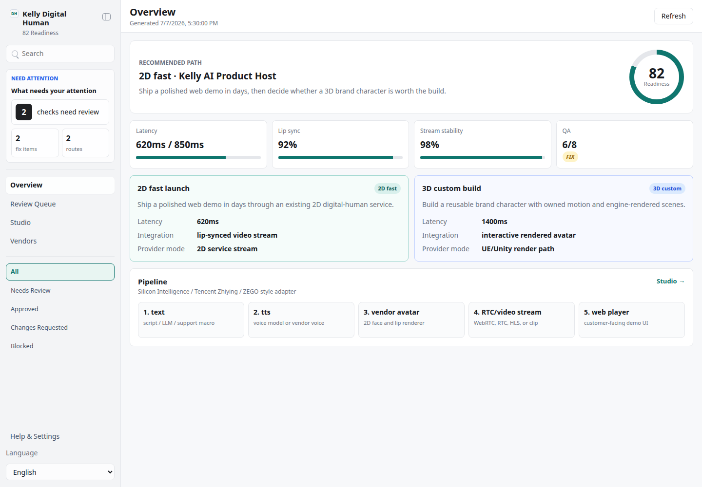
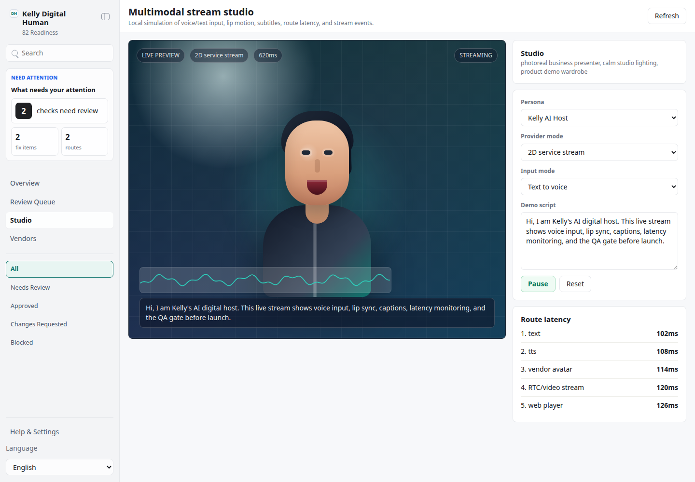
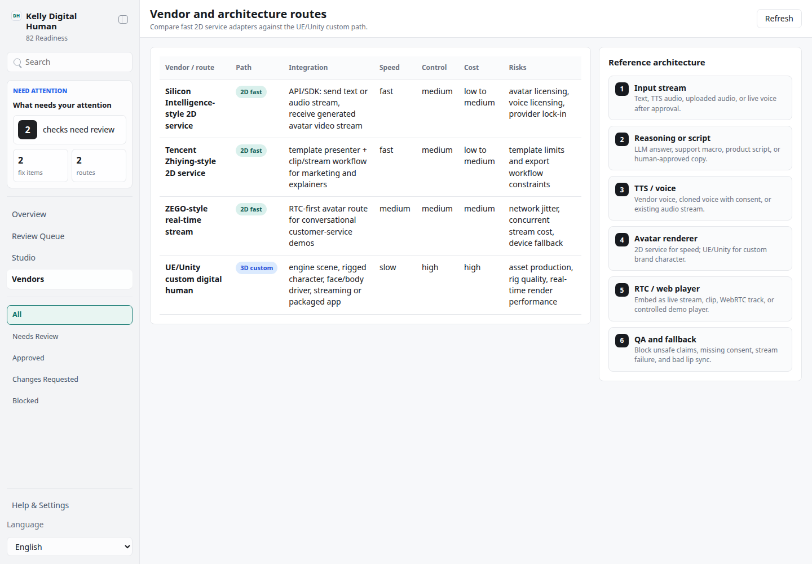
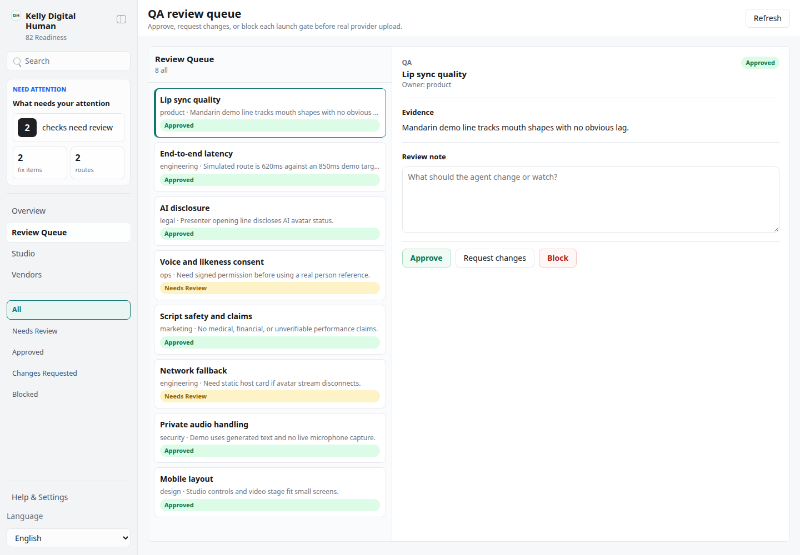

# Kelly Digital Human

## Overview

Use this skill as Kelly's digital-human solution desk. It helps pick the right path, draft the integration plan, prepare scripts and QA gates, and open a local multimodal demo showing voice/text input, avatar rendering, lip-sync/video stream status, latency, and launch readiness.

Default to the local demo app when the user asks for a demo, prototype, vendor comparison, or "快上线". Use chat-only mode only when the user explicitly says "chat only", "纯聊天", "不要打开 UI", or similar.

## Two Implementation Paths

### 1. 2D photoreal digital human, low cost and fast launch

Use this when the goal is an online demo, customer-service agent, product explainer, training host, livestream assistant, or any scene where speed and cost matter more than fully custom body motion.

Operating model:

- Connect an existing digital-human service, for example Silicon Intelligence, Tencent Zhiying, ZEGO-style real-time avatar/RTC providers, or another vendor the user already has access to.
- Send text or a speech/audio stream into the service.
- Receive a rendered video stream or clip with lip-sync and facial motion.
- Keep all business logic, script review, safety wording, telemetry, and QA gates in Kelly's local workflow.
- Best first milestone: one approved persona, one scene, one voice, one Chinese and one English demo script, one web demo page, and a latency/quality dashboard.

### 2. 3D custom digital human, high freedom

Use this when the brand needs a custom character, proprietary body motion, special clothing, stylized art direction, a stage/event scene, game-like interactivity, or reusable UE/Unity assets.

Operating model:

- Use UE or Unity as the renderer.
- Drive face, lip-sync, gaze, and body motion through a digital-human driving layer.
- Treat the engine project as the final render surface; this skill owns the solution design, persona bible, QA checklist, demo script, and launch decision.
- Best first milestone: one hero character, one calibrated voice, three production motions, one camera scene, and an executable or web-streamed demo.

## App UI Screenshots

<table>
  <tr>
    <td width="50%"></td>
    <td width="50%"></td>
  </tr>
  <tr>
    <td><strong>Solution overview</strong><br>Side-by-side 2D fast-launch and 3D custom-build paths, with readiness score, latency targets, and launch blockers.</td>
    <td><strong>Multimodal studio</strong><br>Animated avatar stream with lip motion, waveform, transcript, provider mode, route latency, and stream events.</td>
  </tr>
  <tr>
    <td width="50%"></td>
    <td width="50%"></td>
  </tr>
  <tr>
    <td><strong>Vendor and architecture desk</strong><br>Compares 2D service integration, real-time RTC rendering, and UE/Unity 3D architecture with cost, speed, and control tradeoffs.</td>
    <td><strong>Launch QA gate</strong><br>Checks lip sync, stream latency, consent, script safety, fallback behavior, and production handoff state before launch.</td>
  </tr>
</table>

## Default Workflow

1. Clarify the target scene: sales demo, AI host, customer support, livestream, training, product onboarding, event screen, or brand character.
2. Choose the path:
   - choose **2D** when "低成本", "快上线", "先 demo", "真人感", "视频流", "语音驱动", or "客服/讲解员" is the priority.
   - choose **3D** when "专属形象", "品牌 IP", "动作自由度", "UE", "Unity", "舞台", "互动", or "长期资产" is the priority.
3. Open the local app with `app/start.sh` and use demo mode to show the concept before any vendor contract or engine work.
4. Draft the persona bible: appearance, voice, tone, forbidden claims, supported languages, scene background, fallback lines, and consent requirements.
5. Draft the multimodal pipeline:
   - input: text, uploaded audio, live mic, or TTS output from another skill.
   - cognition: LLM reply, retrieval answer, scripted explainer, or support macro.
   - voice: TTS or user-supplied audio.
   - renderer: 2D vendor service or UE/Unity.
   - transport: video clip, WebRTC/RTC stream, HLS, or embedded player.
6. Create QA gates for lip sync, latency, identity consistency, pronunciation, unsafe content, disclosure, fallback, and device performance.
7. Do not execute external calls, purchase vendor plans, upload identity assets, or stream live user audio unless the user explicitly approves that step.

## Local Demo

Start the demo:

```bash
skills/kelly-digital-human/app/start.sh
```

The app prefers `127.0.0.1:3240`, falls through to the next free port, and honors `KELLY_DIGITAL_HUMAN_UI_PORT`.

Demo routes:

- `/?demo=overview#/overview`: path selection and readiness.
- `/?demo=studio#/studio`: live multimodal avatar stream.
- `/?demo=vendors#/vendors`: vendor and architecture comparison.
- `/?demo=qa#/qa`: launch QA gate.
- add `lang=zh` for Chinese UI chrome.

The demo is deterministic and local. It does not call Silicon Intelligence, Tencent Zhiying, ZEGO, UE, Unity, TTS, STT, camera, microphone, or any external model. It simulates the stream so the concept can be reviewed safely.

## Safety Boundary

- Treat face images, voice samples, customer conversations, support transcripts, and brand scripts as sensitive.
- Never upload identity assets, voice samples, or live audio to a vendor without explicit approval.
- Always include a visible or spoken AI disclosure in customer-facing experiences unless the user has a legally reviewed policy saying otherwise.
- Keep demo data, vendor credentials, SDK tokens, recordings, and generated clips out of git. Store local-only state under `app/.data/`.
- For production, require a human approval gate before public launch and before any live customer support flow.

## When To Read References

- Read `references/digital-human-schema.md` before editing app JSON, validation scripts, or handoff files.

## Useful Commands

```bash
skills/kelly-digital-human/app/start.sh
node skills/kelly-digital-human/scripts/generate_demo_snapshot.ts
node skills/kelly-digital-human/scripts/validate_ui_schema.ts
```
