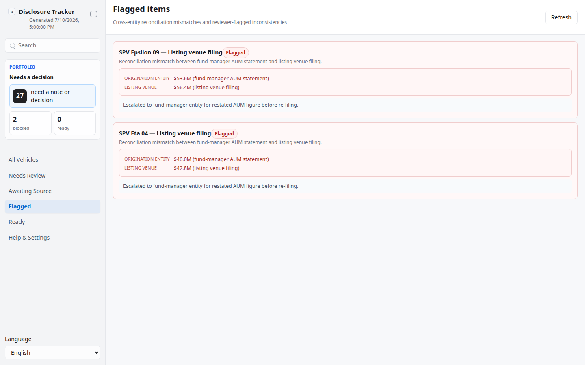

# Cross-Entity Disclosure Tracker

## Overview

Use this skill as a local, file-backed App-in-Skill workspace for a compliance/IR
team assembling a standardized disclosure package per financing vehicle (fund or
SPV). Each vehicle's package spans three generic entity roles:

- **Origination entity** — the onshore entity that originates/services the
  underlying assets.
- **Fund-manager entity** — the offshore entity that manages the vehicle.
- **Listing venue** — the exchange/listing venue where the vehicle's notes or
  units are listed.

This is a **generic, brand-free** tool: no real company, regulator, or exchange
is referenced anywhere in the skill, its data, or its UI. All vehicle and entity
names in seed data are synthetic placeholders ("SPV Alpha 12", "Onshore
Originator A", "Exchange One", and so on).

Default interaction mode: App UI. Unless the user explicitly asks for chat-only
handling, check onboarding/config, generate or refresh the local batch with
`scripts/generate_batch.ts`, start/reuse the local app with `app/start.sh`, and
give the actual local URL. Use chat-only mode only when the user says "纯聊天",
"chat only", "不要打开 UI", or similar.

This is a **workspace/review-queue hybrid**: the human works through a
checklist per vehicle rather than approving a linear queue, but the underlying
mechanics (statuses, decisions, a local file handoff) follow the same App-in-Skill
review model.

## App UI Screenshots

<table>
  <tr>
    <td width="50%"></td>
    <td width="50%"></td>
  </tr>
  <tr>
    <td><strong>Overview</strong><br>Portfolio-level summary (ready / blocked / in-progress vehicles) plus the vehicle grid.</td>
    <td><strong>Vehicle detail</strong><br>Checklist grouped by role (origination / fund-manager / listing venue) with a decision panel: verified, needs source, or flag inconsistent, plus a reviewer note.</td>
  </tr>
  <tr>
    <td colspan="2"></td>
  </tr>
  <tr>
    <td colspan="2"><strong>Flagged</strong><br>Cross-entity reconciliation mismatches (e.g. a figure that doesn't reconcile between the fund-manager's AUM statement and the listing venue's filing) and reviewer-flagged inconsistencies, in one list.</td>
  </tr>
</table>

## Boundary

- Local review workspace only. The skill reads/writes local handoff files under
  `app/.data/` and never calls any external system, filing portal, or exchange
  API.
- NEVER file, submit, or transmit anything to a real regulator, fund
  administrator, or exchange. There is no filing path in this skill by design.
- The app reads and writes local files only.
- Treat all vehicle/entity data as sensitive by convention, even though the
  bundled seed data is synthetic. Do not commit `config.local.json`, env files,
  or `app/.data/`.

## First Run And Onboarding

On invocation, check `app/.data/onboarding.json`. If onboarding is
absent/incomplete, confirm the reviewer's name and preferred language before
seeding real work, then write the completion marker:

```json
{
  "completed": true,
  "completed_at": "ISO timestamp",
  "config_version": "1"
}
```

Private config priority:

1. `KELLY_DISCLOSURE_TRACKER_CONFIG=/absolute/path/to/config.json`
2. `skills/kelly-disclosure-tracker/config.local.json`
3. `~/.config/kelly-disclosure-tracker/config.json`
4. `skills/kelly-disclosure-tracker/config.example.json` as template only

## Local App

Start the workspace with:

```bash
skills/kelly-disclosure-tracker/app/start.sh
```

The app uses local HTTP on `127.0.0.1`, preferring port `3000` through `4000`,
or `KELLY_DISCLOSURE_TRACKER_UI_PORT` when set. First run installs `hono` and
`@hono/node-server`; the frontend is zero-build vanilla.

Seed or refresh the mock vehicle batch with:

```bash
node skills/kelly-disclosure-tracker/scripts/generate_batch.ts
```

This writes `app/.data/current_batch.json` and `app/.data/decisions.json` with
8-10 synthetic vehicles, each carrying disclosure items across the three roles,
a plausible starting mix of verified/awaiting-source/needs-review items, and a
couple of pre-seeded cross-entity reconciliation mismatches.

## Demo Mode

- `?demo=1` opens a deterministic, fully offline mock portfolio (9 vehicles,
  6 items each) for documentation and screenshots.
- `lang=en` or `lang=zh` forces UI chrome language for screenshots.
- Demo API responses never read or write local handoff files.

UI language: support English and Chinese (zh-CN) chrome with `Auto` default.

## Data Model

Read `references/ui-schema.md` before editing the app, scripts, or provider.
Primary local files:

- `app/.data/current_batch.json`: vehicles + disclosure items (the agent-prepared
  batch).
- `app/.data/decisions.json`: reviewer decisions keyed by item id
  (`verified` / `needs_source` / `flagged` + a note).
- `app/.data/execution_report.json`: latest run of `scripts/execute_decisions.ts`
  — which items are settled vs still awaiting review. No external side effect.
- `app/.data/onboarding.json`: onboarding completion marker.
- `app/.data/agent.lock`: temporary lock while a script is writing.
- `config.local.json`: private local configuration, ignored by git.

Use `scripts/validate_ui_schema.ts app/.data/current_batch.json` before relying
on a batch in the UI. `scripts/generate_batch.ts` seeds the mock batch;
`scripts/execute_decisions.ts` writes the execution report.

## Views

- `#/vehicles`: portfolio summary (ready / blocked / in-progress vehicles) plus
  the vehicle grid; `?filter=needs_review|changes_requested|blocked|ready`
  narrows the grid.
- `#/vehicles/<vehicle_id>`: checklist grouped by role, with per-vehicle
  metrics.
- `#/vehicles/<vehicle_id>/<item_id>`: item detail + decision panel (verified /
  needs source / flag inconsistent) with a reviewer note.
- `#/flagged`: every item currently flagged, across all vehicles, with the
  reconciliation detail that triggered the flag.
- `#/settings`: sanitized setup summary — data provider, config path, reviewer
  name, onboarding state.

## Safety

- Local review workspace only; no filing, no external calls, no money movement.
- Do not invent reconciliation figures beyond the deterministic demo/seed data;
  real usage should have the skill populate `current_batch.json` from actual
  source documents before asking the human to review.
- Redact anything that looks like a real credential or account number in logs,
  reports, and UI state (none are expected in this skill's data model).
- Keep local batches minimal and use stable item ids so repeated seeds/decisions
  stay idempotent.
