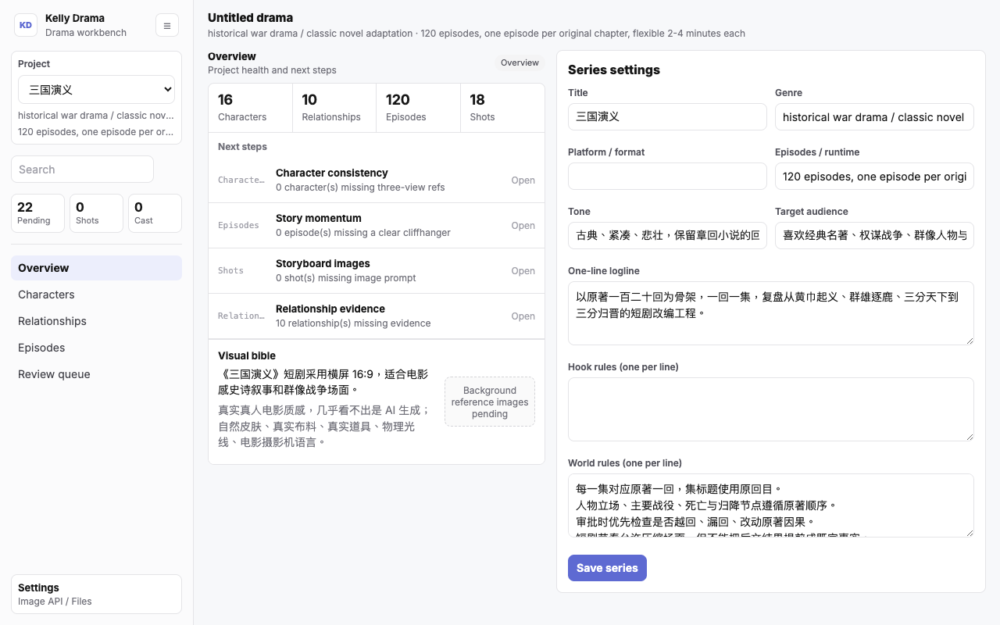
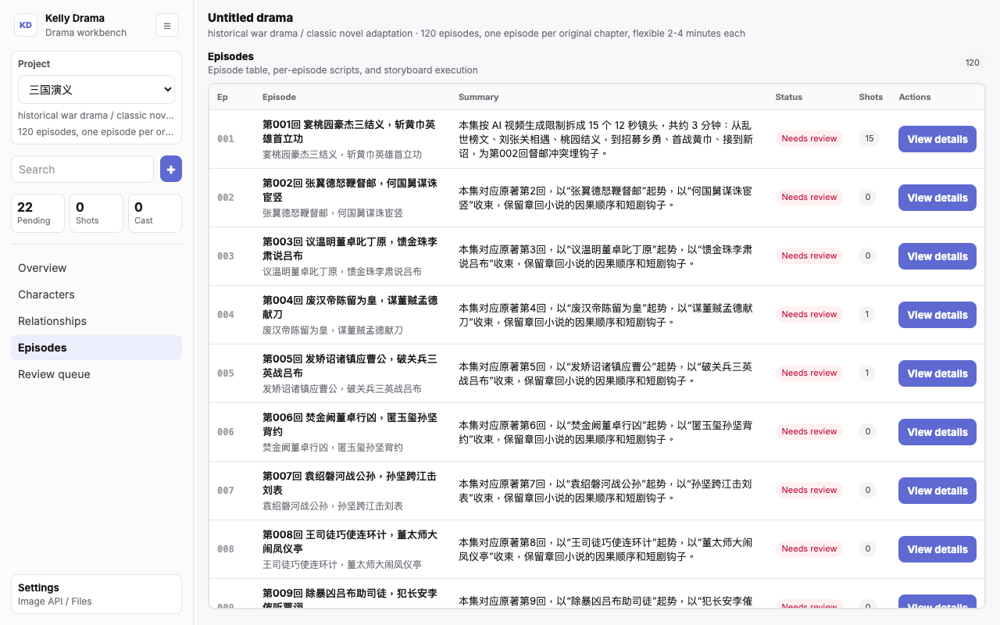
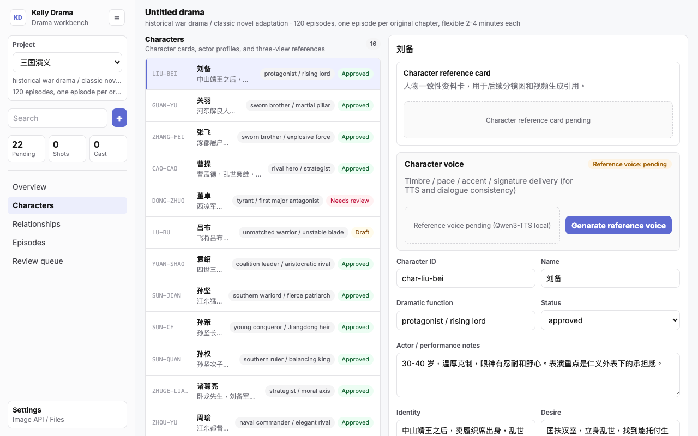
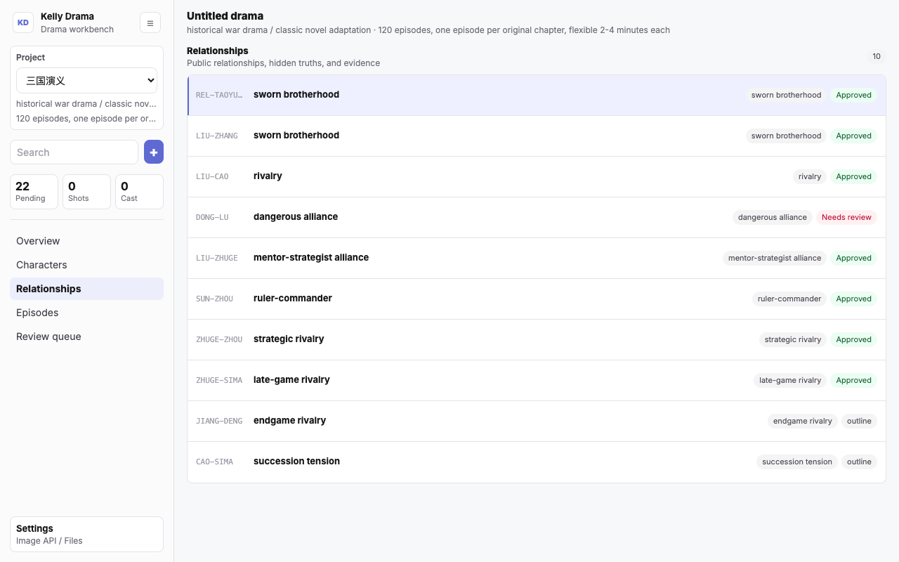

# Kelly Drama

Kelly Drama is a local App-in-Skill workbench for planning short-drama series: series bible, character consistency cards, relationship map, episode ladder, and storyboard shots, with AI image/video/voice generation hooks and a HyperFrame handoff for final motion work.

## What It Shows

- Overview: project metrics, next-step cards, HyperFrame project status, and the visual bible.
- Characters: character cards, actor profiles, three-view visual notes, reference-card images, and voice profiles.
- Relationships: who relates to whom — public status, hidden truth, power dynamic, and evidence episodes.
- Episodes: the episode table (summary, status, shot counts) plus per-episode script beats and the storyboard shot list.
- Review queue: tasks that need human review or approval.

## App UI Screenshots

<table>
  <tr>
    <td width="50%"></td>
    <td width="50%"></td>
  </tr>
  <tr>
    <td><strong>Overview</strong><br>Series workbench with health dashboard, execution timeline, stats, and settings for series parameters.</td>
    <td><strong>Episode table</strong><br>Episode list with script and storyboard status, shot readiness indicators, and per-episode detail pane.</td>
  </tr>
  <tr>
    <td width="50%"></td>
    <td width="50%"></td>
  </tr>
  <tr>
    <td><strong>Character library</strong><br>Character list with three-view image status, actor settings, wardrobe, and voice preview controls.</td>
    <td><strong>Relationship map</strong><br>Character relationship view with power dynamics, evidence links, and relationship detail pane.</td>
  </tr>
</table>

## Demo Mode

Run the app and open a safe mock-data scene:

```bash
skills/kelly-drama/app/start.sh
```

Use the URL printed by the launcher, then add one of these demo paths:

```text
/?demo=overview&lang=en#/overview
/?demo=characters&lang=en#/characters
/?demo=relationships&lang=en#/relationships
/?demo=episodes&lang=en#/episodes
```

Use `lang=zh` for the localized Chinese sample project (《逆光而行》). Demo mode is deterministic and strictly read-only: it never reads or writes project files under `app/.data/`, all write endpoints are rejected with a demo notice, and demo images are synthetic SVG placeholders served from memory (`/generated/demo/*`), never real project assets.

## Private Config

Project state lives in `app/.data/project.json`; generated images, videos, and voice samples live under `app/.data/generated/`. The image-generation backend (base URL, API key, model) is configured in the app's Settings panel and stored in `app/.data/image_config.json`. Never commit anything under `app/.data/` — real API keys, project files, and generated assets stay local. `config.example.json` documents the shareable defaults.
