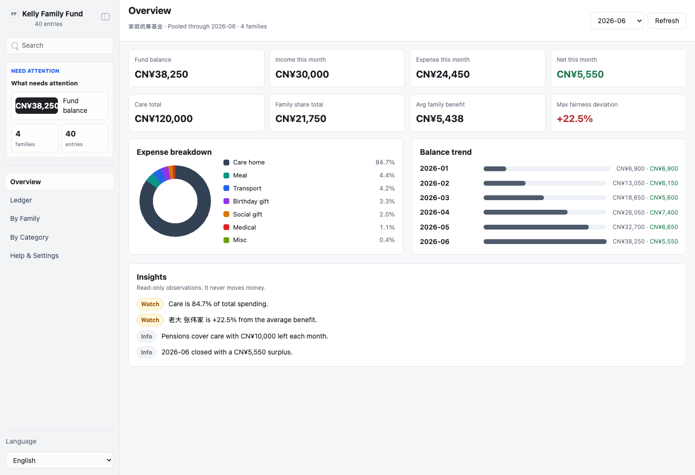
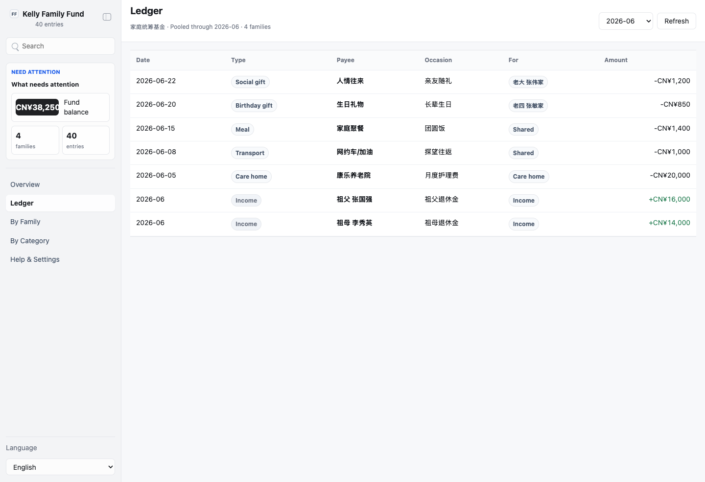
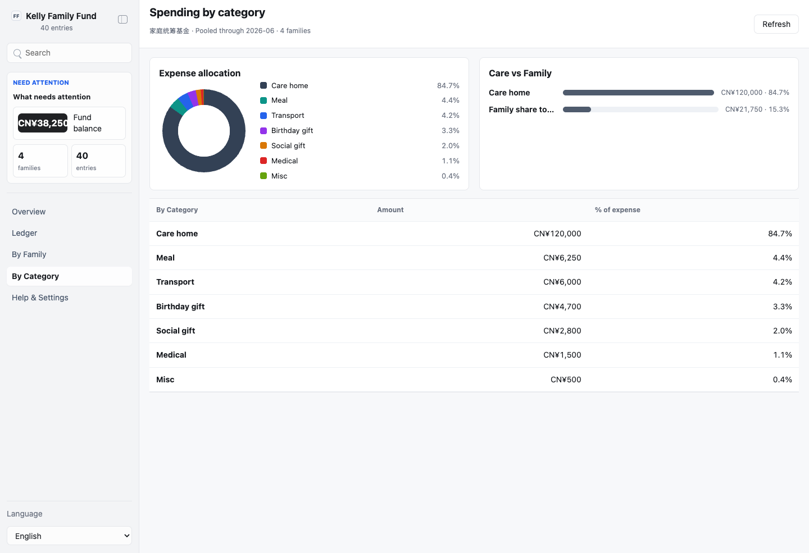
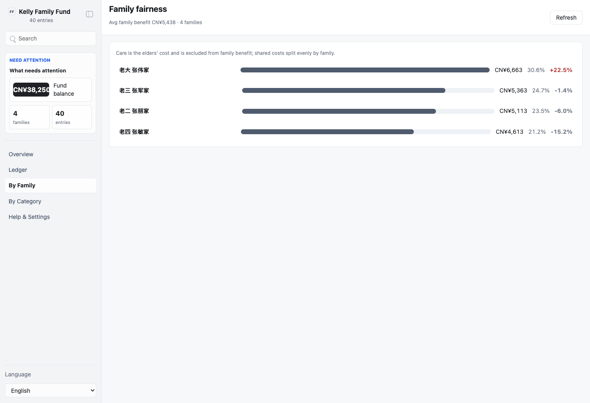

# Kelly Family Fund

Kelly Family Fund (家庭统筹基金) is a local App-in-Skill dashboard for a family caring for elderly parents. Two elders' pensions are pooled and managed by one steward; the fund pays a fixed care cost (nursing home) and shares the remaining surplus across the sibling families — transport, meals, birthday gifts, and 人情 (social gifts). It is a read-only bookkeeping dashboard whose whole point is transparency = fairness. It never moves money.

## What It Shows

- Overview: fund balance, this-month income / expense / net, care and family totals, the max fairness deviation, an expense donut, and a running-balance trend (pure CSS/SVG, no libraries).
- Ledger: unified income + expense timeline, filterable by month, with category badges and family tags (or 养老院/共享).
- By Family: each sibling family's cumulative benefit, share %, and fairness bar (deviation from average); drill into a family's directed and shared-share expenses.
- By Category: expense donut, care-vs-family split, and a per-category totals table.

## App UI Screenshots

<table>
  <tr>
    <td width="50%"></td>
    <td width="50%"></td>
  </tr>
  <tr>
    <td><strong>Overview</strong><br>Fund balance, this-month income / expense / net, care and family totals, an expense-by-category donut, running-balance trend, and read-only insights.</td>
    <td><strong>Ledger</strong><br>Unified income and expense timeline by month, each entry tagged with its category and the sibling family it benefits.</td>
  </tr>
  <tr>
    <td width="50%"></td>
    <td width="50%"></td>
  </tr>
  <tr>
    <td><strong>By category</strong><br>Spending across care, transport, meals, gifts, and gifts of obligation, with the care-versus-family split.</td>
    <td><strong>By family (fairness)</strong><br>Each sibling family's cumulative benefit, share, and deviation from the average — care excluded, shared costs split equally — so anyone can confirm it is balanced.</td>
  </tr>
</table>

## Demo Mode

Run the app and open a safe mock-data scene:

```bash
skills/kelly-family-fund/app/start.sh
```

Use the URL printed by the launcher, then add one of these demo paths:

```text
/?demo=overview&lang=zh#/overview
/?demo=ledger&lang=zh#/ledger
/?demo=family&lang=zh#/family
/?demo=detail&lang=zh#/family/fam-01
/?demo=category&lang=zh#/category
```

Demo mode never reads live data or local private ledger files.

## Private Config

Copy `config.example.json` to `config.local.json` or `~/.config/kelly-family-fund/config.json`. Set your `fund` (name, steward), `base_currency`, `beneficiaries` (the elders and their pensions), `families`, and the `fairness.deviation_threshold_pct`. Never commit real ledger data or files under `app/.data/`.

## CSV Import

Fill in `references/ledger-csv-template.csv` (or a copy) and run:

```bash
node scripts/import_csv.ts path/to/ledger.csv
```

It normalizes income and expenses into `app/.data/snapshot.json`, computing the monthly running balance, the fund totals, the per-category split, and the per-family fairness rollup. `care` rows are always the elders' cost and are excluded from family benefit.
