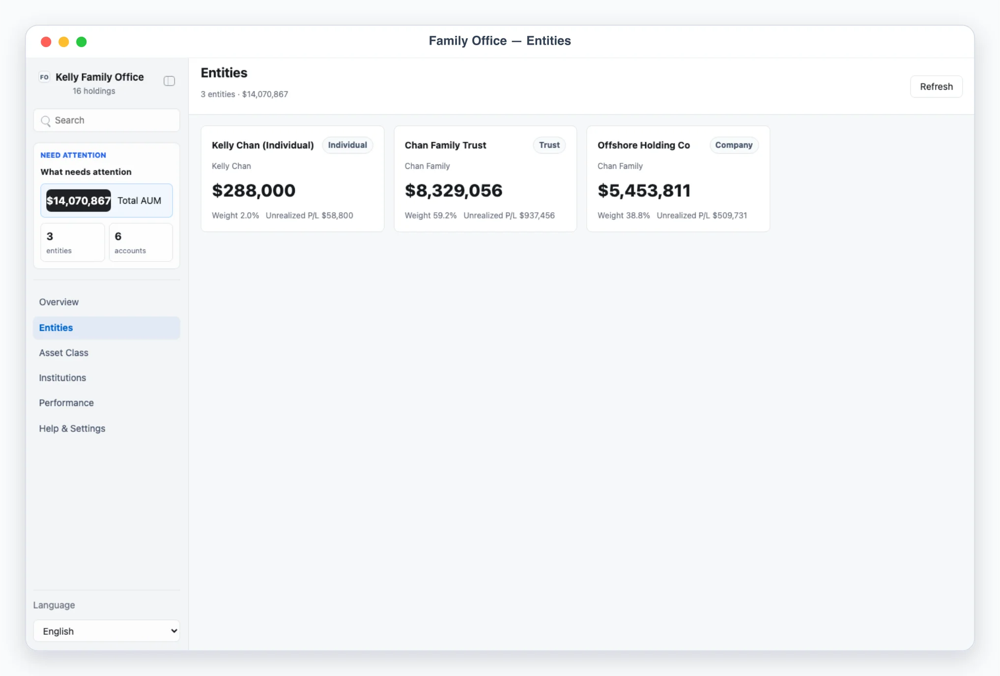
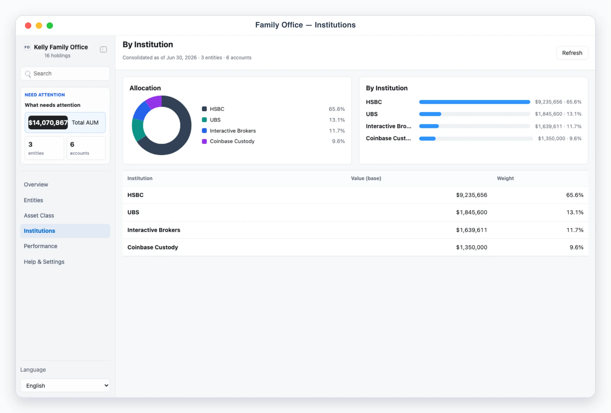
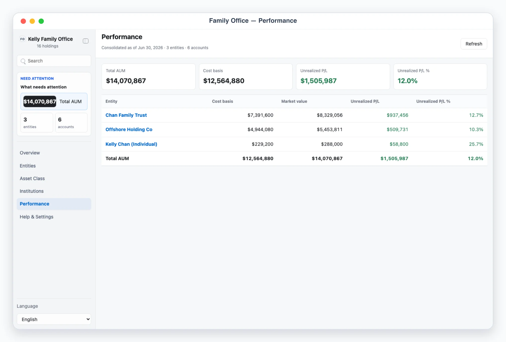

# Kelly Family Office

## Overview

Kelly Family Office is a Busabase Cloud App-in-Skill. Its canonical product surface is the AirApp in Busabase, not a separate local-data product. The same Hono source supports an explicitly requested local preview with OAuth connection bootstrap. Use this skill as Kelly's family-office aggregation desk. It consolidates the holdings of multiple entities and members — an individual, a family trust, an offshore company, a fund, a foundation — into one dashboard: total AUM in a base currency, unrealized P/L, and allocation by entity, asset class, and institution. Data comes from CSV import (through a trusted skill-root script); there is no live brokerage API in v1.

Default behavior is AirApp-first. Unless the user explicitly asks only for explanation, give the user the clickable AirApp URL. Start localhost only when local preview/debugging is explicitly requested; it uses the same Busabase resources and never offers another data provider. Use chat-only mode only when the user says "纯聊天", "chat only", "不要打开 UI", or similar.

## Mandatory Dependencies

1. Read and follow `$kelly-app-skill-creator` for product behavior, visual
   quality, responsive layout, and the complete canonical `app/` artifact.
2. Read and follow `$busabase` for connection, target Space, node discovery,
   ChangeRequests, review, and merge behavior.
3. Read and follow `$busabase-app-creator` for resource modeling, AirApp
   runtime limits, security, validation, and deployment.

If a dependency is unavailable, preserve this skill's local artifact and
product contracts, stop before the unavailable Busabase operation, and report
the exact missing dependency. Do not invent a second data backend.

## App UI Screenshots

<table>
  <tr>
    <td width="50%"></td>
    <td width="50%"></td>
  </tr>
  <tr>
    <td><strong>Overview</strong><br>Consolidated command desk with total AUM in the base currency, unrealized P/L, entity and account counts, and headline allocation.</td>
    <td><strong>By entity / member</strong><br>Each family entity (individual, trust, company) with its consolidated AUM, portfolio weight, and unrealized P/L.</td>
  </tr>
  <tr>
    <td width="50%"></td>
    <td width="50%"></td>
  </tr>
  <tr>
    <td><strong>By asset class</strong><br>Allocation across equity, bond, cash, crypto, real estate, private equity, and alternatives, with a donut, weighted bars, and a value table.</td>
    <td><strong>By account / institution</strong><br>Consolidation by custodian and institution to see where assets are held and concentration across banks and brokers.</td>
  </tr>
  <tr>
    <td width="50%"></td>
  </tr>
  <tr>
    <td><strong>Performance</strong><br>Cost basis versus market value and unrealized P/L, per entity and for the whole family office, in the base currency.</td>
  </tr>
</table>

## Boundary

- The skill may read a holdings CSV, normalize it, and write entity/account/holding rows into Busabase through the trusted `scripts/import_csv.mjs` process.
- The AirApp reads Busabase records only; it is entirely read-only and must NEVER connect to a brokerage/custody API, move money, place trades, rebalance, transfer, or mutate any remote system. It is a read-only monitoring dashboard (`readOnly: true`, no `writeProcedures`).
- Treat all holdings and account data as sensitive. Never commit raw CSV exports, statements, account identifiers, Busabase credentials, or env files.
- There is no approval lifecycle and no decisions workflow — this is monitoring only.

## Busabase Resources

Four Bases under one application Folder (`kelly-family-office`), declared in
`app/app/js/config.js` and `app/resource-map.json`:

- `entities`: the individuals, trusts, companies, funds, and foundations being consolidated (`entity_id`, `name`, `type`, `member`).
- `accounts`: custodian/institution accounts held by each entity (`account_id`, `entity_id`, `institution`, `account_type`, `currency`, `display_name`, `as_of`). Institutions are just a field on accounts — there is no separate Institutions Base.
- `holdings`: individual holdings across every account (`holding_id`, `entity_id`, `account_id`, `symbol`, `name`, `asset_class`, `quantity`, `cost_basis`, `market_value`, `currency`, `as_of`).
- `settings`: one row per `kind` — `office-meta` (`base_currency`, `fx_rates`, `target_allocation`, non-secret) and `onboarding`.

Resources provision lazily through an idempotent Busabase ChangeRequest the
first time the app runs in a Space; see `references/portfolio-schema.md` for
exact field shapes. The AirApp never writes to any Base — only the trusted
CSV importer does. The consolidated snapshot (totals, by_entity,
by_asset_class, by_institution, insights) is computed client-side from
`entities`/`accounts`/`holdings`/`settings` on every read — it is never
stored.

## First Run And Onboarding

On invocation, check the `office-meta` and `onboarding` settings rows for
readiness. If absent, guide setup before importing real holdings.

Set up in this order, asking only for non-secret setup details:

1. Define entities (`entity_id`, `name`, `type` one of INDIVIDUAL/TRUST/COMPANY/FUND/FOUNDATION, `member`).
2. Define the `base_currency` (default USD).
3. Set `fx_rates` for every non-base currency you hold (value in base currency; base = 1).
4. Optionally set `target_allocation` per asset class (used by the `allocation_drift` insight).
5. Import a holdings CSV via `scripts/import_csv.mjs`.

Write the `office-meta` and `onboarding` settings rows through the trusted
process; never ask the user to paste secrets into chat.

## CSV Import

Kelly Family Office's AirApp is read-only; `scripts/import_csv.mjs` is the
only process that writes holdings rows. The documented template is
`references/holdings-csv-template.csv`. Columns:

- `entity_id`, `entity_name`, `entity_type` (INDIVIDUAL|TRUST|COMPANY|FUND|FOUNDATION), `member`
- `account_id`, `institution`, `account_type`, `account_currency`
- `holding_id`, `symbol`, `name`, `asset_class` (EQUITY|BOND|CASH|CRYPTO|REAL_ESTATE|PRIVATE_EQUITY|ALTERNATIVE)
- `quantity`, `cost_basis`, `market_value` (totals in the holding `currency`), `currency`, `as_of`

Run:

```bash
BUSABASE_BASE_URL=... BUSABASE_API_KEY=... BUSABASE_SPACE_ID=... \
  node scripts/import_csv.mjs path/to/holdings.csv --apply
```

Without `--apply` it is a dry run that only prints the planned writes. It
resolves entity/account references against Busabase, creating a new entity
or account record on the fly if the CSV names one that doesn't exist yet,
then writes `holdings` rows via Busabase ChangeRequests.

## Demo Mode

- `?demo=1` (or `?demo=overview`) opens a deterministic offline family office: 3 entities (individual, trust, offshore company), 6 accounts across Interactive Brokers, HSBC, UBS, and Coinbase Custody, and ~16 multi-currency holdings (USD/HKD/CNY) consolidated to a USD base.
- `?demo=entities`, `?demo=assets`, `?demo=institutions`, `?demo=performance`, and `?demo=detail` select named scenes.
- `lang=en` or `lang=zh` forces UI chrome language (and localizes the demo dataset's entity/holding names) for screenshots.
- Demo mode never reads or writes Busabase.

## Local App

Default behavior is AirApp-first — give the user the clickable AirApp URL.
Start `pnpm --dir app dev` only when local preview/debugging is explicitly
requested. UI language supports English and Chinese chrome with an `Auto`
default.

## Views

- `#/overview`: consolidated total AUM (base ccy), unrealized P/L, entity count, and a headline allocation donut.
- `#/entities`: entity/member sidebar; `#/entities/<entity_id>` drills into that entity's accounts, holdings, and subtotal.
- `#/assets`: asset-class allocation donut + bars + table with weights.
- `#/institutions`: consolidated by custodian/institution.
- `#/performance`: cost vs market value and unrealized P/L (absolute + %), per entity and total.
- `#/settings`: sanitized setup summary (base currency, FX rates, entities, institutions, data provider, onboarding state). Never expose secrets.

## Insights

Read-only, deterministic observations rendered from `{ code, severity, params }` by localized templates (en + zh). Codes: `asset_class_concentration`, `institution_concentration`, `entity_concentration`, `allocation_drift`, `currency_exposure`, `cash_level`. They are neutral facts, never advice, and never actions.

## File Contract

Read `references/portfolio-schema.md` before editing the app, `app/app/js/config.js`,
or `scripts/import_csv.mjs`.

## Safety Defaults

- Never connect to a live brokerage/custody API, trade, transfer, or rebalance. The AirApp only reads Busabase and renders it; only the trusted importer writes.
- Keep raw statements and exports outside git; write only normalized safe fields to Busabase.
- If a holding is unpriced or a currency is missing an FX rate, mark it with a warning rather than inventing a value.
- Keep FX rates explicit; stale rates should surface as a warning, not silent drift.
