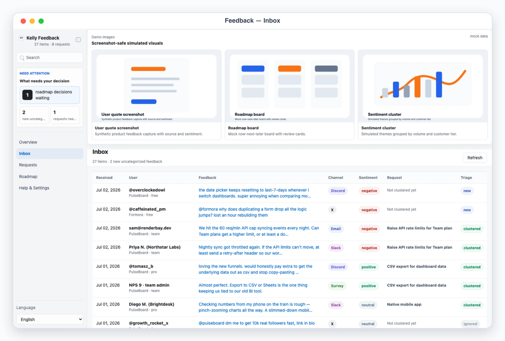

# Kelly Feedback

## App UI Screenshots

<table>
  <tr>
    <td width="50%"></td>
    <td width="50%"></td>
  </tr>
  <tr>
    <td><strong>Overview</strong><br>Voice-of-customer desk with weekly inflow by channel, sentiment split, top clusters, and source freshness.</td>
    <td><strong>Inbox</strong><br>Raw feedback stream across email, Discord, Slack, X, and app-store reviews with triage controls.</td>
  </tr>
  <tr>
    <td width="50%"></td>
    <td width="50%"></td>
  </tr>
  <tr>
    <td><strong>Requests</strong><br>Clustered feature requests with frequency, weighted scores, trend, and representative quotes.</td>
    <td><strong>Roadmap decisions</strong><br>Agent-proposed promote/decline/merge proposals with drafted changelog notes and user replies for approval.</td>
  </tr>
</table>

## Overview

Use this skill as Kelly's voice-of-customer desk. It aggregates raw user
feedback from every channel (support email, Discord, Slack, X replies,
app-store reviews, in-app surveys, interviews) into one Busabase App-in-Skill
dashboard, where the agent's dedupe/clustering work becomes feature requests
with frequency and user weight, and agent-proposed roadmap changes wait in a
decision queue for Kelly's verdict.

Division of labor: the skill (scripts + agent) collects, clusters, and
drafts; the app is where Kelly triages feedback and decides on proposals;
approved roadmap changes are exported/executed by the agent outside the app
(updating a roadmap doc or changelog, handing decline replies to
kelly-messenger or kelly-email). Kelly Feedback sits downstream of
kelly-email, kelly-messenger, and kelly-social: those skills' agents hand
feedback payloads to `scripts/ingest_feedback.mjs`.

Default behavior is AirApp-first. Unless the user explicitly asks only for
explanation, ingest whatever payloads are available and give the user the
clickable AirApp URL (or the local preview URL when local preview is
explicitly requested). Use chat-only mode only when the user says "纯聊天",
"chat only", "不要打开 UI", or similar; in that mode present proposals as
numbered items (`Proposal #1`, `#2`, ...) and record verdicts by asking the
agent to run the same writes `busabase-sdk`-side that the app would.

This skill is an implementation of the **App-in-Skill** pattern — a Codex/agent skill paired with a small companion UI for review and approval. See the spec paper: <https://mr-kelly.github.io/research/app-in-skill-specification-for-pairing-agent-skills-with-a-local-companion-ui.pdf>.

## Mandatory Dependencies

1. Read and follow `$kelly-app-skill-creator` for product behavior, visual
   quality, responsive layout, and the complete canonical `app/` artifact.
2. Read and follow `$busabase` for connection, target Space, node discovery,
   ChangeRequests, review, and merge behavior.
3. Read and follow `$busabase-app-creator` for resource modeling, AirApp
   runtime limits, security, validation, and deployment.

If a dependency is unavailable, preserve this skill's local artifact and
product contracts, stop before the unavailable Busabase operation, and report
the exact missing dependency. Do not invent a second data backend.

## Boundary

- The AirApp reads Busabase records and writes only feedback triage, request effort estimates, and roadmap-proposal verdicts. It must not call feedback platforms, post replies, publish changelogs, or mutate remote systems.
- Any outbound side effect — replying to a user, publishing a changelog note, editing a public roadmap — is approval-required and executed by the agent via other skills (kelly-messenger, kelly-email, docs edits) only after the matching proposal is approved and `scripts/execute_decisions.mjs --apply` marks it `handoff_ready`. `scripts/execute_decisions.mjs` never sends anything itself.
- Own-community data only: ingest feedback addressed to Kelly's own products from Kelly's own channels and accounts via `scripts/ingest_feedback.mjs`. Do not scrape third-party communities or collect data about other companies' users.
- Treat feedback as user PII-adjacent. Never commit real tokens, raw platform exports, or Busabase credentials.

## Busabase Resources

Eight Bases under one application Folder (`kelly-feedback`), declared in
`app/app/js/config.js` and `app/resource-map.json`:

- `products`: products feedback can be about (id, display name, tagline).
- `sources`: feedback channels — email, Discord, Slack, X, app-store, survey, interview — with collection method, env-var *names* for tokens (never values), freshness, and item count.
- `feedback`: raw feedback items normalized from every channel, one row per item (user context, text, sentiment, `triage`, linked `request-id`).
- `requests`: clustered feature requests (title, product, status, trend, effort estimate, problem statement, spec summary, representative feedback ids, decision history). `frequency`/`weighted-score` are **not stored** — they are always recomputed client-side from `feedback` by `recomputeDerived()`.
- `roadmap`: roadmap lane items (`now`/`next`/`later`), read-only in the app; changed only via approved proposals executed by `scripts/execute_decisions.mjs`.
- `proposals`: the decision queue — agent-proposed promote/decline/merge/publish-changelog changes with reason, evidence, an editable draft, the human verdict (`status`/`review-note`/`decided-at`), written directly onto the proposal record.
- `sync_log`: append-only history of ingest/cluster/execute runs.
- `settings`: one row (`record-id: "config"`) with plan-weight scoring and roadmap lane names.

Resources provision lazily through an idempotent Busabase ChangeRequest the
first time the app runs in a Space; see `references/feedback-schema.md` for
exact field shapes. Request `frequency`/`weighted_score` and every snapshot
metric are recomputed client-side from `feedback`/`requests`/`proposals` on
every read via `recomputeDerived()` — **never stored**, so numbers always
agree after any merge.

## First Run And Onboarding

On invocation, check the `sources` Base. If empty, guide setup before
ingesting real feedback.

Onboarding asks, turn by turn (non-secret setup details only):

1. Products: id, display name, one-line tagline for each product feedback can be about.
2. Sources: which channels exist (email/discord/slack/x/appstore/survey/interview), how each is collected (sibling-skill handoff, export, manual notes), and which env var names hold any tokens.
3. Scoring weights: plan weights (e.g. free=1, pro=3, team=5), default weight, recency half-life.
4. Roadmap lanes (default Now / Next / Later).

Never ask the user to paste secret values into chat. Secrets belong only in
local env files. Register products/sources by including them in the first
`scripts/ingest_feedback.mjs` payload's optional `products[]` field and
required `source` field (see references/feedback-schema.md); scoring
weights/roadmap lanes are written directly into the `settings` Base's single
`record-id: "config"` row via `busabase-sdk`.

## Local App

Default behavior is AirApp-first — give the user the clickable AirApp URL.
Start `pnpm --dir app dev` only when local preview/debugging is explicitly
requested.

Required app views (hash routes):

- `#/overview`: VoC command desk — human-attention panel (roadmap decisions waiting, new uncategorized feedback, requests needing info), feedback-this-week inflow by channel with platform badges, sentiment split bars (inline SVG), top clusters by momentum, and freshness per source.
- `#/inbox` and `#/inbox/<feedback_id>`: raw feedback stream. Rows show channel badge, user handle, product, one-line preview, sentiment, cluster link, and triage state (new/clustered/ignored/insight). Detail shows the full text, user context (plan, tenure, revenue weight), source permalink, linked request, agent note, and triage buttons (assign to request / ignore / mark insight) that write directly onto the feedback record through `busabase-sdk`.
- `#/requests` and `#/requests/<request_id>`: clustered feature requests with title, product, frequency, weighted score (frequency × user revenue weight), trend arrow, status (candidate/roadmap/declined/needs_info), and linked feedback count. Detail shows the agent-drafted problem statement and proposed spec summary, representative quotes, all linked feedback, an editable effort-estimate field, and decision history.
- `#/roadmap`: decision queue of agent-proposed roadmap changes (promote to Now/Next/Later, decline with drafted reply, merge duplicates) with reason, evidence, editable draft, a `Review note` textarea, decision buttons (Approve / Request changes / Block), stable refs (`Proposal #1`), and standard workflow states (needs_review / changes_requested / approved / done / blocked) written directly onto the proposal record. The current roadmap columns (Now / Next / Later) render read-only below the queue.
- `#/settings`: sanitized config summary — products, sources (channel + collection method), scoring weights, env readiness booleans, onboarding state, and recent sync log. Never expose secret values.

Demo mode:

- `?demo=overview`, `?demo=inbox`, `?demo=requests`, and `?demo=roadmap` select named mock scenes.
- `?demo=detail` opens a request detail with representative quotes.
- `lang=en` or `lang=zh` forces UI chrome language for screenshots.
- Demo mode never reads or writes Busabase; demo decisions are in-memory only.

UI language: support English and Chinese chrome with `Auto` default
(persisted override in the sidebar). Keep user quotes, handles, product
names, and imported data in their original language.

## File Contract

Read `references/feedback-schema.md` before editing the app, scripts, or any
Busabase field shape.

## Ingestion Workflow

`scripts/ingest_feedback.mjs` is the single write path for raw feedback.
Anyone with a payload — sibling skills' agents, platform exports, or manual
notes — hands feedback to Kelly Feedback the same way:

1. Write a payload JSON file (shape in `references/feedback-schema.md`): a `source` block (`source_id`, `channel`, `name`, `collection`) plus `items[]` with stable `external_id`s, text, user context, and timestamps. Optionally include `products[]` to register/update product catalog entries.
2. Run `node skills/kelly-feedback/scripts/ingest_feedback.mjs <payload.json> [more.json ...] --apply`.
3. The script validates, dedupes by `fb-<source_id>-<external_id>` (idempotent re-ingest), upserts the source/products, and appends a `sync_log` entry — all directly against Busabase. Omit `--apply` first to see a dry-run summary.

Typical handoffs: kelly-email exports support threads mentioning features;
kelly-messenger exports Discord/Slack community posts; kelly-social exports
X replies. Those skills' agents build the payload from their own data; this
skill never reads their private files directly. New items land with
`triage: "new"` and appear in the Inbox and the human-attention panel.

## Clustering Workflow

Clustering is LLM work done by the agent; `scripts/apply_clusters.mjs` is the
deterministic write path.

1. Read feedback from Busabase and pick out `triage: "new"` items (and any requests needing re-scoring).
2. As the agent, dedupe and cluster: group items expressing the same underlying need, draft or update request records (title, problem statement, proposed spec summary, representative feedback ids, trend), and decide non-request items (`ignored` for spam, `insight` for bugs/patterns worth routing elsewhere).
3. Write a cluster-assignment payload (shape in `references/feedback-schema.md`) and run `node skills/kelly-feedback/scripts/apply_clusters.mjs <assignments.json> --apply`. The script validates ids, upserts request drafts, links feedback, and logs the run. Request `frequency`/`weighted_score` recompute automatically client-side — the script never writes them.
4. When clusters warrant action, draft proposals directly into the `proposals` Base (promote/decline/merge/changelog) with reason, evidence, and an editable public draft, then send Kelly to `#/roadmap`.

## Roadmap Decision Workflow

1. Kelly reviews `#/roadmap`: edits drafts, writes review notes, and clicks Approve / Request changes / Block. The app writes the verdict directly onto the proposal record (`status`/`review-note`/`draft`/`decided-at`) through `busabase-sdk` — never a separate decisions file. From a standalone local preview the write merges immediately (trusted operator); from the deployed AirApp it creates a pending ChangeRequest for the trusted process to merge.
2. Before executing, run `node skills/kelly-feedback/scripts/execute_decisions.mjs` (dry-run) to see the plan for every `approved` proposal: `update_roadmap` (target lane) and `merge_requests` are LOCAL operations; `publish_changelog_note` (draft id) and `send_decline_reply` (handoff to kelly-messenger/kelly-email) are always `handoff_ready` — this script never publishes a changelog, edits a roadmap doc, or sends a reply itself.
3. Show Kelly the dry-run summary. After confirmation, run with `--apply`: LOCAL operations (roadmap lanes, merges) are applied directly to Busabase and the proposal's status is set `done`; outbound operations remain `handoff_ready` only.
4. Execute `handoff_ready` operations as the agent via the appropriate skill (send the decline reply through kelly-messenger/kelly-email, update the changelog/roadmap document), then log the outcome as a `sync_log` entry.
5. For a proposal moved to `changes_requested`, revise the draft per the `review-note` and write it back to `needs_review` directly via `busabase-sdk`.

## Safety Defaults

- Treat every outbound message (decline replies, changelog posts, roadmap publications) as approval-required, one proposal at a time.
- Never invent feedback or inflate counts; frequency and weighted score must derive from real linked items via `recomputeDerived()`, never be written directly.
- Keep stored content minimal: trimmed feedback text and safe permalinks, not raw platform API responses or attachments.
- Use stable ids everywhere (`external_id` dedupe keys, request ids, proposal ids) so re-ingest and re-execution are idempotent.
- `scripts/execute_decisions.mjs` performs no external side effect ever — it never sends a reply or publishes a changelog itself, even with `--apply`.

## Useful Commands

```bash
node skills/kelly-feedback/scripts/ingest_feedback.mjs payload.json --apply
node skills/kelly-feedback/scripts/apply_clusters.mjs assignments.json --apply
node skills/kelly-feedback/scripts/execute_decisions.mjs
node skills/kelly-feedback/scripts/execute_decisions.mjs --apply
pnpm --dir skills/kelly-feedback/app dev
```

In normal use, invoke `/kelly-feedback`, let the skill ingest/cluster
whatever is available, and open the AirApp.
