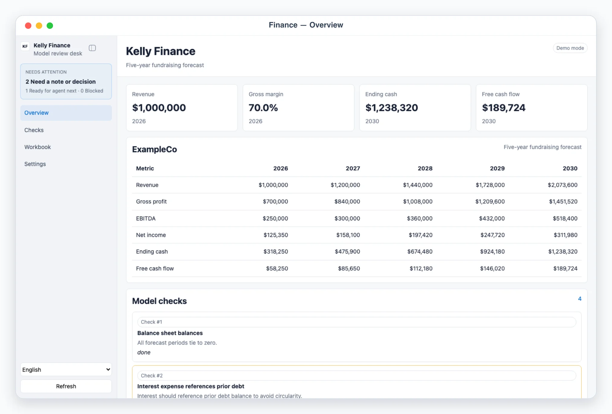
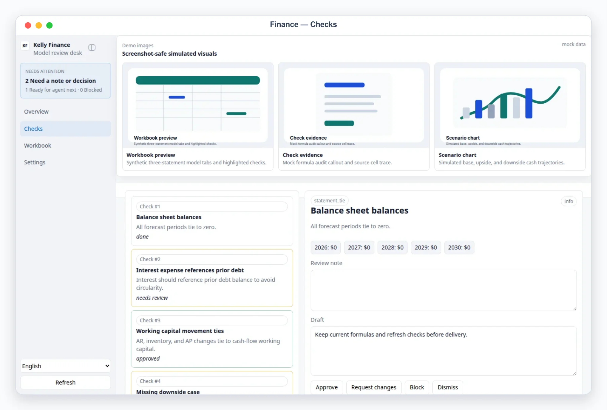

# Kelly Finance

## Overview

Use this skill as a practical FP&A and corporate-finance modeling desk. It
builds clean three-statement starter models with a dependency-free Python
script, and gives a Busabase-backed review workspace (AirApp) for the model
dashboard and its model-quality check queue — audit the model logic, leave
notes, approve/request-changes/block/dismiss each check, and hand rework back
to the agent — before anything is delivered to investors or written back to
the source-of-truth books.

Default behavior is AirApp-first. Unless the user explicitly asks only for
explanation, ensure a model exists (run the trusted build script below if the
`model` Base is empty) and give the user the clickable AirApp URL (or the
local preview URL when local preview is explicitly requested). Use chat-only
mode only when the user says "纯聊天", "chat only", "不要打开 UI", or similar.

## App UI Screenshots

<table>
  <tr>
    <td width="50%"></td>
    <td width="50%"></td>
  </tr>
  <tr>
    <td><strong>Overview</strong><br>Model KPI cards and a five-year forecast table (revenue through free cash flow), with a needs-attention summary.</td>
    <td><strong>Model audit checks</strong><br>Review queue for statement ties, hardcodes, formula direction, and debt/working-capital linkage — each check approvable, blockable, or sent back with a note.</td>
  </tr>
  <tr>
    <td width="50%"></td>
    <td width="50%"></td>
  </tr>
  <tr>
    <td><strong>Workbook</strong><br>Generated workbook path plus the tab contract — Assumptions, Income Statement, Balance Sheet, Cash Flow, Checks.</td>
    <td></td>
  </tr>
</table>

## Mandatory Dependencies

1. Read and follow `$kelly-app-skill-creator` for product behavior, visual quality, responsive layout, and the complete canonical `content/kelly-finance-app/` artifact.
2. Read and follow `$busabase` for connection, target Space, node discovery, ChangeRequests, review, and merge behavior.
3. Read and follow `$busabase-app-creator` for resource modeling, AirApp runtime limits, security, validation, and deployment.

If a dependency is unavailable, preserve this skill's local artifact and product contracts, stop before the unavailable Busabase operation, and report the exact missing dependency. Do not invent a second data backend.

## Boundary

- Review workspace only. The skill reads and writes its own Busabase Bases; it must not connect to banks/accounting systems, send files, mutate ERP records, move money, or change external systems.
- Treat financial models and assumptions as sensitive by convention, even though the bundled demo data is synthetic (`ExampleCo`).
- Any external action, such as sending a model to investors or changing source-of-truth books, is approval-required and executed outside the app by the agent after human review. This skill never performs that step itself.

## Busabase Resources

Three Bases under one application Folder (`kelly-finance`), declared in
`content/kelly-finance-app/app/js/config.js` and the generated template sidecars under `content/`:

- `model`: one row per model run (usually just the current run, `model-id`
  `current`) — company, currency, display unit, model purpose, the forecast
  `periods` array (JSON), headline metrics (revenue CAGR, ending cash, free
  cash flow, balance check), warnings, and the generated workbook's
  path/tab contract. Written by `scripts/build_three_statement_model.mjs`
  after the Python starter-model script runs, or by an agent that has
  reviewed a real workbook and knows the real computed figures.
- `checks`: one row per model-audit check (formula ties, model-quality
  issues, delivery notes) — the raw check fields plus the reviewer's
  decision (`decision-action`/`decision-comment`/`decided-at`) and, once
  `scripts/execute_decisions.mjs` runs, an execution marker, all written
  directly onto the same row. Unlike a derived-status review queue, a
  check's `status` is stored directly (set by the reviewer's decision
  action) — the needs_review/approved/done/blocked *counts* shown on the
  dashboard are recomputed client-side from the checks on every read.
- `settings`: sanitized config summary (company/currency defaults, no
  secrets), one row keyed by `record-id`/`kind`.

Resources provision lazily through an idempotent Busabase ChangeRequest the
first time the app runs in a Space; see `references/finance-ui-schema.md` for
exact field shapes.

## Create A Three-Statement Template

`scripts/build_three_statement_model.py` is the real modeling engine — a
dependency-free Python script that hand-writes a genuine `.xlsx` workbook
(balance-sheet balancing, PP&E/depreciation roll-forward, debt/interest
schedule, working-capital tie), kept exactly as Python since rewriting real
financial-modeling formulas in JavaScript would mean reimplementing that
logic instead of just calling it. The trusted wrapper spawns it and records
the result in Busabase:

```bash
node skills/kelly-finance/scripts/build_three_statement_model.mjs \
  --company "ExampleCo" --start-year 2026 --years 5 \
  --currency USD --base-revenue 1000000 \
  --output /tmp/three_statement_model.xlsx --seed-checks --apply
```

Without `--apply` this is a dry run: the `.xlsx` is still generated locally
(that step has no external side effect either way), but nothing is written
to Busabase. `--seed-checks` also seeds the standard model-quality check
queue (balance sheet, cash roll-forward, net income tie, PP&E tie, debt tie —
check *definitions* only, never fabricated figures) into the `checks` Base.
Once an agent has actually opened the workbook and read real computed
values, pass `--periods '[{"label":"2026","revenue":1000000,...}, ...]'` to
seed the dashboard's forecast table with those real numbers — this script
never invents financial figures itself.

After generating, open or inspect the workbook when possible. If the user
needs a polished investor-facing model, add formatting, scenario cases, and
relevant operating schedules after the starter model is created.

## Local App

Default behavior is AirApp-first — give the user the clickable AirApp URL.
Start `pnpm --dir content/kelly-finance-app dev` only when local preview/debugging is explicitly
requested.

Required app views (hash routes):

- `#/overview`: model KPI dashboard, forecast table, and top model checks.
- `#/checks` and `#/checks/<id>`: review queue for formula ties, model
  quality issues, and delivery notes. Users can approve, request changes,
  block, or dismiss each check — written directly onto the check record
  through `busabase-sdk`.
- `#/workbook`: generated workbook path and tab contract.
- `#/settings`: sanitized config summary, onboarding marker, and data
  provider.

## Demo Mode

- `?demo=1` opens a deterministic offline model (`ExampleCo`, a five-year
  fundraising forecast) for screenshots and review. Demo mode never reads or
  writes Busabase; demo decisions stay in the browser and are discarded on
  refresh.
- `lang=en` or `lang=zh` forces UI chrome language.

## Review Or Repair A Model

When reviewing an existing workbook:

- Preserve user formulas and formatting unless asked to rebuild.
- First map sheets, time axis, linked statements, hardcodes, and check rows.
- Find the actual source of a mismatch before changing formulas.
- Use a separate `Checks` or `Audit` tab if the workbook lacks one.
- Never force a balance-sheet plug without labeling it and explaining why it is temporary.
- Record findings as rows in the `checks` Base (see field contract in `references/finance-ui-schema.md`) so the human reviewer can work through them in the app.

Use `references/three-statement-modeling.md` for the review checklist, forecast-driver conventions, and model quality bar.

## Workflow

1. `node scripts/build_three_statement_model.mjs ... --apply` builds the
   starter workbook and writes the `model` row (and optionally the standard
   check queue) to Busabase.
2. Open the app. **Overview** shows the model KPI dashboard and forecast
   table; **Checks** is the review queue.
3. For each check, record `Approve` / `Request changes` / `Block` /
   `Dismiss` with an optional reviewer note — written straight onto the
   check record.
4. `node scripts/execute_decisions.mjs --apply` (dry run without `--apply`)
   re-reads Busabase and writes an execution marker (`execution-status`,
   `execution-detail`, `executed-at`) onto every approved check, reporting
   which are ready for the agent's next step. It performs no external side
   effect — no export, filing, or transmission to investors or a
   source-of-truth system.

Read `references/finance-ui-schema.md` before editing the app, scripts, or
`content/kelly-finance-app/app/js/finance-model.js`.

## The Domain Model

`content/kelly-finance-app/app/js/finance-model.js` documents and implements the entire pure
domain model: the needs_review/approved/done/blocked rollup
(`computeMetricsFromChecks()`), the decision -> status mapping
(`statusForAction()`), simple derived arithmetic over an already-computed
periods array (`deriveModelMetrics()` — CAGR/ending-cash/free-cash-flow, NOT
a reimplementation of the real modeling math), and the deterministic demo
dataset (`demoSnapshot()`). Every function is pure and deterministic — same
inputs always produce the same output — so a human reviewer can audit every
status and count by hand. It backs the live Busabase read path
(`content/kelly-finance-app/app/js/providers/busabase-provider.js`) and the offline `?demo=`
scenario (`content/kelly-finance-app/app/js/providers/demo-provider.js`), so both always agree on
the snapshot shape.

## Modeling Standards

- Use positive revenue and expense rows with clear sign labels; cash-flow outflows should be negative.
- Separate historical actuals from forecast periods when actuals are supplied.
- Use named scenarios or assumption columns for base/downside/upside cases instead of duplicating whole models.
- State whether currency values are units, thousands, or millions.
- Mark estimates as assumptions, not facts.

## Safety

- Review workspace only: never send a model to investors, change
  source-of-truth books, or otherwise act outside this app — any real
  external action is approval-required and executed by the agent outside
  the app after human review.
- Do not invent forecast figures beyond the deterministic demo data or a
  figure an agent actually read from a real workbook; `--periods` on the
  build script exists precisely so real computed values (not guesses) reach
  the dashboard.
- Keep the model/check rows minimal and use stable ids so repeated builds
  stay idempotent (the build script upserts by `model-id`/`check-id`, never
  duplicating rows).

## Useful Commands

```bash
node skills/kelly-finance/scripts/build_three_statement_model.mjs --apply
node skills/kelly-finance/scripts/execute_decisions.mjs --apply
pnpm --dir skills/kelly-finance/content/kelly-finance-app dev
python3 skills/kelly-finance/scripts/build_three_statement_model.py --output /tmp/model.xlsx --company "ExampleCo"
```
