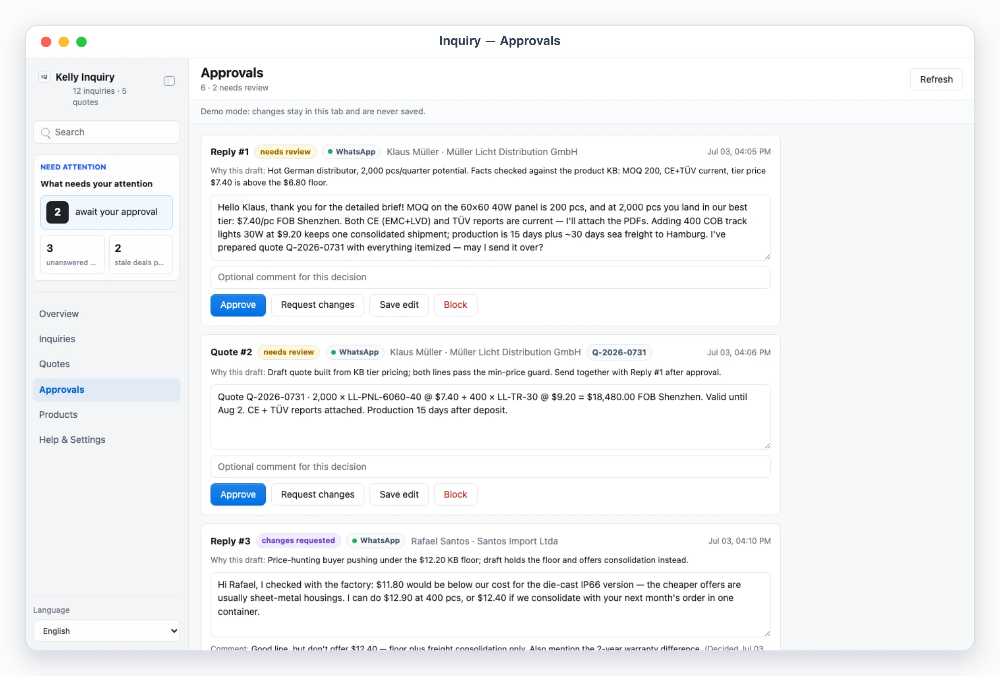
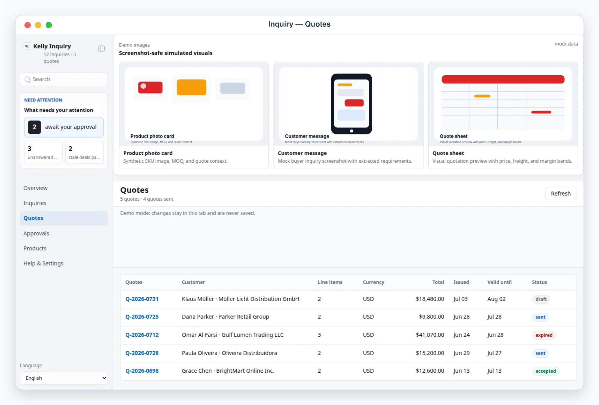

# Kelly Inquiry

## App UI Screenshots

<table>
  <tr>
    <td width="50%"></td>
    <td width="50%"></td>
  </tr>
  <tr>
    <td><strong>Overview</strong><br>Inquiry command desk with reply SLA counters, weekly channel mix, pipeline funnel, and stale-deal alerts.</td>
    <td><strong>Approvals</strong><br>Approval-gated outbox for replies and quotes — nothing is sent until reviewed.</td>
  </tr>
  <tr>
    <td width="50%"></td>
    <td width="50%"></td>
  </tr>
  <tr>
    <td><strong>Pipeline</strong><br>Inquiries across WhatsApp, Instagram, and email with country, stage, value estimate, and next follow-up.</td>
    <td><strong>Quotes</strong><br>Quote worksheets with line items sourced from the product KB, validity, and min-price guards.</td>
  </tr>
</table>

## Overview

Use this skill as Kelly's inbound-inquiry reception desk for foreign-trade
sales. Inquiries arrive via WhatsApp, Instagram, Messenger, and email; sales
reply late and leads leak. The AirApp aggregates them into one Busabase
pipeline (`new` → `replied` → `quoted` → `negotiating` → `won`/`lost`),
maintains a product knowledge base + FAQ so the agent can draft accurate
replies and quotes, enforces approval before anything is sent, and surfaces
stale deals past the follow-up SLA. Collecting real inquiries and sending
real replies/quotes are both genuine external-platform operations a browser
cannot perform (no secrets, no outbound platform calls):
`scripts/ingest_inquiries.mjs` is the single write-path for agent-collected
or manual inquiry payloads, `scripts/sync_products.mjs` imports/refreshes the
product knowledge base, and `scripts/send_approved.mjs` sends approved
replies/quotes. The AirApp itself only reads Busabase and writes queued
drafts/decisions/follow-ups/quote edits.

Default behavior is AirApp-first. Unless the user explicitly asks only for
explanation, ingest whatever inquiries/products are collected and give the
user the clickable AirApp URL (or the local preview URL when local preview
is explicitly requested). Use chat-only mode only when the user says
"纯聊天", "chat only", "不要打开 UI", or similar.

**The AirApp itself never talks to WhatsApp/Instagram/Messenger/email.** It
reads and writes Busabase records only. Both external-platform directions
are genuinely trusted-process-only: `scripts/ingest_inquiries.mjs` is the
only place inquiry payloads are written, and `scripts/send_approved.mjs` is
the only place that sends a real reply/quote — always after a human approval
recorded in Busabase.

## Mandatory Dependencies

1. Read and follow `$kelly-app-skill-creator` for product behavior, visual
   quality, responsive layout, and the complete canonical `content/kelly-inquiry-app/` artifact.
2. Read and follow `$busabase` for connection, target Space, node discovery,
   ChangeRequests, review, and merge behavior.
3. Read and follow `$busabase-app-creator` for resource modeling, AirApp
   runtime limits, security, validation, and deployment.

If a dependency is unavailable, preserve this skill's local artifact and
product contracts, stop before the unavailable Busabase operation, and report
the exact missing dependency. Do not invent a second data backend.

## Boundary

- The AirApp reads and writes Busabase records only. It must never call WhatsApp/Instagram/Messenger/email APIs, or perform any other external side effect. It cannot send anything: the composer queues drafts into the `approvals` Base, the approvals view records verdicts.
- Every outbound reply AND quote is approval-required. Only `scripts/send_approved.mjs --send` sends, and only items whose status is `approved`; the dry run (no `--send`) only prints a plan.
- Own accounts only: read and send exclusively through accounts the user owns and has configured. Respect each platform's terms of service and rate limits; prefer official APIs; keep collection read-only against the platform (Busabase is the only thing the ingest/sync scripts write to).
- Never store passwords, QR-login payloads, or session tokens — anywhere, including Busabase. Accounts store only the channel, connector, and the **names** of env vars holding tokens, never the token values. For `browser_agent` collection the agent drives the user's own already-authenticated web session and stores only inquiry text needed for review.
- Product and pricing data stays in Busabase. Treat customer contacts, conversation excerpts, price floors, and quotes as sensitive: never commit real tokens, customer exports, or Busabase credentials.

## Busabase Resources

Eight Bases under one application Folder (`kelly-inquiry`), declared in
`content/kelly-inquiry-app/app/js/config.js` and the generated template sidecars under `content/`:

- `accounts`: connected channels — WhatsApp/Instagram/Messenger/email, connector, and env-var *names* for tokens (never values), status, last sync.
- `inquiries`: the sales pipeline — customer (name/company/country/source), product interest, linked `product-ids`/`quote-ids`, `stage`, value estimate, owner, `next-follow-up`, the send target (`provider-conversation-id`), and an optional agent-suggested reply.
- `messages`: one row per conversation message, joined onto its inquiry by `inquiry-id`.
- `products`: the product knowledge base — SKU, MOQ, `price-min`/`price-max`, lead time, `specs` and `faq` (JSON-encoded).
- `quotes`: quote worksheets — line items (JSON-encoded), currency, validity, terms, pricing notes, and the min-price-guard `pricing-alerts` (recomputed live, never trusted from storage).
- `approvals`: the review queue — outgoing reply/quote drafts, workflow `status`, the human verdict fields (`decision-action`/`decision-comment`/`decided-at`), and the execution result (`execution-status`/`execution-operation`/`execution-connector`/`execution-target`/`execution-detail`/`executed-at`) written by `scripts/send_approved.mjs`.
- `sync-log`: append-only history of ingest/sync runs per account.
- `settings`: one row (`record-id: "config"`) with quote defaults (currency, validity days, incoterm, payment terms, min-price guard), follow-up SLA days per stage, reply style, and the product KB source path.

Resources provision lazily through an idempotent Busabase ChangeRequest the
first time the app runs in a Space; see `references/inquiry-schema.md` for
exact field shapes. Per-inquiry rollups (`last_message_at`,
`last_incoming_at`, the new→replied stage heuristic), quote totals, the
min-price guard, follow-up staleness, and metrics are all recomputed
client-side from `inquiries`/`messages`/`products`/`quotes` on every read —
**never stored**.

## First Run And Onboarding

On invocation, check the `accounts` Base. If empty, guide setup before
collecting real inquiries.

Onboarding asks, turn by turn:

1. Which channels receive inquiries (WhatsApp / Instagram / Messenger / email) and which connector method per account (see Collection Workflow). Ask for non-secret details only: channel, display name, handle, and which env var names hold the tokens. Never ask the user to paste secret values into chat; secrets belong only in local env files.
2. Product KB import: a JSON or CSV file of products (SKU, MOQ, price range incl. `price_min` floors, lead time, specs, FAQ), imported via `scripts/sync_products.mjs`.
3. Quote defaults: currency, validity days, incoterm/payment terms, and whether the min-price guard is enabled.
4. Follow-up SLA days per stage (defaults: new 1, replied 2, quoted 3, negotiating 5).
5. Reply style: tone, language policy, signature, and "do not say" guardrails.

Write the answers to the `settings` Base's single `record-id: "config"` row
(`quote-defaults`/`follow-up`/`reply-style`/`kb-source-path`, each
JSON-encoded where structured) via `busabase-sdk`. Register an account with:

```bash
node skills/kelly-inquiry/scripts/ingest_inquiries.mjs onboarding-payload.json --apply
```

where `onboarding-payload.json` carries an `account` object (see
`references/inquiry-schema.md`; `inquiries` can be omitted on this first
run).

## Local App

Default behavior is AirApp-first — give the user the clickable AirApp URL.
Start `pnpm --dir content/kelly-inquiry-app dev` only when local preview/debugging is explicitly
requested.

Required app views (hash routes):

- `#/overview`: inquiry command desk. Human-attention panel (replies/quotes awaiting approval, unanswered new inquiries, stale deals past the follow-up SLA), KPI cards (inquiries this week with channel badges, reply median time, quotes sent, win rate), a pipeline funnel summary (inline SVG bars: new→replied→quoted→negotiating→won), and an oldest-unanswered indicator.
- `#/inquiries` and `#/inquiries/<id>`: the pipeline table — customer, country flag/code, channel badge, product interest, stage, value estimate, last message age, next follow-up date, owner. Detail: conversation excerpt (bubbles), customer profile (company, country, source), linked products, quote history, an agent-drafted reply with editable text plus `Queue reply` (goes to Approvals), and a follow-up scheduling field.
- `#/quotes` and `#/quotes/<id>`: quote worksheet — quote no, customer, line items, currency, validity, status (`draft`/`sent`/`accepted`/`expired`/`declined`). Detail: editable line items sourced from the product KB (draft quotes only), terms, and agent pricing notes with the min-price guard result from the KB floors.
- `#/approvals`: the review queue with workflow states `needs_review` / `changes_requested` / `approved` / `done` / `blocked` over outgoing replies AND quotes. Each item shows target channel + customer, the draft, reason/context, editable text, decision buttons (approve / request changes / save edit / block), and stable refs (`Reply #1` / `Quote #2`). `done` means sent, with the execution result written by `scripts/send_approved.mjs`.
- `#/products` and `#/products/<id>`: the product KB — cards with name, SKU, MOQ, price range, lead time, FAQ count; detail with specs and the FAQ entries the agent uses for drafting.
- `#/settings`: sanitized config — channels/accounts with connector method + env readiness booleans, product KB source, quote defaults (currency, validity days, min-price guard), follow-up SLA, sync log, and onboarding state. Never secrets.

Demo mode:

- `?demo=overview`, `?demo=inquiries`, `?demo=quotes`, `?demo=approvals`, `?demo=products`, and `?demo=detail` (opens the featured hot WhatsApp inquiry `wa-mueller-led-panels` with a drafted reply and a draft quote) select named deterministic mock scenes. Persona: "Lumina Lighting Co.", a foreign-trade LED-lighting supplier.
- `lang=en` or `lang=zh` forces UI chrome language for screenshots. With `lang=zh` the chrome AND agent-generated content (reasons, notes, product names, pricing notes) are localized; drafted replies and conversation quotes stay in the buyer's language. Deep links such as `/?demo=detail&lang=zh#/inquiries/wa-mueller-led-panels` work.
- Demo mode never reads or writes Busabase. Composer, approvals, follow-up, and quote-edit buttons still work but act on in-memory state only (running the exact same `refreshInquiryDerived`/`recomputeQuoteTotals`/`applyMinPriceGuard` functions the Busabase provider uses) and show a demo notice.

UI language: English and Chinese chrome with `Auto` default following the browser language; explicit selector persisted locally. Keep customer names, message content, and drafted outbound text in their original language.

## File Contract

Read `references/inquiry-schema.md` before editing the app, scripts, or Busabase field shapes.

## Collection Workflow

1. Detect mode. Default to AirApp-first.
2. Check the `accounts` Base. If empty, enter onboarding.
3. Collection reuses the connector reality documented in kelly-messenger. Per account, declare a `connector`:
   - `whatsapp_cloud` — WhatsApp Business Cloud API (`access_token_env` + `phone_number_id_env`). Inbound messages arrive via webhook only, so history is collected via ingest payloads; sends use the Cloud API.
   - `instagram_graph` / `messenger_graph` — Meta Graph API for professional-account DMs and Page messages (`access_token_env` plus `ig_user_id_env` / `page_id_env`).
   - `email_agent` — hand off to the kelly-email skill: it collects inquiry emails, the agent normalizes them into an ingest payload; sends go back through kelly-email drafts.
   - `browser_agent` — the agent drives the user's own already-authenticated web session (e.g. WhatsApp Web, Instagram web) with the browser skill, then writes a payload. No passwords or QR secrets are ever stored.
   - `manual` — the user or agent prepares an ingest payload by hand.
4. All collected data enters through one write path: `node scripts/ingest_inquiries.mjs payload.json --apply`. It validates the payload, dedupes by stable inquiry/message ids, merges into Busabase, applies the stage heuristic (an outgoing reply promotes `new` → `replied`), upserts the account, and appends a `sync-log` entry. Omit `--apply` first to see a dry-run summary.
5. While drafting, the agent may attach a `suggested-reply` per inquiry (prefilled in the composer) and queue reply/quote drafts into the `approvals` Base with `suggested-by: "agent"` and a clear `reason` — always grounded in the product KB and reply style, never below `price_min`.
6. Give the user the AirApp URL (or local preview URL). Surface connector problems as printed warnings, not silent failures.

## Quoting Workflow

1. Ground every quote in the product KB: SKU, MOQ, tier pricing inside `price-min`–`price-max`, lead time, and FAQ facts (certificates, OEM options, dimming, packaging). Import/refresh the KB with `node scripts/sync_products.mjs products.json|products.csv --apply` (zero-dependency CSV parser with quoted-field support).
2. Min-price guard: config `quote-defaults.min_price_guard` plus per-product `price-min` floors. Any line priced below its floor raises a `pricing_alerts` entry (recomputed live by `applyMinPriceGuard`); with `block_below_price_min` the agent must not queue such a quote for sending — block it and ask the user instead.
3. Build the quote as a `draft` in the `quotes` Base (quote no, line items, currency, validity from `validity_days`, terms from quote defaults, pricing notes explaining the tier used and the guard result) and queue a matching `kind: "quote"` approval item referencing it via `busabase-sdk`.
4. The user edits draft line items in `#/quotes/<id>` (the provider recomputes totals via `recomputeQuoteTotals` and re-runs the guard) and gives the verdict in `#/approvals`.
5. After a quote is sent, `scripts/send_approved.mjs` sets its status to `sent`; track `accepted` / `expired` / `declined` from the conversation, and move the inquiry stage accordingly (`quoted`, `negotiating`, `won`, `lost`).

## Approval And Send Workflow

`scripts/send_approved.mjs` is the executor — there is no separate execute_decisions script.

1. Queue: the user writes or edits a reply in the composer (optionally starting from the agent's `suggested-reply`) and clicks `Queue reply`; the app writes it to the `approvals` Base as `needs_review` via `busabase-sdk`. The agent queues its own reply/quote drafts the same way.
2. Review: in `#/approvals` the user approves, edits (`Save edit`), requests changes, or blocks each item — written directly onto the approval record. From a standalone local preview the write merges immediately (trusted operator); from the deployed AirApp it creates a pending ChangeRequest for the trusted process to merge.
3. Agent revision loop: for an item moved to `changes_requested`, redraft the text honoring the `decision-comment`, the config `reply_style`, and the KB (re-check the min-price guard for quotes), then write it back to `needs_review`.
4. Send: only after the user asks to send, run `node scripts/send_approved.mjs` (dry-run) and show the plan — planned sends, targets, and missing-token blockers. With explicit approval, run `node scripts/send_approved.mjs --send`: it re-reads Busabase immediately before sending, sends API-connector items via the official APIs (WhatsApp Cloud, Instagram/Messenger Graph), marks `email_agent`/`browser_agent`/`manual` items as `handoff_to_agent` for the agent to deliver (kelly-email drafts, or the user's own web session), sets sent items to `done`, and writes the execution result onto each approval record.
5. Report per-item results back to the user with the stable `Reply #N` / `Quote #N` refs.

## Follow-Up Reminders

Stale deals are how leads leak; the agent owns catching them.

1. On every invocation (and after every ingest), compare each active inquiry (`new`/`replied`/`quoted`/`negotiating`) against `follow-up.sla_days` for its stage and its `next-follow-up` date. This is computed live via `staleInquiries`/`isFollowUpOverdue` — never trusted from a stored flag.
2. For each overdue deal, draft a follow-up reply into the `approvals` Base (`suggested-by: "agent"`, reason citing the SLA breach and deal value) so the human can approve before anything is sent.
3. The UI surfaces the same signal: the sidebar stale-deal counter, the overview "Stale deals past follow-up SLA" panel, and red overdue dates in the pipeline table. The user can reschedule with the follow-up field in the inquiry detail.
4. When the user asks "what should I chase today", answer from the stale list (`staleInquiries`) plus any queued follow-up drafts, with `Reply #N` refs for anything already drafted.

## Safety Defaults

- Never send without an `approved` status recorded in the `approvals` Base, and never bypass the dry-run → `--send` sequence.
- Never quote below a product's `price-min` without an explicit human decision recorded on the item.
- Prefer read-scoped tokens where the platform offers them; keep collection strictly read-only against the platform.
- Redact tokens and token-like strings from logs, reports, and UI state; expose only env-var readiness booleans.
- Keep sends idempotent: stable item ids, execution results stored on the approval record, and re-reading Busabase before each send.
- If a send target is missing (`provider-conversation-id`), leave the item `approved` with an `execution-status: error` and ask for configuration instead of guessing.
- Honor platform rate limits; on 429s back off rather than retrying aggressively.

## Useful Commands

```bash
node skills/kelly-inquiry/scripts/ingest_inquiries.mjs payload.json --apply
node skills/kelly-inquiry/scripts/sync_products.mjs products.csv --apply
node skills/kelly-inquiry/scripts/send_approved.mjs
node skills/kelly-inquiry/scripts/send_approved.mjs --send
pnpm --dir skills/kelly-inquiry/content/kelly-inquiry-app dev
```

In normal use, invoke `/kelly-inquiry`, let the skill ingest the configured
accounts/products, and open the AirApp.
