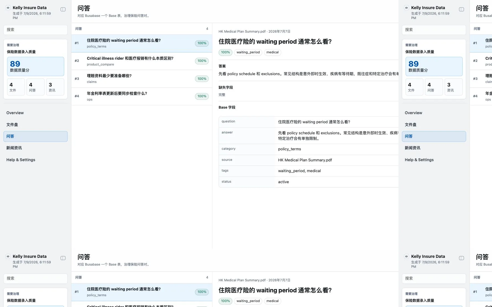

# Kelly Insure Data

Kelly Insure Data is a local App-in-Skill workspace for insurance-industry high-quality data entry and data governance. It connects to Busabase through the REST data provider layer: one Drive node for the file drive, one Base for QA pairs, and one Base for insurance news and market-intelligence records.

## What It Shows

- Overview: file, QA, and news counts; data quality score; metadata field coverage; and records that still need governance.
- 文件盘: Busabase Drive-node files with metadata fields, missing-field badges, source, owner, jurisdiction, carrier, product line, and review status.
- 问答: QA Base records with canonical question/answer text, source traceability, tags, review status, and completeness checks.
- 新闻资讯: News Base records with title, publisher, publish date, market, URL, summary, and governance warnings.
- Settings: local provider state and Busabase connection targets, without exposing tokens or private config.

The app is read-first by default. It surfaces quality gaps and review targets before any insurance data becomes trusted knowledge.

## App UI Screenshots

<table>
  <tr>
    <td width="50%"></td>
    <td width="50%"></td>
  </tr>
  <tr>
    <td><strong>Overview</strong><br>Insurance governance cockpit with counts, score, metadata coverage, and records requiring cleanup.</td>
    <td><strong>文件盘</strong><br>Busabase Drive-node file list with metadata completeness and missing-field diagnostics.</td>
  </tr>
  <tr>
    <td width="50%"></td>
    <td width="50%"></td>
  </tr>
  <tr>
    <td><strong>问答</strong><br>Canonical insurance QA records with source, tags, review status, and answer-quality warnings.</td>
    <td><strong>新闻资讯</strong><br>Insurance news and market-intelligence records with publisher, market, dates, and source URLs.</td>
  </tr>
</table>

## Demo Mode

Run the app and open safe mock insurance data:

```bash
skills/kelly-insure-data/app/start.sh
```

Use the URL printed by the launcher, then add one of these demo paths:

```text
/?demo=overview&lang=zh#/overview
/?demo=files&lang=zh#/files
/?demo=qa&lang=zh#/qa
/?demo=news&lang=zh#/news
/?demo=settings&lang=zh#/settings
```

Demo mode never reads Busabase, private config, API keys, or local production data.

## Busabase Config

Copy `config.example.json` to `config.local.json` or `~/.config/kelly-insure-data/config.json`, then set the Busabase Drive node and Base IDs:

```json
{
  "data_provider": "busabase",
  "busabase": {
    "base_url": "http://127.0.0.1:15419",
    "api_key_env": "KELLY_INSURE_DATA_BUSABASE_API_KEY",
    "drive_node_id": "drv_or_node_id",
    "qa_base_id": "bse_qa",
    "news_base_id": "bse_news"
  }
}
```

Keep real tokens in environment variables only. Never commit real insurance files, record snapshots, tokens, or anything under `app/.data/`.

## Busabase Backup and Restore

The skill can export a portable restore manifest for the active insurance workspace:

```bash
npm run busabase:export -- --output app/.data/busabase_restore_manifest.json
```

After a Busabase reset, restore from that manifest plus the local PDF backup directory:

```bash
npm run busabase:restore -- --manifest app/.data/busabase_restore_manifest.json --files-root /path/to/local/pdf-backup --dry-run
```

Use `--apply` only when you are ready to recreate missing folder, Drive files, Bases, and records.

PDF asset metadata can be regenerated from local PDFs:

```bash
npm run busabase:backfill-pdf-metadata -- --drive-node-id <node-id> --files-root /path/to/local/pdf-backup --limit 5
```

---

# Kelly Insure Data（中文）

Kelly Insure Data 是一个面向保险行业的本地 App-in-Skill 数据录入与治理工作台。它基于 Busabase REST provider 读取三类数据：一个 Drive node 做「文件盘」，一个 Base 做「问答」，一个 Base 做「新闻资讯」。

## 界面内容

- Overview：展示文件数、问答数、资讯数、数据质量分、Metadata 字段覆盖率，以及需要治理的记录。
- 文件盘：展示 Busabase Drive node 下的文件与 Metadata 字段，突出缺失字段、来源、负责人、地区、险种、承保方与审核状态。
- 问答：展示 Busabase Base 中的 QA 对，包含标准问题、标准答案、来源、标签、审核状态与完整性检查。
- 新闻资讯：展示另一个 Busabase Base 中的保险资讯，包含标题、发布方、发布时间、市场、链接、摘要与治理风险。
- Settings：展示本地 provider 和 Busabase 目标配置摘要，不暴露 token 或私有配置。

默认是只读治理视图。需要新增、清洗或回写 Busabase 记录时，应先生成可审核的变更建议，再由用户确认。
