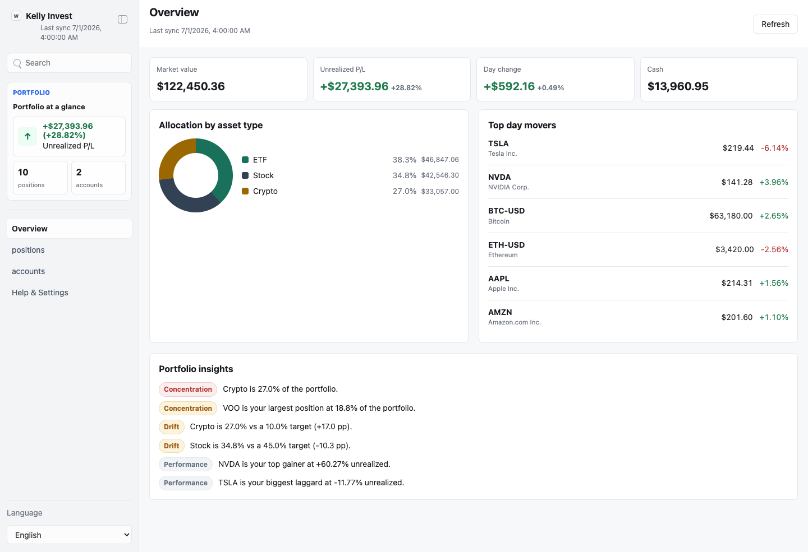
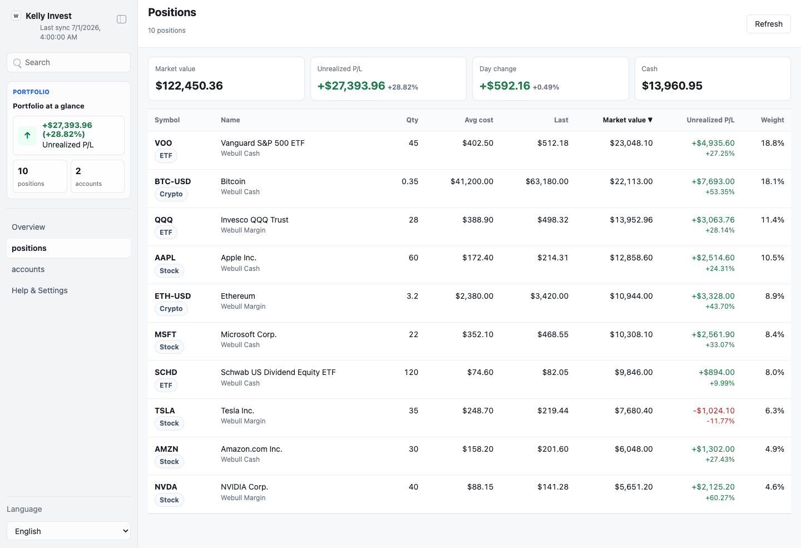
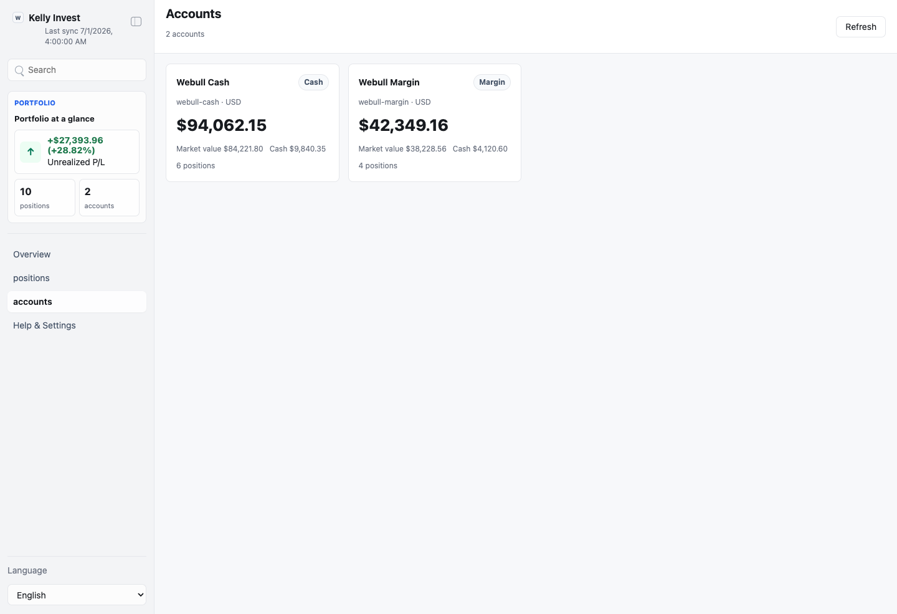
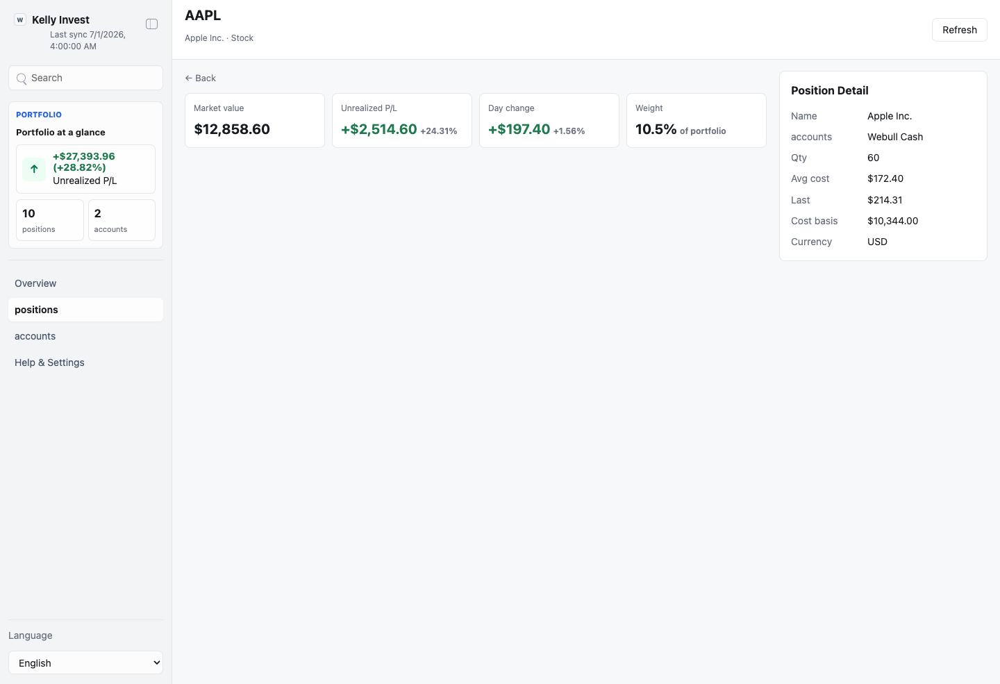

# Kelly Invest (Webull)

Kelly Invest (Webull) is a local, read-only App-in-Skill dashboard that aggregates
your personal Webull brokerage holdings into one portfolio view. It never places,
modifies, or cancels orders and never moves money.

## What It Shows

- Overview: total market value, unrealized P/L (with %), day change, cash, and a
  pure-CSS allocation donut by asset type.
- Positions: sortable table (symbol, name, qty, avg cost, last, market value,
  unrealized P/L %, weight).
- Accounts: cash and margin accounts with net liquidation, cash, and buying power;
  selecting an account filters positions.
- Position detail: per-symbol pane with cost basis, day change, and weight.

## App UI Screenshots

<table>
  <tr>
    <td width="50%"></td>
    <td width="50%"></td>
  </tr>
  <tr>
    <td><strong>Overview</strong><br>Portfolio command desk with market value, unrealized P/L, day change, cash, an allocation-by-asset-type donut, and top day movers.</td>
    <td><strong>Positions</strong><br>Sortable holdings table across symbol, asset type, quantity, average cost, last price, market value, unrealized P/L, and portfolio weight.</td>
  </tr>
  <tr>
    <td width="50%"></td>
    <td width="50%"></td>
  </tr>
  <tr>
    <td><strong>Accounts</strong><br>Per-account view (cash and margin) with net liquidation, total cash, buying power, and the positions held in each account.</td>
    <td><strong>Position detail</strong><br>Single-symbol view with cost basis, market value, unrealized P/L and percentage, day change, weight, and holding account.</td>
  </tr>
</table>

## Demo Mode

Run the app and open a safe mock-data scene:

```bash
skills/kelly-invest-webull/app/start.sh
```

Use the URL printed by the launcher, then add one of these demo paths:

```text
/?demo=1&lang=en#/overview
/?demo=positions&lang=en#/positions
/?demo=accounts&lang=en#/accounts
/?demo=detail&lang=en#/positions/AAPL
```

Demo mode is fully offline and never reads live Webull data or local private files.

## Private Config

Copy `config.example.json` to `config.local.json` or
`~/.config/kelly-invest-webull/config.json`. Put the Webull App Key / App Secret in
local env files only, referenced by env var name in config. Never commit real
credentials, exports, or files under `app/.data/`.
