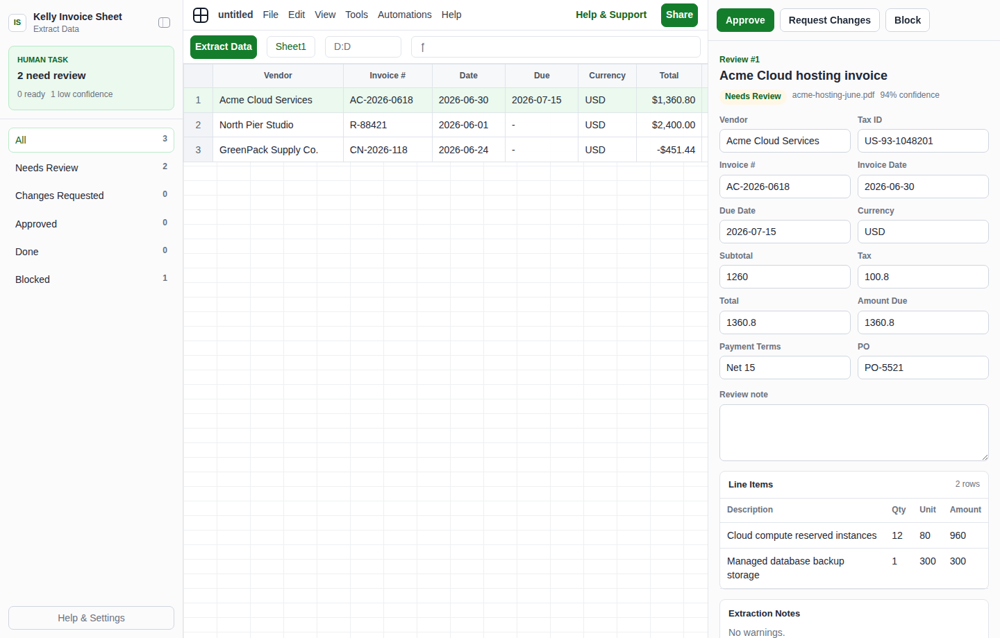
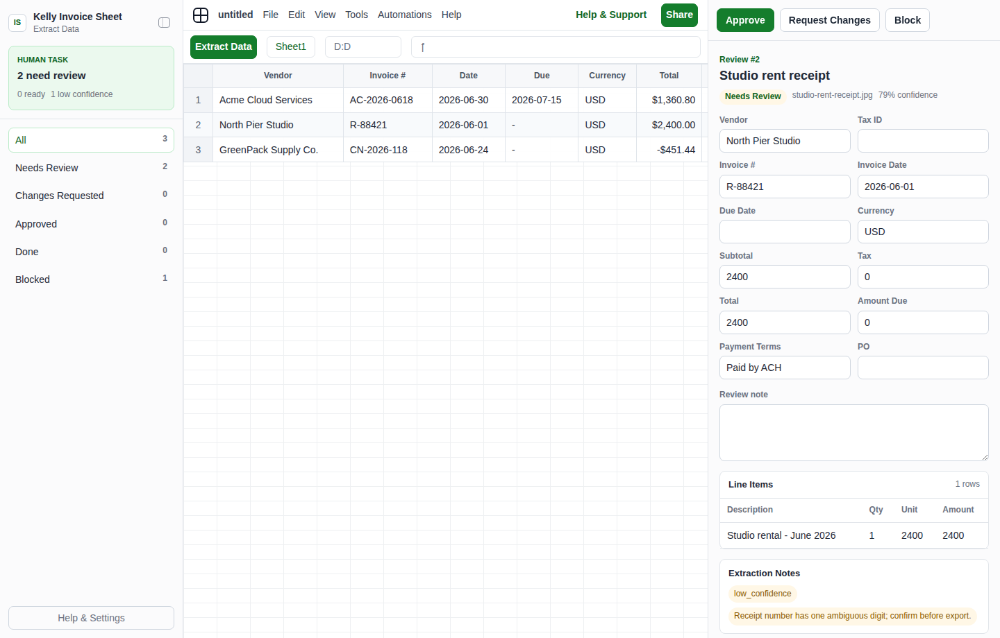
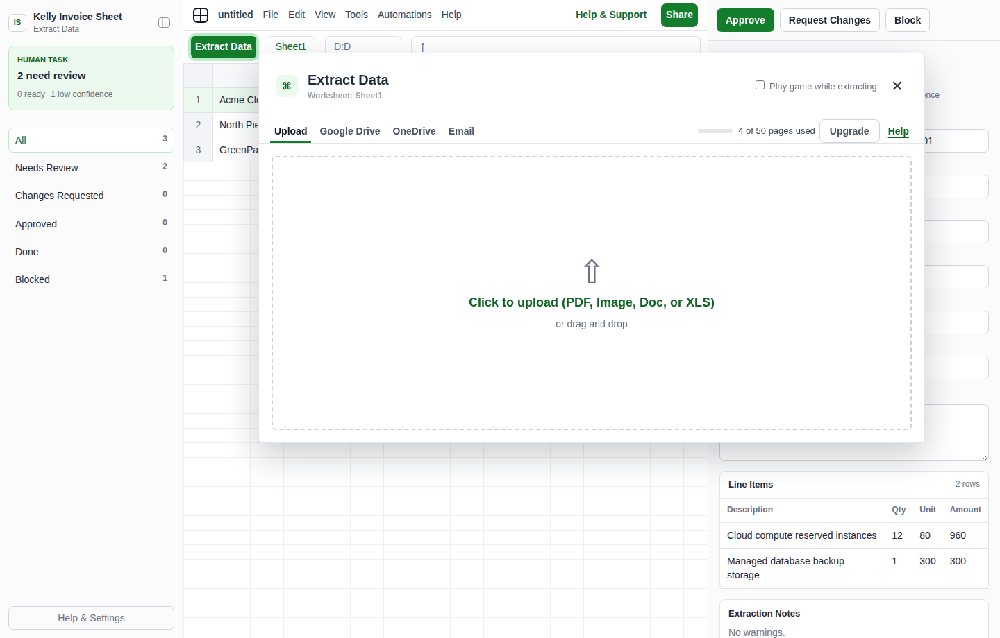

# Kelly Invoice Sheet

Kelly Invoice Sheet turns invoices, receipts, credit notes, and statements into a reviewable local table. It is inspired by Lido's spreadsheet-first "Extract Data" flow: upload or hand off files, inspect extracted fields in a sheet-like workspace, fix low-confidence cells, approve rows, then export clean CSV/JSON for bookkeeping or audit.

## What It Does

- Converts invoice sources into a structured `invoices` table plus `line_items`.
- Tracks confidence, source warnings, ambiguous OCR, missing fields, and money risks.
- Gives the human a local spreadsheet-style review UI before anything is exported.
- Exports approved rows to `invoices.csv`, `line_items.csv`, and `approved_invoices.json`.

## App UI Screenshots

<table>
  <tr>
    <td width="33%"></td>
    <td width="33%"></td>
    <td width="33%"></td>
  </tr>
  <tr>
    <td><strong>Spreadsheet extraction desk</strong><br>Sheet-like invoice table with extracted rows, status filters, confidence flags, and human-attention counts.</td>
    <td><strong>Invoice detail review</strong><br>Editable invoice fields, line items, confidence notes, and approve/request-changes/block controls.</td>
    <td><strong>Extract Data upload</strong><br>Lido-style upload modal with local file, Google Drive, OneDrive, and email source options.</td>
  </tr>
</table>

## Demo

Generate safe mock invoice data, then open the app:

```bash
cd skills/kelly-invoice-sheet
node scripts/generate_demo_batch.ts
app/start.sh
```

Use the URL printed by the launcher. Demo data never reads real invoice files.

## Real Workflow

1. Ask the agent to extract invoice files into `/kelly-invoice-sheet`.
2. The agent writes `app/.data/current_batch.json` using `references/invoice-batch-schema.md`.
3. The app displays the batch for review and saves edits/decisions to `app/.data/decisions.json`.
4. Run:

```bash
node scripts/export_decisions.ts
```

Approved rows are exported under `exports/<batch-id>/`.

## File Contract

- `app/.data/current_batch.json`: current invoice extraction batch.
- `app/.data/decisions.json`: human decisions, field edits, and notes.
- `app/.data/agent_tasks.json`: revision requests for the agent.
- `app/.data/execution_report.json`: latest export result.
- `app/.data/agent.lock`: temporary write lock.

## Safety

The local app never uploads invoice files, pays invoices, emails vendors, or writes to accounting software. Those actions require separate connectors and explicit approval.
