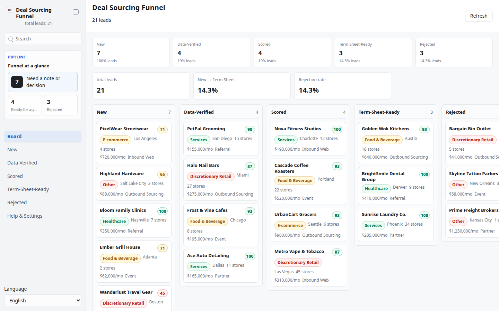

# Deal Sourcing Funnel

Deal Sourcing Funnel is a local, file-backed App-in-Skill control panel for a
BD/sourcing team at any lender or investment fund that sources SME financing
candidates (merchant cash advance, revenue-based financing, or similar). It
ingests a mock pipeline of merchant/business leads, computes a deterministic,
rule-based lead-quality score, and lets the team triage the pipeline as a
kanban board — moving stages, rejecting with a reason, and leaving notes,
all written to local handoff files. It never sends outreach, signs term
sheets, or moves money.

## What It Shows

- **Kanban board** across five funnel stages: New → Data-Verified → Scored →
  Term-Sheet-Ready, with Rejected reachable from any prior stage.
- **Funnel summary header**: per-stage lead counts, stage-by-stage
  conversion rates from New, overall New → Term-Sheet-Ready conversion, and
  the rejection rate.
- **Deterministic lead-quality score** (0-100, `lib/scoring.ts`, not an LLM
  call) from four weighted, explainable factors: chain-size fit (30),
  revenue-scale fit (30), category risk (25), and data verifiability (15).
- **Lead detail panel**: full score breakdown with a rationale per factor,
  suggested next action, notes, stage-move buttons, and reject-with-reason.
- **Human actions**, all written to local handoff files: move a lead's
  stage, reject with a required reason, add a note.

## App UI Screenshots

<table>
  <tr>
    <td width="50%"></td>
    <td width="50%"></td>
  </tr>
  <tr>
    <td><strong>Overview</strong><br>Funnel summary header with per-stage counts, conversion rates, and rejection rate.</td>
    <td><strong>Kanban board</strong><br>Leads across New → Data-Verified → Scored → Term-Sheet-Ready → Rejected, with a score chip per card.</td>
  </tr>
  <tr>
    <td colspan="2"></td>
  </tr>
  <tr>
    <td colspan="2"><strong>Lead detail</strong><br>Score breakdown by factor, suggested next action, notes, stage-move actions, and reject-with-reason.</td>
  </tr>
</table>

Chinese (zh-CN) screenshots are also bundled: `overview-zh-CN.png`,
`kanban-zh-CN.png`, `lead-detail-zh-CN.png`.

## Demo Mode

Run the app and open a safe, fully offline mock scene:

```bash
skills/kelly-lead-funnel/app/start.sh
```

Use the URL printed by the launcher, then add one of these demo paths:

```text
/?demo=1&lang=en#/board
/?demo=board&lang=zh#/board
/?demo=lead&lang=en#/leads/lead-001
/?demo=settings&lang=en#/settings
```

Demo mode is fully offline (21 mock leads across all 5 stages, generated by
`lib/mock-leads.ts`) and never reads or writes `app/.data/`.

## Real Local Data

```bash
npm install
npm run seed        # writes 21 mock leads to app/.data/leads.json
npm run validate     # validates app/.data/leads.json against the schema
npm start            # launches the app on http://127.0.0.1:3000 (or next free port)
```

## Private Config

Copy `config.example.json` to `config.local.json` (or
`~/.config/kelly-lead-funnel/config.json`) and set your fund's display name,
product description, target check size, and scoring-criteria bands. There
are no secrets in the default config — everything here is non-sensitive
business configuration. Never commit `config.local.json`, exports, or files
under `app/.data/`.
