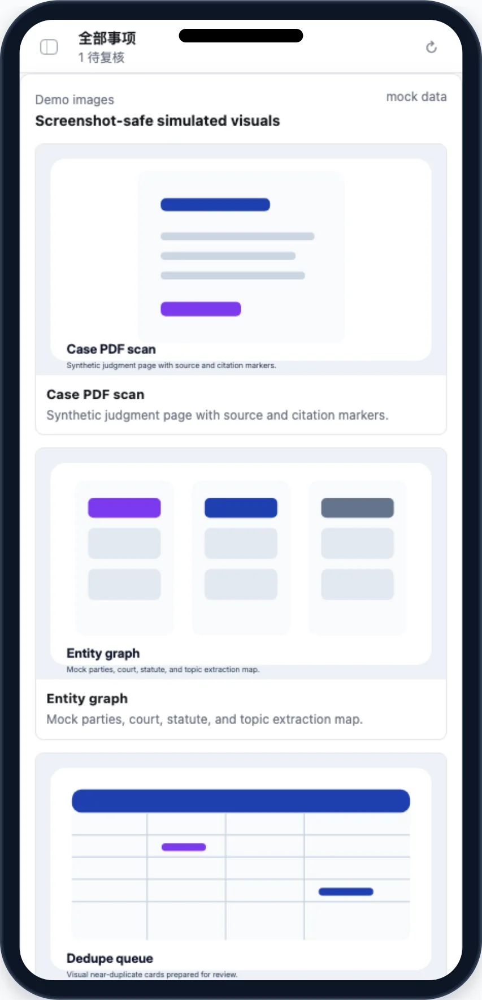

# Legal Casebase Ingest

Turns archived judgments and arbitral awards into reviewed internal case records: anonymization checks, issue tags, court/cause metadata, reasoning snippets, and reviewer approval before ingest.

## App UI Screenshots

<table>
  <tr>
    <td width="50%"></td>
    <td width="50%"></td>
  </tr>
  <tr>
    <td><strong>Overview</strong><br>Casebase command desk with intake progress, anonymization risk, review load, and recent activity.</td>
    <td><strong>Review queue</strong><br>Approval-gated case records with stable refs, anonymization evidence, review notes, and decision controls.</td>
  </tr>
  <tr>
    <td width="50%"></td>
    <td width="50%"></td>
  </tr>
  <tr>
    <td><strong>Checks</strong><br>Deterministic QA checks for PII leakage, taxonomy completeness, source coverage, and tag confidence.</td>
    <td><strong>Workbench</strong><br>Detail pane for facts, reasoning, legal basis, tags, editable draft, and reviewer note before ingest.</td>
  </tr>
  <tr>
    <td width="50%"></td>
  </tr>
  <tr>
    <td><strong>Library</strong><br>Ingested case library with needs-review and approved buckets and per-item counts.</td>
  </tr>
  <tr>
    <td width="50%"></td>
    <td></td>
  </tr>
  <tr>
    <td><strong>Mobile detail</strong><br>Phone-width shell with top bar, single-pane detail, sticky actions, and back-to-list control.</td>
    <td></td>
  </tr>
</table>

## Local App

```bash
skills/kelly-legal-casebase-ingest/app/start.sh
```

Views: overview, review queue, workbench, checks, entities, and settings. The app reads/writes local handoff files only.

## Safety

- Treat all source documents, parties, trade secrets, personal data, and attorney work product as sensitive.
- Do not ingest a record if anonymization evidence is missing, PII-risk checks fail, or reviewer approval is absent.
- Preserve enough facts, reasoning, and legal application for reuse while minimizing raw source text.
- Never expose private source text, secrets, or real client names through demo data, screenshots, logs, or config summaries.
