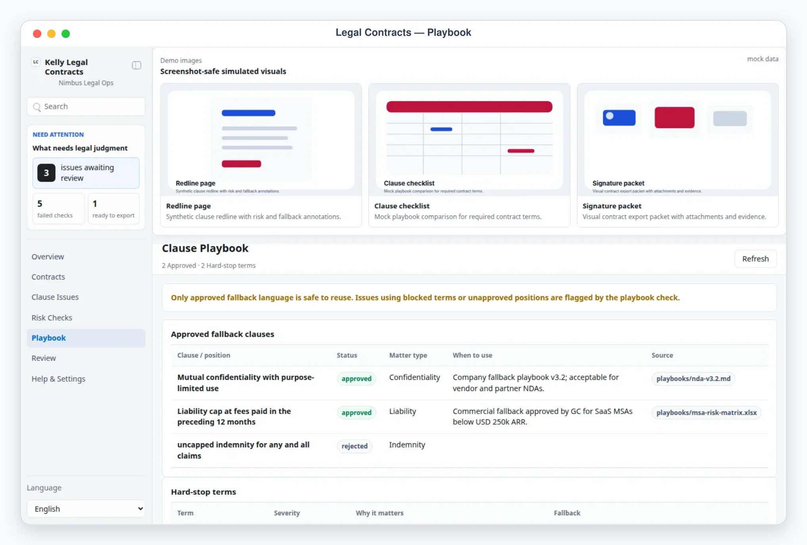

# Kelly Legal Contracts

Kelly Legal Contracts is a Busabase App-in-Skill contract review desk for NDAs, MSAs, DPAs, and SOWs. The agent prepares clause issues, fallback language, playbook checks, and issue-list exports; the human legal reviewer approves, edits, requests changes, or blocks everything through the App-in-Skill review queue.

## What It Shows

- Overview: contract × workstream status, risk pass rate, review queue preview, and recent legal activity.
- Contracts: counterparty, matter type, governing law, deal owner, key obligations, watch terms, and document checklist.
- Clause Issues: editable fallback language, negotiation notes, memo summary, jurisdiction tabs, and per-rule risk checks.
- Risk Checks: rule × issue results with pass/warn/fail badges and evidence.
- Playbook: approved fallback clauses plus hard-stop/restricted terms.
- Review: approve / request changes / block queue with stable refs (`Issue #1`) and legal audit notes.
- Settings: sanitized legal profile, enabled workstreams, jurisdictions, rule counts, export preferences, and data provider.

## App UI Screenshots

<table>
  <tr>
    <td width="50%"></td>
    <td width="50%"></td>
  </tr>
  <tr>
    <td><strong>Overview</strong><br>Legal command desk with contract × workstream status, risk pass rate, review queue preview, and recent activity.</td>
    <td><strong>Review queue</strong><br>Approval-gated legal issue queue with approve / request changes / block decisions and audit notes.</td>
  </tr>
  <tr>
    <td width="50%"></td>
    <td width="50%"></td>
  </tr>
  <tr>
    <td><strong>Risk checks</strong><br>Per-rule pass/warn/fail results across clause issues, including hard-stop terms and playbook violations.</td>
    <td><strong>Clause issues</strong><br>Editable issue detail with fallback language, memo fields, reviewer rationale, and risk-check evidence.</td>
  </tr>
  <tr>
    <td width="50%"></td>
    <td width="50%"></td>
  </tr>
  <tr>
    <td><strong>Clause playbook</strong><br>Approved fallback clauses by position with status, matter type, and where each is safe to use.</td>
    <td><strong>Contract register</strong><br>Contract table with counterparty, matter type, source, workstream, clause issues, and status.</td>
  </tr>
</table>

## Demo Mode

Start the AirApp locally and open a safe mock-data scene:

```bash
pnpm --dir skills/kelly-legal-contracts/content/kelly-legal-contracts-app dev
```

Then add one of these demo paths:

```text
/?demo=overview&lang=en#/overview
/?demo=contracts&lang=en#/contracts
/?demo=issues&lang=en#/issues
/?demo=checks&lang=en#/checks
/?demo=claims&lang=en#/claims
/?demo=review&lang=en#/review
/?demo=detail&lang=en#/issues/d-msa-liability-us
```

The featured detail scene opens `/?demo=detail&lang=zh#/issues/d-msa-liability-us`: a Zenith SaaS MSA issue where customer paper requests uncapped liability and broad indemnity. The clause playbook flags it as escalation-required. Demo mode never reads or writes Busabase.

## Issue Payload Format

`scripts/ingest_contracts.mjs` accepts a single issue object or `{ "contracts": [...], "issues": [...] }`:

```json
{
  "contracts": [
    {
      "name": "Acme Mutual NDA",
      "sku": "Acme Robotics",
      "category": "Vendor evaluation",
      "source": "manual",
      "platforms": ["nda"],
      "locales": ["US"],
      "specs": [{ "name": "Governing law", "value": "California" }],
      "features": ["Mutual confidentiality", "Residuals clause added"],
      "keywords": ["residuals", "purpose limitation"],
      "images": [{ "name": "Counterparty redline", "status": "ready" }]
    }
  ],
  "issues": [
    {
      "contract": "Acme Mutual NDA",
      "platform": "nda",
      "locale": "US",
      "keyword_strategy": "Residuals clause exceeds playbook.",
      "fields": {
        "title": "Residuals clause allows retained ideas after NDA ends",
        "bullets": ["Risk note", "Business impact", "Fallback", "Compromise", "Escalation"],
        "description": "Delete the residuals clause or narrow to unaided memory only.",
        "search_terms": "Ask counterparty to remove residuals.",
        "aplus_outline": ["Memo", "Redline", "Fallback"]
      }
    }
  ]
}
```

After ingesting, run `node scripts/run_checks.mjs --apply` to refresh risk checks, and `node scripts/export_issues.mjs --out <dir>` to export approved issues as Markdown + CSV. See `references/contracts-schema.md` for the full Busabase field contract.

## Busabase Setup

Kelly Legal Contracts provisions its own Folder and six Bases (`contracts`, `issues`, `checks`, `claims`, `claim-rules`, `settings`) lazily on first run in a Busabase Space — no manual setup required. See `SKILL.md`'s Busabase Resources section.

## Boundary

The AirApp reads and writes Busabase only — it never contacts counterparties or remote systems, and never provides final legal advice. Every outbound legal position, redline, counterparty message, approval, signature, or filing is approval-required and sent by the agent via other channels only after explicit human approval. Ingesting a contract/issue and exporting approved issues are local-file operations performed by the trusted `scripts/*.mjs` scripts, never by the browser. Never commit local payload files, env files, or generated exports (`exports/` is gitignored).
