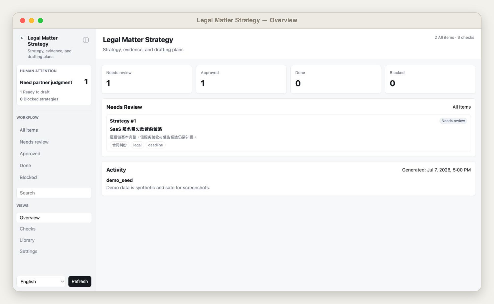
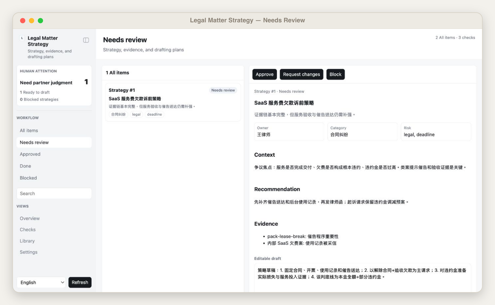
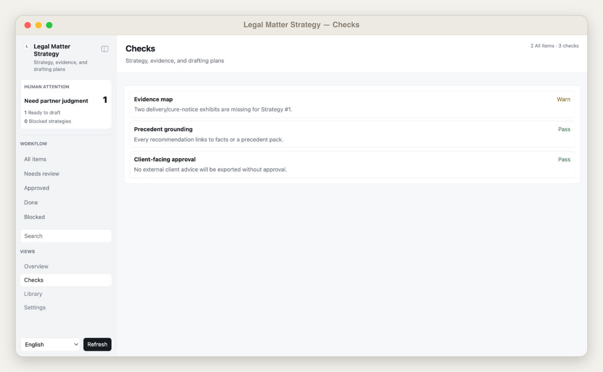
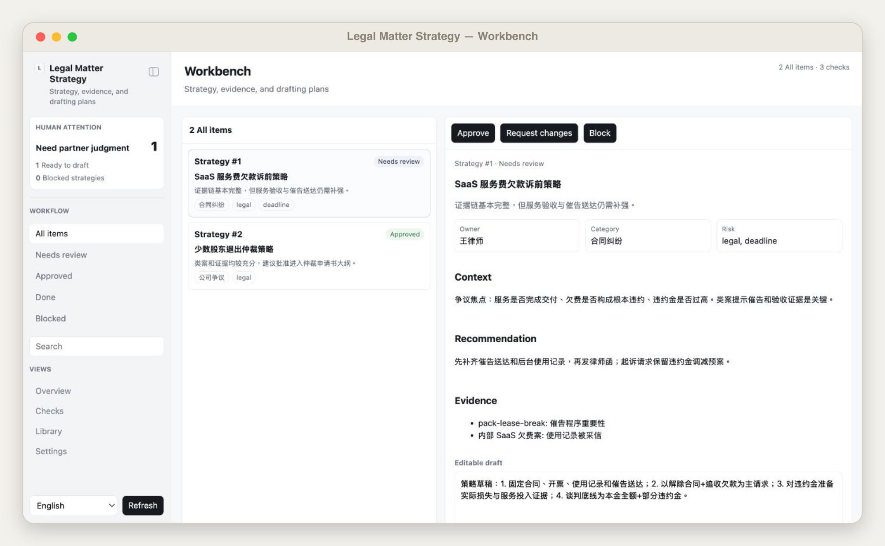

# Legal Matter Strategy

Builds reviewer-gated matter strategy packs from facts and internal precedents: issue tree, evidence map, risk posture, negotiation options, and pleading or memo outlines.

## App UI Screenshots

<table>
  <tr>
    <td width="50%"></td>
    <td width="50%"></td>
  </tr>
  <tr>
    <td><strong>Overview</strong><br>Matter-strategy command desk with partner review load, ready-to-draft strategies, blocked items, and activity.</td>
    <td><strong>Review queue</strong><br>Issue-tree and evidence-map recommendations with responsible-lawyer approval controls.</td>
  </tr>
  <tr>
    <td width="50%"></td>
    <td width="50%"></td>
  </tr>
  <tr>
    <td><strong>Checks</strong><br>Strategy QA for missing facts, evidence gaps, deadline caveats, precedent grounding, and risk warnings.</td>
    <td><strong>Workbench</strong><br>Detail pane for issue tree, evidence map, risk posture, negotiation options, and draft outline.</td>
  </tr>
</table>

## Local App

```bash
skills/kelly-legal-matter-strategy/app/start.sh
```

Views: overview, review queue, workbench, checks, entities, and settings. The app reads/writes local handoff files only.

## Safety

- Do not fabricate facts, evidence, procedural deadlines, counsel approval, or expected judicial outcomes.
- Treat legal advice, settlement posture, filing strategy, and client communications as approval-required.
- If evidence is missing, mark the strategy as needing information rather than filling the gap.
- Approved exports are internal work product unless the responsible lawyer explicitly repurposes them elsewhere.
