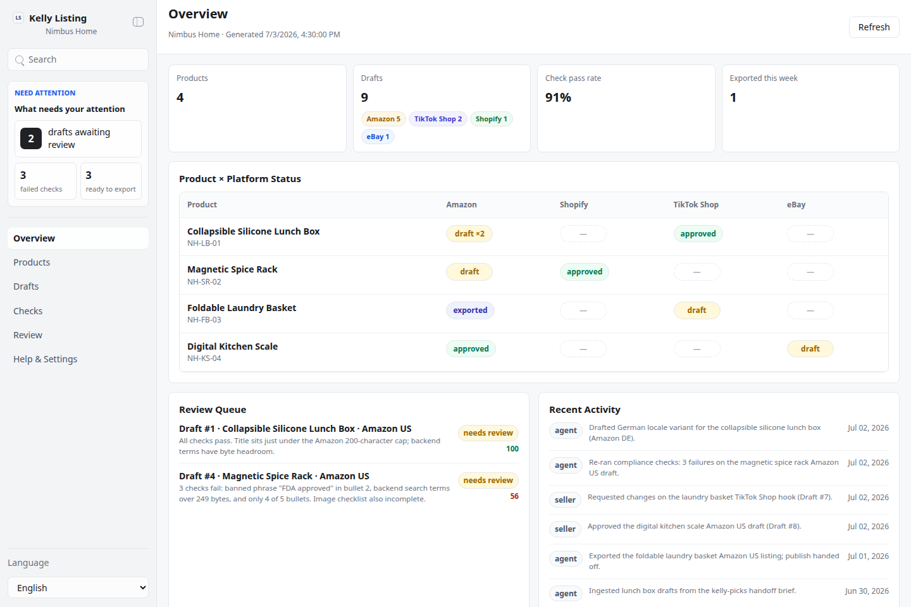
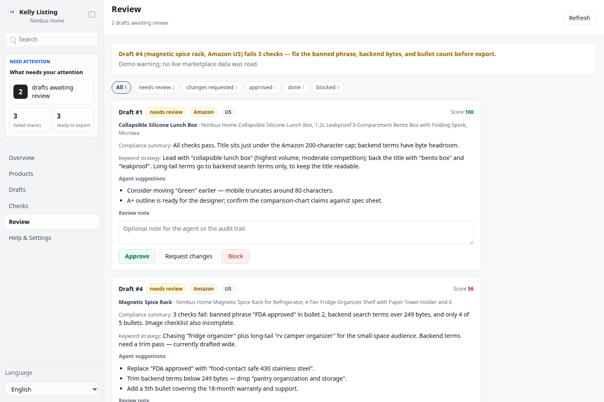
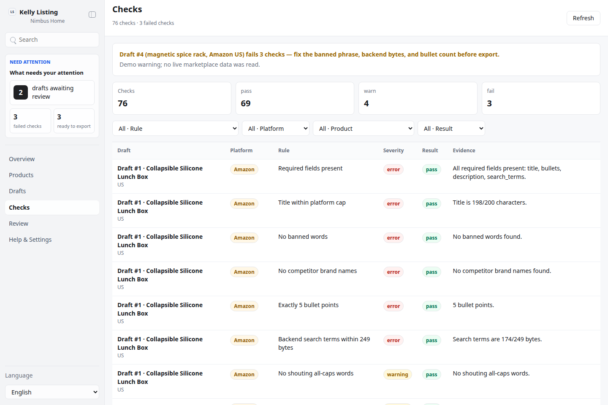
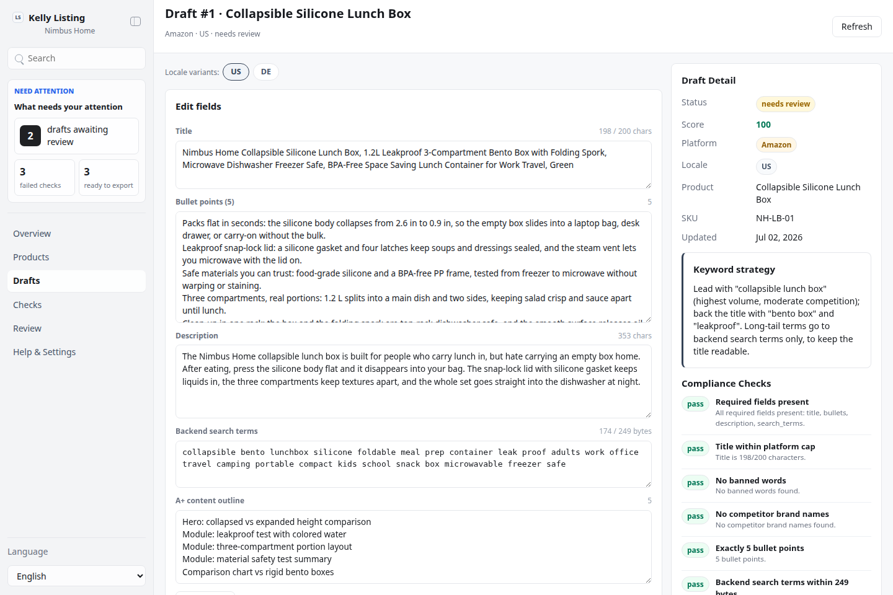

# Kelly Listing

## Overview

Use this skill as the cross-border seller's listing operator (上架工作台). Feed it product source material — specs, features, an image checklist, target keywords, possibly a handoff brief from kelly-picks — and the agent drafts platform-specific listings: Amazon (title / 5 bullets / description / backend search terms / A+ outline), Shopify (title / description / SEO meta), TikTok Shop (punchy title + selling points), eBay (title / subtitle / description / item specifics), plus locale variants (US/DE/JP). Deterministic compliance checks run against per-platform rule sets; the human reviews drafts in a queue, edits, and approves; approved listings export as clean Markdown plus a flat-file-ready CSV for upload.

Default interaction mode: App UI. Unless the user explicitly asks for chat-only handling, check onboarding/config, refresh or ingest the listing snapshot, start/reuse the local app with `app/start.sh`, and give the actual local URL. Use chat-only mode only when the user says "纯聊天", "chat only", "不要打开 UI", or similar; in that mode present numbered drafts (`Draft #1`) and take verdicts in conversation.

## App UI Screenshots

<table>
  <tr>
    <td width="50%"></td>
    <td width="50%"></td>
  </tr>
  <tr>
    <td><strong>Overview</strong><br>Listing command desk with product × platform status matrix, compliance pass rate, and export readiness.</td>
    <td><strong>Review queue</strong><br>Draft submissions with compliance summaries and keyword-strategy notes for approval before export or publish.</td>
  </tr>
  <tr>
    <td width="50%"></td>
    <td width="50%"></td>
  </tr>
  <tr>
    <td><strong>Compliance checks</strong><br>Per-rule pass/warn/fail results — banned words, character caps, bullet counts — across all drafts.</td>
    <td><strong>Draft workbench</strong><br>Amazon draft with live title character count, five bullets, backend search terms byte counter, A+ outline, and locale tabs.</td>
  </tr>
</table>

## Boundary

- The skill may read product source material and kelly-picks briefs, draft listing copy, run deterministic checks, and write local handoff files. Drafting and checking are entirely local.
- The app reads and writes local files only. It renders local files, never touches any network beyond `127.0.0.1`, and never publishes anything.
- Publishing to marketplaces is approval-required and is executed by the agent outside the app, after the seller approves in the review queue. The execution report records `publish_via_api` operations as `handoff_to_agent`.
- No seller credentials live in this repo. Marketplace API tokens, if the user configures any for the publish handoff, are referenced by env var name only, in local env files. Never commit `config.local.json`, env files, `app/.data/`, or `exports/`.

## First Run And Onboarding

On invocation, check `app/.data/onboarding.json` and private config readiness. If onboarding is absent/incomplete, guide setup before doing real work.

Private config priority:

1. `KELLY_LISTING_CONFIG=/absolute/path/to/config.json`
2. `skills/kelly-listing/config.local.json`
3. `~/.config/kelly-listing/config.json`
4. `skills/kelly-listing/config.example.json` as template only

Env priority:

1. Existing environment variables
2. `KELLY_LISTING_ENV_FILE=/absolute/path/to/.env`
3. Repository root `.env`
4. `skills/kelly-listing/.env.local`
5. `~/.config/kelly-listing/.env`

Onboarding asks, turn by turn: brand/seller profile (brand name, legal entity, copy tone), platforms to enable with their rule sets (start from `config.example.json` caps and adjust), target locales, the banned-word list (inline `banned_words` or a `banned_words_file` JSON array) plus competitor brand names, and export preferences. No secrets are needed by default; if a publish handoff later needs a token, reference it by env var name only. When setup is complete and the user confirms, write `app/.data/onboarding.json`:

```json
{
  "completed": true,
  "completed_at": "ISO timestamp",
  "config_version": "1"
}
```

## Local App

Start the desk with:

```bash
skills/kelly-listing/app/start.sh
```

The app uses local HTTP on `127.0.0.1`, preferring ports `3000` through `4000`, or `KELLY_LISTING_UI_PORT` when set. `/api/state` reports `app: "kelly-listing"`.

Required app views:

- `#/overview`: listing command desk — KPI cards (products, drafts with per-platform badges, compliance pass rate, exported this week), per-product status matrix (product × platform: none/draft/approved/exported), review-queue preview, recent activity.
- `#/products` and `#/products/<id>`: the product library — name, SKU, category, source badge (`manual`/`kelly_picks` handoff), platforms targeted, overall status. Detail shows source material: specs, feature list, image checklist with status ticks, target keywords, and linked drafts per platform.
- `#/drafts` and `#/drafts/<id>`: the draft workbench — list by product+platform+locale with compliance score badges. Detail renders the full structured listing per platform shape with every field editable (demo mode keeps edits in memory), live character counts against caps and a byte count for backend search terms, the compliance panel alongside with per-rule pass/warn/fail and evidence, and locale tabs (US/DE/JP) when variants exist.
- `#/checks`: compliance results across all drafts — rule × draft table with pass/warn/fail badges and evidence, filterable by rule, platform, product, and result.
- `#/review`: the review queue — workflow states (`needs_review` / `changes_requested` / `approved` / `done` / `blocked`), compliance summary, the agent's keyword-strategy notes, decision buttons (approve / request changes / block), a `Review note`, stable refs (`Draft #1`). `done` = exported, from the execution report.
- `#/settings`: sanitized config — seller/brand profile, platforms enabled with their rule sets, locales, banned-word list size, export prefs, env readiness booleans, data provider, onboarding state. Never expose secret values.

Demo mode:

- `?demo=overview`, `?demo=products`, `?demo=drafts`, `?demo=checks`, `?demo=review`, and `?demo=detail` open deterministic mock scenes ("Nimbus Home" persona) for documentation and screenshots.
- `lang=en` or `lang=zh` forces UI chrome language. With `lang=zh` the desk chrome AND agent-generated meta content (product names such as 可折叠硅胶饭盒, compliance rule names, keyword-strategy notes, review reasons) are Chinese, but the listing copy itself (titles/bullets/descriptions/search terms) stays in the target-market language (English for US, German for DE) — a Chinese seller reads the desk in Chinese while the listings stay in the marketplace language.
- Deep links such as `/?demo=detail&lang=zh#/drafts/d-lunchbox-amazon-us` must work (the featured draft id is stable).
- Demo API responses never read or write files under `app/.data/`.

UI language: English and Chinese chrome with `Auto` default. Keep real listing copy, SKUs, and imported source material in their original language.

## File Contract

Read `references/listing-schema.md` before editing the app, scripts, or any generated JSON.

- `app/.data/listing_snapshot.json`: products, drafts (structured per-platform fields), rules, checks, review items, metrics, activity log.
- `app/.data/decisions.json`: seller verdicts keyed by review id.
- `app/.data/agent_tasks.json`: queued `revise_listing` work for the agent.
- `app/.data/execution_report.json`: export/publish-handoff/revision operations.
- `app/.data/onboarding.json`: onboarding completion marker.
- `app/.data/agent.lock`: temporary lock while the skill writes; the review queue rejects `POST /api/decision` with HTTP 423 while it exists.

Validate with `scripts/validate_ui_schema.mjs` before relying on a snapshot.

## Drafting Workflow

1. Collect inputs: product specs, feature facts, target keywords, the image checklist, and any kelly-picks handoff brief (set product `source: "kelly_picks"` and note the pick reference in `notes`).
2. Draft each platform's listing as a structured ingest payload in the marketplace language of the target locale — Amazon needs exactly 5 benefit-led bullets and backend search terms under 249 bytes; keep the tone from the seller profile; never invent certifications or use words from the banned list.
3. For locale variants, localize for the market (keyword habits, units, register), don't translate word-for-word; variants share a `variant_group` so the workbench shows locale tabs.
4. Record the reasoning in each draft's `keyword_strategy` so the reviewer sees why the title reads the way it does.
5. Acquire `app/.data/agent.lock`, run `node scripts/ingest_drafts.mjs payload.json` (it validates products and per-platform field shapes, merges, and creates review items), release the lock.

## Check Workflow

1. Run `node scripts/run_checks.mjs`. Rules come from config per platform: title length caps (200 Amazon / 70 Shopify / 255 TikTok Shop / 80 eBay), exactly 5 bullets, backend search terms ≤ 249 bytes (`Buffer.byteLength`), banned words and competitor brands (word-boundary matching for ASCII), required fields, Shopify SEO meta lengths, no all-caps shouting words, a keyword-stuffing heuristic, and the product image checklist.
2. Checks, per-draft compliance scores, and metrics are recomputed idempotently on every run; re-running never duplicates results.
3. Summarize failures for the seller in the review items (`compliance_summary`, `suggestions`) before sending them to `#/review`.

## Review And Agent Tasks Loop

1. Send the seller to `#/review`. Verdicts persist through `POST /api/decision` into `decisions.json` (HTTP 423 under lock). Field edits saved in the workbench arrive as `revise` decisions carrying the edited `fields`.
2. Poll `app/.data/agent_tasks.json` for `revise_listing` tasks created by `request_changes`. Redraft the listing per the comment (and any `revise` field edits), re-ingest, re-run checks; the item returns to `needs_review`.
3. Before executing anything, re-read decisions and run `node scripts/execute_decisions.mjs` (dry-run). With `--apply` it records `export_listing`, `publish_via_api` (`handoff_to_agent: true`), and `request_revision` operations in `execution_report.json` — no external side effects.

## Export And Publish Workflow

1. `node scripts/export_listings.mjs --out <dir>` writes approved drafts as clean files (default `exports/`, gitignored): one Markdown document per listing plus `listings.csv` (flat-file-ready: sku, platform, locale, title, bullets joined, description, search terms). It records `export_listing` entries in the execution report and marks the drafts `done`.
2. Publishing to the marketplace (Amazon flat file upload, Shopify admin, TikTok Shop, eBay) happens after approval and outside the app: do it yourself via the platform APIs/skills the user has configured, and report concrete results back into the conversation.
3. Keep exports out of git and report the exact file paths.

## Safety Defaults

- Approving, blocking, and publishing are human decisions; never fabricate a verdict or publish without an approval on record.
- Never write claims the checks would flag (banned words, competitor brands, invented certifications); fix the copy, don't weaken the rules.
- Keep local data minimal and ids stable so re-ingest, re-check, and re-export runs are idempotent.
- If the snapshot and config disagree (unknown platforms or rule sets), stop and reconcile before executing.
