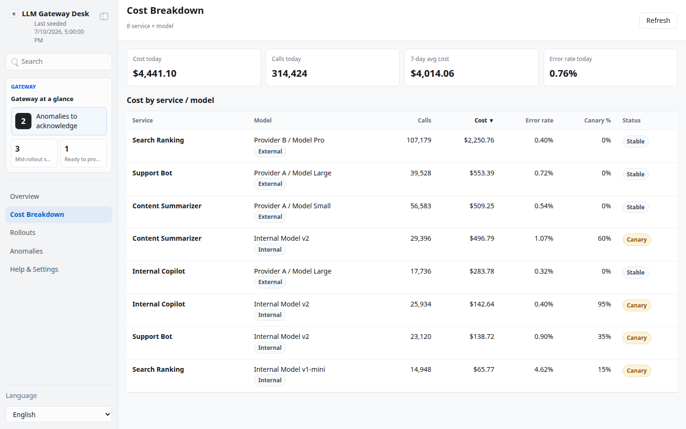
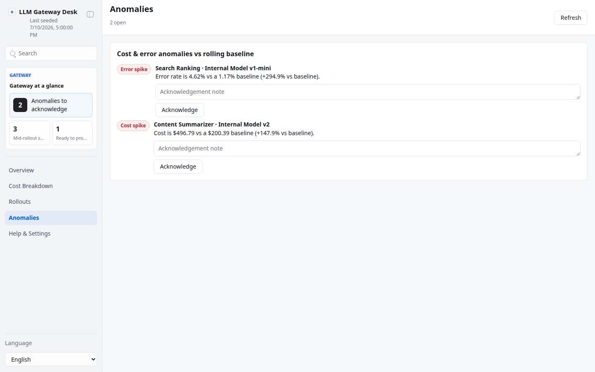

# LLM Gateway Cost & Governance Desk

## Overview

Use this skill as a platform team's local operator dashboard over a shared LLM
gateway: several consuming services (e.g. Support Bot, Search Ranking, Content
Summarizer, Internal Copilot) routed through one gateway to a mix of internal
and external models. It aggregates per-service/per-model call volume, cost, and
error rate into one file-backed App-in-Skill: an Overview (spend trend,
allocation-style rollout/anomaly summaries), a Cost Breakdown table, a Canary
Rollout status board, and an Anomaly list.

This is deliberately **generic and brand-free**: no real company, product, or
model name appears anywhere in the code, config, or seed data — only role-based
service names ("Support Bot") and generic provider/model labels ("Provider A /
Model Large", "Internal Model v2").

Default interaction mode: App UI. Unless the user explicitly asks for chat-only
handling, check onboarding/config, seed or refresh the local snapshot, start/
reuse the local app with `app/start.sh`, and give the actual local URL. Use
chat-only mode only when the user says "纯聊天", "chat only", "不要打开 UI", or
similar.

## App UI Screenshots

<table>
  <tr>
    <td width="50%"></td>
    <td width="50%"></td>
  </tr>
  <tr>
    <td><strong>Overview</strong><br>Total daily spend trend, a canary-rollout summary, and a top anomalies preview.</td>
    <td><strong>Cost Breakdown</strong><br>Sortable service × model table: calls, cost, error rate, canary %, status.</td>
  </tr>
  <tr>
    <td width="50%"></td>
    <td width="50%"></td>
  </tr>
  <tr>
    <td><strong>Rollouts</strong><br>Canary-rollout status board with rollback readiness and promote/rollback/hold actions.</td>
    <td><strong>Anomalies</strong><br>Deterministic cost/error spikes vs each route's own rolling baseline, with acknowledgement.</td>
  </tr>
</table>

## Boundary

- Local dashboard over a local snapshot only. The skill may read a gateway
  usage/cost API (via `lib/data-provider/`), normalize it, and write local
  handoff files.
- Human actions here (`promote`, `rollback`, `hold`, anomaly acknowledgement)
  write ONLY to `app/.data/decisions.json`. NEVER change a real routing config,
  a real gateway, or any live traffic split. There is no execution/merge path
  in this skill by design — a human still applies the decision in the real
  system of record.
- The app reads and writes local files only. It must not call a live gateway;
  it only renders the normalized snapshot and the demo payload.
- Treat cost/usage data as sensitive. Do not commit `config.local.json`, env
  files, `app/.data/`, or raw gateway exports.

## First Run And Onboarding

On invocation, check `app/.data/onboarding.json` and private config readiness.
If onboarding is absent/incomplete, guide setup before syncing real gateway
data; the seeded demo dataset works with no configuration at all.

Private config priority:

1. `KELLY_LLM_GATEWAY_CONFIG=/absolute/path/to/config.json`
2. `skills/kelly-llm-gateway/config.local.json`
3. `~/.config/kelly-llm-gateway/config.json`
4. `skills/kelly-llm-gateway/config.example.json` as template only

Env priority:

1. Existing environment variables
2. `KELLY_LLM_GATEWAY_ENV_FILE=/absolute/path/to/.env`
3. Repository root `.env`
4. `skills/kelly-llm-gateway/.env.local`
5. `~/.config/kelly-llm-gateway/.env`

Ask for non-secret setup details only: region, base URL, base currency, and
which env var name holds the gateway API key (`api_key_env`). Never ask the
user to paste secret values into chat.

When setup is complete and the user confirms, write `app/.data/onboarding.json`:

```json
{
  "completed": true,
  "completed_at": "ISO timestamp",
  "config_version": "1"
}
```

## Local App

Start the dashboard with:

```bash
skills/kelly-llm-gateway/app/start.sh
```

The app uses local HTTP on `127.0.0.1`, preferring port `3000` through `4000`,
or `KELLY_LLM_GATEWAY_UI_PORT` when set. First run installs `hono` and
`@hono/node-server`; the frontend is zero-build vanilla.

Seed a deterministic local snapshot before first use (no config required):

```bash
node skills/kelly-llm-gateway/scripts/seed_snapshot.ts
```

## Demo Mode

- `?demo=1` opens a deterministic, fully offline mock gateway (4 services, 5
  models, 8 service/model routes, 14 days of history) with computed spend
  trend, rollout status, and anomalies for documentation and screenshots.
- `?demo=spend`, `?demo=rollouts`, and `?demo=anomalies` select named mock
  scenes (their initial route).
- `lang=en` or `lang=zh` forces UI chrome language for screenshots.
- Demo API responses never read or write live gateway data or local private
  files; rollout/ack actions in demo mode only update in-memory state in the
  browser, never `app/.data/decisions.json`.

UI language: support English and Chinese chrome with `Auto` default.

## Data Provider

The skill reads a gateway usage/cost API; the app only ever reads the
normalized snapshot.

- Provider selector env: `KELLY_LLM_GATEWAY_DATA_PROVIDER=local` (default).
  Reserve `postgres`, `aitable`, `notion`, `busabase` for future cloud-backed
  providers (see `lib/data-provider/provider-interface.ts`).
- The seed dataset lives in `lib/data-provider/seed-data.ts` — pure, no
  `Math.random`, so re-seeding is byte-identical. Wire a real gateway adapter
  behind the same `DataProvider` interface when one exists; keep it read-only
  for usage/cost data.
- Store secrets only via env; reference env var names in config
  (`gateway.api_key_env`). Never hardcode credentials.

Read `references/gateway-schema.md` before editing the app, scripts, or a
future gateway adapter. Primary local files:

- `app/.data/snapshot.json`: canonical normalized gateway snapshot.
- `app/.data/onboarding.json`: onboarding completion marker.
- `app/.data/decisions.json`: rollout decisions and anomaly acknowledgements
  (the only human-write handoff file; no execution/merge step).
- `app/.data/agent.lock`: temporary lock while a decision is being written.
- `config.local.json`: private gateway configuration, ignored by git.

Use `scripts/validate_ui_schema.ts app/.data/snapshot.json` before relying on a
snapshot in the UI. `scripts/seed_snapshot.ts` writes a consistent seeded
snapshot to `app/.data/snapshot.json`.

## Views

- `#/overview`: total daily spend trend (14 days), a canary-rollout summary,
  and a top anomalies preview.
- `#/spend`: sortable service × model cost-breakdown table (calls, cost, error
  rate, canary %, status).
- `#/rollouts`: canary rollout status board — canary %, rollback readiness,
  and `promote to 100%` / `rollback` / `hold` actions with a note.
- `#/anomalies`: cost/error anomalies vs each route's own rolling baseline,
  with acknowledgement.
- `#/settings`: sanitized setup summary — data provider, config path, gateway
  region/base URL, credential-readiness booleans, and onboarding state. Never
  expose secret values.

## Safety

- This skill has no execution/merge step: `promote` / `rollback` / `hold` and
  anomaly acknowledgement only ever update `app/.data/decisions.json`. A human
  must still apply the decision in the real gateway/routing system — the app
  is an operator surface, not a control plane.
- Anomalies are deterministic and rule-based (rolling baseline comparison), not
  ML-based or random; the same snapshot always produces the same anomalies.
- Redact credential-like strings in logs, reports, and UI state.
