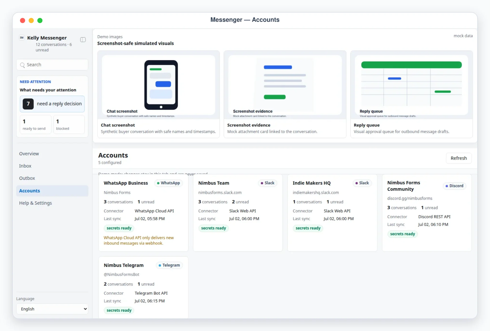

# Kelly Messenger

Kelly Messenger is a Busabase App-in-Skill unified chat inbox: WhatsApp, Discord, Slack, and Telegram (extensible to WeChat, iMessage, LINE, Messenger) aggregated into one place, with one composer that queues replies for review instead of sending them. `scripts/sync_messages.mjs` pulls new messages from the API connectors, `scripts/ingest_messages.mjs` writes agent-browsed or manually-collected payloads, and `scripts/send_outbox.mjs` sends approved replies — the AirApp itself never talks to a messaging platform.

## What It Shows

- Overview: what needs a reply decision, approved replies waiting for send, blocked replies, oldest-waiting conversation, per-platform account cards, and recent activity.
- Inbox: all conversations across platforms sorted by latest activity, with chat-bubble transcripts, platform/channel metadata, and a reply composer (`Queue reply` writes to the Busabase `replies` Base — nothing is sent).
- Outbox: the reply review queue (`needs_review` / `changes_requested` / `approved` / `done` / `blocked`) with stable `Reply #N` refs, editable drafts, and approve / request-changes / block decisions.
- Accounts: connector method, env readiness, last sync, and per-account warnings.
- Help & Settings: sanitized config summary, sync log, and the last execution report. Never secrets.

## App UI Screenshots

<table>
  <tr>
    <td width="50%"></td>
    <td width="50%"></td>
  </tr>
  <tr>
    <td><strong>Overview</strong><br>Messaging command desk with reply-decision counts, per-platform sync status, and oldest-waiting indicator.</td>
    <td><strong>Conversation</strong><br>Chat transcript with an agent-suggested reply prefilled in the composer, ready to edit and queue.</td>
  </tr>
  <tr>
    <td width="50%"></td>
    <td width="50%"></td>
  </tr>
  <tr>
    <td><strong>Unified inbox</strong><br>Conversations across WhatsApp, Slack, Discord, and Telegram sorted by latest activity with waiting-time badges.</td>
    <td><strong>Reply outbox</strong><br>Approval queue for outgoing replies: every message is reviewed before the agent sends it via platform connectors.</td>
  </tr>
  <tr>
    <td width="50%"></td>
  </tr>
  <tr>
    <td><strong>Accounts</strong><br>Connected messaging accounts across WhatsApp and Telegram with connector status and secret readiness.</td>
  </tr>
</table>

## Demo Mode

Start the local preview and open a safe mock-data scene:

```bash
pnpm --dir skills/kelly-messenger/content/kelly-messenger-app dev
```

Use the URL printed by the launcher, then add one of these demo paths:

```text
/?demo=overview&lang=en#/overview
/?demo=inbox&lang=en#/inbox
/?demo=chat&lang=en#/inbox/wa-lena-pricing
/?demo=outbox&lang=en#/outbox
/?demo=accounts&lang=en#/accounts
```

The `chat` scene opens the featured WhatsApp customer conversation (`wa-lena-pricing`) with an agent-suggested reply prefilled in the composer. Demo mode never reads or writes Busabase; demo edits stay in the browser tab.

## Connector Setup

Each account declares a `connector` and references tokens by env var name only:

- Slack: create a bot (scopes like `channels:history`, `channels:read`, `chat:write`), invite it to the channels to watch, set `bot_token_env`.
- Discord: create a bot, invite it to your server with read/send permissions, list the channel ids to watch in `channels`, set `bot_token_env`.
- Telegram: create a bot with @BotFather, add it to the groups it should read (it must share the chats), set `bot_token_env`.
- WhatsApp Business Cloud API: set `access_token_env` and `phone_number_id_env`. Inbound history is webhook-based, so reading uses ingest payloads; sending uses the Cloud API.
- WhatsApp Web / anything else: use `browser_agent` (the agent reads your own logged-in session and imports via `scripts/ingest_messages.mjs`) or `manual`. No passwords or QR secrets are ever stored.

Register an account (onboarding), then sync and send:

```bash
node skills/kelly-messenger/scripts/ingest_messages.mjs onboarding-payload.json --apply  # register an account (payload.account)
node skills/kelly-messenger/scripts/sync_messages.mjs --apply                            # read-only API sync (friendly no-op without tokens)
node skills/kelly-messenger/scripts/ingest_messages.mjs payload.json --apply             # browser_agent/manual message payloads
node skills/kelly-messenger/scripts/send_outbox.mjs                                      # dry-run
node skills/kelly-messenger/scripts/send_outbox.mjs --send                               # execute approved replies
```

## Boundary

The AirApp reads and writes Busabase records only and cannot send messages — the composer only queues drafts into the `replies` Base. Only the skill sends, only replies you approved, only through your own accounts, and only after a dry-run: API connectors via official APIs, browser-based accounts as explicit agent handoffs. Platform terms of service and rate limits are respected. See `references/messenger-schema.md` for the full Busabase field schema.
