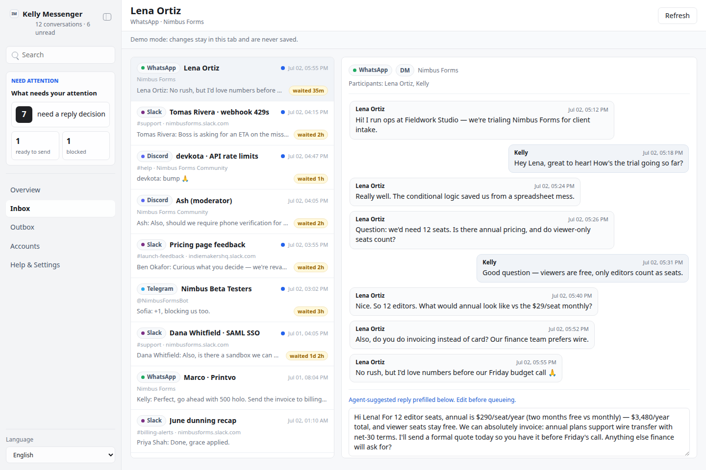
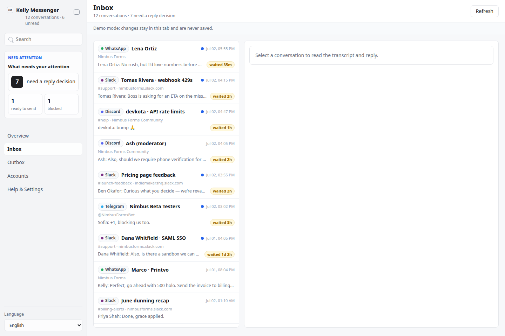
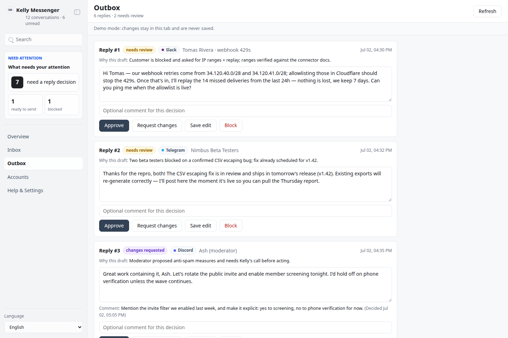

# Kelly Messenger

## Overview

Use this skill as Kelly's unified chat inbox operator. It aggregates messages from WhatsApp, Discord, Slack, and Telegram (extensible to WeChat, iMessage, LINE, Messenger) into one file-backed App-in-Skill app: a command-desk overview, a unified inbox with chat transcripts and a reply composer, an outbox review queue for outgoing replies, and account/connector health.

Default interaction mode: App UI. Unless the user explicitly asks for chat-only handling, check onboarding/config, refresh or load the local message snapshot, start/reuse the local app with `app/start.sh`, and give the actual local URL. Use chat-only mode only when the user says "纯聊天", "chat only", "不要打开 UI", or similar.

## App UI Screenshots

<table>
  <tr>
    <td width="50%"></td>
    <td width="50%"></td>
  </tr>
  <tr>
    <td><strong>Overview</strong><br>Messaging command desk with reply-decision counts, per-platform sync status, and oldest-waiting indicator.</td>
    <td><strong>Conversation</strong><br>Chat transcript with an agent-suggested reply prefilled in the composer, ready to edit and queue.</td>
  </tr>
  <tr>
    <td width="50%"></td>
    <td width="50%"></td>
  </tr>
  <tr>
    <td><strong>Unified inbox</strong><br>Conversations across WhatsApp, Slack, Discord, and Telegram sorted by latest activity with waiting-time badges.</td>
    <td><strong>Reply outbox</strong><br>Approval queue for outgoing replies: every message is reviewed before the agent sends it via platform connectors.</td>
  </tr>
</table>

## Boundary

- The app reads and writes local files only and never touches any network beyond `127.0.0.1`. It cannot send messages: the composer only queues drafts into the local outbox.
- Every outgoing message is approval-required. The skill executes only replies whose outbox status is `approved`, via `scripts/send_outbox.mjs` (dry-run by default) or, for `browser_agent`/`manual` connectors, by the agent performing the handoff after `--send` marks them `handoff_to_agent`.
- Own accounts only: read and send exclusively through accounts the user owns and has configured. Respect each platform's terms of service and rate limits; prefer official APIs; keep sync read-only.
- Never store passwords, QR-login payloads, or session tokens. For `browser_agent` collection the agent drives the user's own already-authenticated web session and stores only message text needed for review.
- Treat all chat content as sensitive. Do not commit `config.local.json`, env files, `app/.data/`, exports, tokens, or customer PII.

## First Run And Onboarding

On invocation, check `app/.data/onboarding.json` and private config readiness. If onboarding is absent/incomplete, guide setup before syncing real accounts.

Private config priority:

1. `KELLY_MESSENGER_CONFIG=/absolute/path/to/config.json`
2. `skills/kelly-messenger/config.local.json`
3. `~/.config/kelly-messenger/config.json`
4. `skills/kelly-messenger/config.example.json` as template only

Env priority:

1. Existing environment variables
2. `KELLY_MESSENGER_ENV_FILE=/absolute/path/to/.env`
3. Repository root `.env`
4. `skills/kelly-messenger/.env.local`
5. `~/.config/kelly-messenger/.env`

Onboarding asks, turn by turn: which platforms to connect, which connector method per account, and which env var names hold the tokens. Ask for non-secret details only: platform, display name, workspace/server, channels or chats to watch, reply style, and env var names. Never ask the user to paste secret values into chat; secrets belong only in local env files.

Connector reality per platform (declare as `"connector"` on each account):

- `slack` — official Web API (`conversations.history` to read, `chat.postMessage` to send) with a bot/user token from env (`bot_token_env` / `user_token_env`).
- `discord` — official REST API with a bot token from env (`bot_token_env`); the bot must be in the servers/channels it should read.
- `telegram` — Telegram Bot API (`getUpdates` to read, `sendMessage` to send) with a bot token from env (`bot_token_env`); the bot must share the chats.
- `whatsapp_cloud` — WhatsApp Business Cloud API with `access_token_env` + `phone_number_id_env`. Inbound messages arrive via webhook only, so history is collected via ingest; sends use the Cloud API.
- `browser_agent` — the agent drives the user's own web session (e.g. WhatsApp Web) with the browser skill, then writes a payload through `scripts/ingest_messages.mjs`. No passwords or QR secrets are ever stored.
- `manual` — the user or agent prepares an ingest payload by hand. Use for anything else (WeChat, iMessage, LINE, Messenger).

When setup is complete and the user confirms, write `app/.data/onboarding.json`:

```json
{
  "completed": true,
  "completed_at": "ISO timestamp",
  "config_version": "1"
}
```

## Local App

Start the app with:

```bash
skills/kelly-messenger/app/start.sh
```

The app uses local HTTP on `127.0.0.1`, preferring ports `3000` through `4000`, or `KELLY_MESSENGER_UI_PORT` when set. `/api/state` identifies the app as `kelly-messenger`.

Required app views (hash routes):

- `#/overview`: messaging command desk. Human-attention numbers (conversations needing a reply decision, approved replies waiting for send, blocked), oldest-waiting indicator, per-platform account cards (unread, conversations, last sync, connector method), and recent activity.
- `#/inbox` and `#/inbox/<conversation_id>`: the unified inbox. Left: conversations across all platforms sorted by latest activity with platform badge, title, preview, unread dot, and waiting time. Right: chat transcript (incoming left, Kelly's outgoing right, sender names, timestamps, channel/workspace metadata) plus a reply composer with an agent-`suggested_reply` prefill when present, a note field, and a `Queue reply` button. Queued replies appear as dashed "queued" bubbles.
- `#/outbox`: review queue over outgoing replies with workflow states `needs_review` / `changes_requested` / `approved` / `done` / `blocked`, stable refs (`Reply #1`), editable draft text, reason/context, and decision buttons (approve / request changes / save edit / block). `done` means sent, with the execution result shown.
- `#/accounts`: connected accounts with platform, workspace, connector method, env readiness boolean, last sync, conversation/unread counts, and warnings.
- `#/settings`: sanitized config summary (data provider, config path, onboarding state, reply style, accounts with env readiness booleans), sync log, and last execution report. Never secrets.

Demo mode:

- `?demo=overview`, `?demo=inbox`, `?demo=chat` (opens the featured conversation `wa-lena-pricing` with an agent-suggested reply prefilled), and `?demo=outbox` select named deterministic mock scenes.
- `lang=en` or `lang=zh` forces UI chrome language for screenshots. Deep links such as `/?demo=chat&lang=en#/inbox/wa-lena-pricing` work.
- Demo mode never reads or writes `app/.data/`. Composer and outbox buttons still work but act on in-memory state only and show a demo notice.

UI language: English and Chinese chrome with `Auto` default following the browser language; explicit selector persisted locally. Keep message content, sender names, and chat titles in their original language.

## File Contract

Read `references/messenger-schema.md` before editing the app, scripts, or any generated JSON.

- `app/.data/messages_snapshot.json`: accounts, conversations with transcripts, metrics, sync log. Written only by `scripts/sync_messages.mjs` and `scripts/ingest_messages.mjs`.
- `app/.data/outbox.json`: the decisions file — queued/decided outgoing replies keyed by reply id with conversation ref, text, status, decision, timestamps.
- `app/.data/agent_tasks.json`: queued agent work; `request_changes` decisions land here as `revise_reply` tasks.
- `app/.data/execution_report.json`: latest send run results.
- `app/.data/onboarding.json`: onboarding completion marker.
- `app/.data/agent.lock`: temporary lock while the skill syncs, ingests, or sends. While it exists the app rejects writes and renders the composer and outbox read-only.

Validate with `node scripts/validate_ui_schema.mjs` before relying on a snapshot in the UI.

## Sync Workflow

1. Detect mode. Default to App UI.
2. Load private config. If only `config.example.json` exists, enter onboarding.
3. For API connectors (`slack`, `discord`, `telegram`, `whatsapp_cloud`), run `node scripts/sync_messages.mjs`. It uses global fetch only, prints a clear friendly message when tokens are missing, refuses to run under an active lock, acquires the lock itself, merges into the snapshot by stable message ids, appends `sync_log` entries, and releases the lock.
4. For `browser_agent` platforms, use the browser skill on the user's own session to read conversations, build an ingest payload (see the schema), and run `node scripts/ingest_messages.mjs payload.json` — the single write-path for collected messages. Same for `manual`.
5. Start/reuse the UI and report the URL. Surface connector problems as snapshot warnings, not silent failures.

## Reply And Outbox Workflow

1. Queue: the user writes or edits a reply in the composer (optionally starting from the agent's `suggested_reply`) and clicks `Queue reply`; the app writes it to `outbox.json` as `needs_review`. The agent may also queue drafts (`suggested_by: "agent"`) with a `reason`.
2. Review: in `#/outbox` the user approves, edits (`Save edit`), requests changes, or blocks each reply. `request_changes` enqueues a `revise_reply` task in `agent_tasks.json`.
3. Agent revision loop: poll `agent_tasks.json`, redraft the reply text honoring the comment and the config `reply_style`, set the reply back to `needs_review`, and mark the task done.
4. Send: only after the user asks to send, run `node scripts/send_outbox.mjs` (dry-run) and show the plan. With explicit approval, run `node scripts/send_outbox.mjs --send`: it re-checks the lock and each reply's approval immediately before sending, sends API-connector replies via the official APIs, marks `browser_agent`/`manual` replies as `handoff_to_agent` for the agent to deliver through the user's session, sets sent replies to `done`, and writes `execution_report.json`.
5. Report per-reply results back to the user with the stable `Reply #N` refs.

## Safety Defaults

- Never send without an `approved` status recorded in the outbox, and never bypass the dry-run → `--send` sequence.
- Prefer read-scoped tokens where the platform offers them; keep sync strictly read-only.
- Redact tokens and token-like strings from logs, reports, and UI state; expose only env-var readiness booleans.
- Keep sends idempotent: stable reply ids, execution results stored on the reply, and re-reading decisions before each send.
- If a send target is missing (`provider_conversation_id`), block that reply and ask for configuration instead of guessing.
- Honor platform rate limits; on 429s back off rather than retrying aggressively.
