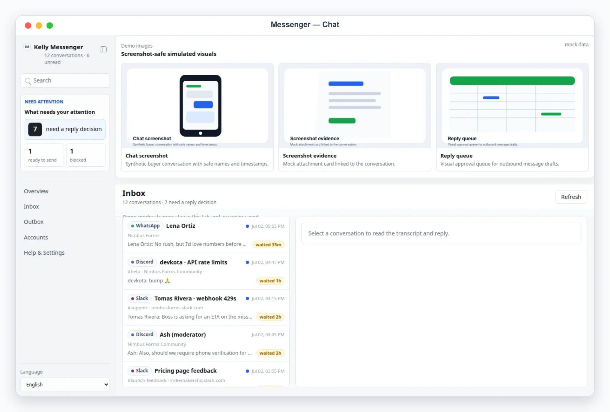
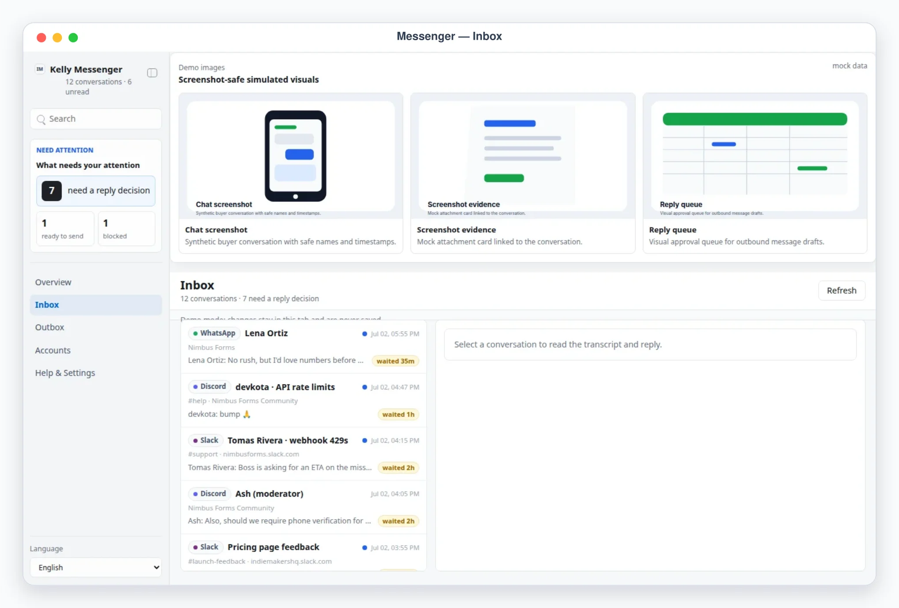
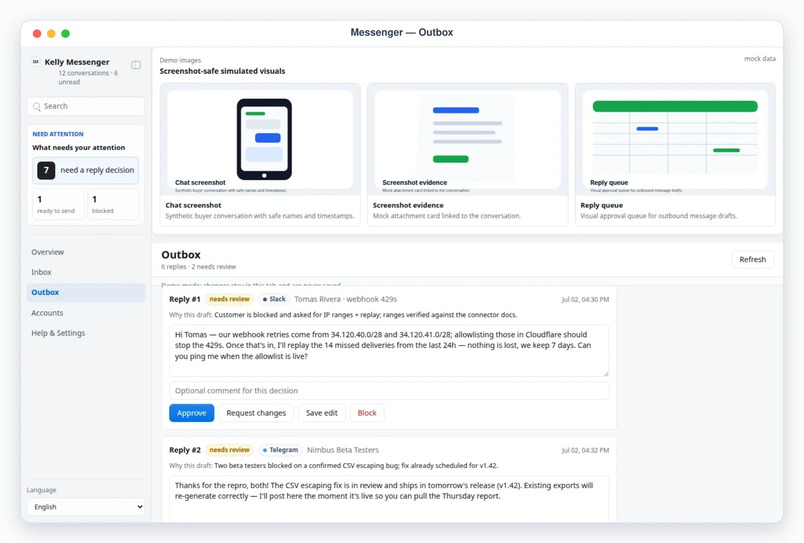

# Kelly Messenger

## App UI Screenshots

<table>
  <tr>
    <td width="50%"></td>
    <td width="50%"></td>
  </tr>
  <tr>
    <td><strong>Overview</strong><br>Messaging command desk with reply-decision counts, per-platform sync status, and oldest-waiting indicator.</td>
    <td><strong>Conversation</strong><br>Chat transcript with an agent-suggested reply prefilled in the composer, ready to edit and queue.</td>
  </tr>
  <tr>
    <td width="50%"></td>
    <td width="50%"></td>
  </tr>
  <tr>
    <td><strong>Unified inbox</strong><br>Conversations across WhatsApp, Slack, Discord, and Telegram sorted by latest activity with waiting-time badges.</td>
    <td><strong>Reply outbox</strong><br>Approval queue for outgoing replies: every message is reviewed before the agent sends it via platform connectors.</td>
  </tr>
</table>

## Overview

Use this skill as Kelly's unified chat inbox operator: WhatsApp, Discord,
Slack, and Telegram (extensible to WeChat, iMessage, LINE, Messenger)
aggregated into one place, with one composer that queues replies for review
instead of sending them. The AirApp shows a command-desk overview, a unified
inbox with chat transcripts and a reply composer, an outbox review queue for
outgoing replies, account/connector health, and settings. Reading real
messages and sending real replies are both genuine external-platform
operations a browser cannot perform (no secrets, no outbound platform
calls): `scripts/sync_messages.mjs` pulls new messages from the API
connectors, `scripts/ingest_messages.mjs` is the single write-path for
agent-browsed or manually-collected payloads, and `scripts/send_outbox.mjs`
sends approved replies. The AirApp itself only reads Busabase and writes
queued replies/decisions.

Default behavior is AirApp-first. Unless the user explicitly asks only for
explanation, sync/ingest whatever accounts are configured and give the user
the clickable AirApp URL (or the local preview URL when local preview is
explicitly requested). Use chat-only mode only when the user says "纯聊天",
"chat only", "不要打开 UI", or similar.

**The AirApp itself never talks to WhatsApp/Discord/Slack/Telegram.** It
reads and writes Busabase records only. Both external-platform directions
are genuinely trusted-process-only: `scripts/sync_messages.mjs` and
`scripts/ingest_messages.mjs` are the only places that read a real
messaging platform, and `scripts/send_outbox.mjs` is the only place that
sends a real message — always after a human approval recorded in Busabase.

## Mandatory Dependencies

1. Read and follow `$kelly-app-skill-creator` for product behavior, visual
   quality, responsive layout, and the complete canonical `content/kelly-messenger-app/` artifact.
2. Read and follow `$busabase` for connection, target Space, node discovery,
   ChangeRequests, review, and merge behavior.
3. Read and follow `$busabase-app-creator` for resource modeling, AirApp
   runtime limits, security, validation, and deployment.

If a dependency is unavailable, preserve this skill's local artifact and
product contracts, stop before the unavailable Busabase operation, and report
the exact missing dependency. Do not invent a second data backend.

## Boundary

- The AirApp reads and writes Busabase records only. It must never call a chat platform API, or perform any other external side effect. It cannot send messages: the composer only queues drafts into the `replies` Base.
- Every outgoing message is approval-required. Only `scripts/send_outbox.mjs --send` sends, and only replies whose status is `approved`; the dry run (no `--send`) only prints a plan.
- Own accounts only: read and send exclusively through accounts the user owns and has configured. Respect each platform's terms of service and rate limits; prefer official APIs; keep sync read-only against the platform (Busabase is the only thing the sync scripts write to).
- Never store passwords, QR-login payloads, or session tokens — anywhere, including Busabase. Accounts store only the platform, connector, channels to watch, and the **names** of env vars holding tokens, never the token values. For `browser_agent` collection the agent drives the user's own already-authenticated web session and stores only message text needed for review.
- Treat all chat content as sensitive. Never commit real tokens, chat exports, or Busabase credentials.

## Busabase Resources

Six Bases under one application Folder (`kelly-messenger`), declared in
`content/kelly-messenger-app/app/js/config.js` and the generated template sidecars under `content/`:

- `accounts`: connected accounts — platform, connector, channels to watch, and env-var *names* for tokens (never values), status, last sync.
- `conversations`: one row per conversation across all accounts — title, kind, channel/workspace, participants, `unread`/`awaiting-reply` flags, the send target (`provider-conversation-id`), and an optional agent-suggested reply.
- `messages`: one row per message, joined onto its conversation by `conversation-id`.
- `sync-log`: append-only history of sync/ingest runs per account.
- `replies`: the reply review queue — draft text, workflow `status`, the human verdict fields (`decision-action`/`decision-comment`/`decided-at`), and the execution result (`execution-status`/`execution-operation`/`execution-connector`/`execution-target`/`execution-detail`/`executed-at`) written by `scripts/send_outbox.mjs`.
- `settings`: one row (`record-id: "config"`) with reply style and sync cadence.

Resources provision lazily through an idempotent Busabase ChangeRequest the
first time the app runs in a Space; see `references/messenger-schema.md` for
exact field shapes. Per-conversation/per-account rollups (`unread_count`,
`conversation_count`, `last_message_at`, `last_incoming_at`, metrics) are all
recomputed client-side from `conversations`/`messages` on every read — never
stored.

## First Run And Onboarding

On invocation, check the `accounts` Base. If empty, guide setup before
syncing real accounts: ask, turn by turn, which platforms to connect, which
connector method per account, which channels/chats to watch, and which env
var names hold the tokens. Ask for non-secret details only: platform,
display name, workspace/server, channels or chats to watch, and env var
names. Never ask the user to paste secret values into chat; secrets belong
only in local env files. Register the account with:

```bash
node skills/kelly-messenger/scripts/ingest_messages.mjs onboarding-payload.json --apply
```

where `onboarding-payload.json` carries an `account` object (see
`references/messenger-schema.md`; `conversations` can be omitted on this
first run).

Connector reality per platform (declare as `connector` on the account):

- `slack` — official Web API (`conversations.history` to read, `chat.postMessage` to send) with a bot/user token from env (`bot_token_env` / `user_token_env`).
- `discord` — official REST API with a bot token from env (`bot_token_env`); the bot must be in the servers/channels it should read.
- `telegram` — Telegram Bot API (`getUpdates` to read, `sendMessage` to send) with a bot token from env (`bot_token_env`); the bot must share the chats.
- `whatsapp_cloud` — WhatsApp Business Cloud API with `access_token_env` + `phone_number_id_env`. Inbound messages arrive via webhook only, so history is collected via ingest; sends use the Cloud API.
- `browser_agent` — the agent drives the user's own web session (e.g. WhatsApp Web) with the browser skill, then writes a payload through `scripts/ingest_messages.mjs`. No passwords or QR secrets are ever stored.
- `manual` — the user or agent prepares an ingest payload by hand. Use for anything else (WeChat, iMessage, LINE, Messenger).

## Local App

Default behavior is AirApp-first — give the user the clickable AirApp URL.
Start `pnpm --dir content/kelly-messenger-app dev` only when local preview/debugging is explicitly
requested.

Required app views (hash routes):

- `#/overview`: messaging command desk. Human-attention numbers (conversations needing a reply decision, approved replies waiting for send, blocked), oldest-waiting indicator, per-platform account cards (unread, conversations, last sync, connector method), and recent activity.
- `#/inbox` and `#/inbox/<conversation_id>`: the unified inbox. Left: conversations across all platforms sorted by latest activity with platform badge, title, preview, unread dot, and waiting time. Right: chat transcript (incoming left, Kelly's outgoing right, sender names, timestamps, channel/workspace metadata) plus a reply composer with an agent-`suggested_reply` prefill when present, a note field, and a `Queue reply` button. Queued replies appear as dashed "queued" bubbles.
- `#/outbox`: review queue over outgoing replies with workflow states `needs_review` / `changes_requested` / `approved` / `done` / `blocked`, stable refs (`Reply #1`), editable draft text, reason/context, and decision buttons (approve / request changes / save edit / block) that write the verdict directly onto the reply record through `busabase-sdk`.
- `#/accounts`: connected accounts with platform, workspace, connector method, env readiness boolean, last sync, conversation/unread counts, and warnings.
- `#/settings`: sanitized config summary (reply style, sync cadence, accounts with env readiness booleans), sync log, and last execution report. Never secrets.

Demo mode:

- `?demo=overview`, `?demo=inbox`, `?demo=chat` (opens the featured conversation `wa-lena-pricing` with an agent-suggested reply prefilled), `?demo=outbox`, and `?demo=accounts` select named deterministic mock scenes.
- `lang=en` or `lang=zh` forces UI chrome language for screenshots. Deep links such as `/?demo=chat&lang=en#/inbox/wa-lena-pricing` work.
- Demo mode never reads or writes Busabase. Composer and outbox buttons still work but act on in-memory state only and show a demo notice.

UI language: English and Chinese chrome with `Auto` default following the browser language; explicit selector persisted locally. Keep message content, sender names, and chat titles in their original language.

## Sync Workflow

1. Detect mode. Default to AirApp-first.
2. Check the `accounts` Base. If empty, enter onboarding.
3. For API connectors (`slack`, `discord`, `telegram`, `whatsapp_cloud`), run `node scripts/sync_messages.mjs --apply`. It uses global fetch only, prints a clear friendly message when tokens are missing, merges into Busabase (accounts/conversations/messages) by stable message ids, and appends a `sync-log` entry per account. Omit `--apply` first to see a dry-run summary.
4. For `browser_agent` platforms, use the browser skill on the user's own session to read conversations, build an ingest payload (see `references/messenger-schema.md`), and run `node scripts/ingest_messages.mjs payload.json --apply` — the single write-path for collected messages. Same for `manual`.
5. Give the user the AirApp URL (or local preview URL). Surface connector problems as printed warnings, not silent failures.

## Reply And Outbox Workflow

1. Queue: the user writes or edits a reply in the composer (optionally starting from the agent's `suggested_reply`) and clicks `Queue reply`; the app writes it to the `replies` Base as `needs_review` via `busabase-sdk`. The agent may also queue drafts (`suggested_by: "agent"`) with a `reason`.
2. Review: in `#/outbox` the user approves, edits (`Save edit`), requests changes, or blocks each reply — written directly onto the reply record. From a standalone local preview the write merges immediately (trusted operator); from the deployed AirApp it creates a pending ChangeRequest for the trusted process to merge.
3. Agent revision loop: for a reply moved to `changes_requested`, redraft the reply text honoring the comment and the configured reply style, then set it back to `needs_review` (e.g. via `scripts/ingest_messages.mjs`-adjacent tooling or by editing the record directly).
4. Send: only after the user asks to send, run `node scripts/send_outbox.mjs` (dry-run) and show the plan. With explicit approval, run `node scripts/send_outbox.mjs --send`: it re-reads Busabase immediately before sending, sends API-connector replies via the official APIs, marks `browser_agent`/`manual` replies as `handoff_to_agent` for the agent to deliver through the user's session, sets sent replies to `done`, and writes the execution result onto each reply.
5. Report per-reply results back to the user with the stable `Reply #N` refs.

## Safety Defaults

- Never send without an `approved` status recorded in Busabase, and never bypass the dry-run → `--send` sequence.
- Prefer read-scoped tokens where the platform offers them; keep sync strictly read-only against the platform.
- Expose only env-var readiness booleans in UI state, logs, and reports — never token values. `scripts/sync_messages.mjs` is the only process that checks whether a referenced env var is actually set.
- Keep sends idempotent: stable reply ids, execution results stored on the reply, and re-reading Busabase before each send.
- If a send target is missing (`provider_conversation_id`), leave the reply `approved` with an `execution-status: error` and ask for configuration instead of guessing.
- Honor platform rate limits; on 429s back off rather than retrying aggressively.

## Useful Commands

```bash
node skills/kelly-messenger/scripts/sync_messages.mjs
node skills/kelly-messenger/scripts/sync_messages.mjs --apply
node skills/kelly-messenger/scripts/ingest_messages.mjs payload.json --apply
node skills/kelly-messenger/scripts/send_outbox.mjs
node skills/kelly-messenger/scripts/send_outbox.mjs --send
pnpm --dir skills/kelly-messenger/content/kelly-messenger-app dev
```

In normal use, invoke `/kelly-messenger`, let the skill sync/ingest the
configured accounts, and open the AirApp.
