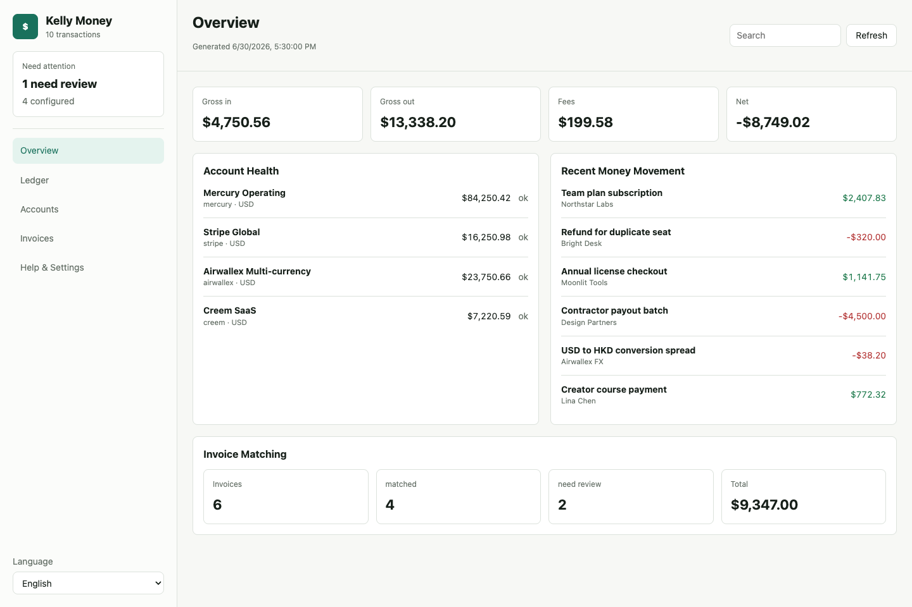
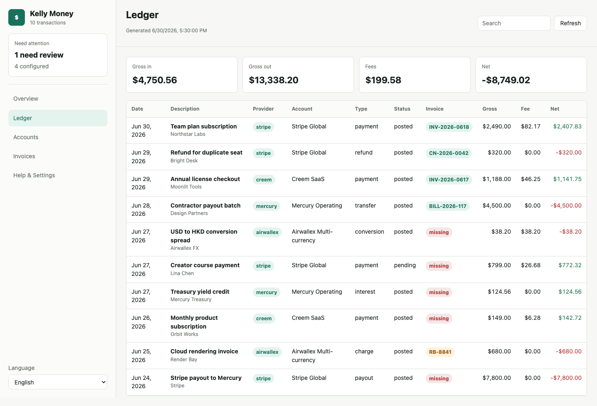
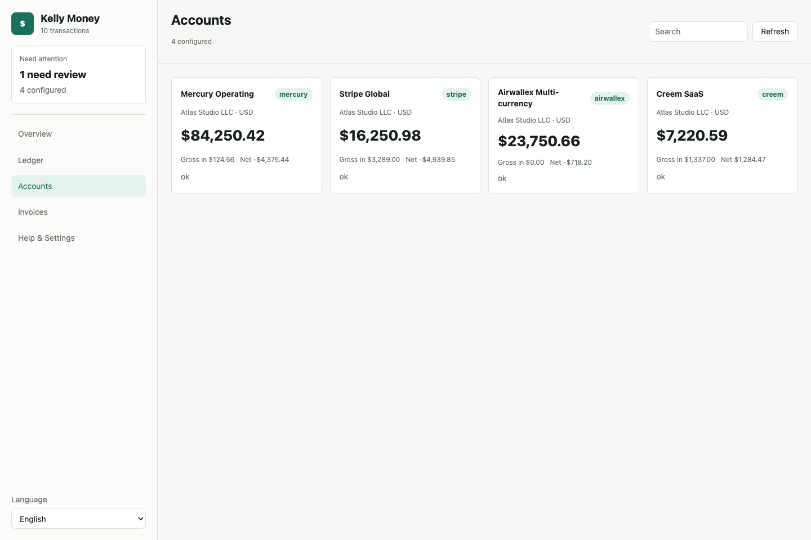
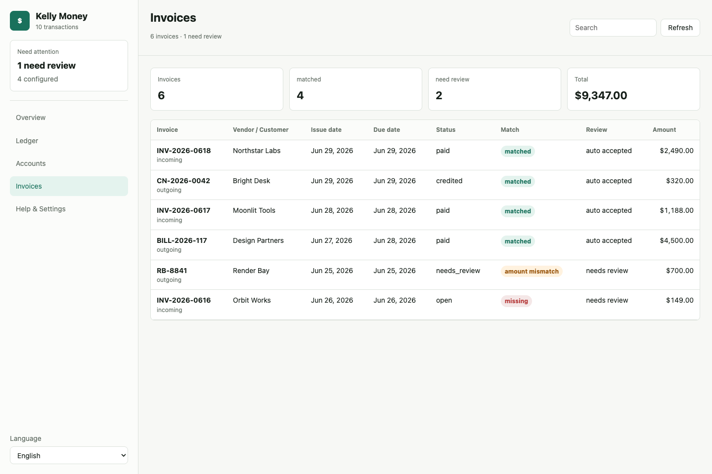
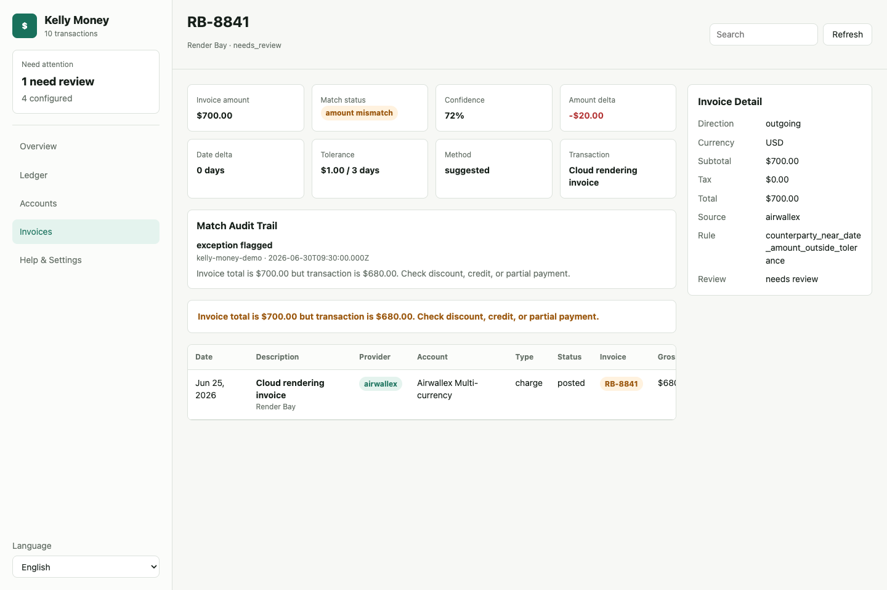

# Kelly Money

Kelly Money is a local App-in-Skill dashboard for aggregating Mercury, Stripe, Airwallex, and Creem into one money ledger.

## What It Shows

- Overview: account health, recent money movement, inflow, outflow, fees, and net.
- Ledger: normalized transactions across providers and accounts.
- Accounts: provider account inventory with balances and sync status.
- Account detail: per-account transactions, provider ids, pending balance, and warnings.
- Invoices: invoice-to-transaction matching, missing invoices, amount mismatches, and review notes.

## App UI Screenshots

<table>
  <tr>
    <td width="50%"></td>
    <td width="50%"></td>
  </tr>
  <tr>
    <td><strong>Overview</strong><br>Money command desk with account health, recent movement, and top-level inflow, outflow, fees, and net totals.</td>
    <td><strong>Total ledger</strong><br>Normalized cashflow table across providers, accounts, transaction types, fees, statuses, and signed net movement.</td>
  </tr>
  <tr>
    <td width="50%"></td>
    <td width="50%"></td>
  </tr>
  <tr>
    <td><strong>Accounts</strong><br>Provider account inventory with balances, currency, sync status, inflow, fees, and net movement per account.</td>
    <td><strong>Invoice matching</strong><br>Invoice-to-transaction reconciliation with matched items, missing invoices, amount mismatches, and review status.</td>
  </tr>
  <tr>
    <td width="50%"></td>
  </tr>
  <tr>
    <td><strong>Exception detail</strong><br>Invoice exception view with amount/date deltas, matching rule, explicit tolerance, candidate transaction, and audit trail.</td>
  </tr>
</table>

## Demo Mode

Run the app and open a safe mock-data scene:

```bash
skills/kelly-money/app/start.sh
```

Use the URL printed by the launcher, then add one of these demo paths:

```text
/?demo=overview&lang=en#/overview
/?demo=ledger&lang=en#/ledger
/?demo=accounts&lang=en#/accounts
/?demo=invoices&lang=en#/invoices
/?demo=detail&lang=en#/accounts/stripe-main
```

Demo mode never reads live provider data or local private ledger files.

## Private Config

Copy `config.example.json` to `config.local.json` or `~/.config/kelly-money/config.json`, then put secrets in local env files only. Never commit real provider tokens, account exports, or files under `app/.data/`.
