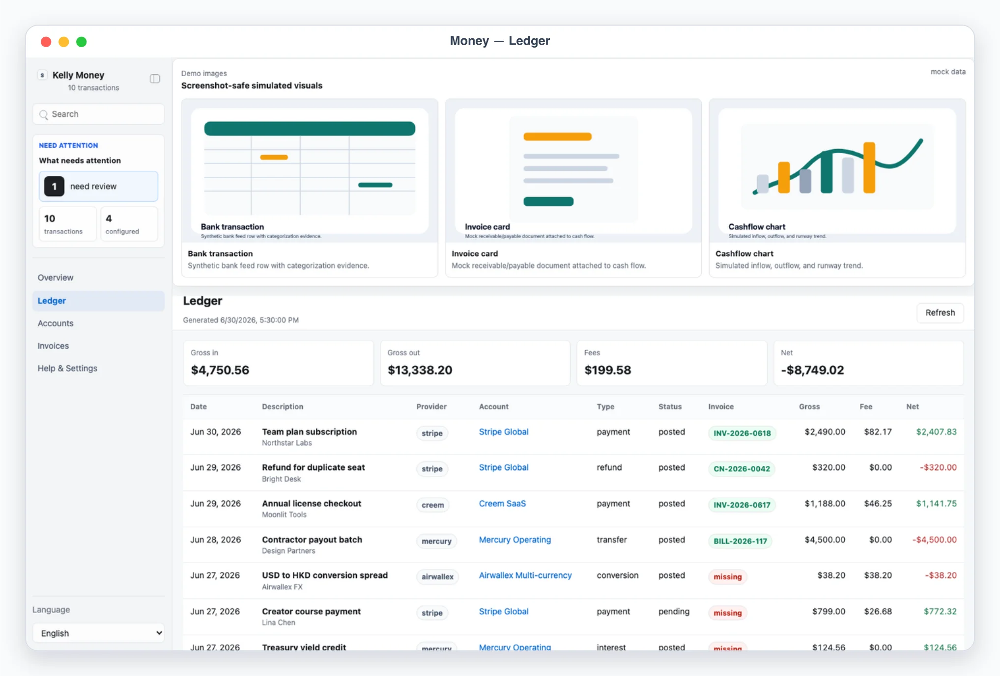
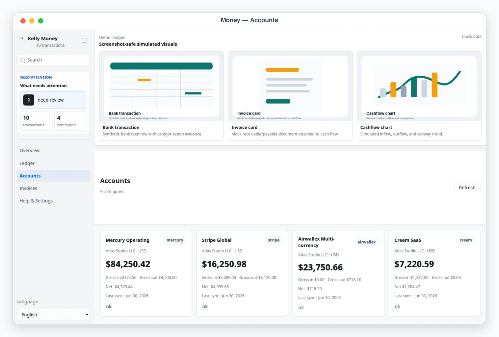

# Kelly Money

## Overview

Kelly Money is a Busabase Cloud App-in-Skill. Its canonical product surface
is the AirApp in Busabase, not a separate local-data product. The same Hono
source supports an explicitly requested local preview with OAuth connection
bootstrap. Use this skill as Kelly's money ledger operator: it aggregates
Mercury, Stripe, Airwallex, and Creem into one read-only dashboard with a
total cashflow table, provider/account columns, an `Accounts` view, and
account detail pages.

Default behavior is AirApp-first. Unless the user explicitly asks only for
explanation, sync/import through the trusted skill process and give the user
the clickable AirApp URL. Start localhost only when local preview/debugging
is explicitly requested; it uses the same Busabase resources and never
offers another data provider. Use chat-only mode only when the user says
"纯聊天", "chat only", "不要打开 UI", or similar.

## Mandatory Dependencies

1. Read and follow `$kelly-app-skill-creator` for product behavior, visual
   quality, responsive layout, and the complete canonical `content/kelly-money-app/` artifact.
2. Read and follow `$busabase` for connection, target Space, node discovery,
   ChangeRequests, review, and merge behavior.
3. Read and follow `$busabase-app-creator` for resource modeling, AirApp
   runtime limits, security, validation, and deployment.

If a dependency is unavailable, preserve this skill's local artifact and
product contracts, stop before the unavailable Busabase operation, and report
the exact missing dependency. Do not invent a second data backend.

## App UI Screenshots

<table>
  <tr>
    <td width="50%"></td>
    <td width="50%"></td>
  </tr>
  <tr>
    <td><strong>Overview</strong> Money command desk with account health, recent movement, and top-level inflow, outflow, fees, and net totals.</td>
    <td><strong>Total ledger</strong> Normalized cashflow table across providers, accounts, transaction types, fees, statuses, and signed net movement.</td>
  </tr>
  <tr>
    <td width="50%"></td>
    <td width="50%"></td>
  </tr>
  <tr>
    <td><strong>Accounts</strong> Provider account inventory with balances, currency, sync status, inflow, fees, and net movement per account.</td>
    <td><strong>Invoice matching</strong> Invoice-to-transaction reconciliation with matched items, missing invoices, amount mismatches, and review status.</td>
  </tr>
  <tr>
    <td width="50%"></td>
  </tr>
  <tr>
    <td><strong>Exception detail</strong> Invoice exception view with amount/date deltas, matching rule, explicit tolerance, candidate transaction, and audit trail.</td>
  </tr>
</table>

## Boundary

- The skill may read provider APIs, import exports, normalize transactions, and write the result into Busabase.
- The AirApp reads Busabase records only; it is entirely read-only and must never initiate a provider API call, move money, issue refunds, create charges, change bank settings, or mutate any remote system.
- Treat all money/account data as sensitive. Never commit provider tokens, account exports, customer PII, raw provider responses, or Busabase credentials.
- Require explicit user approval before any remote mutation. Normal Kelly Money operation is read-only aggregation unless the user asks for a specific approved action, and that action happens outside the AirApp.

## Busabase Resources

Five Bases under one application Folder (`kelly-money`), declared in
`content/kelly-money-app/app/js/config.js` and the generated template sidecars under `content/`:

- `accounts`: provider account inventory — balances, currency, status, totals, last sync.
- `transactions`: normalized ledger entries across providers.
- `invoices`: invoice metadata from provider exports, PDFs, or manual entry.
- `invoice-matches`: invoice-to-transaction reconciliation results, including review status and audit trail.
- `settings`: one row per `kind` — `kelly-money-accounts` (configured account list, non-secret) and `kelly-money-lock`.

Resources provision lazily through an idempotent Busabase ChangeRequest the
first time the app runs in a Space; see `references/ledger-schema.md` for
exact field shapes. The AirApp never writes to `accounts`, `transactions`,
`invoices`, or `invoice-matches` — only the trusted sync process does.

## First Run And Onboarding

On invocation, check the `kelly-money-accounts` settings row for readiness.
If it is absent, guide setup before syncing real accounts.

Ask for non-secret setup details only: provider, display name,
business/entity, currency, account grouping, and which env var names contain
API keys/tokens. Never ask the user to paste secret values into chat. Secrets
belong only in local env files used by the trusted sync process; Busabase
authentication is ambient inside the deployed AirApp.

## Local App

Default behavior is AirApp-first — give the user the clickable AirApp URL.
Start `pnpm --dir content/kelly-money-app dev` only when local preview/debugging is explicitly
requested.

Required app views:

- `#/ledger`: total cashflow table. Rows are normalized transactions; columns include date, description, provider, account, type, currency, gross, fee, net, and status.
- `#/overview`: dashboard summary with account health, totals, and recent money movement.
- `#/accounts`: Accounts view. Each configured or imported account appears with provider, currency, balance, inflow, outflow, net, and last sync.
- `#/accounts/<account_id>`: Account Detail. Show balances, recent transactions, counterparties, statuses, provider identifiers, and sync health.
- `#/invoices`: invoice reconciliation desk. Show invoices, match status, amount deltas, missing matches, and transactions that need human review.
- `#/invoices/<invoice_id>`: Invoice Detail. Show invoice metadata, selected transaction, confidence, amount/date deltas, and notes.
- `#/settings`: sanitized setup summary. Show configured account names, provider types, onboarding state, and Busabase connection identifiers. Never expose secret values.

Demo mode:

- `?demo=1` opens a deterministic mock ledger for documentation and screenshots.
- `?demo=overview`, `?demo=ledger`, `?demo=accounts`, and `?demo=detail` select named mock scenes.
- `?demo=invoices` opens the invoice matching mock scene.
- `lang=en` or `lang=zh` forces UI chrome language for screenshots.
- Demo mode never reads or writes Busabase.

UI language: support English and Chinese chrome with `Auto` default. Keep provider names, account names, transaction descriptions, and imported data in their original language.

## Sync Workflow

Read `references/ledger-schema.md` before editing the app or the sync
process. Sync happens entirely outside the AirApp, in the trusted skill
process:

1. Propose a read-only sync scope first: providers, accounts, date window, currencies, and whether to include pending transactions.
2. After approval, fetch or import provider data, normalize to the ledger schema, and write it to the `accounts`/`transactions`/`invoices`/`invoice-matches` Bases through `busabase-sdk`.
3. For discrepancies, write them as computed warnings (the app derives account-level warnings from `status`) and ask before any remote action.

Invoice matching lives inside Kelly Money rather than a separate skill until it becomes a full invoice-generation or tax-export workflow. Write imported invoice metadata into the `invoices` Base and matching decisions into `invoice-matches`; do not store private invoice PDFs in git.

## Provider Notes

Use provider API docs or official exports when implementing sync. Provider APIs and object shapes change, so verify current official docs before writing connector code.

Normalize these concepts consistently:

- Mercury: bank accounts, transactions, counterparty, transfer ids, check/wire/ACH metadata.
- Stripe: balance transactions, charges, refunds, disputes, payouts, fees, source objects.
- Airwallex: wallet/balances, financial transactions, conversions, transfers, payouts, fees.
- Creem: payments/orders/subscriptions/refunds/fees/payout-equivalent records as available.

Always preserve provider provenance: `provider`, `provider_account_id`, `provider_transaction_id`, raw currency, original amount fields, and source object references. Deduplicate by stable provider ids before falling back to date/amount/description hashes.

## Safety Defaults

- Treat charge creation, refunds, transfers, payouts, bank-account changes, account linking, currency conversion, subscription changes, and customer-visible billing actions as approval-required.
- Prefer read-only scopes/tokens when possible.
- Redact account numbers and token-like strings in logs, reports, and UI state.
- Keep local exports minimal and use stable ids so repeated syncs are idempotent.
- If balances and transactions disagree, do not invent corrections. Mark the account `warning` and explain the mismatch.
