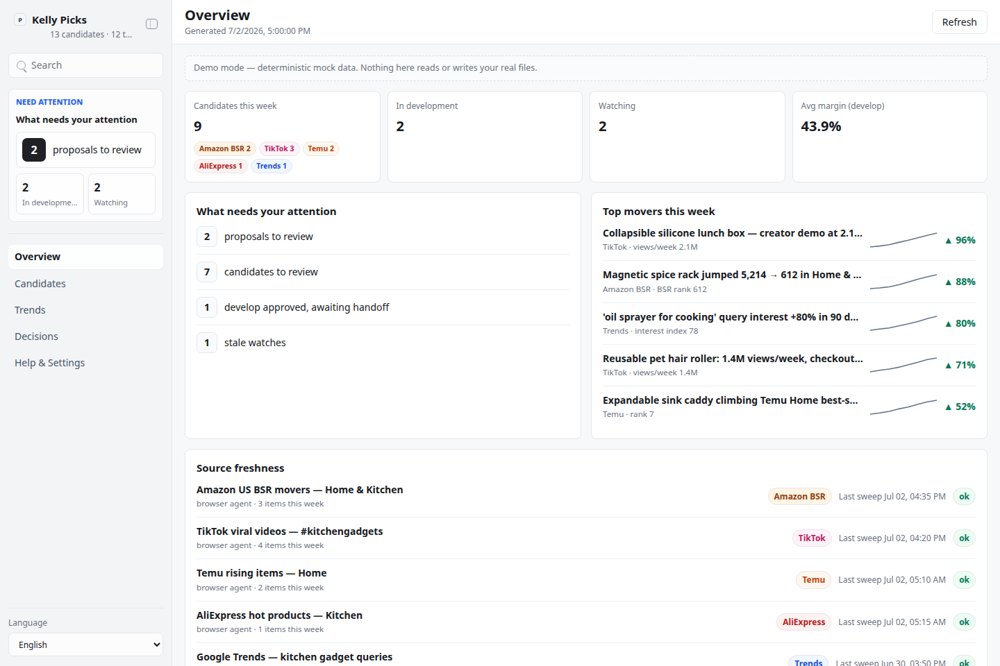
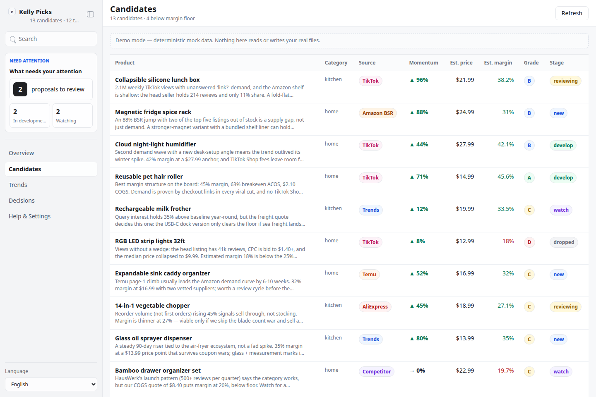
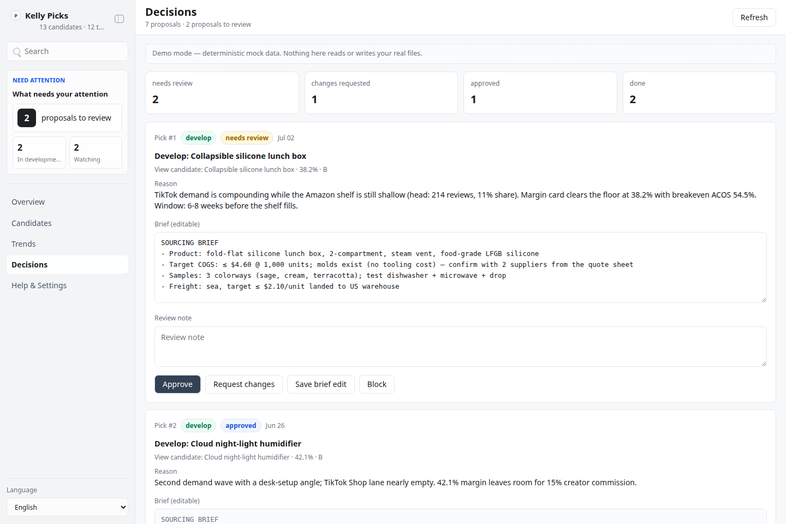
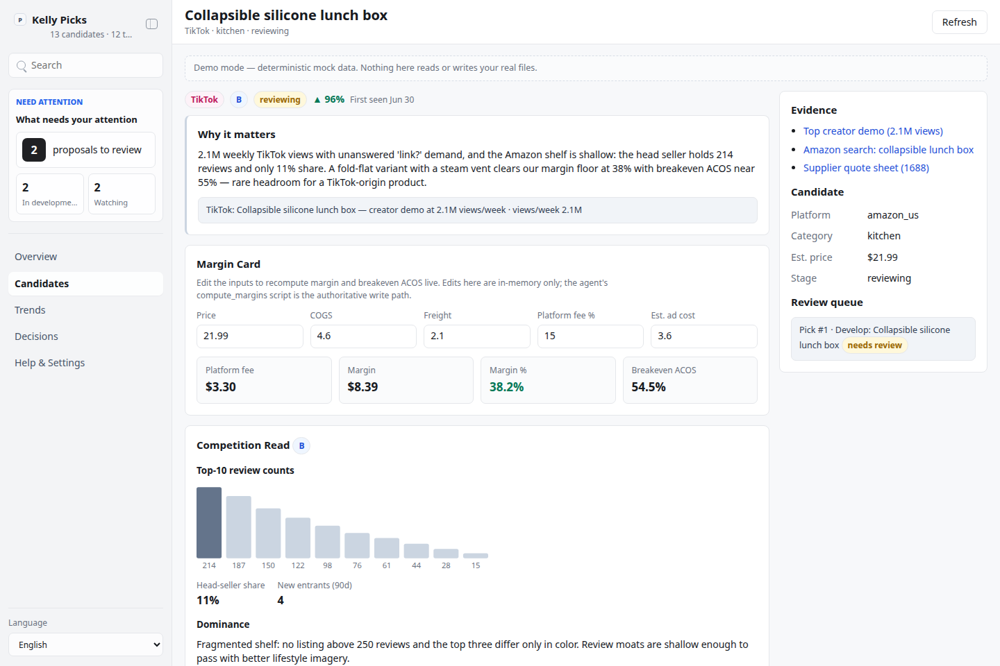

# Kelly Picks

Kelly Picks is a local App-in-Skill product-research (选品) desk for a cross-border e-commerce seller. The agent sweeps trend sources — Amazon BSR movers, TikTok viral product videos, Temu/AliExpress rising items, Google Trends terms, competitor new launches — and files product candidates; Kelly verdicts them develop / watch / drop in a review queue.

## What It Shows

- Overview: what needs Kelly's attention (proposals to review, develop-approved awaiting handoff, stale watches), KPI cards (candidates this week by source, in development, watching, avg margin of approved), top movers with momentum arrows, and per-source sweep freshness.
- Candidates: the research table — source badge, momentum, est. price, est. margin %, competition grade (A-D), stage. Detail shows a line-by-line margin card (price − COGS − freight − platform fee − est. ad cost → margin %, breakeven ACOS) with live-recomputing inputs, a competition read (top-10 review counts as SVG bars, head-seller dominance, new-entrant velocity), evidence links, and Develop / Watch / Drop verdict buttons.
- Trends: the raw signal feed, filterable by source badges, each item linked to its candidate or offering "Promote to candidate".
- Decisions: the review queue (`needs_review / changes_requested / approved / done / blocked`) — each item is an agent verdict proposal with an editable sourcing/listing brief, Approve / Request changes / Block buttons, and stable refs like `Pick #1`.
- Help & Settings: sanitized config — seller profile, platform fee tables, freight rules, sources with method, env readiness booleans.

## How It Flows

1. The agent sweeps sources (browser skills, exports, pasted research) and files everything through `scripts/ingest_trends.mjs` — the single write path, which validates, dedupes (source + external id, content-hash fallback), merges, and honors `app/.data/agent.lock`. The app itself never touches the network beyond `127.0.0.1`.
2. `scripts/compute_margins.mjs` deterministically recomputes every margin card from the config fee tables and flags candidates below the margin floor. It is idempotent.
3. Kelly verdicts candidates and reviews proposals in the app. Decisions land in `app/.data/decisions.json`; revision requests queue in `app/.data/agent_tasks.json`. `POST /api/decision` returns HTTP 423 while the agent lock exists.
4. `scripts/execute_decisions.mjs` (dry-run by default) turns approved proposals into concrete operations in `app/.data/execution_report.json`: `create_sourcing_brief` (export path), `handoff_listing_brief` (→ kelly-listing), `add_watch` (re-check criteria). The agent performs the handoffs, then re-runs with `--apply`.

## App UI Screenshots

<table>
  <tr>
    <td width="50%"></td>
    <td width="50%"></td>
  </tr>
  <tr>
    <td><strong>Overview</strong><br>Product-research desk with weekly candidates by source, top movers, and per-source sweep freshness.</td>
    <td><strong>Candidates</strong><br>Candidate table with momentum, estimated margin, competition grade, and develop/watch/drop stages.</td>
  </tr>
  <tr>
    <td width="50%"></td>
    <td width="50%"></td>
  </tr>
  <tr>
    <td><strong>Decision queue</strong><br>Agent-proposed develop/watch/drop verdicts with sourcing and listing briefs for approval.</td>
    <td><strong>Margin card</strong><br>Live-editable margin math — price, landed cost, freight, fees, ad cost → margin % and breakeven ACOS — plus a top-10 review-count competition read.</td>
  </tr>
</table>

## Demo Mode

Run the app and open a safe mock-data scene (a home/kitchen gadget seller, "Nimbus Home"):

```bash
skills/kelly-picks/app/start.sh
```

Use the URL printed by the launcher, then add one of these demo paths:

```text
/?demo=overview&lang=en#/overview
/?demo=candidates&lang=en#/candidates
/?demo=detail&lang=en#/candidates/cand-lunchbox
/?demo=trends&lang=en#/trends
/?demo=decisions&lang=en#/decisions
```

Featured deep link (full margin card + competition bars, Chinese content for zh screenshots — the featured candidate id is stable: `cand-lunchbox`):

```text
/?demo=detail&lang=zh#/candidates/cand-lunchbox
```

With `lang=zh`, demo content (product names like 可折叠硅胶饭盒, reasons, briefs, summaries) is localized to Chinese; currency stays USD. Demo mode never reads or writes files under `app/.data/`, and demo decisions are simulated only.

## Payload Format

`scripts/ingest_trends.mjs <payload.json>` accepts:

```json
{
  "trend_items": [
    {
      "source": "tiktok",
      "title": "Collapsible silicone lunch box — 2.1M views/week",
      "summary": "Three creators posted fold-flat demos this week.",
      "url": "https://…",
      "metric_label": "views/week",
      "metric_value": 2100000,
      "delta_pct": 96,
      "momentum": [12, 18, 26, 41],
      "external_id": "tt-7381",
      "candidate_id": "cand-lunchbox"
    }
  ],
  "candidates": [
    {
      "name": "Collapsible silicone lunch box",
      "category": "kitchen",
      "source": "tiktok",
      "platform_id": "amazon_us",
      "est_price": 21.99,
      "margin_card": { "price": 21.99, "cogs": 4.6, "freight": 2.1, "freight_quoted": true, "ad_cost": 3.6 },
      "competition": { "top_review_counts": [214, 187, 150], "head_share_pct": 11, "dominance_note": "…", "new_entrants_90d": 4, "velocity_note": "…" },
      "evidence": [{ "title": "Creator demo", "url": "https://…" }],
      "why_it_matters": "Demand, wedge, margin, window."
    }
  ],
  "source_sweeps": [{ "source_id": "tiktok-kitchen", "swept_at": "2026-07-02T08:20:00Z" }]
}
```

Source kinds: `amazon_bsr | tiktok | temu | aliexpress | trends | competitor`. Full schema: `references/picks-schema.md`.

## Fee-Table Config

`config.example.json` shows the shape: `seller_profile` (categories, target platforms, `margin_floor_pct`, `max_cogs`), `platforms[]` (per-platform `referral_fee_pct` + `fulfillment_flat`), `freight` (`default_per_unit` + per-category `rules`), and `ad_cost_default_pct`. `compute_margins.mjs` reads these to recompute every margin card; the margin floor drives the `below_floor` flags in the UI.

## Private Config

Copy `config.example.json` to `config.local.json` or `~/.config/kelly-picks/config.json`. Put any API secrets in local env files only, referenced by `*_env` names (env priority: system env → `KELLY_PICKS_ENV_FILE` → repo `.env` → `.env.local` → `~/.config/kelly-picks/.env`). Never commit real fee tables you consider sensitive, supplier quotes, tokens, or files under `app/.data/` or `exports/`.

## Boundary

Collection is read-only over public data — respect each platform's terms of service and robots.txt, throttle politely, and never scrape private or personal data. Margin data stays local. Handoffs (sourcing brief exports, listing briefs → kelly-listing) require Kelly's approval in the app first; `execute_decisions.mjs` is dry-run by default.
