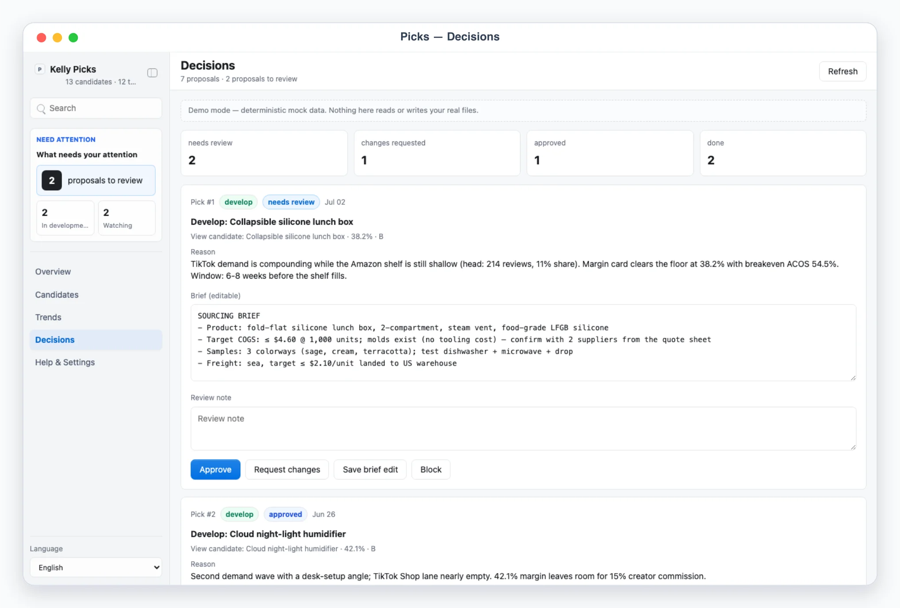

# Kelly Picks

## App UI Screenshots

<table>
  <tr>
    <td width="50%"></td>
    <td width="50%"></td>
  </tr>
  <tr>
    <td><strong>Overview</strong><br>Product-research desk with weekly candidates by source, top movers, and per-source sweep freshness.</td>
    <td><strong>Candidates</strong><br>Candidate table with momentum, estimated margin, competition grade, and develop/watch/drop stages.</td>
  </tr>
  <tr>
    <td width="50%"></td>
    <td width="50%"></td>
  </tr>
  <tr>
    <td><strong>Decision queue</strong><br>Agent-proposed develop/watch/drop verdicts with sourcing and listing briefs for approval.</td>
    <td><strong>Margin card</strong><br>Live-editable margin math — price, landed cost, freight, fees, ad cost → margin % and breakeven ACOS — plus a top-10 review-count competition read.</td>
  </tr>
</table>

## Overview

Use this skill as Kelly's product-research (选品) desk. The agent sweeps configured trend sources and files everything into Busabase, which the AirApp renders live:

1. **Trend feed**: raw source-tagged signals — a viral TikTok with view velocity, a BSR jump, a Temu/AliExpress riser, a rising search query, a competitor launch — each linkable to a candidate.
2. **Candidates**: products under research, each with a **margin card** (estimated price − landed cost − freight − platform fees − est. ad cost → gross margin %, breakeven ACOS) and a **competition read** (top-10 review-count distribution, head-seller dominance, new-entrant velocity).
3. **Decisions**: the review queue — the agent proposes a verdict per candidate (develop with sourcing + listing brief draft, drop with reason, keep watching with re-check criteria); Kelly approves, edits the brief, requests changes, or blocks. Approved develop items become concrete handoffs: a sourcing brief export and a listing brief for kelly-listing.

Real network sweeps (browsing TikTok/Amazon/Temu/AliExpress/Google Trends, reading competitor listings) are genuine external operations the AirApp browser cannot perform: `scripts/ingest_trends.mjs` is the single write path for sweep payloads, `scripts/compute_margins.mjs` deterministically recomputes every margin card from the fee tables, and `scripts/execute_decisions.mjs` prints the plan for approved proposals (and, after the agent performs the real handoff, marks it done). The AirApp itself only reads Busabase and writes review decisions.

Default behavior is AirApp-first. Unless the user explicitly asks only for explanation, sweep the configured sources, ingest the payload, recompute margins, and give the user the clickable AirApp URL (or the local preview URL when local preview is explicitly requested). Use chat-only mode only when the user says "纯聊天", "chat only", "不要打开 UI", or similar; then present numbered candidates/proposals and take verdicts in chat.

**The AirApp itself never browses a trend source, scrapes a listing, or performs a handoff.** It reads and writes Busabase records only. All external collection and execution is genuinely trusted-process-only: `scripts/ingest_trends.mjs` is the only place trend/candidate data enters the system, and `scripts/execute_decisions.mjs` never performs the sourcing-brief export or the kelly-listing handoff itself — it only prints the plan.

## Mandatory Dependencies

1. Read and follow `$kelly-app-skill-creator` for product behavior, visual quality, responsive layout, and the complete canonical `app/` artifact.
2. Read and follow `$busabase` for connection, target Space, node discovery, ChangeRequests, review, and merge behavior.
3. Read and follow `$busabase-app-creator` for resource modeling, AirApp runtime limits, security, validation, and deployment.

If a dependency is unavailable, preserve this skill's local artifact and product contracts, stop before the unavailable Busabase operation, and report the exact missing dependency. Do not invent a second data backend.

## Boundary

- Collection is read-only over public data (rankings, public videos, public listings, public trends). Respect robots.txt and each platform's terms of service, throttle politely, and never scrape private, gated, or personal data.
- The AirApp reads and writes Busabase records only. It must not fetch remote trend pages, place orders, message suppliers, export files, or mutate remote systems.
- Handoffs (listing brief → kelly-listing, sourcing brief exports) are approval-required: Kelly approves the proposal in the app, then `scripts/execute_decisions.mjs` prints the concrete operation for the agent to carry out; only after that does `--apply` mark the proposal done.
- Margin data, supplier quotes, and fee tables are Kelly's business data. Never commit payload JSON files fed to `scripts/ingest_trends.mjs`, env files, or raw export files.

## Busabase Resources

Six Bases under one application Folder (`kelly-picks`), declared in `app/app/js/config.js` and `app/resource-map.json`:

- `candidates`: products under research — one row per candidate, with the margin card and competition read JSON-encoded on the row (they share the candidate's lifecycle, not a separate one).
- `trend_items`: raw source-tagged trend signals from a sweep, optionally linked to a candidate; a genuinely distinct entity with its own promote-to-candidate lifecycle.
- `proposals`: agent-proposed develop/watch/drop verdicts per candidate, with their own five-state review workflow (`needs_review|changes_requested|approved|done|blocked`).
- `sources`: configured trend sources — kind, collection method, and sweep freshness.
- `sync_log`: append-only history of ingest/compute/execute runs.
- `settings`: one row (`record-id: "config"`) with the seller profile, platform fee tables, freight rules, and ad-cost default.

Resources provision lazily through an idempotent Busabase ChangeRequest the first time the app runs in a Space; see `references/picks-schema.md` for exact field shapes. A candidate's `develop`/`watch`/`drop` verdict and a proposal's `approve`/`request_changes`/`revise`/`block` review are both written directly onto the item record — the human verdict IS the field write, merged immediately from a standalone local preview or as a pending ChangeRequest from a deployed AirApp.

## First Run And Onboarding

On invocation, check the `candidates` and `sources` Bases. If both are empty, guide setup before any sweeping: ask, turn by turn, seller profile (store name, product categories, margin floor %, max COGS), target platforms with fee tables (referral fee % and any flat fulfillment fee), freight rules (default per-unit and per-category overrides), the ad-cost default % to assume when the agent has no better number, and which sources to sweep (`amazon_bsr|tiktok|temu|aliexpress|trends|competitor`, each with a method `browser_agent` or `manual`). Write the seller profile/platforms/freight/ad-cost-default into the `settings` Base's single row and each source into the `sources` Base.

## Local App

Default behavior is AirApp-first — give the user the clickable AirApp URL. Start `pnpm --dir app dev` only when local preview/debugging is explicitly requested.

Required app views (hash routes):

- `#/overview`: product-research command desk — human-attention panel (candidates to review, develop-approved awaiting handoff, stale watches), KPI cards (candidates this week by source, in development, watching, average margin of approved), top movers this week with momentum arrows, and source freshness (last sweep per source).
- `#/candidates` and `#/candidates/<id>`: the candidate table — product name, category, source badge, momentum, est. price, est. margin %, competition grade (A-D), stage (`new|reviewing|develop|watch|dropped`). Detail shows the full margin card (line-by-line, editable inputs recomputing live in-memory), the competition read (top-10 review counts as inline SVG bars, dominance note, new-entrant velocity), evidence links, the agent's why-it-matters note, and Develop / Watch / Drop verdict buttons with a `Review note`.
- `#/trends`: the raw signal feed, filterable by source badges; items link to their candidate or offer "Promote to candidate" (writes a promotion decision the agent picks up).
- `#/decisions`: the review queue with workflow states (`needs_review|changes_requested|approved|done|blocked`) — each item is a candidate verdict proposal with editable brief text, Approve / Request changes / Save brief edit / Block buttons, a `Review note`, and stable refs like `Pick #1`.
- `#/settings`: sanitized config — seller profile, platform fee tables, freight rules, sources with per-source method, data provider, onboarding state. Never exposes secret values.

Demo mode:

- `?demo=<scene>` opens deterministic mock data: `overview`, `candidates`, `trends`, `decisions`, `detail` (a featured candidate with full margin card and competition bars; featured id `cand-lunchbox`).
- `lang=en` or `lang=zh` forces UI chrome language for screenshots; with `lang=zh` the demo content itself (product names, reasons, briefs, summaries) is meaningfully localized while numbers stay USD.
- Deep links like `/?demo=detail&lang=zh#/candidates/cand-lunchbox` must work.
- Demo mode never reads or writes Busabase. Decision buttons still work but act on in-memory state only and show a demo notice.

UI language: English and Chinese chrome with `Auto` default (`navigator.languages`), an explicit selector persisted locally, and imported domain content kept in its original language outside demo mode.

## Sweep Workflow

Sweeps run on demand — when Kelly asks for a sweep or invokes the skill for fresh research. There is no cron inside the skill; any recurring schedule lives outside it.

1. Iterate the configured sources with method `browser_agent` using browser skills or web search in the agent session; `manual` sources are supplied by Kelly as pasted research or export files.
2. For each finding, build a normalized trend item: source kind, one-line title, 1-3 sentence summary, evidence URL, a metric (`metric_label` + `metric_value`), `delta_pct`, and a short `momentum` series. Give it a stable `external_id` when the source has one.
3. When a signal is strong enough, file a candidate in the same payload: name, category, target platform, est. price, best-known margin inputs, a competition read (top-10 review counts, head share, entrant velocity), evidence links, and a `why_it_matters` note that states demand, wedge, margin, and window.
4. Write through the single write path: save the payload JSON, then run `node scripts/ingest_trends.mjs <payload.json>`. The script validates, dedupes trend items by source + external id (content hash fallback) and candidates by id or name+source, merges, refreshes source freshness, and appends a `sync_log` entry.
5. Dedupe rules: a re-observed trend with unchanged numbers is skipped; changed numbers update the existing row. One row per signal, not per crawl.

## Margin Workflow

1. After ingest (or when fee tables change), run `node scripts/compute_margins.mjs`. It deterministically recomputes every candidate's margin card from the `settings` fee tables: platform referral fee % + flat fulfillment fee, freight rules by category (agent-quoted freight with `freight_quoted: true` is preserved), and the ad-cost default % when no estimate exists.
2. The script flags candidates below `seller_profile.margin_floor_pct` (`below_floor: true`, surfaced in the UI) and is idempotent — re-running without input changes changes nothing.
3. The margin card in `#/candidates/<id>` is a what-if surface: edits recompute live in the browser only. Busabase is only changed by scripts, so the app and the agent never fight over numbers.
4. When Kelly gets a real freight quote or supplier price, ingest it as a candidate update (`margin_card.freight` + `freight_quoted: true`, or new `cogs`) and re-run `compute_margins.mjs`.

## Decision Workflow

1. The agent proposes verdicts as proposals in the `proposals` Base (via `ingest_trends.mjs` payloads, or seeded directly): `develop` with a drafted sourcing + listing brief, `drop` with the reason, `watch` with re-check criteria.
2. Kelly reviews in `#/decisions` (or `#/candidates/<id>` for direct verdicts) — writes go straight to the proposal/candidate record through `busabase-sdk`.
3. Before executing anything, run `node scripts/execute_decisions.mjs` (dry-run). It prints the concrete operation for each approved proposal: `create_sourcing_brief` → export path under `exports/`, `handoff_listing_brief` → kelly-listing, `add_watch` → candidate id with re-check criteria, `drop_candidate` → stage update. No external side effects.
4. After Kelly confirms the dry-run, perform the handoffs (write the sourcing brief export, invoke kelly-listing with the listing brief), then run `node scripts/execute_decisions.mjs --apply` to mark the proposals done, update candidate stages, and log the run.

## Safety Defaults

- Treat handoffs, exports, config changes, and anything that could become an order or supplier contact as approval-required.
- Keep sweeps polite: throttle, cache, and store only the minimal excerpt needed for the trend item and evidence links.
- Never present a margin card as a guarantee — it is an estimate from configured fee tables; flag missing inputs instead of guessing silently.
- Keep ingestion idempotent via stable ids and content hashes so repeated sweeps never duplicate rows.
- If a source cannot be read reliably (geo-variants, A/B pricing), note the uncertainty in the trend item summary rather than inventing numbers.

## Useful Commands

```bash
node skills/kelly-picks/scripts/ingest_trends.mjs payload.json
node skills/kelly-picks/scripts/compute_margins.mjs
node skills/kelly-picks/scripts/execute_decisions.mjs
node skills/kelly-picks/scripts/execute_decisions.mjs --apply
pnpm --dir skills/kelly-picks/app dev
```

In normal use, invoke `/kelly-picks`, let the skill sweep and ingest what's due, and open the AirApp.
