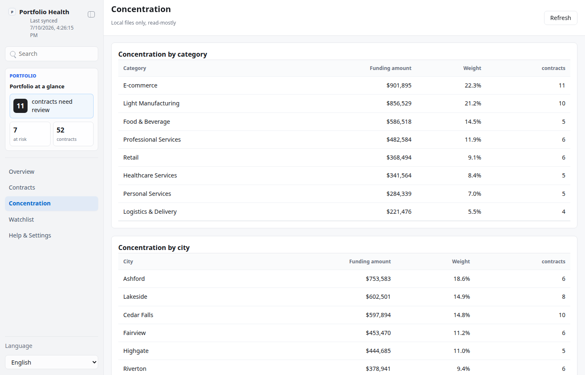
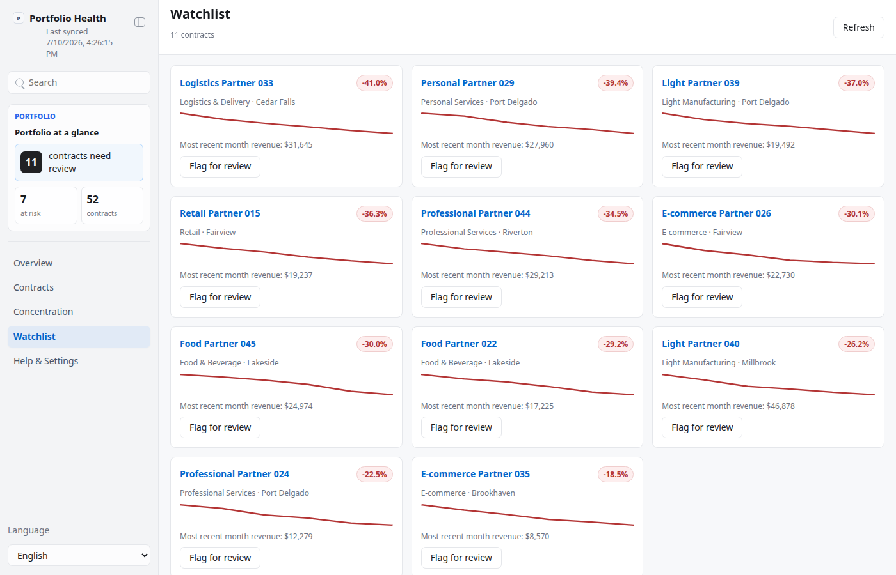
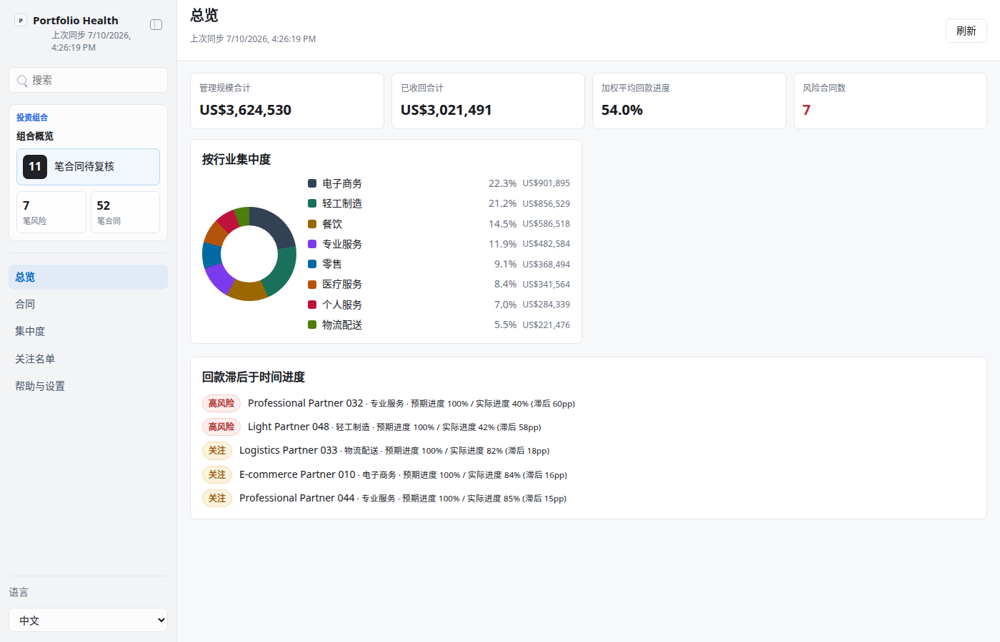
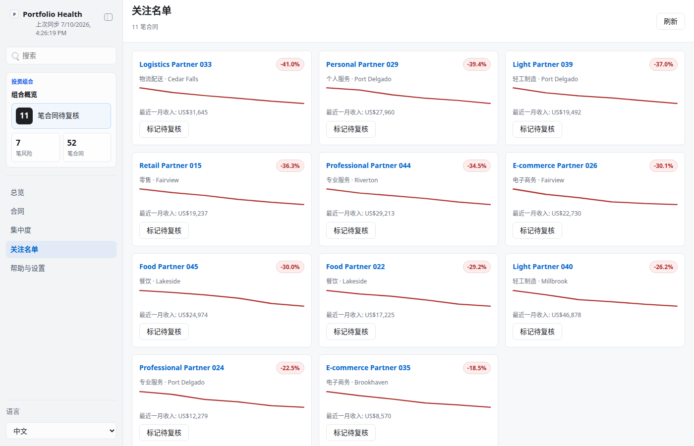

# RBF Portfolio Health Dashboard (`kelly-portfolio-health`)

A local, read-mostly App-in-Skill dashboard for a revenue-based-financing
(RBF) fund or private-credit book made up of many small SME (small/medium
enterprise) contracts. Each contract is a cash advance repaid as a share of
the SME's future revenue, up to a repayment cap. This skill aggregates a
portfolio of such contracts into a health summary, a repayment-progress
view, a concentration breakdown, and a revenue-decline watchlist — with one
lightweight human action: flag a contract for review, clear a flag, or leave
a note.

Generic and brand-free by design: the shipped dataset is a synthetic, seeded
mock book (no real company, fund, or SME names).

## What It Shows

- **Health summary** — total AUM, total collected, weighted-average
  repayment progress, and an at-risk contract count.
- **Repayment progress vs. time elapsed** — each contract's expected
  repayment percentage (based on months since origination vs. its term)
  against its actual percentage, surfacing contracts lagging the most.
- **Concentration** — funding-amount concentration by industry/category and
  by city, so a fund can see if it is overexposed to one segment.
- **Watchlist** — contracts whose most recent month's revenue dropped
  materially below their trailing average, each with a revenue sparkline.
- **Human action** — flag for review / clear flag / review note, written to
  a local handoff file (`app/.data/decisions.json`), never sent anywhere.

## App UI Screenshots

<table>
  <tr>
    <td width="50%"></td>
    <td width="50%"></td>
  </tr>
  <tr>
    <td><strong>Overview</strong><br>Total AUM, total collected, weighted-average repayment progress, at-risk count, category allocation, and the contracts most behind on expected repayment pace.</td>
    <td><strong>Concentration</strong><br>Industry/category and city concentration by funding amount and contract count.</td>
  </tr>
  <tr>
    <td colspan="2"></td>
  </tr>
  <tr>
    <td colspan="2"><strong>Watchlist</strong><br>Contracts with a recent revenue decline, each with a sparkline and a flag-for-review action.</td>
  </tr>
  <tr>
    <td width="50%"></td>
    <td width="50%"></td>
  </tr>
  <tr>
    <td><strong>Overview (中文)</strong></td>
    <td><strong>Watchlist (中文)</strong></td>
  </tr>
</table>

## Quick Start

```bash
cd skills/kelly-portfolio-health
npm install
node scripts/generate_demo_snapshot.ts   # seeds ~52 mock contracts
app/start.sh                             # starts the local dashboard
```

Then open the printed `http://127.0.0.1:<port>` URL.

## Demo Mode

For documentation/screenshots without touching any local state:

- `http://127.0.0.1:<port>/?demo=1#/overview` — deterministic, fully offline
  mock portfolio (~52 contracts across 8 categories, 10 cities).
- `?demo=overview`, `?demo=concentration`, `?demo=watchlist` select scenes.
- `&lang=en` / `&lang=zh` force UI chrome language.
- Demo responses never read or write `app/.data/` — safe to hit repeatedly.

## Structure

See `SKILL.md` for the full operating contract (onboarding, data provider,
views, safety boundary) and `references/portfolio-schema.md` for the
snapshot/insights schema. `package.json` depends on nothing but `hono` and
`@hono/node-server`; the frontend is zero-build vanilla JS/CSS.
