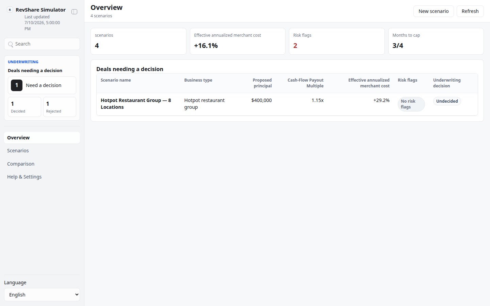
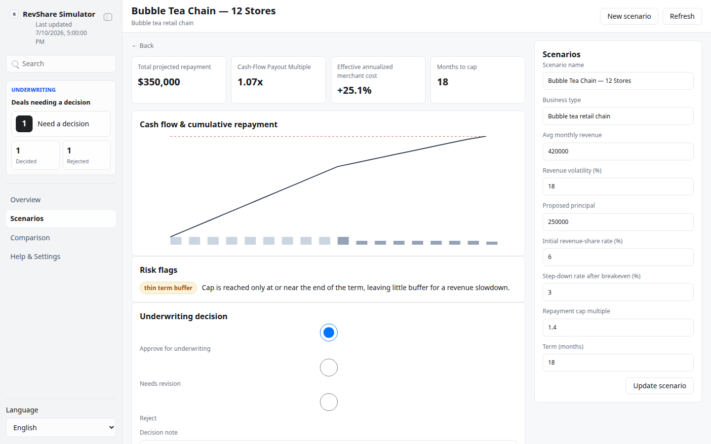
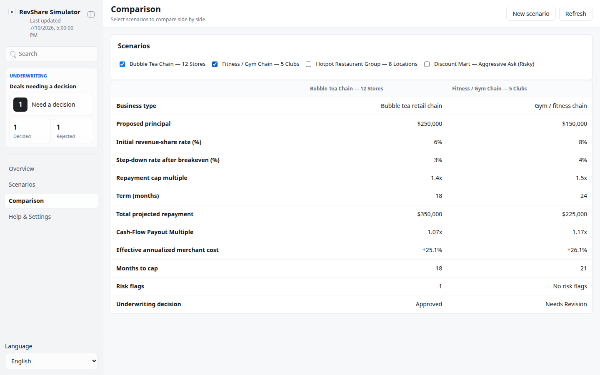

# Revenue-Share Contract Simulator

Revenue-Share Contract Simulator is a local, file-backed App-in-Skill control
panel for modeling revenue-based-financing (RBF) deals for SME businesses
such as retail and F&B chain stores. It never fetches live revenue/banking
data and never moves money — every number comes from analyst-entered inputs
run through pure, deterministic math.

## What It Shows

- Overview: portfolio-level metrics across saved scenarios — average
  effective annualized cost, how many are flagged, and how many still need an
  underwriting decision.
- Scenarios: a filterable list (`All`, `Undecided`, `Approved`, `Needs
  Revision`, `Rejected`) plus a form to create or edit a scenario's inputs
  (average monthly revenue, revenue volatility, principal, initial and
  step-down revenue-share rates, repayment cap multiple, term length).
- Scenario detail: projected monthly cash flow and cumulative repayment
  chart, the Cash-Flow Payout Multiple (a P/E-like ratio of principal to
  annualized repayment cash flow), the implied effective annualized merchant
  cost, rule-based risk flags (cap not reached within term, merchant cost too
  high, high revenue volatility, thin term buffer), and a decision panel
  (approve for underwriting / needs revision / reject) with a note.
- Comparison: pick any saved scenarios for a side-by-side table of inputs,
  projected repayment, payout multiple, effective cost, and decisions.

## App UI Screenshots

<table>
  <tr>
    <td width="50%"></td>
    <td width="50%"></td>
  </tr>
  <tr>
    <td><strong>Overview</strong><br>Portfolio-level summary across saved scenarios: average effective cost, flagged deals, and deals still needing an underwriting decision.</td>
    <td><strong>Scenario detail</strong><br>Cash-flow/cumulative-repayment chart, Cash-Flow Payout Multiple, effective annualized merchant cost, risk flags, and the decision panel.</td>
  </tr>
  <tr>
    <td colspan="2" width="100%"></td>
  </tr>
  <tr>
    <td colspan="2"><strong>Comparison</strong><br>Side-by-side table of selected scenarios' inputs, projected repayment, payout multiple, effective cost, and decisions.</td>
  </tr>
</table>

## Demo Mode

Run the app and open a safe mock-data scene:

```bash
skills/kelly-revshare-simulator/app/start.sh
```

Use the URL printed by the launcher, then add one of these demo paths:

```text
/?demo=1&lang=en#/overview
/?demo=scenarios&lang=en#/scenarios
/?demo=detail&lang=en#/scenarios/bubble-tea-chain-12-stores
/?demo=comparison&lang=en#/comparison
```

Demo mode is fully offline and never reads or writes local scenario files.

## Seed Data

Populate `app/.data/scenarios.json` with four example scenarios (bubble tea
chain, gym chain, hotpot restaurant, and one deliberately aggressive/risky
example that trips the risk flags):

```bash
node skills/kelly-revshare-simulator/scripts/generate_batch.ts
```

Validate the schema at any time with:

```bash
node skills/kelly-revshare-simulator/scripts/validate_ui_schema.ts
```

## Private Config

Copy `config.example.json` to `config.local.json` or
`~/.config/kelly-revshare-simulator/config.json` to set the base currency and
underwriting policy thresholds (max effective annual cost, cap-multiple
range, max term). This skill has no external accounts and needs no secrets.
Never commit real deal data — `app/.data/` is gitignored.
