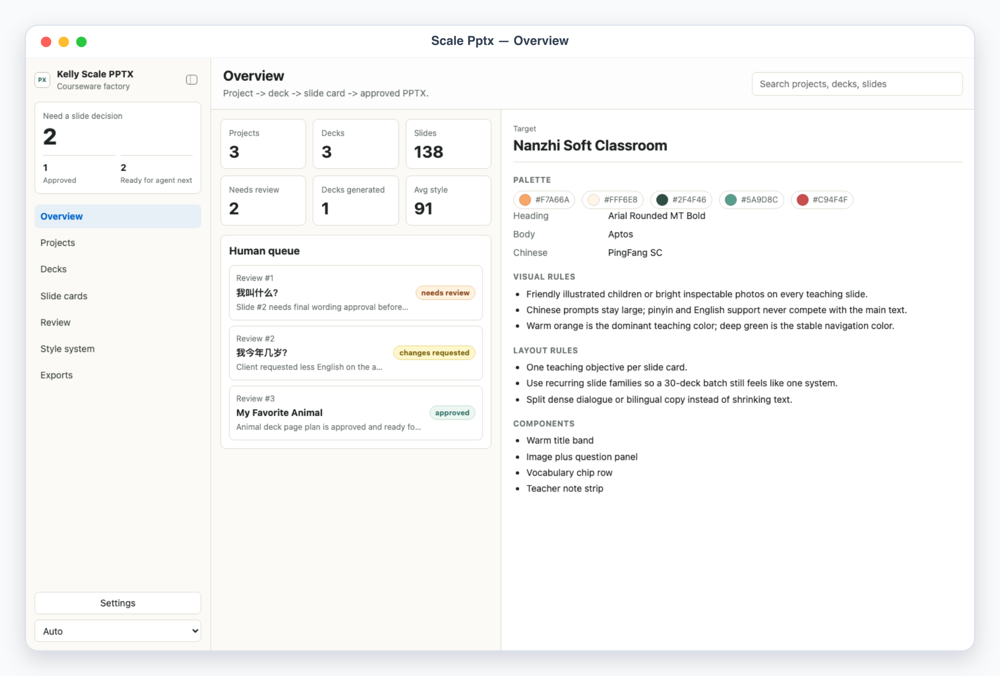
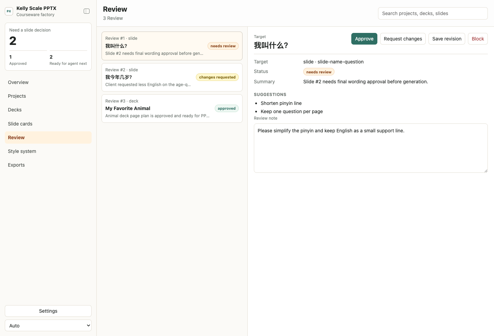
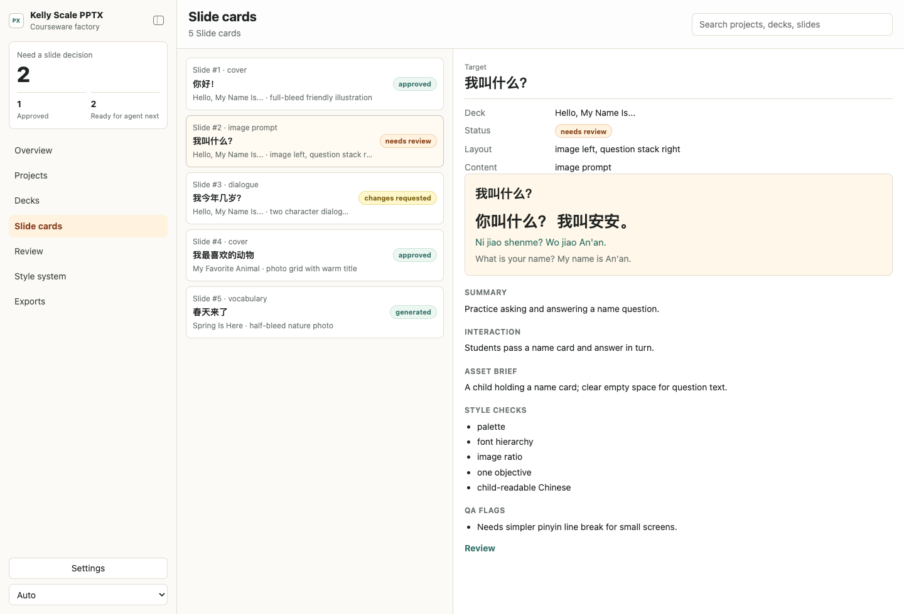
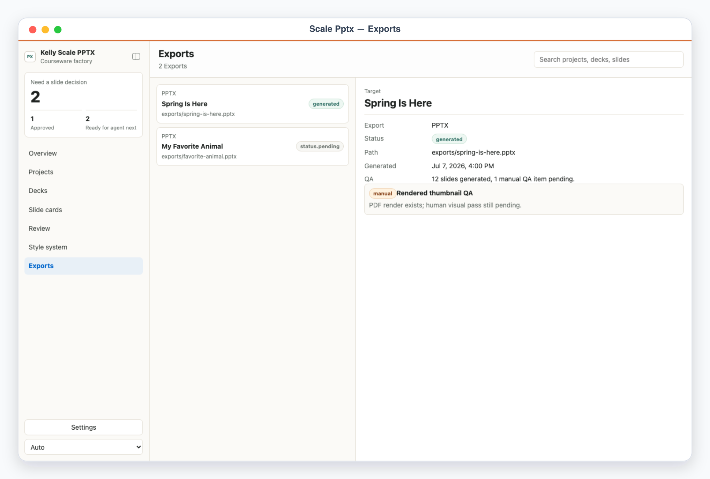

# Kelly Scale PPTX

Kelly Scale PPTX is a local App-in-Skill desk for producing many style-consistent PowerPoint courseware decks. It turns a client/course brief into a managed workflow: project -> deck -> slide card -> review -> PPTX generation -> render QA -> export.

It is designed for work like 南枝中文: a reusable PPT style system, many children-focused teaching decks, and enough review structure that a large batch stays manageable.

## App UI Screenshots

<table>
  <tr>
    <td width="50%"></td>
    <td width="50%"></td>
  </tr>
  <tr>
    <td><strong>Overview</strong><br>Courseware factory dashboard with project, deck, slide-card, QA, and style-score counters.</td>
    <td><strong>Review queue</strong><br>Slide-card and deck approvals before the agent generates or revises PPTX output.</td>
  </tr>
  <tr>
    <td width="50%"></td>
    <td width="50%"></td>
  </tr>
  <tr>
    <td><strong>Slide cards</strong><br>Storyboard-style page specs: objective, layout, copy, visual brief, interaction, style checks, and QA flags.</td>
    <td><strong>Exports</strong><br>PPTX outputs, render paths, generation status, and QA evidence for each deck.</td>
  </tr>
</table>

## Workflow

1. Configure the client, audience, style system, slide families, and export preferences.
2. Create projects and decks for each courseware batch.
3. Draft slide cards before generating any PPTX.
4. Review slide cards and decks in the local UI.
5. Generate PPTX from approved cards.
6. Render and inspect the deck for overflow, crop, contrast, and style drift.
7. Export final PPTX and QA records.

## Run Locally

```bash
skills/kelly-scale-pptx/app/start.sh
```

Demo mode is deterministic and safe for screenshots:

```text
http://127.0.0.1:3000/?demo=overview#/overview
http://127.0.0.1:3000/?demo=review#/review
http://127.0.0.1:3000/?demo=slides#/slides/slide-name-question
http://127.0.0.1:3000/?demo=exports#/exports
```

Use `lang=zh` for Chinese screenshots. Demo mode never reads or writes files under `app/.data/`.

## Commands

```bash
node skills/kelly-scale-pptx/scripts/generate_demo_snapshot.ts
node skills/kelly-scale-pptx/scripts/validate_ui_schema.ts
node skills/kelly-scale-pptx/scripts/generate_pptx.ts --deck=deck-hello-self
node skills/kelly-scale-pptx/scripts/execute_decisions.ts --apply
```

Generated exports live under `skills/kelly-scale-pptx/exports/` by default and are gitignored.
