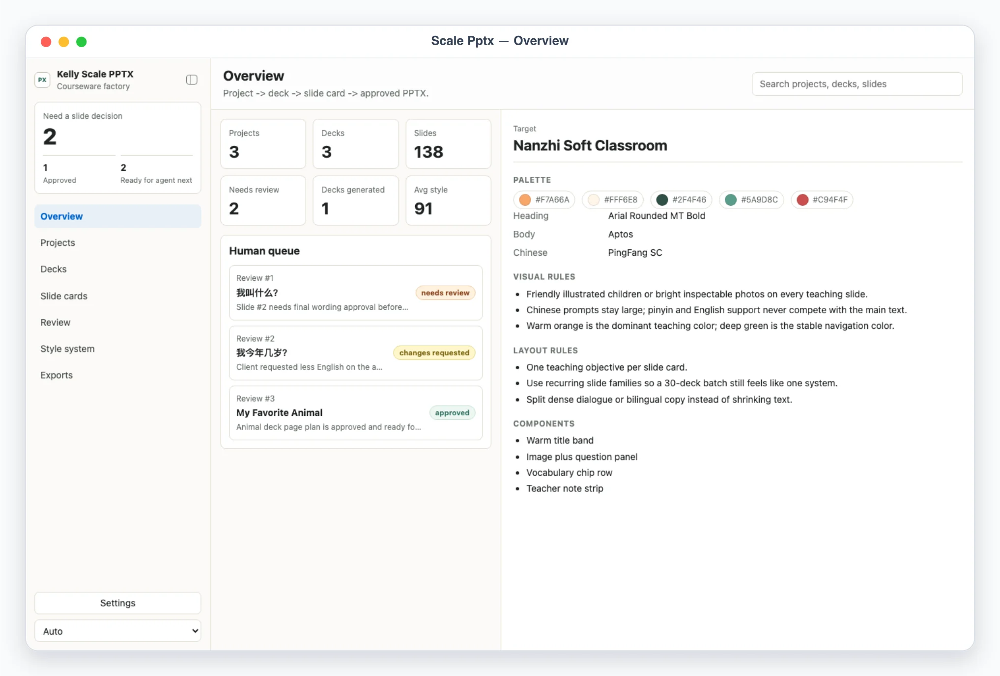
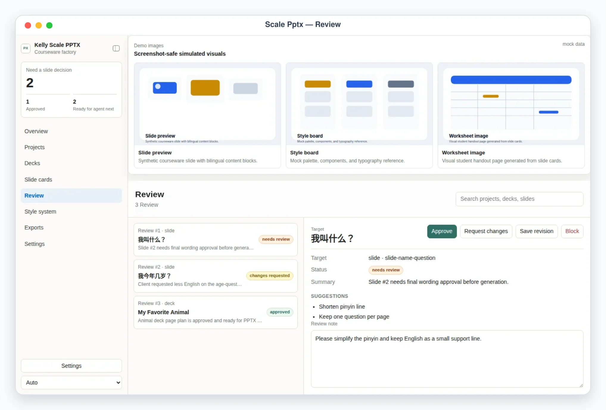
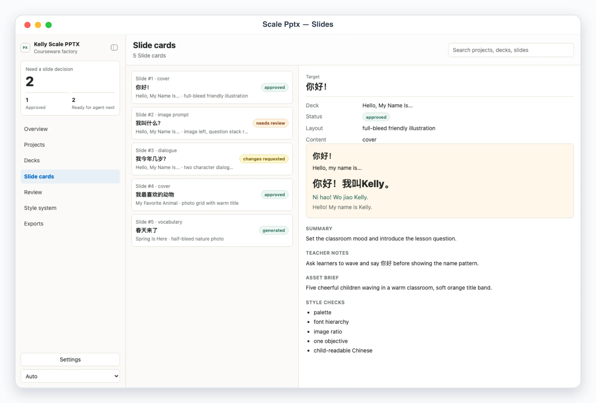
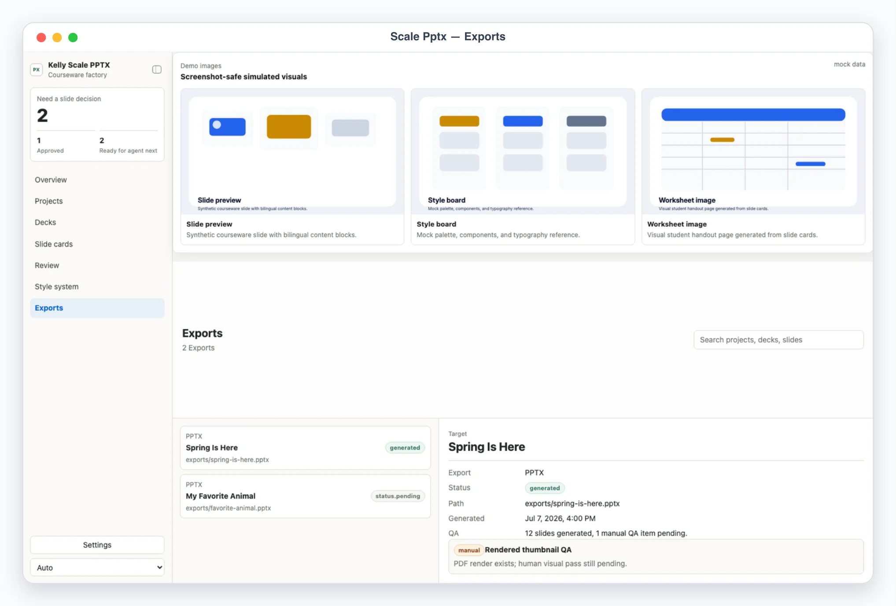

# Kelly Scale PPTX

## Overview

Use this skill as a scalable PPTX courseware factory. It manages a project-based workflow where each deck is planned as slide cards first, reviewed like storyboard shots, then generated into PPTX and rendered for QA. The default user is a teaching-content operator producing many style-consistent courseware decks for a client such as 南枝中文.

Default interaction mode: App UI. Unless the user explicitly asks for chat-only handling, check onboarding/config, refresh or create the courseware snapshot, start/reuse the local app with `app/start.sh`, and give the actual local URL. Use chat-only mode only when the user says "纯聊天", "chat only", "不要打开 UI", or similar.

## App UI Screenshots

<table>
  <tr>
    <td width="50%"></td>
    <td width="50%"></td>
  </tr>
  <tr>
    <td><strong>Overview</strong><br>Courseware factory dashboard with project, deck, slide-card, QA, and style-score counters.</td>
    <td><strong>Review queue</strong><br>Slide-card and deck approvals before the agent generates or revises PPTX output.</td>
  </tr>
  <tr>
    <td width="50%"></td>
    <td width="50%"></td>
  </tr>
  <tr>
    <td><strong>Slide cards</strong><br>Storyboard-style page specs: objective, layout, copy, visual brief, interaction, style checks, and QA flags.</td>
    <td><strong>Exports</strong><br>PPTX outputs, render paths, generation status, and QA evidence for each deck.</td>
  </tr>
</table>

## Boundary

- The skill may parse user-provided course content, draft slide cards, generate local PPTX files, render QA artifacts, and write local handoff files.
- The app reads and writes local files only. It never contacts clients, uploads decks, publishes content, or mutates remote systems.
- External delivery, client email, file uploads, paid image generation, or production publishing are approval-required and should be executed by another explicit skill after the user approves.
- Treat client course materials, style references, and generated decks as private. Never commit `config.local.json`, env files, `app/.data/`, `app/.cache/`, or `exports/`.

## First Run And Onboarding

On invocation, check `app/.data/onboarding.json` and private config readiness. If onboarding is absent/incomplete, guide setup before real work.

Private config priority:

1. `KELLY_SCALE_PPTX_CONFIG=/absolute/path/to/config.json`
2. `skills/kelly-scale-pptx/config.local.json`
3. `~/.config/kelly-scale-pptx/config.json`
4. `skills/kelly-scale-pptx/config.example.json` as template only

Env priority:

1. Existing environment variables
2. `KELLY_SCALE_PPTX_ENV_FILE=/absolute/path/to/.env`
3. Repository root `.env`
4. `skills/kelly-scale-pptx/.env.local`
5. `~/.config/kelly-scale-pptx/.env`

Onboarding asks, turn by turn: client/brand profile, audience, language mode, style-system source materials, slide families, export folder, whether render QA is required, and any PPTX template path. This skill needs no secrets by default. When setup is complete and the user confirms, write `app/.data/onboarding.json`:

```json
{
  "completed": true,
  "completed_at": "ISO timestamp",
  "config_version": "1"
}
```

## Local App

Start the desk with:

```bash
skills/kelly-scale-pptx/app/start.sh
```

The app uses local HTTP on `127.0.0.1`, preferring ports `3000` through `4000`, or `KELLY_SCALE_PPTX_UI_PORT` when set. `/api/state` reports `app: "kelly-scale-pptx"`.

Required app views:

- `#/overview`: courseware factory dashboard — project/deck/slide totals, human attention summary, style-system preview, recent review queue.
- `#/projects`: project list — client, course, stage, deck count, slide count, status.
- `#/decks`: deck list — theme, level, slide counts, style score, PPTX/render paths.
- `#/slides`: slide-card workbench — page objective, layout, copy, pinyin/English support, teacher notes, asset brief, style checks, QA flags.
- `#/review`: review queue — workflow states (`needs_review` / `changes_requested` / `approved` / `generated` / `done` / `blocked`), stable refs, decision buttons, review note.
- `#/style`: reusable style system — palette, fonts, visual rules, layout rules, component library.
- `#/exports`: generated output records — PPTX path, render path, QA summary.
- `#/settings`: sanitized config — brand profiles, style systems, export prefs, provider, onboarding state. Never expose secret values.

Demo mode:

- `?demo=overview`, `?demo=review`, `?demo=slides`, and `?demo=exports` open deterministic mock scenes for documentation and screenshots.
- `lang=en` or `lang=zh` forces UI chrome language; with `lang=zh` the demo content is meaningfully localized.
- Demo API responses never read or write files under `app/.data/`.

## File Contract

Read `references/courseware-schema.md` before editing app files, scripts, or generated JSON.

- `app/.data/courseware_snapshot.json`: brand profiles, style systems, projects, decks, slide cards, QA checks, exports, review items, metrics, activity log.
- `app/.data/decisions.json`: user verdicts keyed by review id.
- `app/.data/agent_tasks.json`: queued `revise_slide_card` or `revise_deck_plan` work for the agent.
- `app/.data/execution_report.json`: latest executor results.
- `app/.data/onboarding.json`: onboarding completion marker.
- `app/.data/agent.lock`: temporary lock while the skill writes; review writes return HTTP 423 while it exists.

Validate with `scripts/validate_ui_schema.ts` before relying on a snapshot.

## Courseware Workflow

1. Collect inputs: client style samples, old PPT screenshots/PPTX, content table, lesson goals, audience, deck count, page count, and export deadline.
2. Create or update the style system first. Extract palette, fonts, slide families, image rules, component library, and density limits.
3. Create projects and decks. One project is a client/course/theme batch; one deck is one PPTX deliverable.
4. Draft slide cards before generating PPTX. Each card must include objective, layout, title/copy, pinyin/English support, interaction, asset brief, style checks, and QA flags.
5. Send slide cards or whole decks to `#/review`. Only approved slide cards/decks should be generated.
6. Generate PPTX with `node scripts/generate_pptx.ts --deck=<deck_id>` or a richer `pptx` skill pass.
7. Render and visually QA the PPTX. Record QA evidence in the snapshot.
8. Export completed PPTX paths and report exactly which files were written.

## Useful Commands

```bash
skills/kelly-scale-pptx/app/start.sh
node skills/kelly-scale-pptx/scripts/generate_demo_snapshot.ts
node skills/kelly-scale-pptx/scripts/validate_ui_schema.ts
node skills/kelly-scale-pptx/scripts/generate_pptx.ts --deck=deck-hello-self
node skills/kelly-scale-pptx/scripts/execute_decisions.ts --apply
```

## Safety Defaults

- Do not generate or deliver bulk PPTX directly from raw content without a slide-card review pass.
- Do not shrink text to fit. Split the page or revise content.
- Treat render QA as required for client-facing decks.
- If style samples conflict, stop and ask which sample is canonical before scaling the system.
- Keep local data minimal and ids stable so re-ingest and re-generation are idempotent.
