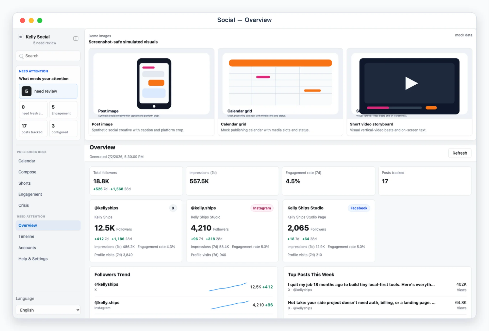
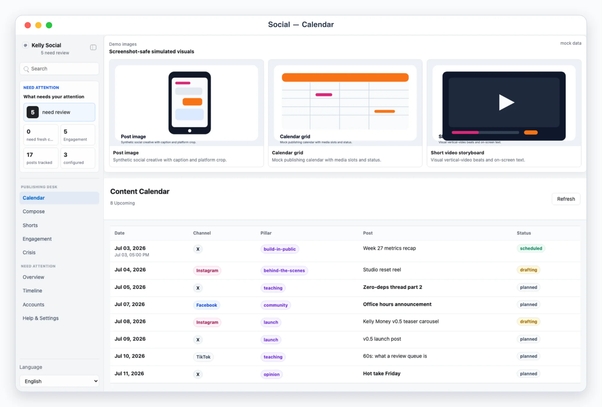
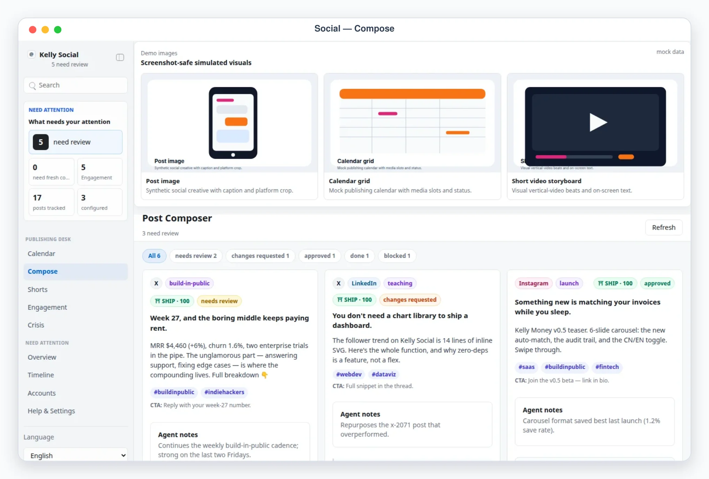
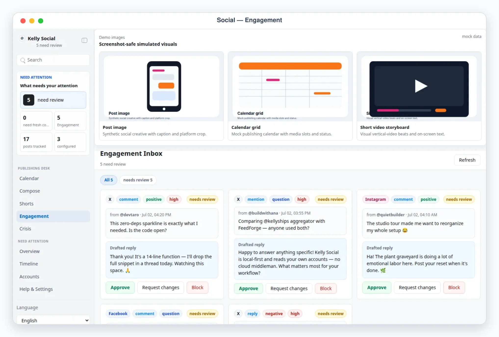

# Kelly Social

Kelly Social is a Busabase Cloud App-in-Skill **command desk** that both **monitors** and **publishes** across Twitter/X, Facebook, and Instagram (extensible to LinkedIn, YouTube, Threads, TikTok, and Xiaohongshu). It follows the **ECHO** discipline — **E**xplore, **C**raft, **H**ost, **O**bserve — so the same app aggregates the numbers and drives an agent-drafts → human-approves → skill-publishes workflow.

## What It Shows

Monitoring (Observe):

- Overview: per-platform KPI cards with 7d/28d deltas, cross-platform follower trends, top posts this week, **share-of-voice vs competitors**, and collection freshness.
- Timeline: one reverse-chronological feed across all platforms with platform filters and per-post metrics.
- Post detail: full text, metrics breakdown, permalink, and agent notes.
- Accounts: handle inventory with followers, growth, engagement rate, and collection method.
- Account detail: profile summary, follower sparkline, top posts, traffic sources, and sync history.

Publishing desk (Explore / Craft / Host):

- Calendar: scheduled posts across channels with theme pillars, dates, and status.
- Compose: an agent-drafted post queue (hook + body + hashtags + CTA + channels) with a five-state review model and a pre-publish quality gate; approve, request changes, block, or publish.
- Shorts: short-video scripts for Reels / Shorts / TikTok / Douyin — shot lists with voiceover, duration, and on-screen text.
- Engagement: an inbox of incoming mentions/comments with agent-drafted replies, approval-gated.
- Crisis: an incident-response checklist with a live status toggle and a pause-publishing switch.

## The Quality Gate (⛩ social-qa)

Every draft is scored 0–100 (SQS) across brand voice, disclosure, and banned claims, producing a **SHIP / FIX / BLOCK** verdict. A BLOCK forces the draft to `blocked` and disables approve/publish until it's revised. The logic lives in `app/app/js/social-model.js` and is recomputed live from each draft's own copy on every read — never trusted as stale stored state.

## Collection & Publishing Philosophy

Most social platforms have hostile or expensive APIs, so collection is agent-driven: the AI agent gathers data using the method configured per account — browsing with the user's own logged-in session, parsing analytics exports the user downloads, or an official API when a token is configured — then writes everything through `scripts/ingest_snapshot.mjs` directly into Busabase. Publishing is human-gated: the agent drafts, the human approves in the review queue, and the skill performs the real platform action out of band. Own accounts only, no password storage, no fake engagement.

## Data

Kelly Social is a Busabase-only App-in-Skill: the browser talks to `busabase-sdk` directly through a thin same-origin OAuth proxy (`server.js`), with lazy Folder/Base provisioning on first connect. There is no local-file persistence and no provider choice. A deterministic `?demo=1` read-only preview is available for exploring the UI without a Busabase connection.

## App UI Screenshots

<table>
  <tr>
    <td width="50%"></td>
    <td width="50%"></td>
  </tr>
  <tr>
    <td><strong>Overview</strong><br>Cross-platform KPI cards for X, Instagram, and Facebook with follower trends and top posts of the week.</td>
    <td><strong>Unified timeline</strong><br>Posts across all platforms in one stream with per-post likes, replies, reposts, and view counts.</td>
  </tr>
  <tr>
    <td width="50%"></td>
    <td width="50%"></td>
  </tr>
  <tr>
    <td><strong>Detail</strong><br>Single-post performance view with platform metrics, comments, reply drafts, and approval status.</td>
    <td><strong>Accounts</strong><br>Connected-account health board with platform status, audience totals, content cadence, and sync freshness.</td>
  </tr>
  <tr>
    <td width="50%"></td>
    <td width="50%"></td>
  </tr>
  <tr>
    <td><strong>Content calendar</strong><br>Scheduled posts across channels by theme pillar and date, with status and approvals.</td>
    <td><strong>Compose (publishing)</strong><br>Agent-drafted posts in a review queue with hooks, hashtags, and CTAs, behind a social-qa SHIP/FIX/BLOCK gate — one draft blocked for a banned claim.</td>
  </tr>
  <tr>
    <td width="50%"></td>
  </tr>
  <tr>
    <td><strong>Engagement</strong><br>Mentions and comments inbox grouped by urgency, sentiment, owner, and reply-approval state.</td>
  </tr>
  <tr>
    <td width="50%"></td>
    <td width="50%"></td>
  </tr>
  <tr>
    <td><strong>Short-video scripts</strong><br>Short-video script queue for Instagram, TikTok, and YouTube with hooks, shot lists, and approval state.</td>
    <td><strong>Crisis playbook</strong><br>Incident status board with triage steps, pause-publishing controls, and spokesperson designation.</td>
  </tr>
</table>

## Data Provider

Kelly Social is a Busabase Cloud App-in-Skill: the AirApp reads and writes
Busabase records directly through `busabase-sdk` (`app/app/js/providers/busabase-provider.js`),
never a local-file backend. `scripts/ingest_snapshot.mjs` is the trusted
collector-write path — it connects with its own credentials
(`BUSABASE_BASE_URL` / `BUSABASE_API_KEY` / `BUSABASE_SPACE_ID`), never the
AirApp's ambient session.

## Demo Mode

Start a local preview and open a safe mock-data scene:

```bash
pnpm --dir skills/kelly-social/app dev
```

Use the printed URL, then add one of these demo paths:

```text
/?demo=overview&lang=en#/overview
/?demo=timeline&lang=en#/timeline
/?demo=accounts&lang=en#/accounts
/?demo=detail&lang=en#/accounts/x-kelly
/?demo=calendar&lang=en#/calendar
/?demo=compose&lang=en#/compose
/?demo=shorts&lang=en#/shorts
/?demo=engagement&lang=en#/engagement
/?demo=crisis&lang=en#/crisis
```

The `compose` demo includes one draft that the quality gate **BLOCK**s. Demo mode never reads live platform data or local private snapshot files, and demo operations never mutate real state.

## Private Config

There is no local config file. Account handles, platforms, and collection
methods live in the `accounts` Base in Busabase; API tokens used by the agent
during collection stay in that process's own environment (never Busabase,
never chat).

---

# Kelly Social（中文）

Kelly Social 是一个 Busabase Cloud App-in-Skill **指挥台**，既**监控**也**发布**，覆盖 Twitter/X、Facebook、Instagram（可扩展至 LinkedIn、YouTube、Threads、TikTok、小红书）。它遵循 **ECHO** 工作法——探索（Explore）、打磨（Craft）、托管（Host）、观察（Observe）——同一个应用既聚合数据，又驱动「Agent 起草 → 人工审批 → 技能发布」的流程。

## 展示什么

监控（观察）：

- 总览：各平台 KPI 卡片（含 7 天/28 天变化）、跨平台粉丝趋势、本周热门帖子、**对比竞品的声量占比**、以及采集新鲜度。
- 时间线：跨全部平台的倒序信息流，支持平台筛选与逐帖指标。
- 帖子详情：全文、指标明细、原帖链接、Agent 备注。
- 账号：账号清单，含粉丝、增长、互动率与采集方式。
- 账号详情：主页概要、粉丝迷你趋势图、热门帖子、流量来源、采集记录。

发布台（探索 / 打磨 / 托管）：

- 日历：跨渠道的排期帖子，含主题支柱、日期与状态。
- 撰稿：Agent 起草的帖子队列（钩子 + 正文 + 话题标签 + 行动号召 + 渠道），采用五态审核模型与发布前质量闸；可批准、要求修改、拦截或发布。
- 短视频：面向 Reels / Shorts / TikTok / 抖音的脚本——含配音、时长与画面文字的分镜表。
- 互动：来自提及/评论的收件箱，配 Agent 起草的回复，需审批放行。
- 危机：事件应对清单，含实时状态切换与暂停发布开关。

## 质量闸（⛩ social-qa）

每条草稿在品牌语气、信息披露、违规主张三个维度上打 0–100 分（SQS），给出 **放行 / 待修 / 拦截** 判定。判定为「拦截」会把草稿强制置为 `blocked`，在修改前禁用批准与发布。逻辑见 `app/app/js/social-model.js`，且每次读取都会用草稿自身文案实时重新计算，从不信任过期的存量数据。

## 采集与发布理念

多数社媒平台的 API 昂贵或不友好，因此采集由 Agent 驱动：AI 按每个账号配置的方式采集——用用户自己的登录会话浏览、解析用户下载的分析导出、或在配置了 token 时调用官方 API——再通过 `scripts/ingest_snapshot.mjs` 写入 Busabase。发布由人工把关：Agent 起草、人工在审核队列批准、技能在链路外执行真正的平台动作。应用本身只读写 Busabase 记录，绝不发起平台请求。仅限本人账号，不存储密码，不制造虚假互动。

## 数据提供方

Kelly Social 是 Busabase Cloud App-in-Skill：AirApp 通过 `busabase-sdk`（`app/app/js/providers/busabase-provider.js`）直接读写 Busabase 记录，不再有本地文件后端。`scripts/ingest_snapshot.mjs` 是受信任的采集写入路径——它使用自己的凭据连接（`BUSABASE_BASE_URL` / `BUSABASE_API_KEY` / `BUSABASE_SPACE_ID`），而非 AirApp 的环境态会话。

## 演示模式

启动本地预览并打开安全的模拟数据场景：

```bash
pnpm --dir skills/kelly-social/app dev
```

使用打印出的 URL，再追加以下演示路径之一：

```text
/?demo=overview&lang=zh#/overview
/?demo=calendar&lang=zh#/calendar
/?demo=compose&lang=zh#/compose
/?demo=shorts&lang=zh#/shorts
/?demo=engagement&lang=zh#/engagement
/?demo=crisis&lang=zh#/crisis
```

`compose` 演示中有一条会被质量闸 **拦截** 的草稿。演示模式绝不读取真实平台数据或本地私有快照，演示操作也绝不改写真实状态。

## 私有配置

不再有本地配置文件。账号的 handle、平台、采集方式都存放在 Busabase 的 `accounts` Base 中；Agent 采集时使用的 API token 只留在该进程自身的环境变量里（绝不写入 Busabase，也绝不出现在聊天记录中）。
