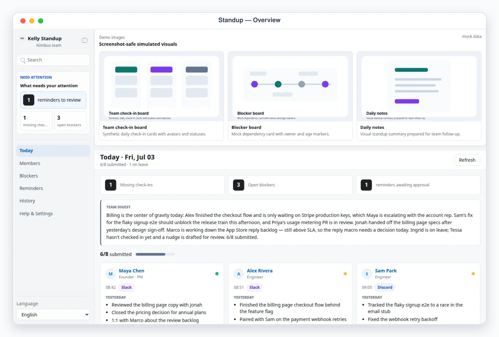
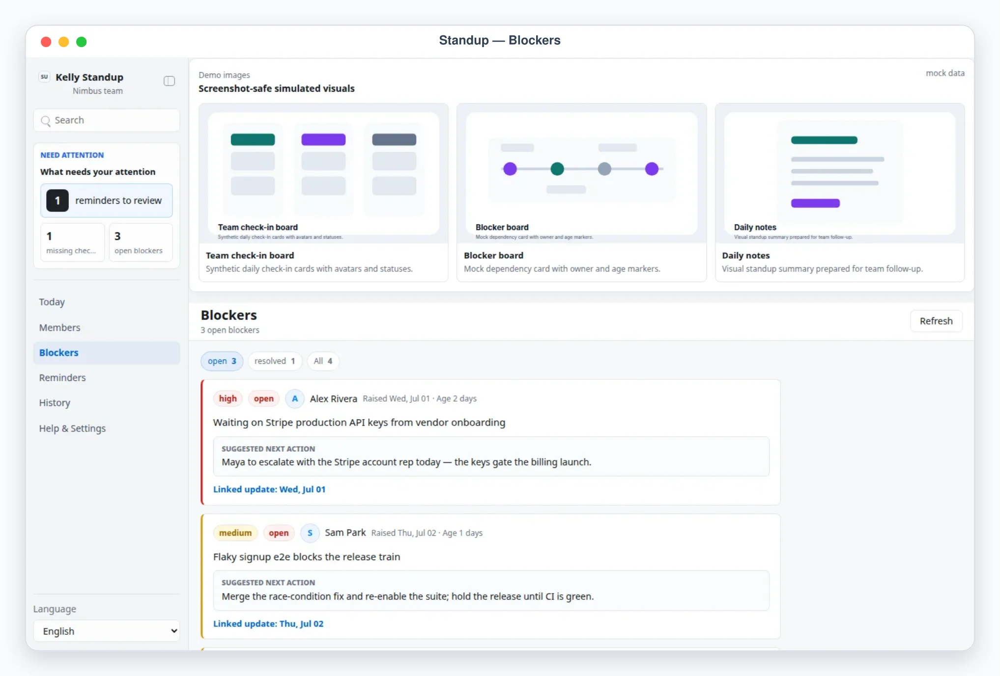
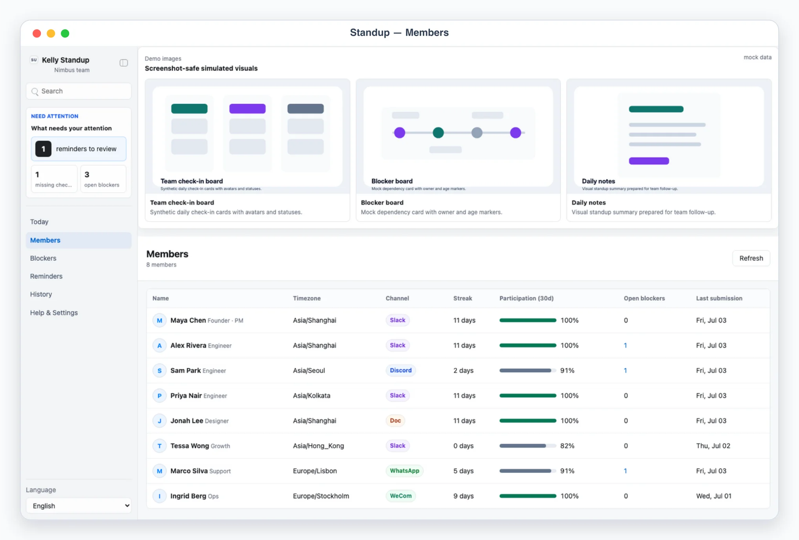
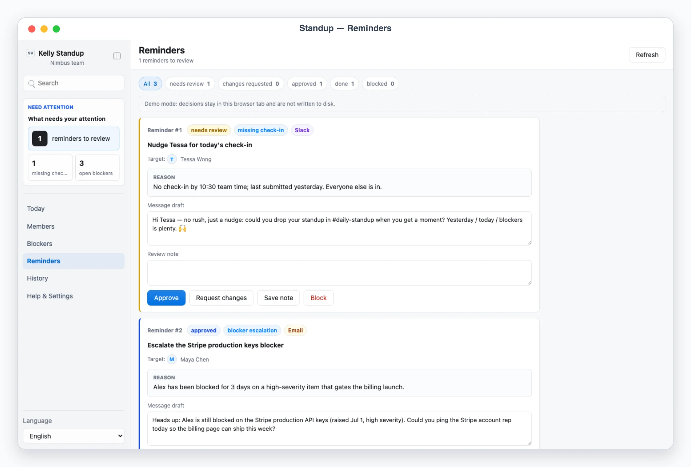

# Kelly Standup

Kelly Standup is a local App-in-Skill standup board for team leads: see at a glance what everyone is working on each day. Members post async updates wherever they already talk (Slack, WeCom, Discord, WhatsApp, shared docs, or pasted text); when the skill is invoked, the agent parses them into structured updates, writes them into a local snapshot, and drafts a team digest. Chasing missing check-ins is agent-drafted and human-approved — never sent by the app. There is no cron or scheduler inside the skill; it runs only when invoked.

## What It Shows

- Today: the agent-written team digest, participation stat (e.g. `6/8 submitted`), a human-attention panel (missing check-ins, open blockers, reminders awaiting approval), and per-member cards with Yesterday / Today / Blockers, mood, submitted time, and source badge. Missing members get a distinct "not submitted" card; on-leave members are marked.
- Members: roster with check-in streak, 30-day participation, open blockers, and last submission; detail shows a day-by-day update timeline.
- Blockers: every blocker across the team with severity, owner, age, open/resolved filter, the linked day, and an agent-suggested next action.
- Reminders: the review queue (`needs_review / changes_requested / approved / done / blocked`) with stable refs like `Reminder #1`, editable message drafts, and approve / request changes / block actions.
- History: recent days with inline-SVG participation bars and digest one-liners; selecting a date shows that day's full board.
- Help & Settings: sanitized team profile, members with contact-env readiness, standup questions, and workdays.

## App UI Screenshots

<table>
  <tr>
    <td width="50%"></td>
    <td width="50%"></td>
  </tr>
  <tr>
    <td><strong>Today board</strong><br>Daily standup at a glance: team digest, participation count, and per-member yesterday/today/blockers cards with source badges.</td>
    <td><strong>Blockers</strong><br>All blockers across the team with severity, age, and agent-suggested next actions.</td>
  </tr>
  <tr>
    <td width="50%"></td>
    <td width="50%"></td>
  </tr>
  <tr>
    <td><strong>Members</strong><br>Team roster with check-in streaks, 30-day participation, open blockers, and per-member update timelines.</td>
    <td><strong>Reminders</strong><br>Approval-gated nudges for missing check-ins — drafted by the agent, sent only after review.</td>
  </tr>
</table>

## Demo Mode

Run the app and open a safe mock-data scene ("Nimbus team", an 8-person product team with 10 workdays of history):

```bash
skills/kelly-standup/app/start.sh
```

Use the URL printed by the launcher, then add one of these demo paths:

```text
/?demo=today&lang=en#/today
/?demo=members&lang=en#/members
/?demo=blockers&lang=en#/blockers
/?demo=history&lang=en#/history
/?demo=detail&lang=en#/members/alex
```

Use `lang=zh` for Chinese screenshots — the demo content itself (中文姓名、日报、阻塞、摘要、提醒草稿) is localized, e.g. `/?demo=today&lang=zh#/today`. Demo mode never reads or writes `app/.data/` or private config.

## Update Payload Format

On each invocation the agent parses raw updates (kelly-messenger snapshot, chat exports, shared docs, pasted text) into a payload and runs the single write path:

```bash
node skills/kelly-standup/scripts/ingest_updates.ts payload.json
```

```json
{
  "source": "slack",
  "date": "2026-07-03",
  "digest": "Billing is the center of gravity today…",
  "on_leave": ["ingrid"],
  "updates": [
    {
      "member_id": "alex",
      "yesterday": ["Finished the billing checkout flow"],
      "today": ["Wire the billing page to live Stripe"],
      "blockers": [{ "text": "Waiting on Stripe production API keys", "severity": "high", "status": "open" }],
      "mood": "ok",
      "submitted_at": "2026-07-03T00:51:00Z",
      "raw_excerpt": "checkout flow done behind flag…"
    }
  ],
  "reminders": [
    {
      "type": "missing_checkin",
      "member_id": "tessa",
      "channel": "slack",
      "title": "Nudge Tessa for today's check-in",
      "reason": "No check-in by 10:30 team time",
      "draft": "Hi Tessa — quick nudge…"
    }
  ]
}
```

Updates are upserted by member + date (re-ingesting is idempotent), blockers are deduped by content hash with open → resolved transitions, participation and streaks are recomputed, and reminders get stable refs. Approved reminders become a concrete `send_reminder` plan via `scripts/execute_decisions.ts` (dry-run by default). See `references/standup-schema.md`.

## Private Config

Copy `config.example.json` to `config.local.json` or `~/.config/kelly-standup/config.json` and describe your team, members (name/role/timezone/channel), standup questions, and workdays. Member contacts are env-var references (`contact_env`) only — put the values in local env files. Never commit real contacts, chat exports, or files under `app/.data/`.

## Boundary

The app renders and edits local files only and never touches any network beyond `127.0.0.1`. Collection parses only team-consented channels and stores structured updates plus short excerpts, not whole chat logs. Reminders are executed by the agent outside the app, only after explicit approval in the queue, via other skills (kelly-messenger / kelly-email).
