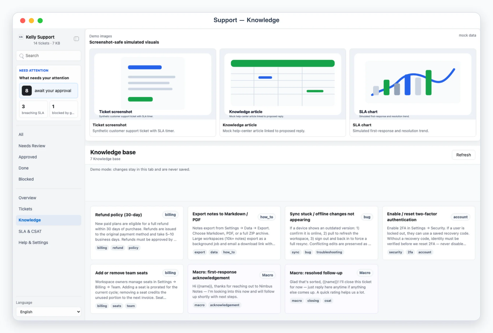
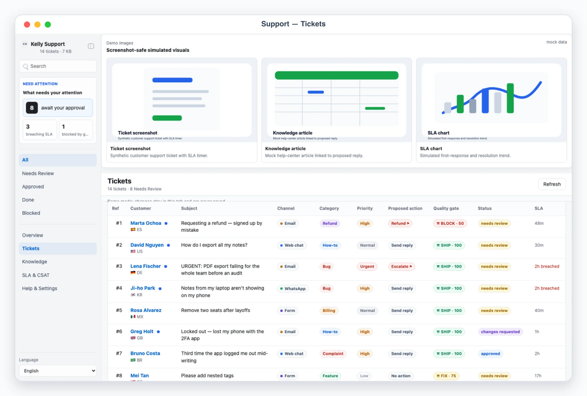

# Kelly Support

## Overview

Kelly Support is a Busabase Cloud App-in-Skill. Its canonical product
surface is the AirApp in Busabase, not a separate local-data product. The
same Hono source supports an explicitly requested local preview with OAuth
connection bootstrap. Use this skill as Kelly's post-sales customer-support
desk. Support tickets arrive over email, WhatsApp, in-app web chat, a
contact form, and WeChat; the agent triages each one, drafts a reply
grounded in a knowledge base, and proposes an action (send a reply,
escalate, refund, close, or no action). The human reviews, edits, and
approves each ticket in the app before anything is sent. A pre-send quality
gate (`support-qa`) scores every drafted reply and returns **SHIP / FIX /
BLOCK**; SLA due-by and CSAT are tracked throughout.

Default behavior is AirApp-first. Unless the user explicitly asks only for
explanation, triage into Busabase directly and give the user the clickable
AirApp URL. Start localhost only when local preview/debugging is explicitly
requested; it uses the same Busabase resources and never offers another data
provider. Use chat-only mode only when the user says "纯聊天", "chat only",
"不要打开 UI", or similar.

This skill is an implementation of the **App-in-Skill** pattern — a Codex/agent skill paired with a small companion UI for review and approval. See the spec paper: <https://mr-kelly.github.io/research/app-in-skill-specification-for-pairing-agent-skills-with-a-local-companion-ui.pdf>.

## Mandatory Dependencies

1. Read and follow `$kelly-app-skill-creator` for product behavior, visual
   quality, responsive layout, and the complete canonical `app/` artifact.
2. Read and follow `$busabase` for connection, target Space, node discovery,
   ChangeRequests, review, and merge behavior.
3. Read and follow `$busabase-app-creator` for resource modeling, AirApp
   runtime limits, security, validation, and deployment.

If a dependency is unavailable, preserve this skill's local artifact and
product contracts, stop before the unavailable Busabase operation, and report
the exact missing dependency. Do not invent a second data backend.

## App UI Screenshots

<table>
  <tr>
    <td width="50%"></td>
    <td width="50%"></td>
  </tr>
  <tr>
    <td><strong>Overview</strong><br>Queue health — open, breaching-SLA, and awaiting-approval counts, CSAT trend, and volume by channel and category.</td>
    <td><strong>Knowledge base</strong><br>Articles and canned macros the agent cites when drafting replies.</td>
  </tr>
  <tr>
    <td width="50%"></td>
    <td width="50%"></td>
  </tr>
  <tr>
    <td><strong>SLA &amp; CSAT</strong><br>SLA board of due and breached tickets, plus CSAT scores on resolved tickets.</td>
    <td><strong>Tickets</strong><br>Approval queue with the KB-grounded draft reply and the support-qa gate — a refund draft blocked pending human approval.</td>
  </tr>
</table>

## Boundary

- The AirApp reads and writes Busabase records only. It must never send anything: the composer stores drafts, the decision buttons record verdicts, and `scripts/execute_decisions.mjs` only records an execution marker on the ticket. Real sends, escalations, and refunds are skill-executed post-approval via the configured channel connectors.
- Every outgoing reply AND every proposed action is approval-required. Refund and escalate are high-risk / approval-required; the skill executes only tickets whose recorded decision is `approve` AND whose `support-qa` verdict is not `block`.
- Own accounts only: read and send exclusively through channels the user owns and has configured. Respect each platform's terms of service and rate limits; prefer official APIs; keep collection read-only.
- Never store passwords, QR-login payloads, or session tokens — anywhere, including Busabase. Accounts store only the channel, connector, and the **names** of env vars holding tokens, never the token values.
- Treat customer contacts, conversation excerpts, plans, and any billing detail as sensitive. Never commit real tokens, customer exports, or Busabase credentials.

## Busabase Resources

Six Bases under one application Folder (`kelly-support`), declared in
`app/app/js/config.js` and `app/resource-map.json`:

- `accounts`: channel accounts — email, WhatsApp, web chat, contact form, WeChat — with connector and env-var *names* for tokens (never values).
- `tickets`: the approval queue — customer, subject/body, category/priority, workflow `status`, `proposed-action`, the KB-grounded `suggested-reply` and its `kb-refs`, SLA fields, an optional CSAT score, the human verdict (`decision-action`/`decision-comment`/`decided-at`), and the execution marker written by `scripts/execute_decisions.mjs`.
- `messages`: one row per conversation message, joined onto its ticket by `ticket-id`.
- `knowledge_base`: articles and canned macros the agent cites when drafting replies.
- `sync_log`: append-only history of ticket-collection runs per account.
- `settings`: one row (`record-id: "config"`) with SLA policy, risk policy, reply style, and the KB source path.

Resources provision lazily through an idempotent Busabase ChangeRequest the
first time the app runs in a Space; see `references/support-schema.md` for
exact field shapes. Per-ticket rollups (`last_message_at`, `last_incoming_at`,
`sla.breached`) and the `support-qa` `quality_gate` verdict are all
recomputed client-side from `tickets`/`messages`/`knowledge_base` on every
read — **never stored**, so a stale record can never carry a stale verdict.

## First Run And Onboarding

On invocation, check the `accounts` Base. If empty, guide setup before
collecting real tickets.

Onboarding asks, turn by turn:

1. Which channels receive tickets (email / WhatsApp / web chat / form / WeChat) and the connector per account (see Collection Workflow). Ask for non-secret details only: channel, display name, handle, and which env var names hold the tokens. Never ask the user to paste secret values into chat; secrets belong only in local env files.
2. Knowledge base import: articles and macros (title, body, tags, category). The agent writes them directly into the `knowledge_base` Base via `busabase-sdk`.
3. SLA policy: first-response targets per priority (defaults: urgent 2h, high 4h, normal 8h, low 24h) and business hours.
4. Risk policy: whether refunds require approval (default yes), the max auto-refund (default 0), and whether ungrounded replies and unapproved commitments are blocked (default yes).
5. Reply style: tone, language policy, signature, and "do not say" guardrails.

Write the answers to the `settings` Base's single `record-id: "config"` row
(`sla-policy`/`risk-policy`/`reply-style`/`kb-source-path`, each JSON-encoded
where structured) via `busabase-sdk`.

## Local App

Default behavior is AirApp-first — give the user the clickable AirApp URL.
Start `pnpm --dir app dev` only when local preview/debugging is explicitly
requested.

Required app views (hash routes):

- `#/overview`: queue-health command desk. Human-attention counts (await your approval, open, breaching-SLA, blocked-by-gate), KPI cards (tickets this week with channel badges, first-response median, CSAT average, resolved), a CSAT trend sparkline, and volume charts by channel and by category.
- `#/tickets` and `#/tickets/<id>`: the approval queue table (ref, customer, subject, channel, category badge, priority, proposed-action badge, `support-qa` verdict badge, status, SLA countdown). Detail: the conversation transcript (bubbles), the agent's `reason`, the full `support-qa` gate panel (verdict + per-check results), an editable KB-grounded reply with its cited `kb_refs`, decision buttons (Save reply / Approve / Request changes / Block) that write directly onto the ticket record through `busabase-sdk`, an SLA reschedule field, the customer profile, and the CSAT if rated. Sidebar workflow filters (`#/tickets/needs_review` etc.) narrow the same table.
- `#/knowledge` and `#/knowledge/<id>`: the knowledge base — article and macro cards (title, body, tags). Detail shows the full article and the tickets that cite it.
- `#/sla`: the SLA board (open tickets sorted by due-by, breached ones flagged) plus the CSAT trend and the rated tickets with their scores and comments.
- `#/settings`: sanitized config — channels/accounts with connector + env readiness booleans, KB source, SLA policy, risk policy, and onboarding state. Never secrets.

Demo mode:

- `?demo=overview`, `?demo=tickets`, `?demo=knowledge`, `?demo=sla`, and `?demo=detail` (opens the featured refund ticket `tk-ochoa-refund` whose drafted reply trips the gate to BLOCK) select named deterministic mock scenes. Persona: "Nimbus Notes", an invented note-taking SaaS.
- `lang=en` or `lang=zh` forces UI chrome language for screenshots. With `lang=zh` the chrome AND agent-generated content (reasons, notes) are localized; customer messages and drafted replies stay in the customer's language. Deep links like `/?demo=detail&lang=zh#/tickets/tk-ochoa-refund` work.
- Demo mode never reads or writes Busabase. Composer, decision, and SLA buttons still work but act on in-memory state only (the gate re-runs live using the exact same `runQualityGate` function) and show a demo notice.

UI language: English and Chinese chrome with `Auto` default following the browser language; explicit selector persisted locally. Keep customer names, message content, and drafted replies in their original language.

## File Contract

Read `references/support-schema.md` before editing the app or its domain
logic.

## Collection Workflow

1. Detect mode. Default to AirApp-first.
2. Check the `accounts` Base. If empty, enter onboarding.
3. Collection per account declares a `connector`:
   - `email_agent` — hand off to the kelly-email skill: it collects support emails; the agent normalizes them into a ticket; replies go back through kelly-email drafts.
   - `whatsapp_cloud` — WhatsApp Business Cloud API (`access_token_env` + `phone_number_id_env`). Inbound arrives via webhook; history is collected as the agent triages; sends use the Cloud API.
   - `webchat_widget` — the in-app web-chat widget posts transcripts (see `references/embeddable-widget.md` for the future visitor bubble); collection is agent-driven.
   - `form_intake` — a contact form writes submissions the agent ingests.
   - `wechat_work` — WeChat Work (`corp_secret_env`).
   - `manual` — the user or agent prepares a ticket by hand.
4. All collected data enters through one write path: the agent merges it directly into the `tickets`/`messages` Bases via `busabase-sdk` (`bases.createChangeRequest` for a new ticket, `records.changeRequest` to append messages or update an existing one) — dedupe by stable ticket/message ids, derive SLA due-by, run `support-qa` on any drafted reply, and append a `sync_log` entry per account. There is no separate ingest script; this mirrors the same write path a human decision uses.
5. While triaging, the agent classifies each ticket (`category`, `priority`), drafts a `suggested_reply` grounded in the knowledge base with the `kb_refs` it used, and sets a `proposed_action`. It never promises a refund or makes a commitment unless the action is an approved refund.

## Triage & Reply Workflow

1. Ground every reply in the knowledge base: cite the `kb_refs` used. If no article fits, keep the reply a short acknowledgement or draft a new KB article — do not invent facts.
2. Set `proposed_action`: `send_reply` for a normal answer, `escalate` (with a tier) for anything beyond L1, `refund` (approval-required) for eligible refunds, `close` to resolve without a reply, `no_action` for spam or FYI.
3. Write the ticket to Busabase with `status: "needs_review"`. The `support-qa` gate (`runQualityGate`) is computed live on every read — never stored — so an edited reply always reflects the current verdict.
4. Give Kelly the AirApp URL (or local preview URL) to review the queue, gate verdicts, and SLA board.

## The Quality Gate — `support-qa` ⛩

Before any send, each drafted reply passes `support-qa`, a CSAT-risk / policy gate producing a score (0–100) and a **SHIP / FIX / BLOCK** verdict (see `runQualityGate()` in `app/app/js/support-model.js`):

- **Grounding** — a substantive reply must cite at least one real KB article; a short acknowledgement is exempt.
- **KB refs resolve** — every cited `kb_ref` must resolve to a real article (a dangling ref is a FIX).
- **No unapproved commitment** — a reply that promises a refund, credit, or other commitment is a hard **BLOCK** unless the ticket is an approved refund action.
- **Refund policy** — a `refund` proposed action requires human approval before it can be sent.

Verdicts: **SHIP** (grounded and within policy), **FIX** (deliverable but revise first — usually add or drop a KB ref), **BLOCK** (hard stop — an unapproved commitment/refund or an ungrounded substantive reply). The gate never sends; a human still approves. A `block` verdict refuses approval (HTTP 409-equivalent thrown error) and refuses execution even if a stale `approve` decision exists.

## Review Workflow

1. Queue: the agent drafts the `suggested_reply` and writes `status: needs_review` to the `tickets` Base. The user edits it in the ticket detail and clicks Save reply (re-runs the gate live), or decides directly.
2. Review: in the ticket detail the user Approves, Requests changes, or Blocks — written directly onto the ticket record through `busabase-sdk`. `approve` is refused while the (possibly just-edited) reply's gate is `BLOCK` — the user must fix the reply (e.g. drop the unapproved refund promise) or Block instead. From a standalone local preview the write merges immediately (trusted operator); from the deployed AirApp it creates a pending ChangeRequest for the trusted process to merge.
3. Agent revision loop: for a ticket moved to `changes_requested`, redraft honoring the `decision-comment`, the config `reply_style`, and the KB (re-run the gate live), and write it back to `needs_review`. A `FIX` verdict (usually a dangling KB ref) is visible live on every read — no separate task queue needed.
4. Execute: only after the user asks, run `node scripts/execute_decisions.mjs` (dry-run) and show the plan — `send_reply` / `escalate` / `refund` / `close` operations, targets, and any gate-blocked items. With explicit approval, run `node scripts/execute_decisions.mjs --apply`: it re-reads Busabase immediately, re-checks each ticket's decision and gate, refuses any `BLOCK`, and writes an execution marker (`execution-status`/`execution-operation`/`execution-target`/etc.) onto each ticket — it never changes the ticket's workflow `status` itself and performs no external side effect. Real delivery is performed by the channel connectors (kelly-email drafts, WhatsApp Cloud API, the web-chat widget, WeChat Work) per this file — the script and the AirApp both send nothing.
5. Report per-ticket results back with the stable `#<ref>` refs.

## SLA & CSAT

- SLA breach is derived, never trusted from input: a ticket breaches when it is still open, has no first response, and its `sla.due_by` has passed relative to the current time. On every invocation (and after ingest), surface breaching tickets on `#/overview`, `#/sla`, and the sidebar counter.
- The user can reschedule a ticket's due-by from the ticket detail, written directly onto the ticket record.
- CSAT scores (1–5) attach to resolved tickets; the overview and SLA board show the average, responses count, and a trend sparkline (last 6 rated tickets), all computed live.

## Safety Defaults

- Never execute without an `approve` decision recorded, and never bypass the dry-run → `--apply` sequence.
- Never send a reply the `support-qa` gate scored `BLOCK`, and never promise a refund or commitment without an explicit approved refund action.
- Never disable 2FA / make account changes on an unverified request; require identity verification first.
- Prefer read-scoped tokens where the platform offers them; keep collection strictly read-only.
- Redact tokens and token-like strings from logs, reports, and UI state; expose only env-var readiness booleans.
- Keep execution idempotent: stable ticket ids, an execution marker stored on each ticket, and re-reading Busabase before each run.
- Honor platform rate limits; on 429s back off rather than retrying aggressively.

## Useful Commands

```bash
node skills/kelly-support/scripts/execute_decisions.mjs
node skills/kelly-support/scripts/execute_decisions.mjs --apply
pnpm --dir skills/kelly-support/app dev
```

In normal use, invoke `/kelly-support`, let the skill triage tickets into
Busabase, and open the AirApp.
