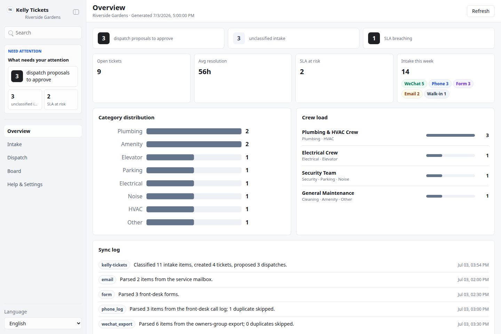
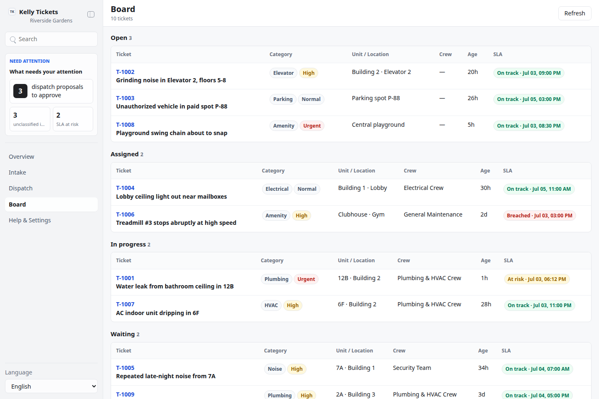
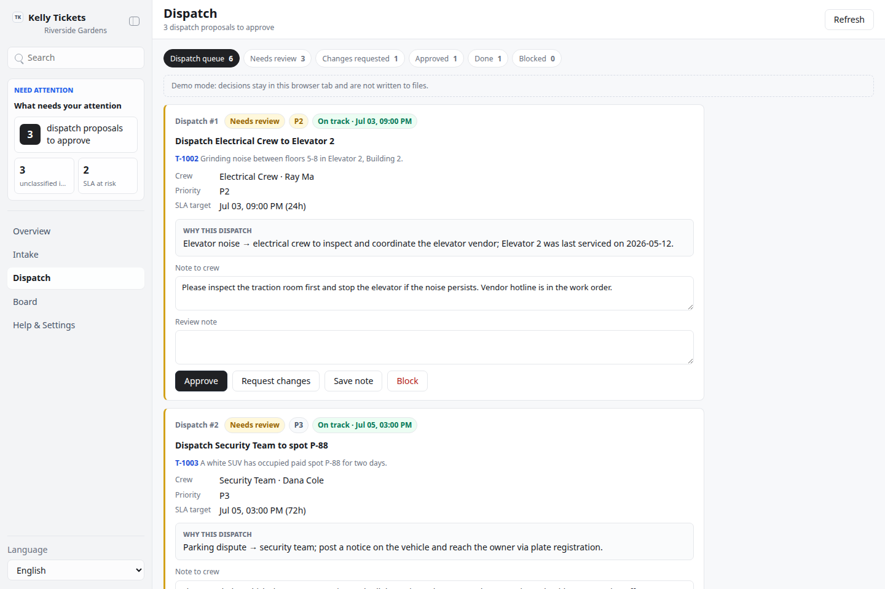
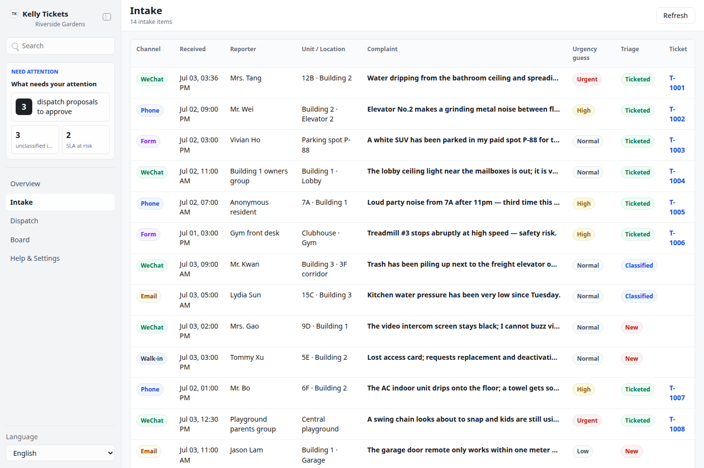

# Kelly Tickets

## Overview

Use this skill as Kelly's complaint triage-and-dispatch desk. Complaints and requests arrive scattered across WeChat group exports, phone-call logs, front-desk forms, and email; the agent ingests them, classifies each ticket (category, urgency, unit/location), and proposes a dispatch (which crew, priority, SLA). The human reviews dispatch proposals in a local App-in-Skill queue and approves or edits; a board tracks every ticket to resolution with an auditable history trail. The demo persona is residential property management, but the same flow fits facilities, IT helpdesk, or any dispatch workflow.

Default interaction mode: App UI. Unless the user explicitly asks for chat-only handling, check onboarding/config, refresh or ingest the local snapshot, start/reuse the local app with `app/start.sh`, and give the actual local URL. Use chat-only mode only when the user says "纯聊天", "chat only", "不要打开 UI", or similar; then present numbered proposals (`Dispatch #1`) directly in the conversation.

## App UI Screenshots

<table>
  <tr>
    <td width="50%"></td>
    <td width="50%"></td>
  </tr>
  <tr>
    <td><strong>Overview</strong><br>Dispatch command desk with SLA risk, weekly intake by channel, category distribution, and crew load.</td>
    <td><strong>Board</strong><br>Tickets tracked across open, assigned, in-progress, waiting, and resolved with SLA indicators and history timelines.</td>
  </tr>
  <tr>
    <td width="50%"></td>
    <td width="50%"></td>
  </tr>
  <tr>
    <td><strong>Dispatch queue</strong><br>Agent-proposed crew assignments with priority, SLA target, reasoning, and an editable note to the crew.</td>
    <td><strong>Intake</strong><br>Raw complaints from WeChat, phone, forms, and email with classification fields and convert-to-ticket controls.</td>
  </tr>
</table>

## Boundary

- The skill may parse channel exports locally, classify complaints, compute SLA targets, write local handoff files, and prepare crew notification drafts.
- The app reads and writes local files only. It never sends messages, calls crews, replies to residents, or mutates remote systems.
- Intake parsing is local: raw WeChat exports, call logs, and mailbox dumps stay on disk outside git. Resident PII stays local and is masked in the UI (`contact_masked`); `scripts/ingest_intake.mjs` re-masks long digit runs defensively and the validator rejects unmasked contacts.
- Any outbound crew notification or resident reply is approval-required and executed by the agent via other skills (messenger/email/WeChat) after `scripts/execute_decisions.mjs` produces the plan. Crew contacts live only in env vars referenced by `contact_env`.
- Do not commit `config.local.json`, env files, `app/.data/`, raw exports, or resident contact details.

## First Run And Onboarding

On invocation, check `app/.data/onboarding.json` and private config readiness. If onboarding is absent/incomplete, guide setup before ingesting real complaints.

Private config priority:

1. `KELLY_TICKETS_CONFIG=/absolute/path/to/config.json`
2. `skills/kelly-tickets/config.local.json`
3. `~/.config/kelly-tickets/config.json`
4. `skills/kelly-tickets/config.example.json` as template only

Env priority:

1. Existing environment variables
2. `KELLY_TICKETS_ENV_FILE=/absolute/path/to/.env`
3. Repository root `.env`
4. `skills/kelly-tickets/.env.local`
5. `~/.config/kelly-tickets/.env`

Onboarding asks, turn by turn, for: property/team profile (name, buildings, timezone), complaint categories, crews (name, skills, and which env var holds each crew's contact), SLA rules per category+urgency, and which intake channels are in use. Never ask the user to paste contact values or secrets into chat; they belong only in local env files, referenced by `contact_env` names.

When setup is complete and the user confirms, write `app/.data/onboarding.json`:

```json
{
  "completed": true,
  "completed_at": "ISO timestamp",
  "config_version": "1"
}
```

## Local App

Start the desk with:

```bash
skills/kelly-tickets/app/start.sh
```

The app uses local HTTP on `127.0.0.1`, preferring ports `3000` through `4000` (reusing a port only when `/api/state` proves it is the same app), or `KELLY_TICKETS_UI_PORT` when set. Always report the URL the launcher prints.

Required app views (hash routes):

- `#/overview`: dispatch command desk — human-attention panel (proposals to approve, unclassified intake, SLA-breaching tickets), KPI cards (open tickets, avg resolution, SLA at risk, this week's intake with channel badges), category distribution bars, and crew load.
- `#/intake` and `#/intake/<id>`: raw intake stream — channel badge (WeChat/phone/form/email/walk-in), reporter, unit/location, complaint text, urgency guess, triage state. Detail shows the full text, attachments note, editable classification (category/urgency/unit), and convert-to-ticket or ignore actions.
- `#/dispatch`: the review queue with workflow states `needs_review / changes_requested / approved / done / blocked`. Each card shows the stable ref (`Dispatch #1`), ticket summary, proposed crew/assignee, priority, SLA target, the reason, an editable note to the crew, and approve / request changes / block buttons.
- `#/board` and `#/board/<ticket_id>`: tickets grouped by status (`open / assigned / in_progress / waiting / resolved`) with category badge, unit, crew, age, and color-coded SLA indicator. Detail shows the full history timeline (intake → classification → dispatch → crew updates → resolution), masked reporter contact, and a resolution note field.
- `#/settings`: sanitized config — property profile, channels, categories, crews with `contact_env` readiness booleans, SLA rules, data provider, and onboarding state. Never expose contact values or secrets.

Demo mode:

- `?demo=overview`, `?demo=intake`, `?demo=dispatch`, `?demo=board`, and `?demo=detail` (a ticket history) select named mock scenes.
- `lang=en` or `lang=zh` forces UI chrome language; with `lang=zh` the demo content itself (property name, complaints, crews, reasons) is meaningfully localized for Chinese screenshots.
- Deep links such as `/?demo=dispatch&lang=zh#/dispatch` must work.
- Demo API responses never read or write `app/.data/` or private config; demo decisions stay in the browser tab.

UI language: English and Chinese chrome with `Auto` default (browser language), plus an explicit selector persisted locally. Keep real resident/complaint data in its original language.

## File Contract

Read `references/tickets-schema.md` before editing the app, scripts, or any generated JSON.

Primary local files (all under `app/.data/`, gitignored):

- `tickets_snapshot.json`: canonical snapshot — `intake[]`, `tickets[]`, `dispatch_proposals[]`, `crews[]`, `metrics`, `sync_log[]`, `warnings[]`.
- `decisions.json`: user verdicts keyed by item id (proposals, intake items, ticket notes).
- `agent_tasks.json`: queued agent work — `revise_dispatch` (changes requested) and `convert_intake` (human-classified intake to turn into tickets). Poll this to pick up revisions.
- `execution_report.json`: latest dry-run/apply plan from `scripts/execute_decisions.mjs`.
- `onboarding.json`: onboarding completion marker.
- `agent.lock`: temporary lock while the skill is ingesting, triaging, or executing. While it exists the app disables editing and `POST /api/decision` returns HTTP 423.

Use `node scripts/validate_ui_schema.mjs app/.data/tickets_snapshot.json` before relying on a snapshot in the UI. The app shows an empty setup state when no snapshot exists.

## Intake Workflow

The agent parses each channel into the ingest payload shape (see `references/tickets-schema.md`), then merges it deterministically:

1. Ask the user for the export/log location (WeChat group export, call log CSV/notes, front-desk forms, mailbox). Raw files stay outside git.
2. Split the raw material into one item per complaint: channel, channel-native `external_id` when available, reporter, contact (will be masked), unit/location, verbatim text, received time, plus first-pass `category_guess`/`urgency_guess`.
3. Write the payload JSON to a temp path and run `node scripts/ingest_intake.mjs <payload.json>`. The script validates, dedupes by `channel + external_id` (falling back to a content hash), masks contacts, merges into the snapshot, and appends `sync_log`. It refuses to run while `agent.lock` exists and takes the lock while writing.
4. Re-ingesting the same export is safe: duplicates are skipped and reported.

## Triage And Dispatch Workflow

1. Classification is LLM work: read `intake[]` items in `new`/`classified` state, decide category, urgency, unit/location, and a ticket title; decide which crew fits and why (use crew skills, prior tickets for the same unit, and SLA pressure in the `reason`).
2. Merge deterministically with `node scripts/apply_triage.mjs <payload.json>`: creates tickets (`T-1001`-style ids), computes `sla_due_at` from config `sla_rules` (category+urgency, `*` wildcard, `sla_default_hours` fallback), assigns stable proposal refs, appends ticket history, and recomputes metrics. `ticket_updates[]` in the same payload records crew progress, status transitions, and resolutions.
3. Send the user to `#/dispatch` to review. Decisions persist via `POST /api/decision` into `decisions.json`; `request_changes` and `convert_to_ticket` also enqueue `agent_tasks.json` entries.
4. Poll `agent_tasks.json`: for `revise_dispatch`, redraft the proposal per the note and re-run `apply_triage` (item returns to `needs_review`); for `convert_intake`, classify using the human-provided fields and create the ticket.
5. After approvals, run `node scripts/execute_decisions.mjs` (dry-run) and show the plan; with user confirmation run `--apply`, then perform the real crew notifications via other skills (messenger/email), record outcomes back through `ticket_updates`, and keep the board honest.
6. Re-read `decisions.json` immediately before executing, and never execute items without an `approved` status.

## Board Semantics

- `open`: classified, no crew accepted yet (dispatch pending or unapproved).
- `assigned`: an approved dispatch reached a crew; nobody started work yet.
- `in_progress`: the crew reported starting work.
- `waiting`: blocked on residents, parts, weather, or vendors — not on the crew.
- `resolved`: work confirmed done; `resolved_at` set and a resolution note recorded.

SLA states are derived, never hand-set: `ok`, `at_risk` (under 25% of the SLA window left), `breached`, and `met` for resolved tickets. History events are append-only — the timeline is the audit trail; never rewrite past events.

## Safety Defaults

- Treat crew notifications, resident replies, fines/fees, lock-outs, towing, and anything customer-visible as approval-required.
- Store only the minimum complaint text needed for review; keep raw exports and attachments outside git and reference them by note.
- Mask resident contacts everywhere in UI state, logs, and reports; expose only env-var readiness booleans for crew contacts.
- Keep merges idempotent: stable intake hashes, ticket ids, and proposal refs so repeated ingests and triage runs do not duplicate work.
- If the UI and schema disagree, stop and fix the schema or UI before executing anything.
